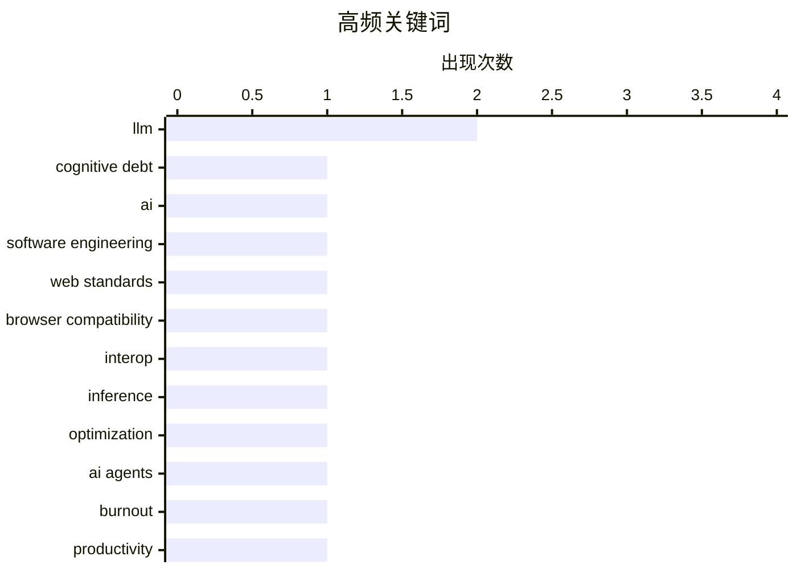

# 📰 AI 博客每日精选 — 2026-02-16

> 来自 Karpathy 推荐的 92 个顶级技术博客，AI 精选 Top 15

## 📝 今日看点

今日技术圈聚焦于AI对软件开发的深度渗透与行业协作的强化。生成式AI正将核心挑战从技术债务转向认知债务，同时引发开发者的心理倦怠与角色演变，重塑工作范式。跨浏览器厂商携手推进Interop 2026计划，致力于提升Web平台的一致性与稳定性。此外，创新工具与开源项目加速涌现，从单文件格式到专用训练硬件，持续降低技术门槛并推动效率突破。

---

## 🏆 今日必读

🥇 **生成式与智能体AI如何将关注点从技术债务转向认知债务**

[How Generative and Agentic AI Shift Concern from Technical Debt to Cognitive Debt](https://simonwillison.net/2026/Feb/15/cognitive-debt/#atom-everything) — simonwillison.net · 20 小时前 · ⚙️ 工程

> 文章探讨了生成式AI和智能体AI的兴起，如何使软件开发的核心挑战从传统的‘技术债务’转向新兴的‘认知债务’。认知债务指的是因过度依赖AI生成代码、文档和决策，导致团队对系统理解模糊、知识碎片化所积累的隐性成本。与技术债务（糟糕代码带来的维护负担）不同，认知债务削弱的是人的心智模型和集体认知，可能导致更严重的系统风险和团队能力退化。作者认为，管理认知债务需要新的实践，如强化代码审查、文档化和有意识的知识保留。结论是，在AI时代，管理团队的集体理解和知识，与管理代码质量同等重要。

💡 **为什么值得读**: 它精准地定义了一个正在影响每个开发团队的隐形风险，并提供了应对这一新范式转变的思考框架。

🏷️ cognitive debt, AI, software engineering

🥈 **启动Interop 2026**

[Launching Interop 2026](https://simonwillison.net/2026/Feb/15/interop-2026/#atom-everything) — simonwillison.net · 21 小时前 · ⚙️ 工程

> 文章介绍了由苹果、谷歌、Igalia、微软和Mozilla共同发起的Interop 2026计划。该计划旨在通过跨浏览器厂商协作，在一年内推动一组特定的Web平台功能达到跨浏览器一致性和稳定性。自2021年启动以来，Interop系列已成功将许多关键Web API的跨浏览器兼容性得分从约60%提升至超过90%。2026年的重点将包括改善表单控件、滚动行为、字体渲染等领域的互操作性。此举旨在为Web开发者提供更一致、可预测的开发体验，减少针对特定浏览器的适配工作。

💡 **为什么值得读**: 了解主流浏览器厂商的年度协作路线图，对于Web开发者规划技术选型和规避兼容性陷阱至关重要。

🏷️ web standards, browser compatibility, Interop

🥉 **实现快速LLM推理的两种不同技巧**

[Two different tricks for fast LLM inference](https://seangoedecke.com/fast-llm-inference/) — seangoedecke.com · 1 天前 · 🤖 AI / ML

> 文章对比了Anthropic和OpenAI为实现其顶级代码模型（Claude Code和GPT-5.3 Codex Spark）的‘快速模式’所采用的两种截然不同的技术路径。Anthropic的方案通过优化服务端计算，将令牌生成速度提升至最高2.5倍，本质上是‘加速’模型本身。而OpenAI则采用了一种‘投机执行’策略，让一个快速但能力稍弱的模型（Spark）先行生成多个令牌，再由强大的Codex模型进行快速验证和纠正，从而在感知上实现即时响应。两种方案分别侧重于硬件优化和算法创新，服务于不同的交互场景（长时间输出 vs. 低延迟对话）。

💡 **为什么值得读**: 通过对比行业巨头的技术选型，可以深入理解LLM推理优化的核心权衡与未来方向。

🏷️ LLM, inference, optimization

---

## 📊 数据概览

| 扫描源 | 抓取文章 | 时间范围 | 精选 |
|:---:|:---:|:---:|:---:|
| 84/92 | 2397 篇 → 29 篇 | 48h | **15 篇** |

### 分类分布


### 高频关键词



<details>
<summary>📈 纯文本关键词图（终端友好）</summary>

```
llm                   │ ████████████████████ 2
cognitive debt        │ ██████████░░░░░░░░░░ 1
ai                    │ ██████████░░░░░░░░░░ 1
software engineering  │ ██████████░░░░░░░░░░ 1
web standards         │ ██████████░░░░░░░░░░ 1
browser compatibility │ ██████████░░░░░░░░░░ 1
interop               │ ██████████░░░░░░░░░░ 1
inference             │ ██████████░░░░░░░░░░ 1
optimization          │ ██████████░░░░░░░░░░ 1
ai agents             │ ██████████░░░░░░░░░░ 1
```

</details>

### 🏷️ 话题标签

**llm**(2) · **cognitive debt**(1) · **ai**(1) · software engineering(1) · web standards(1) · browser compatibility(1) · interop(1) · inference(1) · optimization(1) · ai agents(1) · burnout(1) · productivity(1) · ai anxiety(1) · developer psychology(1) · existential dread(1) · junior developers(1) · ai impact(1) · team building(1) · engineering role(1) · ai era(1)

---

## 💡 观点 / 杂谈

### 1. AI吸血鬼

[The AI Vampire](https://simonwillison.net/2026/Feb/15/the-ai-vampire/#atom-everything) — **simonwillison.net** · 2 小时前 · ⭐ 25/30

> Steve Yegge提出了‘AI吸血鬼’这一比喻，来描述AI工具导致的‘智能体倦怠’及其与职业倦怠的关系。核心论点是，当个人利用AI将个人生产力提升至10倍时，会创造不切实际的预期，最终导致自己或团队陷入持续高强度输出的恶性循环，如同被吸血鬼吸取精力。文章通过两个场景对比，说明无论是个人突出还是团队普及AI，都可能因管理不善而导致全员倦怠。其根本原因在于，AI放大了产出期望，但未相应减少对人类认知和情感投入的需求。结论是，必须系统性地管理由AI驱动的生产力提升，防止其反噬团队的健康与可持续性。

🏷️ AI agents, burnout, productivity

---

### 2. 深蓝忧郁

[Deep Blue](https://simonwillison.net/2026/Feb/15/deep-blue/#atom-everything) — **simonwillison.net** · 4 小时前 · ⭐ 25/30

> 文章介绍了一个新术语‘Deep Blue’（深蓝忧郁），用以描述许多软件开发者在生成式AI侵入其工作领域后，产生的从心理倦怠到存在性焦虑的普遍情绪。这个术语的灵感来源于IBM的‘深蓝’计算机击败国际象棋大师卡斯帕罗夫的历史事件，象征着人类在智能领域被机器超越的转折点。作者指出，这种情绪源于对职业价值、技能过时和身份认同的深层担忧。讨论认为，承认并探讨这种集体情绪是应对AI时代职业变革的第一步。

🏷️ AI anxiety, developer psychology, existential dread

---

### 3. 引用Thoughtworks观点

[Quoting Thoughtworks](https://simonwillison.net/2026/Feb/14/thoughtworks/#atom-everything) — **simonwillison.net** · 1 天前 · ⭐ 25/30

> 文章引用了Thoughtworks报告中的关键观点，挑战了‘AI将淘汰初级开发者’的叙事。报告指出，在AI工具的辅助下，初级开发者能更快度过最初‘净负产出’的尴尬阶段，从而比以往任何时候都更具盈利潜力。他们被视为对未来生产力的‘看涨期权’，并且由于没有旧习惯的束缚，往往比高级工程师更擅长使用AI工具。因此，投资于初级开发者的成长变得比以往更具战略价值。

🏷️ junior developers, AI impact, team building

---

### 4. 引用Boris Cherny观点

[Quoting Boris Cherny](https://simonwillison.net/2026/Feb/14/boris/#atom-everything) — **simonwillison.net** · 1 天前 · ⭐ 24/30

> 文章引用了Claude Code创造者Boris Cherny的观点，解释了为何Anthropic等公司仍在积极招聘工程师。他指出，工程的角色正在演变，但伟大的工程师比以往更重要，因为‘总得有人去提示Claude、与客户沟通、协调其他团队、决定下一步构建什么’。这强调了在AI时代，人类的战略判断、沟通协调和需求洞察能力变得更为核心。

🏷️ engineering role, AI era, prompting

---

### 5. 设计解构：文本驱动的设计思维

[Design Deconstruction](https://feed.tedium.co/link/15204/17276365/text-based-design-mindset) — **tedium.co** · 1 天前 · ⭐ 19/30

> 文章挑战了设计工作必须依赖鼠标和图形界面（GUI）的传统范式，提出了文本驱动设计的可能性。核心论点是，设计思维和决策过程可以像代码一样，通过文本描述、版本控制和协作工具来管理和迭代。这种模式强调逻辑、结构和可复用性，而非仅仅依赖于视觉化的拖拽操作。作者主张将设计从特定的 GUI 工具中解放出来，探索更符合软件开发流程的方法。

🏷️ design, software, text-driven

---

## ⚙️ 工程

### 6. 生成式与智能体AI如何将关注点从技术债务转向认知债务

[How Generative and Agentic AI Shift Concern from Technical Debt to Cognitive Debt](https://simonwillison.net/2026/Feb/15/cognitive-debt/#atom-everything) — **simonwillison.net** · 20 小时前 · ⭐ 27/30

> 文章探讨了生成式AI和智能体AI的兴起，如何使软件开发的核心挑战从传统的‘技术债务’转向新兴的‘认知债务’。认知债务指的是因过度依赖AI生成代码、文档和决策，导致团队对系统理解模糊、知识碎片化所积累的隐性成本。与技术债务（糟糕代码带来的维护负担）不同，认知债务削弱的是人的心智模型和集体认知，可能导致更严重的系统风险和团队能力退化。作者认为，管理认知债务需要新的实践，如强化代码审查、文档化和有意识的知识保留。结论是，在AI时代，管理团队的集体理解和知识，与管理代码质量同等重要。

🏷️ cognitive debt, AI, software engineering

---

### 7. 启动Interop 2026

[Launching Interop 2026](https://simonwillison.net/2026/Feb/15/interop-2026/#atom-everything) — **simonwillison.net** · 21 小时前 · ⭐ 26/30

> 文章介绍了由苹果、谷歌、Igalia、微软和Mozilla共同发起的Interop 2026计划。该计划旨在通过跨浏览器厂商协作，在一年内推动一组特定的Web平台功能达到跨浏览器一致性和稳定性。自2021年启动以来，Interop系列已成功将许多关键Web API的跨浏览器兼容性得分从约60%提升至超过90%。2026年的重点将包括改善表单控件、滚动行为、字体渲染等领域的互操作性。此举旨在为Web开发者提供更一致、可预测的开发体验，减少针对特定浏览器的适配工作。

🏷️ web standards, browser compatibility, Interop

---

### 8. 在 Docker 构建中分离下载与安装步骤

[Separating Download from Install in Docker Builds](https://nesbitt.io/2026/02/15/separating-download-from-install-in-docker-builds.html) — **nesbitt.io** · 1 天前 · ⭐ 21/30

> 文章探讨了如何通过分离包管理器的下载与安装阶段来优化 Docker 镜像的层缓存。大多数包管理器（如 apt、yum、apk）可以先将依赖包下载到本地，再进行安装，这能有效利用 Docker 缓存。将下载步骤置于 Dockerfile 中靠前且独立的层，可以确保在仅修改安装指令时，无需重新下载依赖，从而显著加快构建速度。这种模式是提升 CI/CD 流水线效率的一种关键实践。

🏷️ Docker, build optimization, caching

---

### 9. 破折号

[Em dash](https://simonwillison.net/2026/Feb/15/em-dashes/#atom-everything) — **simonwillison.net** · 4 小时前 · ⭐ 18/30

> 作者针对其博客内容被质疑由 LLM 生成的指控，用一个具体的代码片段进行了反驳。他承认自己的写作中有一个习惯与 AI 类似：使用代码（`s.replace(' - ', u'\u2014')`）自动将连字符替换为全角破折号（em dash）。这个自动化处理是其个人写作流程的一部分，而非 LLM 代笔。文章的核心在于，一个看似“AI化”的文本特征，实际上可能源于个人高度特定的自动化习惯。

🏷️ LLM, writing style, code snippet

---

## 🛠 工具 / 开源

### 10. Gwtar：一种静态高效的单文件HTML格式

[Gwtar: a static efficient single-file HTML format](https://simonwillison.net/2026/Feb/15/gwtar/#atom-everything) — **simonwillison.net** · 7 小时前 · ⭐ 23/30

> 文章介绍了Gwern Branwen和Said Achmiz的新项目Gwtar，它旨在解决将大量资源（HTML、CSS、JS、图片等）打包成单个HTML文件时，浏览器加载卡顿的问题。其核心技术诀窍是在页面加载早期执行`window.stop()`，阻止浏览器继续加载和解析内嵌的巨大数据URI资源，然后通过自定义的JavaScript解压器在需要时动态加载这些资源。这种方法实现了真正的‘单文件归档’，同时保持了在浏览器中直接打开的可用性。项目提供了解压、查看和编辑等工具链，为分发离线文档或网页存档提供了新思路。

🏷️ HTML, static site, file format

---

### 11. OpenClaw三个月记

[Three months of OpenClaw](https://simonwillison.net/2026/Feb/15/openclaw/#atom-everything) — **simonwillison.net** · 8 小时前 · ⭐ 23/30

> 文章回顾了开源项目OpenClaw在启动不到三个月内取得的惊人增长。该项目自2025年11月25日首次提交以来，已获得超过10，000次提交、600位贡献者以及196，000个GitHub星标，甚至在一则模糊的AI.com超级碗广告中被暗示。OpenClaw是一个开源的、本地运行的AI编程助手，其成功被创始人归结为‘在正确的时间出现在正确的地点’，并坚持开源与本地优先的原则。这一现象级增长标志着开发者对可控、私有化AI开发工具的强烈需求。

🏷️ open source, GitHub, rapid growth

---

### 12. WorkOS Pipes

[WorkOS Pipes](https://workos.com/docs/pipes?utm_source=daringfireball&amp;utm_medium=newsletter&amp;utm_campaign=q12026&amp;utm_content=no_rebuild) — **daringfireball.net** · 2 小时前 · ⭐ 20/30

> 文章介绍了 WorkOS Pipes 如何解决连接用户账户到第三方 API 时面临的通用且繁琐的集成问题。该服务通过一个嵌入式组件，统一处理 GitHub、Slack、Google、Salesforce 等服务的 OAuth 流程、令牌存储、刷新逻辑及供应商特定差异。开发者只需从 Pipes API 按需获取有效的访问令牌，而无需在后端维护复杂的认证逻辑。这本质上是一个将第三方集成“管道化”的托管服务。

🏷️ API, integration, developer tools

---

## 🤖 AI / ML

### 13. 实现快速LLM推理的两种不同技巧

[Two different tricks for fast LLM inference](https://seangoedecke.com/fast-llm-inference/) — **seangoedecke.com** · 1 天前 · ⭐ 26/30

> 文章对比了Anthropic和OpenAI为实现其顶级代码模型（Claude Code和GPT-5.3 Codex Spark）的‘快速模式’所采用的两种截然不同的技术路径。Anthropic的方案通过优化服务端计算，将令牌生成速度提升至最高2.5倍，本质上是‘加速’模型本身。而OpenAI则采用了一种‘投机执行’策略，让一个快速但能力稍弱的模型（Spark）先行生成多个令牌，再由强大的Codex模型进行快速验证和纠正，从而在感知上实现即时响应。两种方案分别侧重于硬件优化和算法创新，服务于不同的交互场景（长时间输出 vs. 低延迟对话）。

🏷️ LLM, inference, optimization

---

### 14. tiny corp的产品——一个训练盒

[tiny corp’s product – a training box](https://geohot.github.io//blog/jekyll/update/2026/02/15/tiny-corp-product.html) — **geohot.github.io** · 1 天前 · ⭐ 23/30

> 文章正式介绍了tiny corp（由George Hotz创立）的首款产品：一个专为AI模型训练设计的硬件设备——‘训练盒’。该产品定位为让研究者和小型团队能够以更低的成本和更高的灵活性进行模型训练，挑战现有云训练巨头的垄断。其核心特点是提供裸机级别的性能和控制权，并配套相应的软件栈。这标志着AI硬件市场出现了一个专注于极客和研究者需求的新玩家。

🏷️ AI training, hardware, tiny corp

---

## 🔒 安全

### 15. 你的订阅抓取器看起来是一个 AI 代理或爬虫

[Your feed fetcher appears to be an AI agent or crawler](https://utcc.utoronto.ca/~cks/cspace-no-ai-agents.html) — **utcc.utoronto.ca/~cks** · 22 小时前 · ⭐ 18/30

> 网站管理员明确声明，会屏蔽所有使用 AI 代理或爬虫标识（User-Agent）的请求来抓取其订阅源（如 RSS）。屏蔽的根本理由是，作者认为 AI 代理是“极度滥用过程”的产物，不存在合乎伦理的使用方式。因此，无论背后是否有人类操作，任何被识别为 AI 工具的访问都会被拒绝。这是一种基于伦理立场采取的主动技术防御措施。

🏷️ web scraping, AI ethics, blocking

---

*生成于 2026-02-16 02:06 | 扫描 84 源 → 获取 2397 篇 → 精选 15 篇*
*基于 [Hacker News Popularity Contest 2025](https://refactoringenglish.com/tools/hn-popularity/) RSS 源列表，由 [Andrej Karpathy](https://x.com/karpathy) 推荐*
*由「懂点儿AI」制作，欢迎关注同名微信公众号获取更多 AI 实用技巧 💡*
