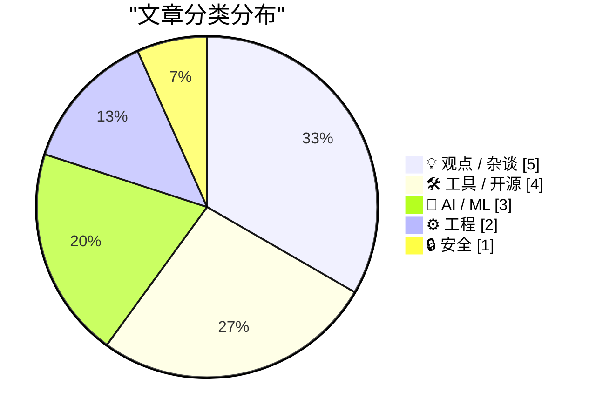
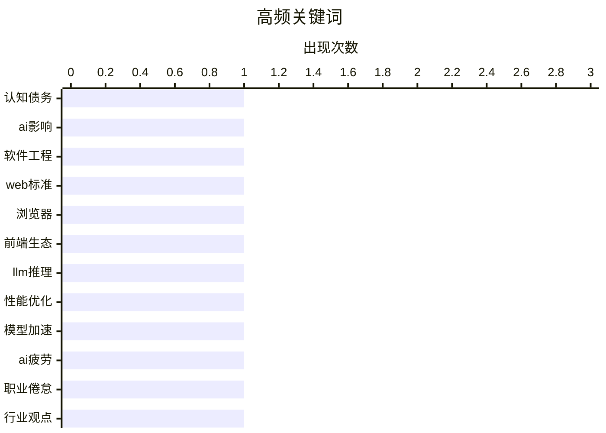

# 📰 AI 博客每日精选 — 2026-02-16

> 来自 Karpathy 推荐的 92 个顶级技术博客，AI 精选 Top 15

## 📝 今日看点

今日技术圈聚焦于人工智能深度整合带来的行业反思与工具生态的协同演进。生成式智能体的广泛应用正促使开发领域从技术债务转向认知债务，同时引发团队倦怠与心理健康的新挑战。跨平台互操作性倡议与开源工具的快速发展，推动着技术标准统一与协作创新。业界也在重新审视智能浪潮中人类开发者的不可替代角色，强调其决策与协调的核心价值。

---

## 🏆 今日必读

🥇 **生成式与智能体人工智能如何将关注点从技术债转向认知债**

[生成式与智能体人工智能如何将关注点从技术债转向认知债](https://simonwillison.net/2026/Feb/15/cognitive-debt/#atom-everything) — simonwillison.net · 1 天前 · 🤖 AI / ML

> 文章探讨了在生成式与智能体人工智能普及的背景下，软件开发领域的关注焦点正从技术债转向认知债。认知债指的是因过度依赖人工智能生成代码或决策，导致团队对系统理解、设计意图和上下文知识逐渐流失所累积的债务。这种债务虽不直接导致系统崩溃，但会削弱团队自主解决问题和进行有效创新的能力。作者的核心观点是，管理认知债将成为未来工程领导力的关键挑战，其重要性可能超过传统技术债。

💡 **为什么值得读**: 该文前瞻性地提出了“认知债”这一关键概念，为理解人工智能时代团队能力退化的隐性风险提供了重要框架。

🏷️ 认知债务, AI影响, 软件工程

🥈 **启动互操作性2026**

[启动互操作性2026](https://simonwillison.net/2026/Feb/15/interop-2026/#atom-everything) — simonwillison.net · 1 天前 · ⚙️ 工程

> 文章介绍了由苹果、谷歌、伊加利亚、微软和谋智共同发起的“互操作性2026”倡议。该倡议旨在通过跨浏览器厂商协作，确保一组特定的网络平台功能在一年内达到跨浏览器一致性。互操作性系列始于2021年，已被证明极具影响力与成效，显著改善了网络开发者的体验。其核心目标是减少开发者因浏览器差异而编写适配代码的负担，推动网络标准更一致地落地。

💡 **为什么值得读**: 了解主流浏览器厂商如何协同推进网络标准统一，对前端开发者预见技术兼容性和减少开发成本有直接指导意义。

🏷️ Web标准, 浏览器, 前端生态

🥉 **两种不同的大语言模型快速推理技巧**

[两种不同的大语言模型快速推理技巧](https://seangoedecke.com/fast-llm-inference/) — seangoedecke.com · 1 天前 · 🤖 AI / ML

> 文章对比分析了安斯科普公司和开放人工智能公司近期推出的两种“快速模式”技术方案，旨在提升其最佳代码模型的响应速度。安斯科普的方案通过优化推理过程，将令牌输出速度提升至最高每秒2.5倍；而开放人工智能则采用了完全不同的技术路径。这两种方案在实现原理、性能表现和适用场景上存在显著差异。文章的核心在于揭示表面相似的功能背后，存在着截然不同的底层技术选型与权衡。

💡 **为什么值得读**: 通过深入对比两大人工智能巨头的技术实现差异，为开发者选择或理解模型优化方案提供了关键洞察。

🏷️ LLM推理, 性能优化, 模型加速

---

## 📊 数据概览

| 扫描源 | 抓取文章 | 时间范围 | 精选 |
|:---:|:---:|:---:|:---:|
| 85/92 | 2417 篇 → 30 篇 | 48h | **15 篇** |

### 分类分布



### 高频关键词



<details>
<summary>📈 纯文本关键词图（终端友好）</summary>

```
认知债务  │ ████████████████████ 1
ai影响  │ ████████████████████ 1
软件工程  │ ████████████████████ 1
web标准 │ ████████████████████ 1
浏览器   │ ████████████████████ 1
前端生态  │ ████████████████████ 1
llm推理 │ ████████████████████ 1
性能优化  │ ████████████████████ 1
模型加速  │ ████████████████████ 1
ai疲劳  │ ████████████████████ 1
```

</details>

### 🏷️ 话题标签

**认知债务**(1) · **ai影响**(1) · **软件工程**(1) · web标准(1) · 浏览器(1) · 前端生态(1) · llm推理(1) · 性能优化(1) · 模型加速(1) · ai疲劳(1) · 职业倦怠(1) · 行业观点(1) · ai训练(1) · 硬件(1) · tiny corp(1) · 文件格式(1) · html(1) · 静态网站(1) · 开发者心态(1) · ai焦虑(1)

---

## 💡 观点 / 杂谈

### 1. 人工智能吸血鬼

[人工智能吸血鬼](https://simonwillison.net/2026/Feb/15/the-ai-vampire/#atom-everything) — **simonwillison.net** · 7 小时前 · ⭐ 25/30

> 文章提出了“人工智能吸血鬼”的概念，用以描述智能体疲劳及其与职业倦怠的关系。它描绘了一种场景：当团队中仅一人使用人工智能工具获得十倍生产力时，会给同事带来巨大压力，最终可能导致整个团队陷入过度工作和倦怠。这种现象如同吸血鬼般，吸取团队的精力与健康。作者的核心观点是，人工智能带来的效率提升若缺乏合理管理，反而会侵蚀团队福祉，引发系统性倦怠。

🏷️ AI疲劳, 职业倦怠, 行业观点

---

### 2. 深蓝

[深蓝](https://simonwillison.net/2026/Feb/15/deep-blue/#atom-everything) — **simonwillison.net** · 10 小时前 · ⭐ 22/30

> 文章定义并阐述了一个新术语“深蓝”，用以描述软件开发者在生成式人工智能侵入其工作领域时，所感受到的从心理倦怠到存在性焦虑的情绪。这个术语源自“深蓝”超级计算机击败国际象棋大师卡斯帕罗夫的历史事件，隐喻人工智能给从业者带来的冲击与无力感。它精准捕捉了当前许多开发者面对技术变革时的复杂心理状态。

🏷️ 开发者心态, AI焦虑, 心理状态

---

### 3. 引用鲍里斯·切尔尼

[引用鲍里斯·切尔尼](https://simonwillison.net/2026/Feb/14/boris/#atom-everything) — **simonwillison.net** · 1 天前 · ⭐ 21/30

> 文章引用了克劳德代码创建者鲍里斯·切尔尼的观点，解释为何安斯科普公司仍在积极招聘开发者。他指出，即使人工智能能力强大，仍需要有人去提示人工智能、与客户沟通、协调跨团队工作并决定下一步构建什么。工程的性质正在改变，而优秀的工程师比以往任何时候都更加重要。

🏷️ 工程师角色, AI时代, 职业发展

---

### 4. 社交媒体支付与扭曲的激励

[社交媒体支付与扭曲的激励](https://shkspr.mobi/blog/2026/02/social-media-payments-and-perverse-incentives/) — **shkspr.mobi** · 19 小时前 · ⭐ 20/30

> 文章讨论了在社交媒体平台上直接向记者或内容创作者进行小额支付的设想。这种机制旨在绕过传统新闻付费墙和平台抽成，让支持行为更便捷。作者认为这能改变创作者依赖广告和流量的激励模式，可能催生更健康的内容生态。然而，这种直接支付也可能带来新的、不可预见的扭曲激励。

🏷️ 社交媒体, 支付, 内容创作

---

### 5. 设计解构：转向文本驱动的心智模式

[设计解构：转向文本驱动的心智模式](https://feed.tedium.co/link/15204/17276365/text-based-design-mindset) — **tedium.co** · 1 天前 · ⭐ 20/30

> 文章挑战了设计工作必须依赖图形用户界面和鼠标操作的传统范式。作者提出，设计完全可以采用文本驱动的思维和工作流程。文本驱动设计能提升工作的可访问性、可版本控制和自动化程度。这并非要抛弃视觉产出，而是将设计过程的核心逻辑与决策文本化。这种转变有可能解放设计师，使其专注于更本质的创意与结构问题。

🏷️ 软件设计, 文本驱动, GUI

---

## 🛠 工具 / 开源

### 6. Gwtar：一种静态高效的单文件超文本标记语言格式

[Gwtar：一种静态高效的单文件超文本标记语言格式](https://simonwillison.net/2026/Feb/15/gwtar/#atom-everything) — **simonwillison.net** · 13 小时前 · ⭐ 23/30

> 文章介绍了一个名为Gwtar的新项目，它旨在解决将大量资源（如图片、样式表）打包进单个超文本标记语言归档文件时的技术挑战。其核心技术诀窍是在页面加载早期调用“窗口停止”方法，以阻止浏览器继续加载内嵌的大型资源，从而避免页面卡顿。然后通过自定义的超文本标记语言元素按需加载这些资源。这种方法实现了静态资源的单文件分发与高效浏览的平衡。

🏷️ 文件格式, HTML, 静态网站

---

### 7. 开源爪的三个月

[开源爪的三个月](https://simonwillison.net/2026/Feb/15/openclaw/#atom-everything) — **simonwillison.net** · 14 小时前 · ⭐ 22/30

> 文章回顾了开源项目“开源爪”在启动不到三个月内取得的惊人增长。该项目在短时间内获得了来自600名贡献者的1万次提交，吸引了19.6万个GitHub星标，甚至其影响力隐约出现在一则超级碗广告中。项目创始人将其描述为一场旨在吸引顶尖人工智能人才加入的“营销活动”。这展示了开源项目在人工智能时代可能达到的病毒式传播速度与社区影响力。

🏷️ 开源项目, 社区增长, GitHub

---

### 8. 工作操作系统管道

[工作操作系统管道](https://workos.com/docs/pipes?utm_source=daringfireball&amp;utm_medium=newsletter&amp;utm_campaign=q12026&amp;utm_content=no_rebuild) — **daringfireball.net** · 8 小时前 · ⭐ 22/30

> 文章介绍了工作操作系统提供的“管道”服务，该服务旨在简化应用程序连接第三方应用程序编程接口（如GitHub、Slack、谷歌）的通用流程。它通过内置小组件处理用户授权流程，并在后端提供统一的令牌访问应用程序编程接口，由管道服务负责凭证存储和令牌刷新等底层逻辑。这使开发者无需重复实现复杂的第三方集成“管道”代码。

🏷️ API集成, OAuth, 开发工具

---

### 9. 在容器构建中分离下载与安装阶段

[在容器构建中分离下载与安装阶段](https://nesbitt.io/2026/02/15/separating-download-from-install-in-docker-builds.html) — **nesbitt.io** · 1 天前 · ⭐ 21/30

> 文章探讨如何优化容器镜像构建过程中的层缓存效率。核心方案是建议软件包管理器将软件包下载与安装两个步骤分离。这样，当仅安装命令变动时，已下载的软件包层可以被复用，无需重新下载。此方法能显著减少构建时间，提升开发与部署流程的效率。

🏷️ Docker, 层缓存, 构建优化

---

## 🤖 AI / ML

### 10. 生成式与智能体人工智能如何将关注点从技术债转向认知债

[生成式与智能体人工智能如何将关注点从技术债转向认知债](https://simonwillison.net/2026/Feb/15/cognitive-debt/#atom-everything) — **simonwillison.net** · 1 天前 · ⭐ 27/30

> 文章探讨了在生成式与智能体人工智能普及的背景下，软件开发领域的关注焦点正从技术债转向认知债。认知债指的是因过度依赖人工智能生成代码或决策，导致团队对系统理解、设计意图和上下文知识逐渐流失所累积的债务。这种债务虽不直接导致系统崩溃，但会削弱团队自主解决问题和进行有效创新的能力。作者的核心观点是，管理认知债将成为未来工程领导力的关键挑战，其重要性可能超过传统技术债。

🏷️ 认知债务, AI影响, 软件工程

---

### 11. 两种不同的大语言模型快速推理技巧

[两种不同的大语言模型快速推理技巧](https://seangoedecke.com/fast-llm-inference/) — **seangoedecke.com** · 1 天前 · ⭐ 26/30

> 文章对比分析了安斯科普公司和开放人工智能公司近期推出的两种“快速模式”技术方案，旨在提升其最佳代码模型的响应速度。安斯科普的方案通过优化推理过程，将令牌输出速度提升至最高每秒2.5倍；而开放人工智能则采用了完全不同的技术路径。这两种方案在实现原理、性能表现和适用场景上存在显著差异。文章的核心在于揭示表面相似的功能背后，存在着截然不同的底层技术选型与权衡。

🏷️ LLM推理, 性能优化, 模型加速

---

### 12. 小公司的产品——一个训练盒

[小公司的产品——一个训练盒](https://geohot.github.io//blog/jekyll/update/2026/02/15/tiny-corp-product.html) — **geohot.github.io** · 1 天前 · ⭐ 24/30

> 文章简短宣布了小公司的新产品定位为“训练盒”，并提及了其位于香港的新办公室。

🏷️ AI训练, 硬件, tiny corp

---

## ⚙️ 工程

### 13. 启动互操作性2026

[启动互操作性2026](https://simonwillison.net/2026/Feb/15/interop-2026/#atom-everything) — **simonwillison.net** · 1 天前 · ⭐ 26/30

> 文章介绍了由苹果、谷歌、伊加利亚、微软和谋智共同发起的“互操作性2026”倡议。该倡议旨在通过跨浏览器厂商协作，确保一组特定的网络平台功能在一年内达到跨浏览器一致性。互操作性系列始于2021年，已被证明极具影响力与成效，显著改善了网络开发者的体验。其核心目标是减少开发者因浏览器差异而编写适配代码的负担，推动网络标准更一致地落地。

🏷️ Web标准, 浏览器, 前端生态

---

### 14. 英特尔8087浮点芯片中的指令解码机制

[英特尔8087浮点芯片中的指令解码机制](http://www.righto.com/feeds/8201340188892833254/comments/default) — **righto.com** · 1 天前 · ⭐ 20/30

> 文章深入解析了上世纪80年代英特尔8087数学协处理器芯片的指令解码工作原理。8087通过扩展指令集，为个人电脑提供了强大的浮点与超越函数计算能力，使图形设计、科学计算等应用性能大幅提升。解码器需要识别并处理来自中央处理器的主指令流中的协处理器指令。其精巧的硬件设计是早期提升个人计算性能的关键技术之一。

🏷️ 指令解码, 浮点处理器, 计算机架构

---

## 🔒 安全

### 15. 你的订阅源抓取器似乎是人工智能代理或网络爬虫

[你的订阅源抓取器似乎是人工智能代理或网络爬虫](https://utcc.utoronto.ca/~cks/cspace-no-ai-agents.html) — **utcc.utoronto.ca/~cks** · 1 天前 · ⭐ 21/30

> 网站管理员主动屏蔽所有人工智能代理和网络爬虫对其订阅源的访问。作者认为人工智能代理是滥用过程的产物，不存在合乎伦理的使用方式。因此，无论背后是否有人类操作，所有使用类似用户代理标识的请求都会被阻止。作者明确表示，不愿为那些不关心工具伦理性的使用者提供帮助。

🏷️ AI爬虫, 安全, 隐私

---

*生成于 2026-02-16 07:39 | 扫描 85 源 → 获取 2417 篇 → 精选 15 篇*
*基于 [Hacker News Popularity Contest 2025](https://refactoringenglish.com/tools/hn-popularity/) RSS 源列表，由 [Andrej Karpathy](https://x.com/karpathy) 推荐*
