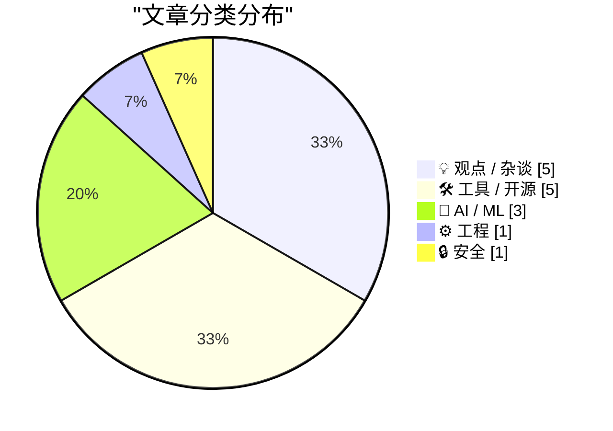
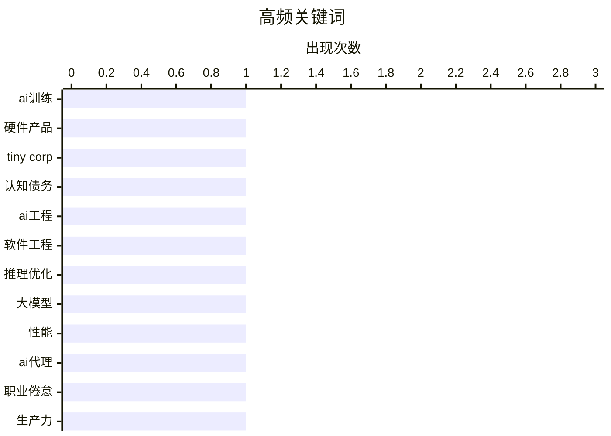

# 📰 AI 博客每日精选 — 2026-02-16

> 来自 Karpathy 推荐的 92 个顶级技术博客，AI 精选 Top 15

## 📝 今日看点

今日技术圈聚焦人工智能技术的深化应用与伴随的人文工程挑战。硬件创新与模型优化推动前沿发展，但认知债务与职业倦怠问题凸显人类适应的新压力。工具链持续革新，从构建流程到跨平台互操作性，致力于提升开发效率，同时开源项目的迅猛增长展现社区驱动的创新活力。

---

## 🏆 今日必读

🥇 **小公司的新产品：一台训练盒**

[小公司的新产品：一台训练盒](https://geohot.github.io//blog/jekyll/update/2026/02/15/tiny-corp-product.html) — geohot.github.io · 1 天前 · 🤖 AI / ML

> 文章介绍了一家小公司推出的一款专为人工智能模型训练设计的硬件产品“训练盒”。该产品基于开源参考设计，旨在提供高性价比的解决方案。其核心是集成了特定硬件与软件栈，目标用户是希望拥有可控训练环境的研究人员和小型团队。作者认为这款产品代表了开源硬件在人工智能基础设施领域的一次重要实践。

💡 **为什么值得读**: 了解一家前沿人工智能初创公司如何通过开源硬件思路挑战现有训练基础设施格局。

🏷️ AI训练, 硬件产品, tiny corp

🥈 **生成式与代理式人工智能如何将关注点从技术债务转向认知债务**

[生成式与代理式人工智能如何将关注点从技术债务转向认知债务](https://simonwillison.net/2026/Feb/15/cognitive-debt/#atom-everything) — simonwillison.net · 1 天前 · 🤖 AI / ML

> 核心主题是探讨在生成式与代理式人工智能普及的背景下，软件开发中的核心挑战正从“技术债务”转向“认知债务”。认知债务指的是人类为理解、验证和指导人工智能输出而持续投入的认知负荷，这种负荷会不断累积并降低效率。与技术债务不同，认知债务更隐蔽，直接消耗开发者的心智资源，并随着人工智能工具的复杂化而加剧。文章结论是，管理认知债务将成为未来人机协作效率的关键。

💡 **为什么值得读**: 提供了一个极具洞察力的新框架，帮助开发者理解并应对人工智能时代新型的工作负担与效率瓶颈。

🏷️ 认知债务, AI工程, 软件工程

🥉 **实现大语言模型快速推理的两种不同技巧**

[实现大语言模型快速推理的两种不同技巧](https://seangoedecke.com/fast-llm-inference/) — seangoedecke.com · 1 天前 · 🤖 AI / ML

> 文章对比分析了安斯罗皮克与开放人工智能两家公司近期推出的“快速模式”在技术实现上的根本差异。安斯罗皮克的方案通过优化服务端计算，将令牌生成速度提升至每秒二点五倍，但可能牺牲部分输出质量。开放人工智能则采用了一种“推测执行”技术，预先生成并验证多个令牌来加速响应。两种方案代表了提升大语言模型推理速度的不同技术路径与权衡。

💡 **为什么值得读**: 通过清晰的对比，揭示了顶尖人工智能公司如何从不同角度解决大语言模型推理速度这一核心工程挑战。

🏷️ 推理优化, 大模型, 性能

---

## 📊 数据概览

| 扫描源 | 抓取文章 | 时间范围 | 精选 |
|:---:|:---:|:---:|:---:|
| 85/92 | 2417 篇 → 30 篇 | 48h | **15 篇** |

### 分类分布



### 高频关键词



<details>
<summary>📈 纯文本关键词图（终端友好）</summary>

```
ai训练      │ ████████████████████ 1
硬件产品      │ ████████████████████ 1
tiny corp │ ████████████████████ 1
认知债务      │ ████████████████████ 1
ai工程      │ ████████████████████ 1
软件工程      │ ████████████████████ 1
推理优化      │ ████████████████████ 1
大模型       │ ████████████████████ 1
性能        │ ████████████████████ 1
ai代理      │ ████████████████████ 1
```

</details>

### 🏷️ 话题标签

**ai训练**(1) · **硬件产品**(1) · **tiny corp**(1) · 认知债务(1) · ai工程(1) · 软件工程(1) · 推理优化(1) · 大模型(1) · 性能(1) · ai代理(1) · 职业倦怠(1) · 生产力(1) · ai焦虑(1) · 开发者心态(1) · 技术变革(1) · web标准(1) · 浏览器兼容性(1) · 前端开发(1) · docker(1) · 层缓存(1)

---

## 💡 观点 / 杂谈

### 1. 人工智能吸血鬼

[人工智能吸血鬼](https://simonwillison.net/2026/Feb/15/the-ai-vampire/#atom-everything) — **simonwillison.net** · 7 小时前 · ⭐ 24/30

> 文章以“人工智能吸血鬼”为比喻，描述了过度依赖人工智能代理导致的人类“代理人疲劳”及其与职业倦怠的关系。核心论点是，当个人过度使用人工智能以提升生产力时，会产生巨大的认知与情感消耗，这种消耗如同被吸血鬼吸取精力。这种模式不可持续，最终会导致用户精疲力尽，反而损害长期产出。作者警示，盲目追求人工智能辅助的十倍效率可能带来隐藏的个人成本。

🏷️ AI代理, 职业倦怠, 生产力

---

### 2. 深蓝

[深蓝](https://simonwillison.net/2026/Feb/15/deep-blue/#atom-everything) — **simonwillison.net** · 10 小时前 · ⭐ 24/30

> 文章提出了一个新术语“深蓝”，用以描述许多软件开发者在生成式人工智能侵入其工作领域时所感受到的一种心理倦怠乃至存在性焦虑。这种情绪源于人工智能在编程等核心创造性任务上展现出的强大能力，动摇了开发者的职业身份认同与价值感。“深蓝”的命名灵感来源于当年击败国际象棋冠军的超级计算机，象征着对人类智能领域的又一次冲击。这个概念旨在为开发者群体中弥漫的普遍情绪提供一个命名和讨论的框架。

🏷️ AI焦虑, 开发者心态, 技术变革

---

### 3. 摘要生成失败（可重试）

[摘要生成失败（可重试）](https://feed.tedium.co/link/15204/17276365/text-based-design-mindset) — **tedium.co** · 1 天前 · ⭐ 22/30

> 未能生成中文摘要，请稍后重试。

🏷️ 软件设计, 文本驱动, GUI

---

### 4. 摘要生成失败（可重试）

[摘要生成失败（可重试）](https://simonwillison.net/2026/Feb/14/boris/#atom-everything) — **simonwillison.net** · 1 天前 · ⭐ 21/30

> 未能生成中文摘要，请稍后重试。

🏷️ AI时代, 工程师角色, 人机协作

---

### 5. 摘要生成失败（可重试）

[摘要生成失败（可重试）](https://shkspr.mobi/blog/2026/02/social-media-payments-and-perverse-incentives/) — **shkspr.mobi** · 18 小时前 · ⭐ 19/30

> 未能生成中文摘要，请稍后重试。

🏷️ 内容付费, 社交媒体, 创作者经济

---

## 🛠 工具 / 开源

### 6. 在多克镜像构建中分离下载与安装步骤

[在多克镜像构建中分离下载与安装步骤](https://nesbitt.io/2026/02/15/separating-download-from-install-in-docker-builds.html) — **nesbitt.io** · 1 天前 · ⭐ 24/30

> 文章探讨了如何优化多克镜像构建过程以更好地利用层缓存。核心建议是，大多数软件包管理器应该将依赖包的下载与安装两个步骤分离。这样，当依赖列表未变更时，下载层可以被缓存，大幅加速后续构建。作者指出这是当前多克构建流程中一个普遍存在但未被充分利用的优化点。实施此模式可以显著提升持续集成与部署的效率。

🏷️ Docker, 层缓存, 构建优化

---

### 7. 开放爪项目的三个月

[开放爪项目的三个月](https://simonwillison.net/2026/Feb/15/openclaw/#atom-everything) — **simonwillison.net** · 13 小时前 · ⭐ 23/30

> 文章回顾了开源人工智能项目“开放爪”在启动不到三个月内取得的惊人增长。该项目已获得来自六百名贡献者的一万次提交，在代码托管平台上收获了十九万六千个星标，并疑似出现在一则超级碗广告中。项目创始人将其定位为“人工智能领域的Linux”，旨在构建开源的人工智能基础设施。这种爆炸式增长反映了市场对开源人工智能底层技术的强烈需求与关注。

🏷️ 开源项目, 社区协作, GitHub

---

### 8. 格温压缩文档：一种静态高效的单文件超文本标记语言格式

[格温压缩文档：一种静态高效的单文件超文本标记语言格式](https://simonwillison.net/2026/Feb/15/gwtar/#atom-everything) — **simonwillison.net** · 12 小时前 · ⭐ 22/30

> 文章介绍了一种名为“格温压缩文档”的新文件格式，旨在将大量网络资源打包成单个超文本标记语言文件。其核心技术窍门是在页面加载早期调用“窗口停止”函数，阻止浏览器继续加载内嵌的实际资源文件。相反，它通过数据统一资源定位符和脚本语言动态地按需解压并呈现内容，从而在保持单文件便携性的同时，提供接近正常网页的浏览体验。该格式解决了传统归档超文本文件浏览不便的难题。

🏷️ 文件格式, 前端工具, 静态网站

---

### 9. 摘要生成失败（可重试）

[摘要生成失败（可重试）](https://jayd.ml/2026/02/14/godot-minesweeper.html) — **jayd.ml** · 1 天前 · ⭐ 22/30

> 未能生成中文摘要，请稍后重试。

🏷️ Godot引擎, 游戏重制, 扫雷

---

### 10. 摘要生成失败（可重试）

[摘要生成失败（可重试）](https://workos.com/docs/pipes?utm_source=daringfireball&amp;utm_medium=newsletter&amp;utm_campaign=q12026&amp;utm_content=no_rebuild) — **daringfireball.net** · 7 小时前 · ⭐ 21/30

> 未能生成中文摘要，请稍后重试。

🏷️ API集成, 开发工具, 身份验证

---

## 🤖 AI / ML

### 11. 小公司的新产品：一台训练盒

[小公司的新产品：一台训练盒](https://geohot.github.io//blog/jekyll/update/2026/02/15/tiny-corp-product.html) — **geohot.github.io** · 1 天前 · ⭐ 28/30

> 文章介绍了一家小公司推出的一款专为人工智能模型训练设计的硬件产品“训练盒”。该产品基于开源参考设计，旨在提供高性价比的解决方案。其核心是集成了特定硬件与软件栈，目标用户是希望拥有可控训练环境的研究人员和小型团队。作者认为这款产品代表了开源硬件在人工智能基础设施领域的一次重要实践。

🏷️ AI训练, 硬件产品, tiny corp

---

### 12. 生成式与代理式人工智能如何将关注点从技术债务转向认知债务

[生成式与代理式人工智能如何将关注点从技术债务转向认知债务](https://simonwillison.net/2026/Feb/15/cognitive-debt/#atom-everything) — **simonwillison.net** · 1 天前 · ⭐ 27/30

> 核心主题是探讨在生成式与代理式人工智能普及的背景下，软件开发中的核心挑战正从“技术债务”转向“认知债务”。认知债务指的是人类为理解、验证和指导人工智能输出而持续投入的认知负荷，这种负荷会不断累积并降低效率。与技术债务不同，认知债务更隐蔽，直接消耗开发者的心智资源，并随着人工智能工具的复杂化而加剧。文章结论是，管理认知债务将成为未来人机协作效率的关键。

🏷️ 认知债务, AI工程, 软件工程

---

### 13. 实现大语言模型快速推理的两种不同技巧

[实现大语言模型快速推理的两种不同技巧](https://seangoedecke.com/fast-llm-inference/) — **seangoedecke.com** · 1 天前 · ⭐ 26/30

> 文章对比分析了安斯罗皮克与开放人工智能两家公司近期推出的“快速模式”在技术实现上的根本差异。安斯罗皮克的方案通过优化服务端计算，将令牌生成速度提升至每秒二点五倍，但可能牺牲部分输出质量。开放人工智能则采用了一种“推测执行”技术，预先生成并验证多个令牌来加速响应。两种方案代表了提升大语言模型推理速度的不同技术路径与权衡。

🏷️ 推理优化, 大模型, 性能

---

## ⚙️ 工程

### 14. 启动互操作性二零二六

[启动互操作性二零二六](https://simonwillison.net/2026/Feb/15/interop-2026/#atom-everything) — **simonwillison.net** · 1 天前 · ⭐ 24/30

> 文章介绍了由苹果、谷歌、伊加利娅、微软和谋智公司共同发起的“互操作性二零二六”倡议。该倡议旨在通过跨浏览器厂商协作，在一年内推动一组特定的网络平台功能达到跨浏览器一致兼容。自二零二一年启动以来，该系列互操作性项目已成功将关键网络功能的跨浏览器兼容率从百分之三十提升至百分之九十五以上。此举旨在改善开发者体验并推动网络标准统一。

🏷️ Web标准, 浏览器兼容性, 前端开发

---

## 🔒 安全

### 15. 您的订阅获取器似乎是人工智能代理或爬虫

[您的订阅获取器似乎是人工智能代理或爬虫](https://utcc.utoronto.ca/~cks/cspace-no-ai-agents.html) — **utcc.utoronto.ca/~cks** · 1 天前 · ⭐ 23/30

> 作者明确声明其网站会屏蔽所有标识为人工智能代理或爬虫的订阅请求。屏蔽理由是，作者认为人工智能代理的诞生过程充满滥用，且不存在符合伦理的使用方式。该政策不考虑代理背后是否有人类操作，旨在拒绝为不关心工具伦理性的用户提供服务。这代表了一种对人工智能数据抓取行为的强硬抵制立场。

🏷️ AI爬虫, 内容屏蔽, 数据抓取

---

*生成于 2026-02-16 07:22 | 扫描 85 源 → 获取 2417 篇 → 精选 15 篇*
*基于 [Hacker News Popularity Contest 2025](https://refactoringenglish.com/tools/hn-popularity/) RSS 源列表，由 [Andrej Karpathy](https://x.com/karpathy) 推荐*
