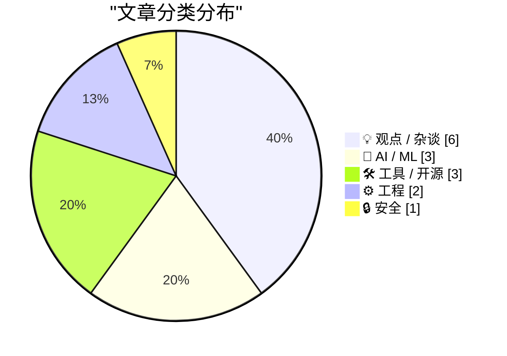
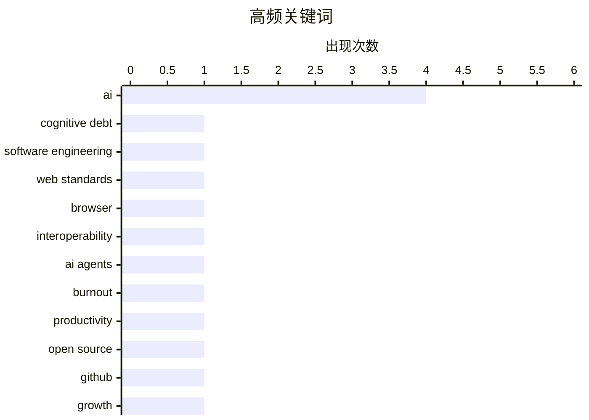

# 📰 AI 博客每日精选 — 2026-02-16

> 来自 Karpathy 推荐的 92 个顶级技术博客，AI 精选 Top 15

## 📝 今日看点

今日技术圈聚焦于AI深度融合带来的范式变革与行业协作新趋势。生成式AI的普及正将技术债务转化为认知债务，引发对开发者心理焦虑与团队自主性的深层讨论。跨浏览器厂商联合启动Interop 2026计划，旨在加速Web平台标准化，彰显生态协同的迫切性。同时，开源项目的迅猛迭代与AI硬件创新，共同推动着开发工具与工作流程的快速演进。

---

## 🏆 今日必读

🥇 **生成式与智能体AI如何将关注点从技术债务转向认知债务**

[How Generative and Agentic AI Shift Concern from Technical Debt to Cognitive Debt](https://simonwillison.net/2026/Feb/15/cognitive-debt/#atom-everything) — simonwillison.net · 22 小时前 · 🤖 AI / ML

> 生成式和智能体AI的兴起，正在将技术债务的关注点转向认知债务。认知债务指因过度依赖AI辅助决策和代码生成，导致团队对系统理解、决策逻辑和领域知识逐渐流失的隐性成本。这种债务积累会削弱团队的长期自主性、创新能力和系统演进潜力，其危害比传统技术债务更隐蔽且难以偿还。文章核心观点是，在AI时代，管理认知债务将比管理技术债务更为关键。

💡 **为什么值得读**: 该文章清晰地定义并剖析了AI普及后一个崭新且至关重要的工程管理概念，帮助团队提前识别和防范潜在风险。

🏷️ AI, cognitive debt, software engineering

🥈 **启动 Interop 2026**

[Launching Interop 2026](https://simonwillison.net/2026/Feb/15/interop-2026/#atom-everything) — simonwillison.net · 23 小时前 · ⚙️ 工程

> 文章介绍了由苹果、谷歌、Igalia、微软和Mozilla共同发起的Interop 2026计划。该计划旨在通过跨浏览器厂商协作，在一年内推动一组特定的Web平台功能达到跨浏览器一致性。自2021年启动以来，Interop系列已成功推动了多个关键Web标准（如CSS、滚动、表单）的兼容性大幅提升。其核心目标是改善开发者体验，确保Web应用在不同浏览器上拥有一致、可靠的行为。

💡 **为什么值得读**: 了解主导Web生态的各大厂商如何协同工作以解决兼容性难题，是理解现代Web技术发展脉络的关键。

🏷️ web standards, browser, interoperability

🥉 **AI吸血鬼**

[The AI Vampire](https://simonwillison.net/2026/Feb/15/the-ai-vampire/#atom-everything) — simonwillison.net · 3 小时前 · 💡 观点 / 杂谈

> 文章探讨了AI代理（Agent）的广泛使用可能导致的“代理疲劳”及其与职业倦怠的关系。核心论点是，当团队中只有少数人使用AI实现10倍生产力时，会迫使其他人被迫跟上，最终导致整个团队的工作强度非理性攀升，如同被“AI吸血鬼”吸取精力。这种无休止的效率竞赛，可能摧毁团队文化和员工心理健康。作者警示，盲目追求AI驱动的个体效率提升，可能以牺牲整体可持续性为代价。

💡 **为什么值得读**: 它从一个新颖的社会心理学视角，揭示了AI工具在提升效率背后可能带来的隐性组织成本与人性化危机。

🏷️ AI agents, burnout, productivity

---

## 📊 数据概览

| 扫描源 | 抓取文章 | 时间范围 | 精选 |
|:---:|:---:|:---:|:---:|
| 86/92 | 2433 篇 → 31 篇 | 48h | **15 篇** |

### 分类分布



### 高频关键词



<details>
<summary>📈 纯文本关键词图（终端友好）</summary>

```
ai                   │ ████████████████████ 4
cognitive debt       │ █████░░░░░░░░░░░░░░░ 1
software engineering │ █████░░░░░░░░░░░░░░░ 1
web standards        │ █████░░░░░░░░░░░░░░░ 1
browser              │ █████░░░░░░░░░░░░░░░ 1
interoperability     │ █████░░░░░░░░░░░░░░░ 1
ai agents            │ █████░░░░░░░░░░░░░░░ 1
burnout              │ █████░░░░░░░░░░░░░░░ 1
productivity         │ █████░░░░░░░░░░░░░░░ 1
open source          │ █████░░░░░░░░░░░░░░░ 1
```

</details>

### 🏷️ 话题标签

**ai**(4) · **cognitive debt**(1) · **software engineering**(1) · web standards(1) · browser(1) · interoperability(1) · ai agents(1) · burnout(1) · productivity(1) · open source(1) · github(1) · growth(1) · llm(1) · inference(1) · optimization(1) · design tools(1) · cli(1) · text-driven(1) · ai hardware(1) · training(1)

---

## 💡 观点 / 杂谈

### 1. AI吸血鬼

[The AI Vampire](https://simonwillison.net/2026/Feb/15/the-ai-vampire/#atom-everything) — **simonwillison.net** · 3 小时前 · ⭐ 24/30

> 文章探讨了AI代理（Agent）的广泛使用可能导致的“代理疲劳”及其与职业倦怠的关系。核心论点是，当团队中只有少数人使用AI实现10倍生产力时，会迫使其他人被迫跟上，最终导致整个团队的工作强度非理性攀升，如同被“AI吸血鬼”吸取精力。这种无休止的效率竞赛，可能摧毁团队文化和员工心理健康。作者警示，盲目追求AI驱动的个体效率提升，可能以牺牲整体可持续性为代价。

🏷️ AI agents, burnout, productivity

---

### 2. 设计解构：迈向文本驱动的设计思维

[Design Deconstruction](https://feed.tedium.co/link/15204/17276365/text-based-design-mindset) — **tedium.co** · 1 天前 · ⭐ 22/30

> 文章挑战了设计工作必须依赖图形用户界面（GUI）和鼠标的传统范式，提出了“文本驱动设计”的新理念。核心论点是，设计本质上是一种结构化的决策过程，完全可以像代码一样通过文本（如设计标记语言、样式代码、版本控制）来创建、修改和协作。这种范式转变能提高设计系统的可复用性、版本控制能力和与开发流程的集成度。作者认为，拥抱文本驱动设计是提升设计工程化和团队效率的关键。

🏷️ design tools, CLI, text-driven

---

### 3. 深蓝：AI时代开发者的心理困境

[Deep Blue](https://simonwillison.net/2026/Feb/15/deep-blue/#atom-everything) — **simonwillison.net** · 6 小时前 · ⭐ 21/30

> 文章提出了一个新术语“深蓝”，用以描述生成式AI侵入软件开发领域后，在许多开发者中普遍存在的心理萎靡乃至存在性焦虑的情绪。这个概念源于1997年IBM“深蓝”计算机击败国际象棋冠军卡斯帕罗夫的历史事件，象征着人类在特定领域被机器超越所带来的冲击。作者指出，这种情绪不同于对失业的恐惧，更多是对职业身份和价值感的深层困惑。它正在成为影响开发者心理健康和行业文化的一个新因素。

🏷️ AI, developer, psychology

---

### 4. 引用Boris Cherny的观点

[Quoting Boris Cherny](https://simonwillison.net/2026/Feb/14/boris/#atom-everything) — **simonwillison.net** · 1 天前 · ⭐ 21/30

> 文章引用了Claude Code创建者Boris Cherny的观点，以回应“AI是否会取代工程师”的疑问。Cherny指出，即使有了强大的AI编码助手，仍然需要人类工程师来完成提示工程、与客户沟通、跨团队协调以及决定下一步构建什么等关键工作。他认为，工程的角色正在演变，但优秀的工程师比以往任何时候都更加重要。这解释了为何Anthropic等公司仍在积极招聘开发人员。

🏷️ AI, engineering, roles

---

### 5. 引用Thoughtworks的观点

[Quoting Thoughtworks](https://simonwillison.net/2026/Feb/14/thoughtworks/#atom-everything) — **simonwillison.net** · 1 天前 · ⭐ 21/30

> 文章引用了Thoughtworks一份报告的关键结论，挑战了“AI将消除对初级开发者需求”的叙事。报告指出，在AI工具的辅助下，初级开发者能更快度过最初的生产力净负值阶段，从而比以往更具盈利潜力。他们像是对未来生产力的“看涨期权”，并且通常比从未形成旧有工作习惯的高级工程师更擅长使用AI工具。因此，投资初级开发者对于团队的长期适应性和创新至关重要。

🏷️ AI, junior developers, career

---

### 6. The empire always falls

[The empire always falls](https://www.joanwestenberg.com/the-empire-always-falls/) — **joanwestenberg.com** · 23 小时前 · ⭐ 21/30

> A citizen of Rome in 117 AD, under Emperor Trajan, would&apos;ve found it difficult to imagine the empire not existing. The roads, the aqueducts, the legal system, the trade networks stretching from B

🏷️ tech culture, history, decline

---

## 🤖 AI / ML

### 7. 生成式与智能体AI如何将关注点从技术债务转向认知债务

[How Generative and Agentic AI Shift Concern from Technical Debt to Cognitive Debt](https://simonwillison.net/2026/Feb/15/cognitive-debt/#atom-everything) — **simonwillison.net** · 22 小时前 · ⭐ 27/30

> 生成式和智能体AI的兴起，正在将技术债务的关注点转向认知债务。认知债务指因过度依赖AI辅助决策和代码生成，导致团队对系统理解、决策逻辑和领域知识逐渐流失的隐性成本。这种债务积累会削弱团队的长期自主性、创新能力和系统演进潜力，其危害比传统技术债务更隐蔽且难以偿还。文章核心观点是，在AI时代，管理认知债务将比管理技术债务更为关键。

🏷️ AI, cognitive debt, software engineering

---

### 8. 实现快速LLM推理的两种不同技巧

[Two different tricks for fast LLM inference](https://seangoedecke.com/fast-llm-inference/) — **seangoedecke.com** · 1 天前 · ⭐ 24/30

> 文章对比了Anthropic和OpenAI近期推出的两种“快速模式”LLM推理技术方案。Anthropic的方案通过降低输出质量（如减少推理步骤）来换取高达2.5倍的令牌生成速度，适用于原型开发和快速迭代。OpenAI的Codex Spark则采用了全新的模型架构，在保持高质量输出的同时实现加速，更适合生产环境。两者的根本区别在于权衡策略不同：一个用质量换速度，另一个通过架构创新同时提升速度与质量。

🏷️ LLM, inference, optimization

---

### 9. tiny corp 的产品——一台训练盒子

[tiny corp’s product – a training box](https://geohot.github.io//blog/jekyll/update/2026/02/15/tiny-corp-product.html) — **geohot.github.io** · 1 天前 · ⭐ 22/30

> 文章简短宣布了tiny corp的新产品定位：一台专注于AI模型训练的硬件设备（“训练盒子”）。同时透露公司已在香港设立新办公室。这标志着tiny corp（以开发tinygrad框架闻名）正从软件层面向硬件基础设施领域拓展。其目标很可能是为AI研究社区提供更易获得、性能优化的专用训练硬件。

🏷️ AI hardware, training, tiny corp

---

## 🛠 工具 / 开源

### 10. OpenClaw 项目启动三个月回顾

[Three months of OpenClaw](https://simonwillison.net/2026/Feb/15/openclaw/#atom-everything) — **simonwillison.net** · 10 小时前 · ⭐ 24/30

> 文章记录了开源项目OpenClaw在启动不到三个月内取得的惊人增长。该项目自2025年11月25日首次提交以来，已获得超过1万次提交、600名贡献者以及19.6万个GitHub星标，甚至以某种形式出现在AI.com的超级碗广告中。项目创始人认为其成功源于抓住了开发者对开源、可定制AI编码助手的强烈需求，以对抗封闭的、受控的AI系统。这标志着开源社区在构建AI工具领域正展现出强大的凝聚力和发展速度。

🏷️ open source, GitHub, growth

---

### 11. WorkOS Pipes

[WorkOS Pipes](https://workos.com/docs/pipes?utm_source=daringfireball&amp;utm_medium=newsletter&amp;utm_campaign=q12026&amp;utm_content=no_rebuild) — **daringfireball.net** · 4 小时前 · ⭐ 21/30

> My thanks to WorkOS for sponsoring DF last week. Connecting user accounts to third-party APIs always comes with the same plumbing: OAuth flows, token storage, refresh logic, and provider-specific quir

🏷️ WorkOS, API, integration

---

### 12. Gwtar: a static efficient single-file HTML format

[Gwtar: a static efficient single-file HTML format](https://simonwillison.net/2026/Feb/15/gwtar/#atom-everything) — **simonwillison.net** · 9 小时前 · ⭐ 19/30

> <p><strong><a href="https://gwern.net/gwtar">Gwtar: a static efficient single-file HTML format</a></strong></p>
Fascinating new project from Gwern Branwen and Said Achmiz that targets the challenge of

🏷️ HTML, archive, format

---

## ⚙️ 工程

### 13. 启动 Interop 2026

[Launching Interop 2026](https://simonwillison.net/2026/Feb/15/interop-2026/#atom-everything) — **simonwillison.net** · 23 小时前 · ⭐ 25/30

> 文章介绍了由苹果、谷歌、Igalia、微软和Mozilla共同发起的Interop 2026计划。该计划旨在通过跨浏览器厂商协作，在一年内推动一组特定的Web平台功能达到跨浏览器一致性。自2021年启动以来，Interop系列已成功推动了多个关键Web标准（如CSS、滚动、表单）的兼容性大幅提升。其核心目标是改善开发者体验，确保Web应用在不同浏览器上拥有一致、可靠的行为。

🏷️ web standards, browser, interoperability

---

### 14. Separating Download from Install in Docker Builds

[Separating Download from Install in Docker Builds](https://nesbitt.io/2026/02/15/separating-download-from-install-in-docker-builds.html) — **nesbitt.io** · 1 天前 · ⭐ 21/30

> Most package managers could separate download from install for better Docker layer caching.

🏷️ Docker, build optimization, caching

---

## 🔒 安全

### 15. Your feed fetcher appears to be an AI agent or crawler

[Your feed fetcher appears to be an AI agent or crawler](https://utcc.utoronto.ca/~cks/cspace-no-ai-agents.html) — **utcc.utoronto.ca/~cks** · 23 小时前 · ⭐ 21/30

> <p>Your software is blocked from fetching my syndication feeds
  because it is using a User-Agent header in its HTTP requests that
  appears to be an AI agent or an AI crawler. I block all
  AI agents

🏷️ AI agent, crawler, blocking

---

*生成于 2026-02-16 03:39 | 扫描 86 源 → 获取 2433 篇 → 精选 15 篇*
*基于 [Hacker News Popularity Contest 2025](https://refactoringenglish.com/tools/hn-popularity/) RSS 源列表，由 [Andrej Karpathy](https://x.com/karpathy) 推荐*
*由「懂点儿AI」制作，欢迎关注同名微信公众号获取更多 AI 实用技巧 💡*
