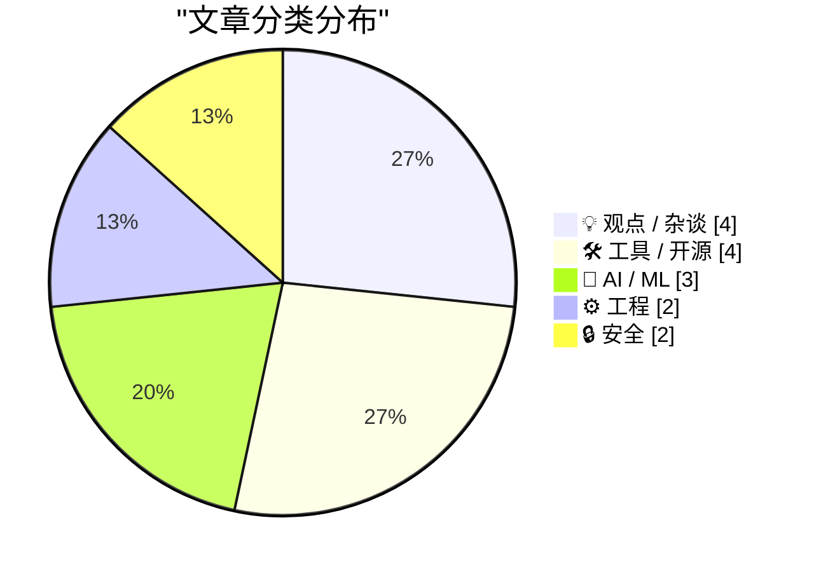
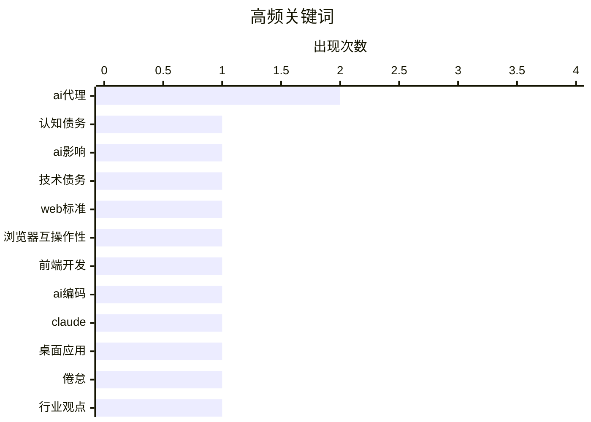

# 📰 AI 博客每日精选 — 2026-02-17

> 来自 Karpathy 推荐的 92 个顶级技术博客，AI 精选 Top 15

## 📝 今日看点

今日技术圈聚焦人工智能的深远影响与社区生态演变。生成式人工智能的普及引发开发者群体心理压力与职业不确定性，同时模型安全漏洞凸显新兴风险。开源项目呈现爆发式增长，彰显协作创新的强大动力。在线社区建设面临规模、质量与凝聚力的根本矛盾，折射出技术扩张中的深层挑战。

---

## 🏆 今日必读

🥇 **深蓝**

[深蓝](https://simonwillison.net/2026/Feb/15/cognitive-debt/#atom-everything) — simonwillison.net · 1 天前 · 🤖 AI / ML

> 生成式人工智能的兴起导致软件开发者普遍感到心理厌倦和存在性恐惧。在奥克赛德与朋友播客中，亚当·莱文塔尔等人创造了新术语“深蓝”来描述这种情绪。该术语精准捕捉了开发者对人工智能替代工作的担忧和职业不确定性。命名“深蓝”现象有助于开发者社区识别和讨论人工智能带来的心理影响。作者强调这是应对人工智能时代职业挑战的重要一步。

💡 **为什么值得读**: 这篇文章首次为软件开发者因人工智能冲击而产生的普遍焦虑情绪命名，提供了理解和应对职业危机的框架。

🏷️ 认知债务, AI影响, 技术债务

🥈 **开放爪项目的三个月**

[开放爪项目的三个月](https://simonwillison.net/2026/Feb/15/interop-2026/#atom-everything) — simonwillison.net · 1 天前 · ⚙️ 工程

> 文章记录了开源项目开放爪在启动后不到三个月内取得的爆炸式增长。该项目自2025年11月25日首次提交以来，已累计获得一万次提交，吸引了六百名贡献者参与，并在代码托管平台收获了十九万六千个星标。其影响力甚至延伸至主流文化领域，被一个含义模糊的人工智能点域名超级碗广告所提及。这一系列数据清晰地表明，一个专注于开放人工智能基础设施的项目能够以惊人的速度凝聚社区力量并获得广泛关注。

💡 **为什么值得读**: 通过真实数据生动展示了开源项目在人工智能时代可能达到的惊人成长速度与社区号召力，对开发者与项目运营者极具启发。

🏷️ Web标准, 浏览器互操作性, 前端开发

🥉 **沃克奥斯管道服务**

[沃克奥斯管道服务](https://simonwillison.net/2026/Feb/16/rodney-claude-code/#atom-everything) — simonwillison.net · 11 小时前 · 🤖 AI / ML

> 连接用户账户到第三方应用程序接口常涉及重复的底层工作，例如授权流程、令牌存储、刷新逻辑和提供商特定问题。沃克奥斯管道服务通过即插即用的小部件，让用户直接连接吉特哈布、斯莱克、谷歌、赛富时等支持的服务。后端在需要时从管道应用程序接口请求有效访问令牌，而该服务自动处理凭证存储和令牌刷新。这一方案消除了集成第三方应用程序接口时的常见开销，使开发者能专注于核心业务逻辑。

💡 **为什么值得读**: 该文章为需要简化第三方服务集成的开发团队，提供了一个能大幅降低开发复杂度的实际解决方案。

🏷️ AI编码, Claude, 桌面应用

---

## 📊 数据概览

| 扫描源 | 抓取文章 | 时间范围 | 精选 |
|:---:|:---:|:---:|:---:|
| 82/92 | 2354 篇 → 34 篇 | 48h | **15 篇** |

### 分类分布



### 高频关键词



<details>
<summary>📈 纯文本关键词图（终端友好）</summary>

```
ai代理    │ ████████████████████ 2
认知债务    │ ██████████░░░░░░░░░░ 1
ai影响    │ ██████████░░░░░░░░░░ 1
技术债务    │ ██████████░░░░░░░░░░ 1
web标准   │ ██████████░░░░░░░░░░ 1
浏览器互操作性 │ ██████████░░░░░░░░░░ 1
前端开发    │ ██████████░░░░░░░░░░ 1
ai编码    │ ██████████░░░░░░░░░░ 1
claude  │ ██████████░░░░░░░░░░ 1
桌面应用    │ ██████████░░░░░░░░░░ 1
```

</details>

### 🏷️ 话题标签

**ai代理**(2) · **认知债务**(1) · **ai影响**(1) · 技术债务(1) · web标准(1) · 浏览器互操作性(1) · 前端开发(1) · ai编码(1) · claude(1) · 桌面应用(1) · 倦怠(1) · 行业观点(1) · ai(1) · 开源(1) · 幻觉(1) · 伦理(1) · llm(1) · 技能生成(1) · 提示工程(1) · cli工具(1)

---

## 💡 观点 / 杂谈

### 1. 在线社区的三重困境：规模、质量与凝聚力不可兼得

[在线社区的三重困境：规模、质量与凝聚力不可兼得](https://simonwillison.net/2026/Feb/15/the-ai-vampire/#atom-everything) — **simonwillison.net** · 1 天前 · ⭐ 24/30

> 文章剖析了在线社区建设中的一个根本性矛盾，即规模、信息质量和社区凝聚力这三项目标无法同时达成。作者提出了一个“三重困境”模型，指出平台若追求大规模用户覆盖，往往需要依赖算法推荐和宽松审核，这会稀释信息质量并削弱成员间的紧密联系。反之，专注于高质量内容或强凝聚力的社区，其增长速度和用户基数通常会受到限制。其核心结论在于，当前主流技术平台的设计逻辑与可持续、健康的社区发展需求之间存在内在冲突。

🏷️ AI代理, 倦怠, 行业观点

---

### 2. 诊断工厂

[诊断工厂](https://www.jeffgeerling.com/blog/2026/ai-is-destroying-open-source/) — **jeffgeerling.com** · 6 小时前 · ⭐ 24/30

> 文章探讨错误管理中的报告问题，即如何向用户生成有用的错误消息。齐格编程语言的强类型错误代码解决了错误处理部分，但报告环节仍需开发者自行设计。作者提出“诊断工厂”作为个人默认方法，利用工厂模式创建结构化错误诊断，以提高错误消息的清晰度和可维护性。这种方法通过标准化流程简化错误报告实现。作者认为“诊断工厂”是提升错误报告质量的有效策略。

🏷️ AI, 开源, 幻觉, 伦理

---

### 3. 深蓝

[深蓝](https://simonwillison.net/2026/Feb/15/deep-blue/#atom-everything) — **simonwillison.net** · 1 天前 · ⭐ 22/30

> 生成式人工智能的兴起导致软件开发者普遍感到心理厌倦和存在性恐惧。在奥克赛德与朋友播客中，亚当·莱文塔尔等人创造了新术语“深蓝”来描述这种情绪。这个术语精准捕捉了开发者对人工智能替代工作的担忧和职业不确定性。命名“深蓝”现象有助于开发者社区识别和讨论人工智能带来的心理影响。作者强调这是应对人工智能时代职业挑战的重要一步。

🏷️ AI心理影响, 开发者倦怠

---

### 4. 在线社区的三重困境：规模、质量与凝聚力不可兼得

[在线社区的三重困境：规模、质量与凝聚力不可兼得](https://pluralistic.net/2026/02/16/fast-good-cheap/) — **pluralistic.net** · 19 小时前 · ⭐ 21/30

> 文章剖析了在线社区建设中的一个根本性矛盾，即规模、信息质量和社区凝聚力这三项目标无法同时达成。作者提出了一个“三重困境”模型，指出平台若追求大规模用户覆盖，往往需要依赖算法推荐和宽松审核，这会稀释信息质量并削弱成员间的紧密联系。反之，专注于高质量内容或强凝聚力的社区，其增长速度和用户基数通常会受到限制。其核心结论在于，当前主流技术平台的设计逻辑与可持续、健康的社区发展需求之间存在内在冲突。

🏷️ 在线社区, 三难困境, 互联网文化

---

## 🛠 工具 / 开源

### 5. 两个新的Showboat模式工具：Chartroom与datasette-showboat

[两个新的Showboat模式工具：Chartroom与datasette-showboat](https://simonwillison.net/2026/Feb/17/chartroom-and-datasette-showboat/#atom-everything) — **simonwillison.net** · 2 小时前 · ⭐ 23/30

> 作者介绍了其为Showboat模式开发的两个新命令行工具。Chartroom是一个与Showboat配合良好的图表工具，datasette-showboat则是一个相关插件。Showboat本身是一个帮助编码智能体创建用于演示其所编写代码的标记文档的工具。这些新工具的发布旨在扩展Showboat模式的应用场景，提升开发者和智能体记录、展示代码成果的效率。

🏷️ CLI工具, Markdown, 编码代理

---

### 6. Gwtar：一种静态高效的单文件超文本标记语言格式

[Gwtar：一种静态高效的单文件超文本标记语言格式](https://simonwillison.net/2026/Feb/15/gwtar/#atom-everything) — **simonwillison.net** · 1 天前 · ⭐ 23/30

> 文章介绍了一个由格温·布兰温和赛义德·阿奇米兹发起的新项目Gwtar。该项目旨在解决将大量资源打包成单个超文本标记语言存档文件时，在浏览器中查看不便的技术挑战。其核心技术诀窍是在页面加载早期调用‘窗口停止加载’方法，以阻止浏览器加载不必要的资源。这种设计实现了既将内容聚合为单一文件，又保持浏览器访问便捷性的目标。

🏷️ HTML格式, 静态网站, 单文件

---

### 7. OpenClaw的三个月

[OpenClaw的三个月](https://simonwillison.net/2026/Feb/15/openclaw/#atom-everything) — **simonwillison.net** · 1 天前 · ⭐ 21/30

> 文章记录了开源项目OpenClaw在启动后不到三个月内取得的爆炸式增长。该项目自2025年11月25日首次提交以来，已累计获得一万次提交，吸引了六百名贡献者参与，并在代码托管平台收获了十九万六千个星标。其影响力甚至延伸至主流文化领域，被一个含义模糊的人工智能点域名超级碗广告所提及。这一系列数据清晰地表明，一个专注于开放人工智能基础设施的项目能够以惊人的速度凝聚社区力量并获得广泛关注。

🏷️ 开源项目, GitHub, 社区贡献

---

### 8. 沃克奥斯管道服务

[沃克奥斯管道服务](https://workos.com/docs/pipes?utm_source=daringfireball&amp;utm_medium=newsletter&amp;utm_campaign=q12026&amp;utm_content=no_rebuild) — **daringfireball.net** · 1 天前 · ⭐ 21/30

> 连接用户账户到第三方应用程序接口常涉及重复的底层工作，如授权流程、令牌存储、刷新逻辑和提供商特定问题。沃克奥斯管道服务通过即插即用的小部件，让用户直接连接吉特哈布、斯莱克、谷歌、赛富时等支持的服务。后端在需要时从管道应用程序接口请求有效访问令牌，而该服务自动处理凭证存储和令牌刷新。这一方案消除了集成第三方应用程序接口时的常见开销，使开发者能专注于核心业务逻辑。

🏷️ WorkOS, 第三方集成, OAuth, API

---

## 🤖 AI / ML

### 9. 深蓝

[深蓝](https://simonwillison.net/2026/Feb/15/cognitive-debt/#atom-everything) — **simonwillison.net** · 1 天前 · ⭐ 27/30

> 生成式人工智能的兴起导致软件开发者普遍感到心理厌倦和存在性恐惧。在奥克赛德与朋友播客中，亚当·莱文塔尔等人创造了新术语“深蓝”来描述这种情绪。该术语精准捕捉了开发者对人工智能替代工作的担忧和职业不确定性。命名“深蓝”现象有助于开发者社区识别和讨论人工智能带来的心理影响。作者强调这是应对人工智能时代职业挑战的重要一步。

🏷️ 认知债务, AI影响, 技术债务

---

### 10. 沃克奥斯管道服务

[沃克奥斯管道服务](https://simonwillison.net/2026/Feb/16/rodney-claude-code/#atom-everything) — **simonwillison.net** · 11 小时前 · ⭐ 24/30

> 连接用户账户到第三方应用程序接口常涉及重复的底层工作，例如授权流程、令牌存储、刷新逻辑和提供商特定问题。沃克奥斯管道服务通过即插即用的小部件，让用户直接连接吉特哈布、斯莱克、谷歌、赛富时等支持的服务。后端在需要时从管道应用程序接口请求有效访问令牌，而该服务自动处理凭证存储和令牌刷新。这一方案消除了集成第三方应用程序接口时的常见开销，使开发者能专注于核心业务逻辑。

🏷️ AI编码, Claude, 桌面应用

---

### 11. 大语言模型生成的‘技能’，仅在生成后使用时有效

[大语言模型生成的‘技能’，仅在生成后使用时有效](https://seangoedecke.com/generate-skills-afterwards/) — **seangoedecke.com** · 3 小时前 · ⭐ 24/30

> 文章讨论了大语言模型的‘技能’功能，即用于特定任务的简短解释性提示。引用的一项新研究表明，虽然技能对大语言模型有用，但由大语言模型自身生成的技能平均来看并无益处。研究摘要指出，模型无法可靠地创作出它们能从中受益的程序性知识。这揭示了当前大语言模型在创建高质量、可复用指令知识方面存在局限性。

🏷️ LLM, 技能生成, 提示工程

---

## ⚙️ 工程

### 12. 开放爪项目的三个月

[开放爪项目的三个月](https://simonwillison.net/2026/Feb/15/interop-2026/#atom-everything) — **simonwillison.net** · 1 天前 · ⭐ 26/30

> 文章记录了开源项目开放爪在启动后不到三个月内取得的爆炸式增长。该项目自2025年11月25日首次提交以来，已累计获得一万次提交，吸引了六百名贡献者参与，并在代码托管平台收获了十九万六千个星标。其影响力甚至延伸至主流文化领域，被一个含义模糊的人工智能点域名超级碗广告所提及。这一系列数据清晰地表明，一个专注于开放人工智能基础设施的项目能够以惊人的速度凝聚社区力量并获得广泛关注。

🏷️ Web标准, 浏览器互操作性, 前端开发

---

### 13. 诊断工厂

[诊断工厂](https://matklad.github.io/2026/02/16/diagnostics-factory.html) — **matklad.github.io** · 1 天前 · ⭐ 21/30

> 文章探讨错误管理中的报告问题，即如何向用户生成有用的错误消息。齐格编程语言的强类型错误代码解决了错误处理部分，但报告环节仍需开发者自行设计。作者提出'诊断工厂'作为个人默认方法，利用工厂模式创建结构化错误诊断，以提高错误消息的清晰度和可维护性。这种方法通过标准化流程简化错误报告实现。作者认为'诊断工厂'是提升错误报告质量的有效策略。

🏷️ 错误处理, Zig, 诊断

---

## 🔒 安全

### 14. 您的订阅抓取程序似乎是人工智能代理或网络爬虫

[您的订阅抓取程序似乎是人工智能代理或网络爬虫](https://utcc.utoronto.ca/~cks/cspace-no-ai-agents.html) — **utcc.utoronto.ca/~cks** · 1 天前 · ⭐ 23/30

> 这是一份网站发布的声明，明确阻止所有人工智能代理或网络爬虫抓取其订阅源。作者声明，因其超文本传输协议请求中的用户代理头显示为人工智能代理，相关软件已被屏蔽。屏蔽理由包括人工智能代理是‘极度滥用过程的产物’，并且作者认为‘人工智能代理没有合乎伦理的用途’。该立场反映了部分内容创作者对人工智能未经授权抓取和使用其内容的强烈反对与伦理担忧。

🏷️ AI代理, 爬虫, 隐私, 屏蔽

---

### 15. Anthropic发现的五百个漏洞仅是冰山一角

[Anthropic发现的五百个漏洞仅是冰山一角](https://martinalderson.com/posts/anthropic-found-500-zero-days/?utm_source=rss) — **martinalderson.com** · 3 小时前 · ⭐ 23/30

> 文章指出，Anthropic公司红队发现其人工智能模型Claude存在五百多个关键漏洞，但这仅是问题的开始。这些发现集中于有维护的软件，而更可怕的问题在于无人修补的长尾漏洞。大量陈旧、无人维护的软件中潜藏着更多未知风险，构成了更大的安全威胁。作者认为，已披露的漏洞只是庞大漏洞冰山浮出水面的部分。

🏷️ 安全漏洞, 人工智能安全, 软件维护

---

*生成于 2026-02-17 03:43 | 扫描 82 源 → 获取 2354 篇 → 精选 15 篇*
*基于 [Hacker News Popularity Contest 2025](https://refactoringenglish.com/tools/hn-popularity/) RSS 源列表，由 [Andrej Karpathy](https://x.com/karpathy) 推荐*
