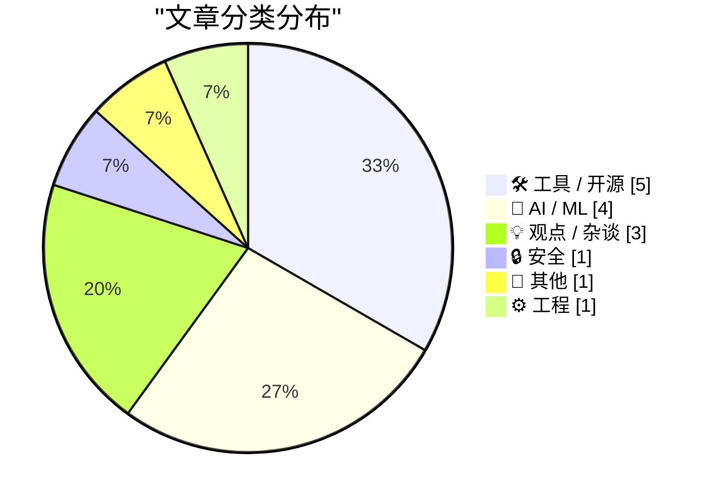
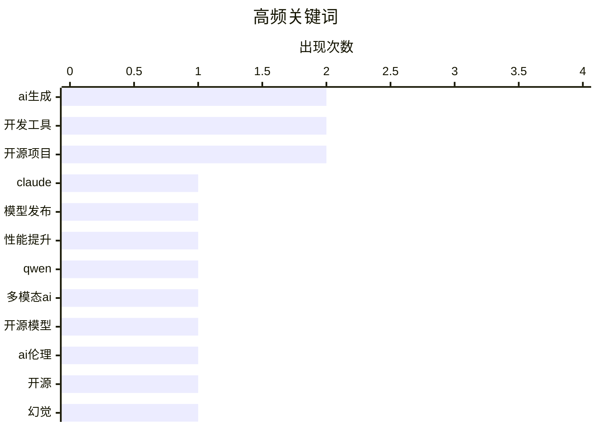

# 📰 AI 博客每日精选 — 2026-02-18

> 来自 Karpathy 推荐的 92 个顶级技术博客，AI 精选 Top 15

## 📝 今日看点

今日技术圈聚焦人工智能技术的迅猛发展与伴随而来的生态挑战。主流厂商竞相推出性能更强、成本更低的新一代大模型，推动智能工具加速普及。与此同时，人工智能生成内容的泛滥正对开源社区造成严重冲击，低质提交消耗维护精力，促使项目加强审核并探索可视化叙事等创新应对方式。安全领域也警示，人工智能在挖掘漏洞的同时，暴露了老旧软件的长尾风险。

---

## 🏆 今日必读

🥇 **克劳德·索内特 4.6 模型发布**

[克劳德·索内特 4.6 模型发布](https://simonwillison.net/2026/Feb/17/claude-sonnet-46/#atom-everything) — simonwillison.net · 3 小时前 · 🤖 AI / ML

> 安斯罗皮克公司发布了其克劳德·索内特 4.6 模型。该模型宣称其性能已接近去年十一月发布的奥普斯 4.5 模型。关键优势在于，它在实现相近性能的同时，保持了索内特系列的亲民定价，即每百万输入令牌三美元、输出令牌十五美元，显著低于奥普斯模型的五美元和二十五美元。这表明安斯罗皮克正致力于在更经济的模型中提供顶级性能。

💡 **为什么值得读**: 本文清晰地揭示了大型语言模型市场性能与成本的最新平衡点，对开发者和企业进行模型选型具有直接参考价值。

🏷️ Claude, 模型发布, 性能提升

🥈 **通义千问 3.5：迈向原生多模态智能体**

[通义千问 3.5：迈向原生多模态智能体](https://simonwillison.net/2026/Feb/17/qwen35/#atom-everything) — simonwillison.net · 23 小时前 · 🤖 AI / ML

> 阿里巴巴的通义千问团队发布了 3.5 系列的首批两个模型。该系列包含一个开源权重模型和一个专有模型，两者均支持视觉输入。开源模型名为通义千问三点五三百九十七B-A十七B，采用了混合专家架构。团队特别强调了该架构在服务效率方面的优势，旨在推动构建更高效的原生多模态智能体。

💡 **为什么值得读**: 了解中国顶尖科技公司在开源大模型与多模态架构上的最新进展与战略方向。

🏷️ Qwen, 多模态AI, 开源模型

🥉 **人工智能正在摧毁开源，而它甚至还不够好**

[人工智能正在摧毁开源，而它甚至还不够好](https://www.jeffgeerling.com/blog/2026/ai-is-destroying-open-source/) — jeffgeerling.com · 1 天前 · 💡 观点 / 杂谈

> 文章以一起人工智能捏造开源维护者言论并导致媒体报道被撤回的事件为引，批判了人工智能对开源社区的负面影响。核心论点是，人工智能生成的大量低质量代码和问题正在淹没开源项目仓库，消耗维护者本已有限的精力。这导致真正的贡献被淹没，社区协作质量下降。作者认为，当前人工智能在代码生成上的低效与滥用，正在从内部侵蚀开源文化的根基。

💡 **为什么值得读**: 它尖锐地指出了人工智能热潮下一个被忽视的危机，为所有开源参与者和技术决策者敲响了警钟。

🏷️ AI伦理, 开源, 幻觉

---

## 📊 数据概览

| 扫描源 | 抓取文章 | 时间范围 | 精选 |
|:---:|:---:|:---:|:---:|
| 85/92 | 2412 篇 → 37 篇 | 48h | **15 篇** |

### 分类分布



### 高频关键词



<details>
<summary>📈 纯文本关键词图（终端友好）</summary>

```
ai生成   │ ████████████████████ 2
开发工具   │ ████████████████████ 2
开源项目   │ ████████████████████ 2
claude │ ██████████░░░░░░░░░░ 1
模型发布   │ ██████████░░░░░░░░░░ 1
性能提升   │ ██████████░░░░░░░░░░ 1
qwen   │ ██████████░░░░░░░░░░ 1
多模态ai  │ ██████████░░░░░░░░░░ 1
开源模型   │ ██████████░░░░░░░░░░ 1
ai伦理   │ ██████████░░░░░░░░░░ 1
```

</details>

### 🏷️ 话题标签

**ai生成**(2) · **开发工具**(2) · **开源项目**(2) · claude(1) · 模型发布(1) · 性能提升(1) · qwen(1) · 多模态ai(1) · 开源模型(1) · ai伦理(1) · 开源(1) · 幻觉(1) · ai安全(1) · 漏洞管理(1) · 红队测试(1) · 认知债务(1) · ai开发(1) · 软件工程(1) · llm技能(1) · 提示工程(1)

---

## 🛠 工具 / 开源

### 1. 罗德尼工具与桌面版克劳德代码

[罗德尼工具与桌面版克劳德代码](https://simonwillison.net/2026/Feb/16/rodney-claude-code/#atom-everything) — **simonwillison.net** · 1 天前 · ⭐ 22/30

> 作者是克劳德代码网页版的深度用户，但不喜欢其名称带来的误解。他通过一款名为“罗德尼”的新工具，成功将克劳德代码的强大功能带到了本地桌面环境运行。该工具充当桥梁，允许用户在熟悉的本地编辑器中调用云端容器的安全计算能力。这实现了既享受云端隔离的安全性与便利性，又获得本地开发的流畅体验。

🏷️ AI编程, 开发工具, 集成

---

### 2. 全新的‘尝试纱线纺纱机’

[全新的‘尝试纱线纺纱机’](https://hey.paris/posts/new-try-yarn-spinner/) — **hey.paris** · 1 天前 · ⭐ 22/30

> 文章宣布了交互式叙事对话工具‘尝试纱线纺纱机’的全新版本正式发布。该工具旨在让创作者无需复杂设置即可直接在浏览器中编写和预览纱线脚本。新版附带了一个由作者专门撰写的新演示故事‘校准’，用以展示工具的能力。作者在纱线纺纱机一月的更新中详细介绍了此次发布。核心观点是，这个新版本及其演示故事标志着该工具开发的一个重要里程碑，作者对此成果感到自豪。

🏷️ 游戏对话, 叙事工具, 开源项目

---

### 3. 浏览器自动化命令行工具Rodney发布0.4.0版本

[浏览器自动化命令行工具Rodney发布0.4.0版本](https://simonwillison.net/2026/Feb/17/rodney/#atom-everything) — **simonwillison.net** · 4 小时前 · ⭐ 20/30

> 文章介绍了浏览器自动化命令行工具Rodney的最新版本0.4.0的更新内容。该版本在上周发布后，根据社区反馈整合了多项拉取请求的改进，主要包括将错误退出码标准化为1，并新增了用于验证浏览器连接的`rodney ping`命令。此外，通过移除冗余的异步等待，工具的执行性能提升了约百分之十，同时代码库引入了更严格的类型提示以提升质量。此次更新标志着Rodney正通过社区协作快速迭代，成为一个更稳定、功能更完善的开发工具。

🏷️ 浏览器自动化, CLI工具, 开源项目

---

### 4. 两个新的展示船工具：图表室与数据台展示船插件

[两个新的展示船工具：图表室与数据台展示船插件](https://simonwillison.net/2026/Feb/17/chartroom-and-datasette-showboat/#atom-everything) — **simonwillison.net** · 1 天前 · ⭐ 20/30

> 作者为扩展其代码展示工具“展示船”的应用模式，新发布了两个配套工具。图表室是一个命令行图表生成工具，专为与展示船配合工作而设计，能直接将可视化图表嵌入演示文档。数据台展示船插件则能将数据台的查询结果无缝转换为展示船格式的标记文档，方便分享数据分析过程。这两个工具共同丰富了展示船生态，使其能覆盖从代码到数据可视化的更完整工作流。作者认为，展示船模式正通过此类工具不断进化，能更有效地帮助开发者创建和分享可复现的工作成果。

🏷️ 开发工具, 文档生成, CLI

---

### 5. 实战工作坊：快速修复——Sentry中的iOS崩溃报告、追踪与日志分析

[实战工作坊：快速修复——Sentry中的iOS崩溃报告、追踪与日志分析](https://sentry.io/resources/ios-workshop-jan-2026/?utm_source=daringfireball&amp;utm_medium=paid-display&amp;utm_campaign=general-fy27q1-evergreen&amp;utm_content=static-ad-mobilerss-trysentry) — **daringfireball.net** · 1 天前 · ⭐ 20/30

> 该工作坊旨在帮助开发者建立iOS应用运行缓慢、崩溃与用户体验之间的关联分析能力。内容涵盖如何配置Sentry以精准呈现高优先级移动端问题，同时避免警报疲劳；利用日志与事件轨迹功能完整重建崩溃发生前的场景；通过分布式追踪技术定位性能瓶颈的根本原因；并借助应用大小分析工具监控与优化iOS应用的体积。掌握这些方法能系统性提升应用稳定性与性能表现。

🏷️ 崩溃报告, iOS调试, Sentry

---

## 🤖 AI / ML

### 6. 克劳德·索内特 4.6 模型发布

[克劳德·索内特 4.6 模型发布](https://simonwillison.net/2026/Feb/17/claude-sonnet-46/#atom-everything) — **simonwillison.net** · 3 小时前 · ⭐ 26/30

> 安斯罗皮克公司发布了其克劳德·索内特 4.6 模型。该模型宣称其性能已接近去年十一月发布的奥普斯 4.5 模型。关键优势在于，它在实现相近性能的同时，保持了索内特系列的亲民定价，即每百万输入令牌三美元、输出令牌十五美元，显著低于奥普斯模型的五美元和二十五美元。这表明安斯罗皮克正致力于在更经济的模型中提供顶级性能。

🏷️ Claude, 模型发布, 性能提升

---

### 7. 通义千问 3.5：迈向原生多模态智能体

[通义千问 3.5：迈向原生多模态智能体](https://simonwillison.net/2026/Feb/17/qwen35/#atom-everything) — **simonwillison.net** · 23 小时前 · ⭐ 26/30

> 阿里巴巴的通义千问团队发布了 3.5 系列的首批两个模型。该系列包含一个开源权重模型和一个专有模型，两者均支持视觉输入。开源模型名为通义千问三点五三百九十七B-A十七B，采用了混合专家架构。团队特别强调了该架构在服务效率方面的优势，旨在推动构建更高效的原生多模态智能体。

🏷️ Qwen, 多模态AI, 开源模型

---

### 8. 大语言模型生成的技能有效，但前提是事后生成

[大语言模型生成的技能有效，但前提是事后生成](https://seangoedecke.com/generate-skills-afterwards/) — **seangoedecke.com** · 1 天前 · ⭐ 24/30

> 文章讨论了大语言模型“技能”（一种针对特定任务的提示模板）的有效性问题。引用的一项新研究显示，虽然现成的技能对大语言模型完成任务有帮助，但由大语言模型自己生成的技能却平均而言没有提供任何增益。这表明模型无法可靠地创作出它们自己能从中受益的程序性知识。结论是，技能的创作与使用需要分离，人类的事后提炼和优化是关键。

🏷️ LLM技能, 提示工程, AI生成

---

### 9. 我每月二十美元“出卖自己”，换来了完美生成的代码

[我每月二十美元“出卖自己”，换来了完美生成的代码](https://matduggan.com/i-sold-out-for-200-a-month-and-all-i-got-was-this-perfectly-generated-terraform/) — **matduggan.com** · 1 天前 · ⭐ 23/30

> 作者曾认为多数人工智能编程工具华而不实，直到尝试了一款月费二十美元的专业工具。该工具能根据其架构偏好与编码风格，生成可直接投入生产的完美基础设施代码。这一经历颠覆了其认知，意识到问题不在于技术本身，而在于是否找到了与个人工作流深度匹配的专业化工具。文章结论是，特定领域的高度定制化人工智能助手已能提供巨大价值。

🏷️ 代码生成, LLM应用, 基础设施即代码

---

## 💡 观点 / 杂谈

### 10. 人工智能正在摧毁开源，而它甚至还不够好

[人工智能正在摧毁开源，而它甚至还不够好](https://www.jeffgeerling.com/blog/2026/ai-is-destroying-open-source/) — **jeffgeerling.com** · 1 天前 · ⭐ 26/30

> 文章以一起人工智能捏造开源维护者言论并导致媒体报道被撤回的事件为引，批判了人工智能对开源社区的负面影响。核心论点是，人工智能生成的大量低质量代码和问题正在淹没开源项目仓库，消耗维护者本已有限的精力。这导致真正的贡献被淹没，社区协作质量下降。作者认为，当前人工智能在代码生成上的低效与滥用，正在从内部侵蚀开源文化的根基。

🏷️ AI伦理, 开源, 幻觉

---

### 11. 从发布说明到网络漫画：对抗认知债务的新技巧

[从发布说明到网络漫画：对抗认知债务的新技巧](https://simonwillison.net/2026/Feb/17/release-notes-webcomic/#atom-everything) — **simonwillison.net** · 22 小时前 · ⭐ 24/30

> 针对人工智能加速开发导致项目理解肤浅的“认知债务”问题，文章介绍了一种新颖的应对方法。该方法的核心是将枯燥的技术发布说明，通过人工智能转化为生动易懂的网络漫画。这种可视化叙事能帮助团队成员快速把握项目变更的核心与上下文。作者认为，创造此类高信息密度的认知载体，是缓解认知债务的有效实践。

🏷️ 认知债务, AI开发, 软件工程

---

### 12. 为守门辩护：为何中世纪行会早已洞悉一切

[为守门辩护：为何中世纪行会早已洞悉一切](https://www.joanwestenberg.com/the-case-for-gatekeeping-or-why-medieval-guilds-had-it-figured-out/) — **joanwestenberg.com** · 1 小时前 · ⭐ 23/30

> 文章为开源项目中的严格审核（即“守门”）制度进行了辩护。作者指出，近半年来，几乎所有开源维护者都面临人工智能生成的大量低质提交的淹没，这些提交看似规范却毫无价值。作者将现代开源项目与中世纪行会类比，认为行会通过严格的学徒制和质量标准维护了技艺的尊严与产品的可靠性。文章主张，在人工智能时代，维护者必须重拾“守门”角色，以保护项目的核心质量与可持续性。

🏷️ 开源维护, AI生成, 门控机制

---

## 🔒 安全

### 13. 安斯罗皮克发现的五百个漏洞只是冰山一角

[安斯罗皮克发现的五百个漏洞只是冰山一角](https://martinalderson.com/posts/anthropic-found-500-zero-days/?utm_source=rss) — **martinalderson.com** · 1 天前 · ⭐ 26/30

> 安斯罗皮克公司的红队利用克劳德模型发现了超过五百个关键安全漏洞。然而，这些被发现和报告的漏洞主要集中在仍有维护的活跃软件上。文章指出，更可怕的问题在于那些无人维护、但仍在被广泛使用的“长尾”软件中的漏洞。这些漏洞几乎永远不会被修补，构成了持久且难以估量的安全威胁。

🏷️ AI安全, 漏洞管理, 红队测试

---

## 📝 其他

### 14. 苹果邀请媒体参加三月四日在纽约、伦敦和上海的特别“体验”活动

[苹果邀请媒体参加三月四日在纽约、伦敦和上海的特别“体验”活动](https://www.macrumors.com/2026/02/16/apple-announces-special-event-in-new-york/) — **daringfireball.net** · 3 小时前 · ⭐ 22/30

> 苹果公司已向部分媒体发出邀请，将于三月四日在纽约、伦敦和上海三地同步举办一场特别活动。邀请函上明确将其描述为“特别的苹果体验”，而非传统的“发布会”。活动采用独特的黄色、绿色和蓝色圆盘构成的三维苹果标志。这与在苹果园区进行全球直播的典型发布会形式不同，可能预示着一种更注重线下亲身体验的新产品或服务展示方式。

🏷️ 苹果, 产品发布, 媒体活动

---

## ⚙️ 工程

### 15. 苹果发布操作系统版本26采用率数据，与近年趋势基本持平

[苹果发布操作系统版本26采用率数据，与近年趋势基本持平](https://daringfireball.net/2026/02/apple_releases_ios_26_adoption_rates) — **daringfireball.net** · 8 小时前 · ⭐ 21/30

> 苹果公布了其移动操作系统版本26的采用率情况。根据苹果应用商店的官方数据，版本26的采用率与版本18和17基本一致。用户升级到新系统的速度与过去几年保持相似模式。采用率趋势稳定，未出现显著变化。这反映了苹果操作系统生态系统的成熟性和用户升级习惯的持续性。

🏷️ iOS, 采用率, 移动开发

---

*生成于 2026-02-18 03:45 | 扫描 85 源 → 获取 2412 篇 → 精选 15 篇*
*基于 [Hacker News Popularity Contest 2025](https://refactoringenglish.com/tools/hn-popularity/) RSS 源列表，由 [Andrej Karpathy](https://x.com/karpathy) 推荐*
