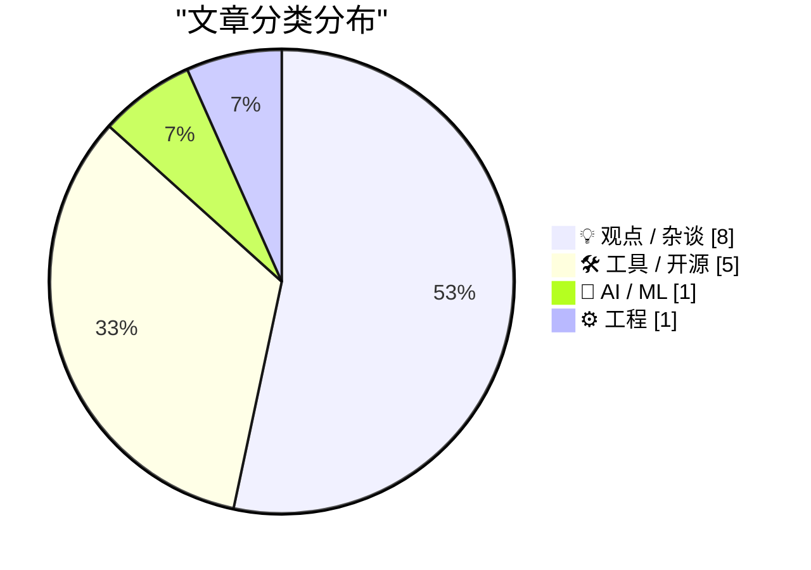
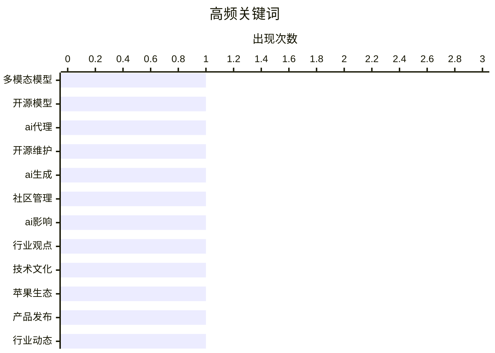

# 📰 AI 博客每日精选 — 2026-02-19

> 来自 Karpathy 推荐的 92 个顶级技术博客，AI 精选 Top 15

## 📝 今日看点

今日技术圈聚焦于人工智能领域的快速演进与深度反思。一方面，主要厂商竞相推出新一代多模态大模型，在提升性能与服务效率上持续突破；另一方面，行业内部对技术发展带来的认知负担和短期主义倾向展开批判，强调可持续创造的重要性。与此同时，科技巨头通过系统生态的稳定运营与创新体验布局，保持市场影响力。

---

## 🏆 今日必读

🥇 **通义千问3.5：迈向原生多模态智能体**

[通义千问3.5：迈向原生多模态智能体](https://simonwillison.net/2026/Feb/17/qwen35/#atom-everything) — simonwillison.net · 1 天前 · 🤖 AI / ML

> 阿里巴巴发布了通义千问3.5系列的首批模型，包含开源与闭源两个版本，均支持视觉输入。开源模型名为通义千问3.5-3970亿-A170亿，采用了创新的专家混合架构。该架构被强调能有效提升模型的服务效率。这一系列模型的发布旨在推动构建更强大的原生多模态智能体。

💡 **为什么值得读**: 该发布揭示了顶尖大模型在架构创新与多模态能力融合上的最新进展，对关注开源模型和AI代理发展的从业者具有重要参考价值。

🏷️ 多模态模型, 开源模型, AI代理

🥈 **Claude Sonnet 4.6模型发布**

[Claude Sonnet 4.6模型发布](https://simonwillison.net/2026/Feb/17/claude-sonnet-46/#atom-everything) — simonwillison.net · 1 天前 · 💡 观点 / 杂谈

> Anthropic公司发布了Claude Sonnet 4.6模型。该模型宣称在性能上接近去年十一月发布的Opus 4.5版本。同时，它保持了Sonnet系列的价格优势，输入和输出令牌的价格分别为每百万三美元和十五美元。这使得用户能以更低成本获得接近顶级模型的性能。

💡 **为什么值得读**: 对于寻求高性价比大模型API的用户而言，此次更新提供了在性能与成本之间更优的平衡选择。

🏷️ 开源维护, AI生成, 社区管理

🥉 **保罗·福特：‘人工智能颠覆已至，确实有趣’**

[保罗·福特：‘人工智能颠覆已至，确实有趣’](https://www.nytimes.com/2026/02/18/opinion/ai-software.html?unlocked_article_code=1.NFA.djaw.TBlAp8kE_N-i) — daringfireball.net · 6 小时前 · 💡 观点 / 杂谈

> 文章表达了作者对当前人工智能浪潮的一种矛盾而兴奋的个人观察。作者指出，他所爱的人普遍讨厌这项技术，而他所讨厌的人却热爱它。尽管如此，作者本人因最初吸引他投身科技的性格缺陷，对AI的发展感到‘恼人地兴奋’。这种分裂的情感反映了技术圈内外对AI颠覆性影响的认知差异。

💡 **为什么值得读**: 这篇文章提供了一个跳出纯粹技术讨论的、充满人情味与矛盾感的独特视角，有助于理解公众对AI的复杂情绪。

🏷️ AI影响, 行业观点, 技术文化

---

## 📊 数据概览

| 扫描源 | 抓取文章 | 时间范围 | 精选 |
|:---:|:---:|:---:|:---:|
| 82/92 | 2358 篇 → 37 篇 | 48h | **15 篇** |

### 分类分布



### 高频关键词



<details>
<summary>📈 纯文本关键词图（终端友好）</summary>

```
多模态模型 │ ████████████████████ 1
开源模型  │ ████████████████████ 1
ai代理  │ ████████████████████ 1
开源维护  │ ████████████████████ 1
ai生成  │ ████████████████████ 1
社区管理  │ ████████████████████ 1
ai影响  │ ████████████████████ 1
行业观点  │ ████████████████████ 1
技术文化  │ ████████████████████ 1
苹果生态  │ ████████████████████ 1
```

</details>

### 🏷️ 话题标签

**多模态模型**(1) · **开源模型**(1) · **ai代理**(1) · 开源维护(1) · ai生成(1) · 社区管理(1) · ai影响(1) · 行业观点(1) · 技术文化(1) · 苹果生态(1) · 产品发布(1) · 行业动态(1) · markdown(1) · ai推动(1) · 技术写作(1) · ai伦理(1) · 产品设计(1) · 关怀(1) · ios(1) · 系统适配(1)

---

## 💡 观点 / 杂谈

### 1. Claude Sonnet 4.6模型发布

[Claude Sonnet 4.6模型发布](https://simonwillison.net/2026/Feb/17/claude-sonnet-46/#atom-everything) — **simonwillison.net** · 1 天前 · ⭐ 25/30

> Anthropic公司发布了Claude Sonnet 4.6模型。该模型宣称在性能上接近去年十一月发布的Opus 4.5版本。同时，它保持了Sonnet系列的价格优势，输入和输出令牌的价格分别为每百万三美元和十五美元。这使得用户能以更低成本获得接近顶级模型的性能。

🏷️ 开源维护, AI生成, 社区管理

---

### 2. 保罗·福特：‘人工智能颠覆已至，确实有趣’

[保罗·福特：‘人工智能颠覆已至，确实有趣’](https://www.nytimes.com/2026/02/18/opinion/ai-software.html?unlocked_article_code=1.NFA.djaw.TBlAp8kE_N-i) — **daringfireball.net** · 6 小时前 · ⭐ 23/30

> 文章表达了作者对当前人工智能浪潮的一种矛盾而兴奋的个人观察。作者指出，他所爱的人普遍讨厌这项技术，而他所讨厌的人却热爱它。尽管如此，作者本人因最初吸引他投身科技的性格缺陷，对AI的发展感到‘恼人地兴奋’。这种分裂的情感反映了技术圈内外对AI颠覆性影响的认知差异。

🏷️ AI影响, 行业观点, 技术文化

---

### 3. 四年来首只鸮鹦鹉雏鸟在情人节孵化

[四年来首只鸮鹦鹉雏鸟在情人节孵化](https://simonwillison.net/2026/Feb/17/first-kakapo-chick-in-four-years/#atom-everything) — **simonwillison.net** · 1 天前 · ⭐ 22/30

> 新西兰保护部宣布，一只极度濒危的鸮鹦鹉雏鸟在情人节成功孵化，这是四年来首次有新雏鸟诞生。这只雏鸟是2026年繁殖季的第一只。它由名为雅思敏的鸮鹦鹉代孵了来自另一只名为蒂维里鸮鹦鹉的蛋。这一成功对全球仅存百余只的鸮鹦鹉种群恢复是一个重要的里程碑。

🏷️ Markdown, AI推动, 技术写作

---

### 4. 纳米香蕉专业版差异与网络漫画

[纳米香蕉专业版差异与网络漫画](https://simonwillison.net/2026/Feb/17/release-notes-webcomic/#atom-everything) — **simonwillison.net** · 1 天前 · ⭐ 22/30

> 文章探讨了人工智能加速软件开发导致的‘认知债务’问题，即项目增多但对其工作原理理解变浅。作者引用内森·巴谢兹的观点，提出了一种缓解此问题的方法。该方法是通过将项目的发布说明与根据说明生成的网络漫画进行对比，来增进对项目变更的直观理解。这种可视化的对比有助于开发者快速把握更新内容的本质。

🏷️ AI伦理, 产品设计, 关怀

---

### 5. 价值提取

[价值提取](https://keygen.sh/blog/value-extraction/) — **keygen.sh** · 21 小时前 · ⭐ 22/30

> 文章批判了当前围绕人工智能领域的两种极端心态：末日预言者和新时代的淘金热。作者指出，许多讨论聚焦于如何从AI中快速提取短期价值，而非进行可持续的价值创造。这种氛围可能导致行业忽视长期发展和社会责任。文章呼吁超越简单的价值提取思维，转向更建设性的发展方向。

🏷️ 价值提取, 商业趋势, 淘金热

---

### 6. 数字联盟计划：真的会实现吗？

[数字联盟计划：真的会实现吗？](https://berthub.eu/articles/posts/digitale-coalitieplannen/) — **berthub.eu** · 1 天前 · ⭐ 21/30

> 文章分析了荷兰新政府联盟协议中的数字化改革计划。计划内容包括对中央政府信息技术进行革命性变革，如集中管控、集中采购、强制推行标准，并提议设立具有‘执行权力’的‘荷兰数字服务局’。作者虽然肯定这些设想的雄心，但对其在复杂官僚体系中的实际执行可行性提出了质疑。核心问题在于美好的政治承诺能否转化为具体的、可落地的政策与成果。

🏷️ 数字政府, ICT政策, 联盟计划

---

### 7. 你以为他们为你工作

[你以为他们为你工作](https://steveblank.com/2026/02/18/you-only-think-they-work-for-you/) — **steveblank.com** · 13 小时前 · ⭐ 21/30

> 作者分享了其作为新任营销副总裁时从公关机构那里得到的痛苦教训。他意识到，外部供应商（如公关公司）的首要利益并不总是与客户完全一致。这一教训后来被证明适用于所有外部合作方。作者指出，问题的关键往往在于未能向供应商明确传达真正需要他们完成的任务和期望。管理者必须清晰定义并管理这些外部关系，以确保目标对齐。

🏷️ 供应商管理, 公关机构, 职业教训

---

### 8. 思考的复利效应

[思考的复利效应](https://idiallo.com/blog/taking-our-mind-for-granted?src=feed) — **idiallo.com** · 15 小时前 · ⭐ 20/30

> 文章探讨了在人工智能工具普及的背景下，人类深度思考能力所面临的挑战与价值。作者指出，真正的思考需要主动投入并忍受不确定性，通过散步、静坐等方式让潜意识工作，从而孕育出原创的解决方案。思考本身具有自我强化的特性，持续的思考能产生更深刻、更连贯的见解。与依赖外部工具快速获取答案相比，独立思考的过程虽然缓慢且令人不适，但却是创造力的根本来源。结论是，我们应当有意识地减少对即时答案工具的依赖，重新珍视并训练独立思考这一核心能力。

🏷️ AI反思, 思维方式, 技术哲学

---

## 🛠 工具 / 开源

### 9. 苹果邀请媒体参加3月4日在纽约、伦敦和上海举行的特别‘体验’活动

[苹果邀请媒体参加3月4日在纽约、伦敦和上海举行的特别‘体验’活动](https://www.macrumors.com/2026/02/16/apple-announces-special-event-in-new-york/) — **daringfireball.net** · 1 天前 · ⭐ 23/30

> 苹果向部分媒体发出了于3月4日在纽约、伦敦和上海三地举行的特别活动邀请。邀请函上明确将此次活动描述为一次‘特别的苹果体验’，而非传统的‘发布会’。邀请函设计采用了由黄、绿、蓝三色圆盘组成的三维苹果标志。这一措辞和形式上的变化，可能预示着此次活动将侧重于沉浸式产品体验而非单纯的产品公告。

🏷️ 苹果生态, 产品发布, 行业动态

---

### 10. 罗德尼 v0.4.0

[罗德尼 v0.4.0](https://simonwillison.net/2026/Feb/17/rodney/#atom-everything) — **simonwillison.net** · 1 天前 · ⭐ 20/30

> 文章介绍了浏览器自动化命令行工具罗德尼的最新版本v0.4.0。该版本主要修复了错误处理机制，现在错误会正确返回退出码，并移除了冗余的进度条显示。新增了‘rodney config’命令用于管理配置，并为‘rodney goto’和‘rodney screenshot’命令引入了‘--help’选项。这些改进使罗德尼在脚本集成和用户体验上更加可靠与友好。

🏷️ 包管理, 容器技术, 存储原语

---

### 11. 在树莓派上使用海洛加速卡运行弗瑞盖特进行物体检测

[在树莓派上使用海洛加速卡运行弗瑞盖特进行物体检测](https://www.jeffgeerling.com/blog/2026/frigate-with-hailo-for-object-detection-on-a-raspberry-pi/) — **jeffgeerling.com** · 6 小时前 · ⭐ 20/30

> 文章探讨了在树莓派上升级弗瑞盖特智能视频监控系统的物体检测硬件方案。作者将原有的谷歌珊瑚张量处理单元替换为树莓派五专用的海洛加速卡，以提升处理性能。测试表明，海洛加速卡在检测速度上比珊瑚张量处理单元快3到4倍，每秒能处理超过60帧的高清视频流。然而，作者也指出海洛加速卡目前与弗瑞盖特的集成尚不完善，存在内存泄漏和配置复杂等问题。最终结论是，海洛加速卡虽性能强劲，但现阶段更适合技术爱好者尝鲜，而非追求稳定性的生产环境。

🏷️ 边缘计算, 物体检测, 树莓派

---

### 12. 无需亲自“打字”的类型标注

[无需亲自“打字”的类型标注](https://simonwillison.net/2026/Feb/18/typing/#atom-everything) — **simonwillison.net** · 8 小时前 · ⭐ 19/30

> 一位拥有超过25年经验的程序员分享了对代码类型标注态度的重要转变。他过去因类型提示和强类型会拖慢在交互式编程环境中的迭代速度而抗拒使用。然而，当编码代理（AI编程助手）承担了实际的代码键入工作时，明确定义所有类型带来的益处，如更好的代码清晰度和工具支持，突然变得极具吸引力。作者的核心结论是，在人工智能辅助编程的新范式下，类型系统的优势得以充分显现，其代价则被大幅降低。

🏷️ 版本更新, 开源项目, 开发日志

---

### 13. Pebble二月生产与软件更新：三款新硬件即将发货

[Pebble二月生产与软件更新：三款新硬件即将发货](https://repebble.com/blog/february-pebble-production-and-software-updates) — **ericmigi.com** · 1 天前 · ⭐ 19/30

> 智能手表厂商Pebble正忙于三款新硬件的最终生产与软件更新工作。即将推出的新产品包括Pebble Time 2、Pebble Round 2以及一款名为Index 01的新设备。软件方面，团队正在为现有产品开发新的功能与体验。目前生产已接近完成，即将进入发货阶段。这表明Pebble在智能手表领域仍在积极创新并拓展其产品线。

🏷️ 智能手表, 硬件更新, 可穿戴设备

---

## 🤖 AI / ML

### 14. 通义千问3.5：迈向原生多模态智能体

[通义千问3.5：迈向原生多模态智能体](https://simonwillison.net/2026/Feb/17/qwen35/#atom-everything) — **simonwillison.net** · 1 天前 · ⭐ 27/30

> 阿里巴巴发布了通义千问3.5系列的首批模型，包含开源与闭源两个版本，均支持视觉输入。开源模型名为通义千问3.5-3970亿-A170亿，采用了创新的专家混合架构。该架构被强调能有效提升模型的服务效率。这一系列模型的发布旨在推动构建更强大的原生多模态智能体。

🏷️ 多模态模型, 开源模型, AI代理

---

## ⚙️ 工程

### 15. 苹果发布iOS 26采用率数据，与过去几年基本持平

[苹果发布iOS 26采用率数据，与过去几年基本持平](https://daringfireball.net/2026/02/apple_releases_ios_26_adoption_rates) — **daringfireball.net** · 1 天前 · ⭐ 22/30

> 根据苹果官方从应用商店获取的数据，iOS 26系统的采用率已基本达到稳定水平。其 adoption rate 与之前的iOS 18和iOS 17同期数据几乎完全一致。这表明用户升级到最新版操作系统的行为模式在过去几年中已形成固定规律。iOS系统的更新普及速度并未出现显著加速或放缓。

🏷️ iOS, 系统适配, 开发者

---

*生成于 2026-02-19 03:44 | 扫描 82 源 → 获取 2358 篇 → 精选 15 篇*
*基于 [Hacker News Popularity Contest 2025](https://refactoringenglish.com/tools/hn-popularity/) RSS 源列表，由 [Andrej Karpathy](https://x.com/karpathy) 推荐*
