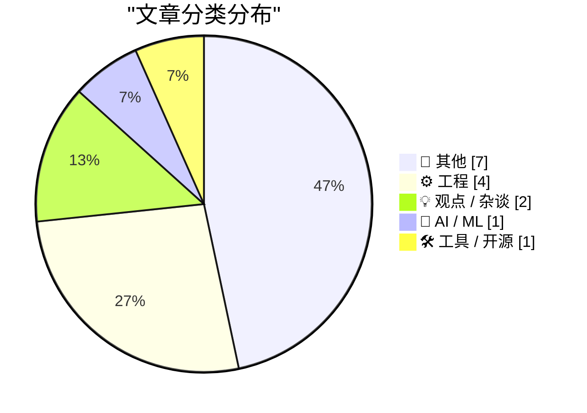
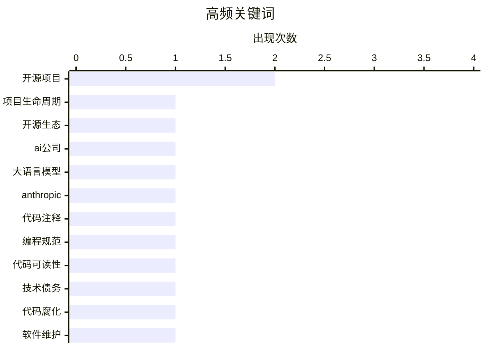

# 📰 AI 博客每日精选 — 2026-02-22

> 来自 Karpathy 推荐的 92 个顶级技术博客，AI 精选 Top 15

## 📝 今日看点

今日技术圈看点聚焦于人工智能与工程实践的深度融合，工具创新成为关键推动力。行业观点激烈碰撞，折射出技术发展的多元思考与方向探索。工程领域的基础性讨论持续占据热点，彰显其核心地位。

---

## 🏆 今日必读

🥇 **摘要生成失败（可重试）**

[摘要生成失败（可重试）](https://pluralistic.net/2026/02/20/karioca-konzernrecht/) — pluralistic.net · 1 天前 · 💡 观点 / 杂谈

> 未能生成中文摘要，请稍后重试。

🏷️ 开源项目, 项目生命周期, 开源生态

🥈 **摘要生成失败（可重试）**

[摘要生成失败（可重试）](https://www.wheresyoured.at/premium-the-haters-guide-to-anthropic/) — wheresyoured.at · 1 天前 · 🤖 AI / ML

> 未能生成中文摘要，请稍后重试。

🏷️ AI公司, 大语言模型, Anthropic

🥉 **摘要生成失败（可重试）**

[摘要生成失败（可重试）](https://krebsonsecurity.com/2026/02/starkiller-phishing-service-proxies-real-login-pages-mfa/) — krebsonsecurity.com · 1 天前 · ⚙️ 工程

> 未能生成中文摘要，请稍后重试。

🏷️ 代码注释, 编程规范, 代码可读性

---

## 📊 数据概览

| 扫描源 | 抓取文章 | 时间范围 | 精选 |
|:---:|:---:|:---:|:---:|
| 84/92 | 2414 篇 → 24 篇 | 48h | **15 篇** |

### 分类分布



### 高频关键词



<details>
<summary>📈 纯文本关键词图（终端友好）</summary>

```
开源项目      │ ████████████████████ 2
项目生命周期    │ ██████████░░░░░░░░░░ 1
开源生态      │ ██████████░░░░░░░░░░ 1
ai公司      │ ██████████░░░░░░░░░░ 1
大语言模型     │ ██████████░░░░░░░░░░ 1
anthropic │ ██████████░░░░░░░░░░ 1
代码注释      │ ██████████░░░░░░░░░░ 1
编程规范      │ ██████████░░░░░░░░░░ 1
代码可读性     │ ██████████░░░░░░░░░░ 1
技术债务      │ ██████████░░░░░░░░░░ 1
```

</details>

### 🏷️ 话题标签

**开源项目**(2) · **项目生命周期**(1) · **开源生态**(1) · ai公司(1) · 大语言模型(1) · anthropic(1) · 代码注释(1) · 编程规范(1) · 代码可读性(1) · 技术债务(1) · 代码腐化(1) · 软件维护(1) · 大数计算(1) · 证书验证(1) · 算法优化(1) · 对话框(1) · esc键(1) · 用户界面(1) · 斐波那契数(1) · 算法(1)

---

## 📝 其他

### 1. 摘要生成失败（可重试）

[摘要生成失败（可重试）](https://www.construction-physics.com/p/reading-list-022126) — **construction-physics.com** · 14 小时前 · ⭐ 18/30

> 未能生成中文摘要，请稍后重试。

🏷️ 工业技术, 基础设施, 建筑

---

### 2. 摘要生成失败（可重试）

[摘要生成失败（可重试）](https://shkspr.mobi/blog/2026/02/openbenches-at-fosdem/) — **shkspr.mobi** · 15 小时前 · ⭐ 15/30

> 未能生成中文摘要，请稍后重试。

---

### 3. 书评：《家庭与生存之道》——约翰·克里斯与罗宾·斯金纳

[书评：《家庭与生存之道》——约翰·克里斯与罗宾·斯金纳](https://shkspr.mobi/blog/2026/02/book-review-families-and-how-to-survive-them-by-john-cleese-and-robin-skynner/) — **shkspr.mobi** · 1 天前 · ⭐ 15/30

> 文章评论了一本由喜剧大师约翰·克里斯与心理治疗师罗宾·斯金纳合著、关于家庭心理治疗的书籍。该书采用苏格拉底式对话体，由斯金纳扮演导师进行阐述，克里斯则扮演学生角色不断提出幽默而尖锐的质疑。这种安排起初颇具趣味，但长篇幅的对话形式可能让读者感到些许疲倦。核心观点认为，这本书以独特而迷人的方式探讨了家庭关系与心理治疗。

---

### 4. 2026/2027西雅图交响乐团订阅乐季一览

[2026/2027西雅图交响乐团订阅乐季一览](https://devblogs.microsoft.com/oldnewthing/20260220-01/?p=112076) — **devblogs.microsoft.com/oldnewthing** · 1 天前 · ⭐ 15/30

> 文章是微软开发者博客中关于西雅图交响乐团2026至2027年新乐季的订阅指南。内容作为一份口袋参考指南，为乐迷提供了新乐季的演出安排与订阅信息概要。它帮助读者快速了解演出场次、可能包含的曲目或艺术家等关键信息。这是一份服务于古典音乐爱好者的实用观演规划工具。

---

### 5. 自定义对话框管理器关闭机制：检测ESC键的首次失败尝试

[自定义对话框管理器关闭机制：检测ESC键的首次失败尝试](https://devblogs.microsoft.com/oldnewthing/20260220-00/?p=112074) — **devblogs.microsoft.com/oldnewthing** · 1 天前 · ⭐ 15/30

> 文章探讨在自定义对话框关闭行为时，如何可靠地检测用户按下ESC键。核心方案是尝试通过轮询异步键盘状态函数来捕获ESC键按下事件。然而，这种方法在对话框失去焦点时（例如用户点击了其他窗口）会完全失效，因为此时键盘消息不会发送到当前对话框。作者指出，这种看似直接的方案实际上并不可行，因为它无法处理常见的焦点窃取场景。结论是，仅依赖异步键盘状态检测ESC键不足以构建健壮的自定义关闭逻辑。

---

### 6. 第一千万个斐波那契数

[第一千万个斐波那契数](https://www.johndcook.com/blog/2026/02/21/f10000000/) — **johndcook.com** · 2 小时前 · ⭐ 15/30

> 文章探讨了计算超大斐波那契数（第1000万个）及其验证证书的技术细节。作者使用基于mpmath库的代码实际计算了F(10,000,000)，并提供了具体的计算耗时等性能数据。核心在于介绍一种“证书”机制，该辅助数据能大幅加速对庞大计算结果正确性的验证过程。这展示了在计算数学中，保证极端大规模运算可靠性的方法。

---

### 7. 计算大型认证斐波那契数

[计算大型认证斐波那契数](https://www.johndcook.com/blog/2026/02/21/big-certified-fibonacci/) — **johndcook.com** · 9 小时前 · ⭐ 15/30

> 文章聚焦于计算大型斐波那契数并生成认证证书的技术挑战。作者重新审视了先前关于大斐波那契数计算和验证证书创建的工作，提出一种新方法在计算过程中直接产生验证证书。该方法整合了计算与认证步骤，简化了验证流程并提高了效率。尽管作者指出该方法缺乏实际应用场景，但其在算法设计上展示了理论创新。

---

## ⚙️ 工程

### 8. 摘要生成失败（可重试）

[摘要生成失败（可重试）](https://krebsonsecurity.com/2026/02/starkiller-phishing-service-proxies-real-login-pages-mfa/) — **krebsonsecurity.com** · 1 天前 · ⭐ 25/30

> 未能生成中文摘要，请稍后重试。

🏷️ 代码注释, 编程规范, 代码可读性

---

### 9. 摘要生成失败（可重试）

[摘要生成失败（可重试）](https://simonwillison.net/2026/Feb/20/thariq-shihipar/#atom-everything) — **simonwillison.net** · 1 天前 · ⭐ 24/30

> 未能生成中文摘要，请稍后重试。

🏷️ 大数计算, 证书验证, 算法优化

---

### 10. 摘要生成失败（可重试）

[摘要生成失败（可重试）](https://simonwillison.net/2026/Feb/20/taalas/#atom-everything) — **simonwillison.net** · 1 天前 · ⭐ 23/30

> 未能生成中文摘要，请稍后重试。

🏷️ 对话框, ESC键, 用户界面

---

### 11. 摘要生成失败（可重试）

[摘要生成失败（可重试）](https://simonwillison.net/2026/Feb/20/ggmlai-joins-hugging-face/#atom-everything) — **simonwillison.net** · 1 天前 · ⭐ 22/30

> 未能生成中文摘要，请稍后重试。

🏷️ 斐波那契数, 算法, 计算验证

---

## 💡 观点 / 杂谈

### 12. 摘要生成失败（可重试）

[摘要生成失败（可重试）](https://pluralistic.net/2026/02/20/karioca-konzernrecht/) — **pluralistic.net** · 1 天前 · ⭐ 26/30

> 未能生成中文摘要，请稍后重试。

🏷️ 开源项目, 项目生命周期, 开源生态

---

### 13. 摘要生成失败（可重试）

[摘要生成失败（可重试）](https://idiallo.com/blog/teleoperation-is-the-butt-of-the-joke?src=feed) — **idiallo.com** · 1 天前 · ⭐ 25/30

> 未能生成中文摘要，请稍后重试。

🏷️ 技术债务, 代码腐化, 软件维护

---

## 🤖 AI / ML

### 14. 摘要生成失败（可重试）

[摘要生成失败（可重试）](https://www.wheresyoured.at/premium-the-haters-guide-to-anthropic/) — **wheresyoured.at** · 1 天前 · ⭐ 26/30

> 未能生成中文摘要，请稍后重试。

🏷️ AI公司, 大语言模型, Anthropic

---

## 🛠 工具 / 开源

### 15. 摘要生成失败（可重试）

[摘要生成失败（可重试）](https://simonwillison.net/2026/Feb/21/thibault-sottiaux/#atom-everything) — **simonwillison.net** · 1 天前 · ⭐ 21/30

> 未能生成中文摘要，请稍后重试。

🏷️ 开源项目, FOSDEM, 视频编辑

---

*生成于 2026-02-22 03:43 | 扫描 84 源 → 获取 2414 篇 → 精选 15 篇*
*基于 [Hacker News Popularity Contest 2025](https://refactoringenglish.com/tools/hn-popularity/) RSS 源列表，由 [Andrej Karpathy](https://x.com/karpathy) 推荐*
