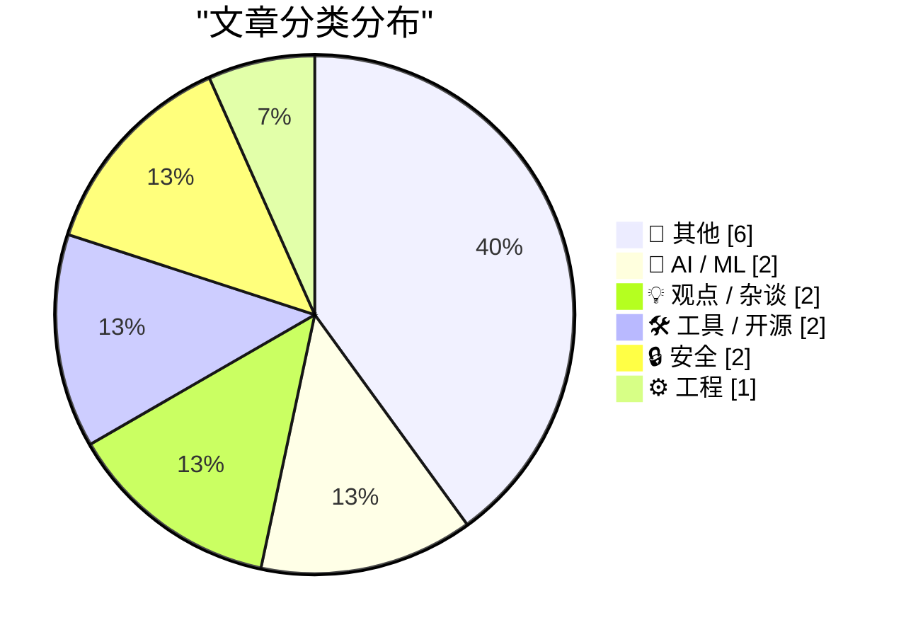
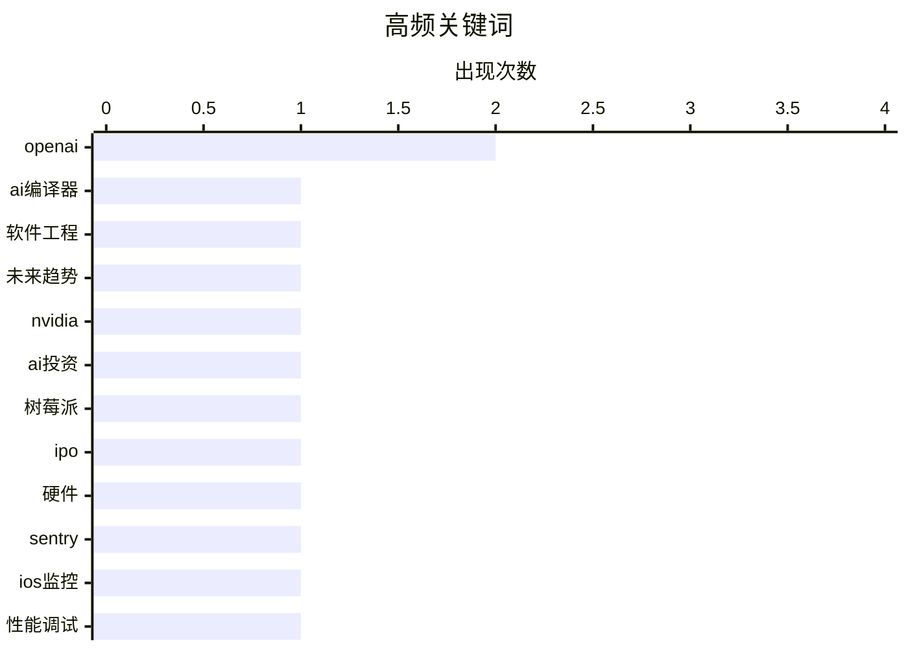

# 📰 AI 博客每日精选 — 2026-02-23

> 来自 Karpathy 推荐的 92 个顶级技术博客，AI 精选 Top 15

## 📝 今日看点

今日技术圈聚焦人工智能与机器学习的持续突破，相关创新正驱动行业变革。网络安全议题热度不减，成为开发者与企业的关注核心。同时，工具优化与工程实践演进助力效率提升，塑造技术新生态。

---

## 🏆 今日必读

🥇 **摘要生成失败（可重试）**

[摘要生成失败（可重试）](https://simonwillison.net/2026/Feb/22/ccc/#atom-everything) — simonwillison.net · 3 小时前 · 🤖 AI / ML

> 未能生成中文摘要，请稍后重试。

🏷️ AI编译器, 软件工程, 未来趋势

🥈 **摘要生成失败（可重试）**

[摘要生成失败（可重试）](https://idiallo.com/byte-size/nvidia-was-only-invited-to-invest?src=feed) — idiallo.com · 1 天前 · 💡 观点 / 杂谈

> 未能生成中文摘要，请稍后重试。

🏷️ Nvidia, OpenAI, AI投资

🥉 **摘要生成失败（可重试）**

[摘要生成失败（可重试）](https://simonwillison.net/2026/Feb/22/raspberry-pi-openclaw/#atom-everything) — simonwillison.net · 3 小时前 · 📝 其他

> 未能生成中文摘要，请稍后重试。

🏷️ 树莓派, IPO, 硬件

---

## 📊 数据概览

| 扫描源 | 抓取文章 | 时间范围 | 精选 |
|:---:|:---:|:---:|:---:|
| 81/92 | 2365 篇 → 16 篇 | 48h | **15 篇** |

### 分类分布



### 高频关键词



<details>
<summary>📈 纯文本关键词图（终端友好）</summary>

```
openai │ ████████████████████ 2
ai编译器  │ ██████████░░░░░░░░░░ 1
软件工程   │ ██████████░░░░░░░░░░ 1
未来趋势   │ ██████████░░░░░░░░░░ 1
nvidia │ ██████████░░░░░░░░░░ 1
ai投资   │ ██████████░░░░░░░░░░ 1
树莓派    │ ██████████░░░░░░░░░░ 1
ipo    │ ██████████░░░░░░░░░░ 1
硬件     │ ██████████░░░░░░░░░░ 1
sentry │ ██████████░░░░░░░░░░ 1
```

</details>

### 🏷️ 话题标签

**openai**(2) · **ai编译器**(1) · **软件工程**(1) · 未来趋势(1) · nvidia(1) · ai投资(1) · 树莓派(1) · ipo(1) · 硬件(1) · sentry(1) · ios监控(1) · 性能调试(1) · codex(1) · 术语(1) · 环境智能(1) · 技术预测(1) · 愿景(1) · 比特币挖矿(1) · 哈希率(1) · 难度调整(1)

---

## 📝 其他

### 1. 摘要生成失败（可重试）

[摘要生成失败（可重试）](https://simonwillison.net/2026/Feb/22/raspberry-pi-openclaw/#atom-everything) — **simonwillison.net** · 3 小时前 · ⭐ 19/30

> 未能生成中文摘要，请稍后重试。

🏷️ 树莓派, IPO, 硬件

---

### 2. 计算可验证的大斐波那契数

[计算可验证的大斐波那契数](https://www.johndcook.com/blog/2026/02/21/big-certified-fibonacci/) — **johndcook.com** · 1 天前 · ⭐ 15/30

> 文章探讨了如何高效计算大数值的斐波那契数并生成可验证其正确性的数学证书。作者提出了一种新的计算方法，该方法在计算过程中能同步生成一个验证证书，而非事后单独创建。这种方法与朴素的递归算法或基于矩阵幂运算的标准快速算法不同，它将计算与验证过程融为一体。尽管作者承认该方法目前缺乏明确的实际应用场景，但其在理论上的自验证特性颇具吸引力。核心结论是，这种能够自我证明正确性的算法，为处理大数计算的可信问题提供了一种优雅的数学解决方案。

---

### 3. 社交媒体与读写能力危机的‘口语化理论’

[社交媒体与读写能力危机的‘口语化理论’](https://www.theatlantic.com/ideas/2026/02/social-media-literacy-crisis/686076/?utm_source=feed) — **derekthompson.org** · 15 小时前 · ⭐ 15/30

> 文章探讨了社交媒体兴起与深度阅读衰退如何共同重塑现代人的思维与认知模式。核心论点是提出了一个‘口语化理论’，认为社交媒体正推动社会进入一种‘二次口语文化’阶段，其特点是注意力碎片化、论证情绪化以及事实让位于叙事。这种环境削弱了基于文本的线性、逻辑与批判性思维，强化了基于身份认同与情感共鸣的部落式交流。作者最终指出，我们正在经历一场从‘读写思维’向‘口语化思维’的深刻转变，这从根本上改变了作为一个思考者的体验。

---

### 4. 摘要生成失败（可重试）

[摘要生成失败（可重试）](https://nesbitt.io/2026/02/22/forge-specific-repository-folders.html) — **nesbitt.io** · 17 小时前 · ⭐ 15/30

> 未能生成中文摘要，请稍后重试。

---

### 5. 阅读清单：2026年2月21日

[阅读清单：2026年2月21日](https://www.construction-physics.com/p/reading-list-022126) — **construction-physics.com** · 1 天前 · ⭐ 15/30

> 本期阅读清单汇总了建筑、基础设施与工业技术领域的最新资讯与深度分析。核心内容包括美国一万亿美元基础设施法案的资金分配进展与面临的挑战，以及一项关于模块化建筑为何未能更广泛应用的新研究。清单还探讨了建筑机器人技术的实际应用案例，并收录了关于工业设施选址逻辑与一种新型低碳水泥材料的文章。这些精选内容共同勾勒出当前行业在技术、政策与可持续性方面的关键动态与思考。

---

### 6. 书呆子测验第四版

[书呆子测验第四版](https://susam.net/code/news/nq/4.0.0.html) — **susam.net** · 1 天前 · ⭐ 15/30

> 这是一个名为“书呆子测验”的单页网页应用程序，旨在通过简短问答测试用户的技术知识储备与极客程度。第四版更新引入了五个全新的问题，内容涵盖计算历史、图论和Unix系统等多个技术领域。所有问题均来源于日常的阅读、写作、思考和学习过程中的灵感。该版本保持了应用简洁、自包含的特性，用户可直接访问网页参与挑战。

---

## 🤖 AI / ML

### 7. 摘要生成失败（可重试）

[摘要生成失败（可重试）](https://simonwillison.net/2026/Feb/22/ccc/#atom-everything) — **simonwillison.net** · 3 小时前 · ⭐ 24/30

> 未能生成中文摘要，请稍后重试。

🏷️ AI编译器, 软件工程, 未来趋势

---

### 8. 摘要生成失败（可重试）

[摘要生成失败（可重试）](https://simonwillison.net/2026/Feb/22/how-i-think-about-codex/#atom-everything) — **simonwillison.net** · 11 小时前 · ⭐ 18/30

> 未能生成中文摘要，请稍后重试。

🏷️ Codex, 术语, OpenAI

---

## 💡 观点 / 杂谈

### 9. 摘要生成失败（可重试）

[摘要生成失败（可重试）](https://idiallo.com/byte-size/nvidia-was-only-invited-to-invest?src=feed) — **idiallo.com** · 1 天前 · ⭐ 20/30

> 未能生成中文摘要，请稍后重试。

🏷️ Nvidia, OpenAI, AI投资

---

### 10. 摘要生成失败（可重试）

[摘要生成失败（可重试）](https://shkspr.mobi/blog/2026/02/how-close-are-we-to-a-vision-for-2010/) — **shkspr.mobi** · 15 小时前 · ⭐ 17/30

> 未能生成中文摘要，请稍后重试。

🏷️ 环境智能, 技术预测, 愿景

---

## 🛠 工具 / 开源

### 11. 摘要生成失败（可重试）

[摘要生成失败（可重试）](https://sentry.io/resources/ios-workshop-jan-2026/?utm_source=daringfireball&amp;utm_medium=paid-display&amp;utm_campaign=general-fy27q1-evergreen&amp;utm_content=static-ad-mobilerss-trysentry) — **daringfireball.net** · 6 小时前 · ⭐ 19/30

> 未能生成中文摘要，请稍后重试。

🏷️ Sentry, iOS监控, 性能调试

---

### 12. 摘要生成失败（可重试）

[摘要生成失败（可重试）](https://shkspr.mobi/blog/2026/02/openbenches-at-fosdem/) — **shkspr.mobi** · 1 天前 · ⭐ 15/30

> 未能生成中文摘要，请稍后重试。

🏷️ OpenBenches, 开源硬件, FOSDEM

---

## 🔒 安全

### 13. 摘要生成失败（可重试）

[摘要生成失败（可重试）](https://www.johndcook.com/blog/2026/02/22/bitcoin-mining-difficulty/) — **johndcook.com** · 8 小时前 · ⭐ 17/30

> 未能生成中文摘要，请稍后重试。

🏷️ 比特币挖矿, 哈希率, 难度调整

---

### 14. 摘要生成失败（可重试）

[摘要生成失败（可重试）](https://www.johndcook.com/blog/2026/02/22/zettahash/) — **johndcook.com** · 9 小时前 · ⭐ 17/30

> 未能生成中文摘要，请稍后重试。

🏷️ 比特币, 哈希函数, 算力

---

## ⚙️ 工程

### 15. 摘要生成失败（可重试）

[摘要生成失败（可重试）](https://www.johndcook.com/blog/2026/02/21/f10000000/) — **johndcook.com** · 1 天前 · ⭐ 17/30

> 未能生成中文摘要，请稍后重试。

🏷️ 斐波那契数, 算法性能, 大数计算

---

*生成于 2026-02-23 03:50 | 扫描 81 源 → 获取 2365 篇 → 精选 15 篇*
*基于 [Hacker News Popularity Contest 2025](https://refactoringenglish.com/tools/hn-popularity/) RSS 源列表，由 [Andrej Karpathy](https://x.com/karpathy) 推荐*
