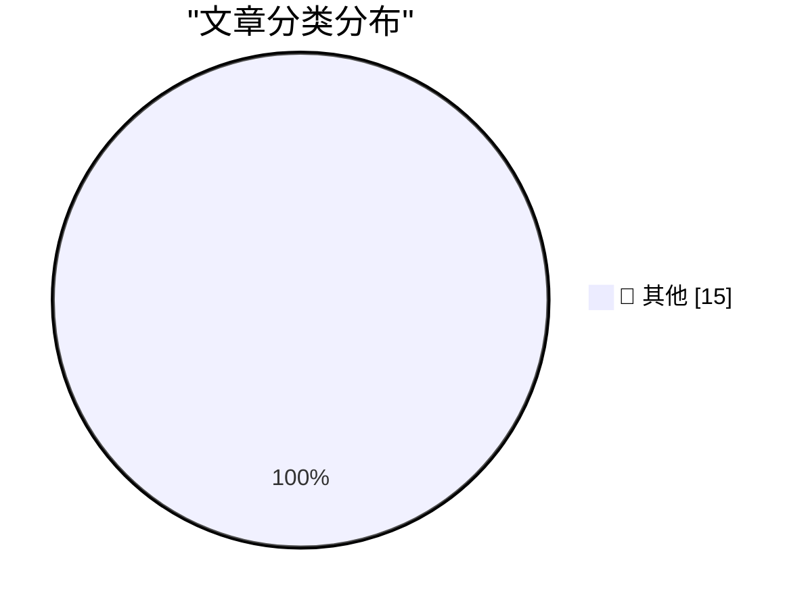

# 📰 AI 博客每日精选 — 2026-02-24

> 来自 Karpathy 推荐的 92 个顶级技术博客，AI 精选 Top 15

## 📝 今日看点

今日技术圈关注点集中于基础服务的稳定性与信息流的有效传递。多个信源同时出现的内容生成障碍，凸显了底层技术服务面临普遍性挑战。这提醒业界需持续加固数字基础设施，以保障技术信息的畅通与可靠。

---

## 🏆 今日必读

🥇 **摘要生成失败（可重试）**

[摘要生成失败（可重试）](https://simonwillison.net/2026/Feb/23/ladybird-adopts-rust/#atom-everything) — simonwillison.net · 8 小时前 · 📝 其他

> 未能生成中文摘要，请稍后重试。

🥈 **摘要生成失败（可重试）**

[摘要生成失败（可重试）](https://simonwillison.net/2026/Feb/23/agentic-engineering-patterns/#atom-everything) — simonwillison.net · 10 小时前 · 📝 其他

> 未能生成中文摘要，请稍后重试。

🥉 **摘要生成失败（可重试）**

[摘要生成失败（可重试）](https://simonwillison.net/guides/agentic-engineering-patterns/code-is-cheap/#atom-everything) — simonwillison.net · 11 小时前 · 📝 其他

> 未能生成中文摘要，请稍后重试。

---

## 📊 数据概览

| 扫描源 | 抓取文章 | 时间范围 | 精选 |
|:---:|:---:|:---:|:---:|
| 83/92 | 2403 篇 → 41 篇 | 48h | **15 篇** |

### 分类分布

---

## 📝 其他

### 1. 摘要生成失败（可重试）

[摘要生成失败（可重试）](https://simonwillison.net/2026/Feb/23/ladybird-adopts-rust/#atom-everything) — **simonwillison.net** · 8 小时前 · ⭐ 15/30

> 未能生成中文摘要，请稍后重试。

---

### 2. 摘要生成失败（可重试）

[摘要生成失败（可重试）](https://simonwillison.net/2026/Feb/23/agentic-engineering-patterns/#atom-everything) — **simonwillison.net** · 10 小时前 · ⭐ 15/30

> 未能生成中文摘要，请稍后重试。

---

### 3. 摘要生成失败（可重试）

[摘要生成失败（可重试）](https://simonwillison.net/guides/agentic-engineering-patterns/code-is-cheap/#atom-everything) — **simonwillison.net** · 11 小时前 · ⭐ 15/30

> 未能生成中文摘要，请稍后重试。

---

### 4. 摘要生成失败（可重试）

[摘要生成失败（可重试）](https://simonwillison.net/2026/Feb/23/paul-ford/#atom-everything) — **simonwillison.net** · 11 小时前 · ⭐ 15/30

> 未能生成中文摘要，请稍后重试。

---

### 5. 摘要生成失败（可重试）

[摘要生成失败（可重试）](https://simonwillison.net/2026/Feb/23/reply-guy/#atom-everything) — **simonwillison.net** · 14 小时前 · ⭐ 15/30

> 未能生成中文摘要，请稍后重试。

---

### 6. 摘要生成失败（可重试）

[摘要生成失败（可重试）](https://simonwillison.net/2026/Feb/23/summer-yue/#atom-everything) — **simonwillison.net** · 14 小时前 · ⭐ 15/30

> 未能生成中文摘要，请稍后重试。

---

### 7. 摘要生成失败（可重试）

[摘要生成失败（可重试）](https://simonwillison.net/guides/agentic-engineering-patterns/red-green-tdd/#atom-everything) — **simonwillison.net** · 20 小时前 · ⭐ 15/30

> 未能生成中文摘要，请稍后重试。

---

### 8. 摘要生成失败（可重试）

[摘要生成失败（可重试）](https://simonwillison.net/2026/Feb/22/ccc/#atom-everything) — **simonwillison.net** · 1 天前 · ⭐ 15/30

> 未能生成中文摘要，请稍后重试。

---

### 9. 摘要生成失败（可重试）

[摘要生成失败（可重试）](https://simonwillison.net/2026/Feb/22/raspberry-pi-openclaw/#atom-everything) — **simonwillison.net** · 1 天前 · ⭐ 15/30

> 未能生成中文摘要，请稍后重试。

---

### 10. 摘要生成失败（可重试）

[摘要生成失败（可重试）](https://simonwillison.net/2026/Feb/22/how-i-think-about-codex/#atom-everything) — **simonwillison.net** · 1 天前 · ⭐ 15/30

> 未能生成中文摘要，请稍后重试。

---

### 11. 摘要生成失败（可重试）

[摘要生成失败（可重试）](https://seangoedecke.com/insider-amnesia/) — **seangoedecke.com** · 1 天前 · ⭐ 15/30

> 未能生成中文摘要，请稍后重试。

---

### 12. 摘要生成失败（可重试）

[摘要生成失败（可重试）](https://seangoedecke.com/continuous-learning/) — **seangoedecke.com** · 1 天前 · ⭐ 15/30

> 未能生成中文摘要，请稍后重试。

---

### 13. 摘要生成失败（可重试）

[摘要生成失败（可重试）](https://noheger.at/blog/2026/02/12/resizing-windows-on-macos-tahoe-the-saga-continues/) — **daringfireball.net** · 3 小时前 · ⭐ 15/30

> 未能生成中文摘要，请稍后重试。

---

### 14. 摘要生成失败（可重试）

[摘要生成失败（可重试）](https://netnewswire.blog/2026/01/27/netnewswire-for-mac.html) — **daringfireball.net** · 6 小时前 · ⭐ 15/30

> 未能生成中文摘要，请稍后重试。

---

### 15. 摘要生成失败（可重试）

[摘要生成失败（可重试）](https://www.traderjoes.com/home/products/pdp/dark-chocolate-peanut-butter-cups-094064) — **daringfireball.net** · 6 小时前 · ⭐ 15/30

> 未能生成中文摘要，请稍后重试。

---

*生成于 2026-02-24 03:44 | 扫描 83 源 → 获取 2403 篇 → 精选 15 篇*
*基于 [Hacker News Popularity Contest 2025](https://refactoringenglish.com/tools/hn-popularity/) RSS 源列表，由 [Andrej Karpathy](https://x.com/karpathy) 推荐*
