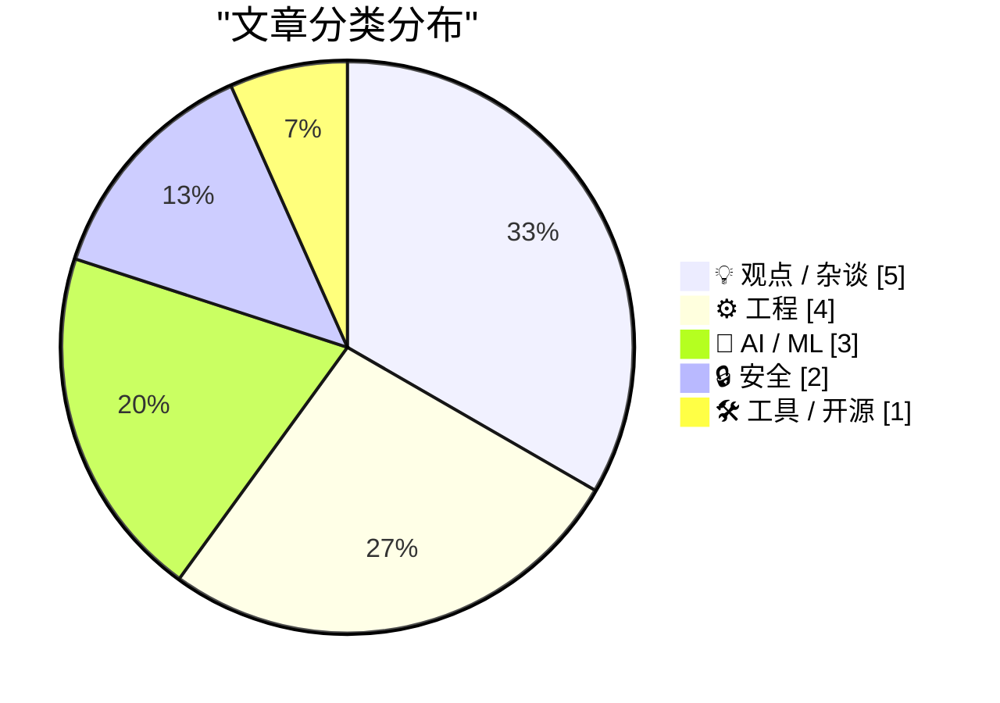
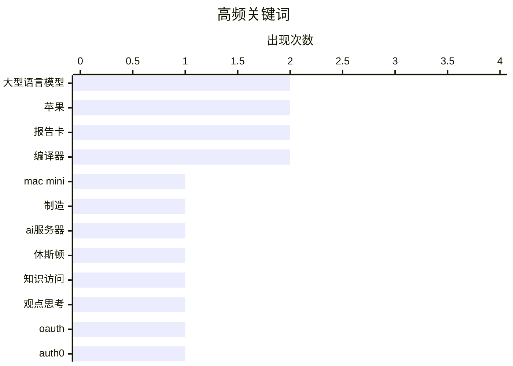

# 📰 AI 博客每日精选 — 2026-02-26

> 来自 Karpathy 推荐的 92 个顶级技术博客，AI 精选 Top 15

## 📝 今日看点

今日技术圈聚焦人工智能的深刻变革与行业巨头的战略动向。大语言模型正重塑知识获取与交互方式，推动乐观思潮在业界兴起。同时，苹果公司制造本土化与操作系统更新持续吸引关注，反映硬件与软件生态的演进。开发工具领域也涌现新思考，从编译器架构批判到代码理解实践，引领工程方法迭代。

---

## 🏆 今日必读

🥇 **苹果宣布今年晚些时候在休斯顿启动Mac迷你电脑生产**

[苹果宣布今年晚些时候在休斯顿启动Mac迷你电脑生产](https://www.apple.com/newsroom/2026/02/apple-accelerates-us-manufacturing-with-mac-mini-production/) — daringfireball.net · 1 天前 · ⚙️ 工程

> 苹果公司宣布，将首次把Mac迷你电脑的未来生产转移至美国。该公司计划大幅扩展其位于休斯顿工厂的运营，并同步提升先进人工智能服务器的制造产能。从今年晚些时候开始，苹果还将在其新建的先进制造中心提供实践培训。此举预计将为休斯顿当地创造数千个就业岗位。

💡 **为什么值得读**: 该消息揭示了苹果推动供应链本土化与高端制造回流美国的重要战略动向。

🏷️ Mac mini, 制造, AI服务器, 休斯顿

🥈 **当获取知识不再是限制时**

[当获取知识不再是限制时](https://idiallo.com/blog/access-to-knowledge-is-no-longer-a-limitation?src=feed) — idiallo.com · 15 小时前 · 🤖 AI / ML

> 文章的核心主题是探讨大语言模型带来的积极变革。作者通过一个思想实验，主张暂时搁置所有对大语言模型的批评，转而聚焦于其创造的可能性。核心论点是，如今我们能够即时获取全球信息并获得答案，这从根本上改变了学习与解决问题的模式。作者认为，这种便捷的知识获取能力是一种前所未有的积极力量。

💡 **为什么值得读**: 文章提供了一个跳出常见争议、聚焦于技术潜力的独特乐观视角。

🏷️ 大型语言模型, 知识访问, 观点思考

🥉 **在Auth0平台集成OpenStreetMap登录功能**

[在Auth0平台集成OpenStreetMap登录功能](https://shkspr.mobi/blog/2026/02/adding-openstreetmap-login-to-auth0/) — shkspr.mobi · 1 天前 · 🛠 工具 / 开源

> 文章提供了在Auth0平台集成OpenStreetMap作为第三方登录服务的具体技术方案。关键指导是避免创建自定义社交连接，而应选择创建“OpenID连接”提供商。方案详细列出了所需步骤，包括在OpenStreetMap官网注册应用程序并配置回调地址等。这为开发者实现该登录功能提供了清晰的路径。

💡 **为什么值得读**: 这是一份步骤清晰、直击要害的实战教程，能帮助开发者快速解决集成难题。

🏷️ OAuth, Auth0, OpenStreetMap, 身份验证

---

## 📊 数据概览

| 扫描源 | 抓取文章 | 时间范围 | 精选 |
|:---:|:---:|:---:|:---:|
| 82/92 | 2375 篇 → 53 篇 | 48h | **15 篇** |

### 分类分布



### 高频关键词



<details>
<summary>📈 纯文本关键词图（终端友好）</summary>

```
大型语言模型   │ ████████████████████ 2
苹果       │ ████████████████████ 2
报告卡      │ ████████████████████ 2
编译器      │ ████████████████████ 2
mac mini │ ██████████░░░░░░░░░░ 1
制造       │ ██████████░░░░░░░░░░ 1
ai服务器    │ ██████████░░░░░░░░░░ 1
休斯顿      │ ██████████░░░░░░░░░░ 1
知识访问     │ ██████████░░░░░░░░░░ 1
观点思考     │ ██████████░░░░░░░░░░ 1
```

</details>

### 🏷️ 话题标签

**大型语言模型**(2) · **苹果**(2) · **报告卡**(2) · 编译器(2) · mac mini(1) · 制造(1) · ai服务器(1) · 休斯顿(1) · 知识访问(1) · 观点思考(1) · oauth(1) · auth0(1) · openstreetmap(1) · 身份验证(1) · 人工智能(1) · 未来展望(1) · 技术乐观主义(1) · 抽象(1) · 工业化(1) · ios 26(1)

---

## 💡 观点 / 杂谈

### 1. 一切都很棒（我为何是个乐观主义者）

[一切都很棒（我为何是个乐观主义者）](https://www.joanwestenberg.com/everything-is-awesome-why-im-an-optimist/) — **joanwestenberg.com** · 1 天前 · ⭐ 24/30

> 文章针对互联网上弥漫的、特别是关于人工智能的末日论调进行了反驳。作者以马特·舒默将人工智能与新冠疫情早期类比的观点获得超过八千万浏览量为例，指出了这种恐慌情绪的盛行。作者的核心论点是，尽管存在挑战，但技术发展整体上带来了巨大的进步与可能性。因此，作者选择并阐述了保持乐观的理由。

🏷️ 人工智能, 未来展望, 技术乐观主义

---

### 2. 格雷格·克瑙斯：‘迷失自我’

[格雷格·克瑙斯：‘迷失自我’](https://www.eod.com/blog/2026/02/lose-myself/) — **daringfireball.net** · 4 小时前 · ⭐ 23/30

> 文章探讨了人们使用自然语言与大型语言模型交互的本质意义。针对“用英语与模型交流只是远离机器物理原理的又一层抽象”这一技术性质疑，作者认为这种说法“错过了重点”。作者用工业化生产的蛋糕与手工烘焙的蛋糕并非同一事物的比喻，说明工业化从根本上以量子级程度改变了事物。核心观点是，新范式带来的能力跃迁本身具有革命性价值。

🏷️ 大型语言模型, 抽象, 工业化

---

### 3. 苹果在2025年：六色舆情报告卡

[苹果在2025年：六色舆情报告卡](https://sixcolors.com/post/2026/02/2025reportcard/) — **daringfireball.net** · 1 天前 · ⭐ 23/30

> 文章呈现了针对苹果公司2025年表现的年度舆情调查报告。该调查收集了长期关注苹果的作家、编辑、开发者等群体的广泛意见，旨在捕捉“当下的整体氛围”。这是第十一年进行此项调查，因此可以观察长达十年的舆情变化趋势。调查结果显示，大约百分之八十的参与者对苹果过去一年的表现给予了“B”或更高的评分。

🏷️ 苹果, 2025, 报告卡, 评价

---

### 4. 流沙般的灵动岛：深入解读2025年苹果报告卡

[流沙般的灵动岛：深入解读2025年苹果报告卡](https://www.relay.fm/upgrade/604) — **daringfireball.net** · 1 天前 · ⭐ 22/30

> 本期播客节目深入探讨了科技媒体“六色”发布的2025年苹果公司年度报告卡评分结果。两位主持人杰森·斯内尔和迈克·赫利对报告卡中的每一个类别都给出了他们个人的详细评价和观点。讨论中产生了显著分歧，特别是在评价“麦克操作系统26大湖版本”时，杰森提出了颇具争议性的看法，而迈克则试图在五分制中给出十分的评价。这期节目生动展现了外部观察者对苹果各产品线年度表现的多元视角，以及评价本身的主观性和趣味性。

🏷️ 苹果, 报告卡, 播客

---

### 5. 氛围编码垃圾邮件时代已至

[氛围编码垃圾邮件时代已至](https://feed.tedium.co/link/15204/17283566/vibe-coded-email-spam) — **tedium.co** · 13 小时前 · ⭐ 22/30

> 编程工具的低门槛化让更多人能轻松编码，却意外使垃圾邮件制作更吸引人。低代码平台和简化编程环境使非专业者也能创建逼真垃圾邮件内容，提升欺骗性。传统反垃圾邮件措施面临新挑战，垃圾邮件质量和数量均有所增加。作者指出技术便利性被滥用，呼吁加强安全防护以平衡创新与风险。

🏷️ 低代码, 垃圾代码, 软件开发

---

## ⚙️ 工程

### 6. 苹果宣布今年晚些时候在休斯顿启动Mac迷你电脑生产

[苹果宣布今年晚些时候在休斯顿启动Mac迷你电脑生产](https://www.apple.com/newsroom/2026/02/apple-accelerates-us-manufacturing-with-mac-mini-production/) — **daringfireball.net** · 1 天前 · ⭐ 25/30

> 苹果公司宣布，将首次把Mac迷你电脑的未来生产转移至美国。该公司计划大幅扩展其位于休斯顿工厂的运营，并同步提升先进人工智能服务器的制造产能。从今年晚些时候开始，苹果还将在其新建的先进制造中心提供实践培训。此举预计将为休斯顿当地创造数千个就业岗位。

🏷️ Mac mini, 制造, AI服务器, 休斯顿

---

### 7. 播客节目：‘严肃的意见发表者’

[播客节目：‘严肃的意见发表者’](https://daringfireball.net/thetalkshow/2026/02/25/ep-441) — **daringfireball.net** · 5 小时前 · ⭐ 23/30

> 本期播客节目详细讨论了苹果iOS 26及其他版本26操作系统的用户界面变化。嘉宾亚当·恩斯特重点分析了电话应用中的新“统一视图”，以及电话和信息应用中的“过滤器”弹出菜单。节目中还提到了对“气球帮助”功能的致意。本期节目由哨兵监控平台与Squarespace网站建设工具赞助播出。

🏷️ iOS 26, 用户界面, Phone应用

---

### 8. 反对查询式编译器

[反对查询式编译器](https://matklad.github.io/2026/02/25/against-query-based-compilers.html) — **matklad.github.io** · 1 天前 · ⭐ 23/30

> 文章对当前流行的查询式编译器架构提出了批判性观点。作者承认查询式编译器是当下的热门趋势，但旨在指出其潜在的问题与风险。核心论点是，这种架构可能并非适用于所有场景，并存在一些容易被忽视的缺陷。文章旨在为编译器开发者提供一个不同的思考角度，警惕盲目跟风。

🏷️ 编译器, 编程语言, 设计模式

---

### 9. 为玩具优化器编写模糊测试工具

[为玩具优化器编写模糊测试工具](https://bernsteinbear.com/blog/toy-fuzzer/?utm_source=rss) — **bernsteinbear.com** · 1 天前 · ⭐ 22/30

> 优化器实现极易出错，手动编写的测试套件难以覆盖组件交互和多轮优化过程中的复杂边界情况。作者尝试通过编写模糊测试工具来自动发现这些缺陷，但关键在于需要定义一个‘正确性预言’来区分普通的程序崩溃与真正的优化逻辑错误。文章探讨了如何构建这样的测试框架，以捕捉传统测试方法可能遗漏的深层交互性错误。其核心在于将模糊测试的随机性与对优化结果正确性的形式化验证相结合。

🏷️ 模糊测试, 编译器, 优化

---

## 🤖 AI / ML

### 10. 当获取知识不再是限制时

[当获取知识不再是限制时](https://idiallo.com/blog/access-to-knowledge-is-no-longer-a-limitation?src=feed) — **idiallo.com** · 15 小时前 · ⭐ 24/30

> 文章的核心主题是探讨大语言模型带来的积极变革。作者通过一个思想实验，主张暂时搁置所有对大语言模型的批评，转而聚焦于其创造的可能性。核心论点是，如今我们能够即时获取全球信息并获得答案，这从根本上改变了学习与解决问题的模式。作者认为，这种便捷的知识获取能力是一种前所未有的积极力量。

🏷️ 大型语言模型, 知识访问, 观点思考

---

### 11. 线性演练

[线性演练](https://simonwillison.net/guides/agentic-engineering-patterns/linear-walkthroughs/#atom-everything) — **simonwillison.net** · 1 天前 · ⭐ 22/30

> 文章介绍了一种名为“线性演练”的智能体工程模式，用于帮助理解代码库。该模式适用于需要快速熟悉现有代码、回顾自己遗忘的代码或理清随意编写代码逻辑的场景。在合适的智能体框架驱动下，前沿模型能够构建出代码的结构化解释。这种方法能系统性地引导开发者遍历代码，理清模块关系和执行流程。

🏷️ AI, 开源, 维护者

---

### 12. Go语言二进制文件大小分析工具

[Go语言二进制文件大小分析工具](https://simonwillison.net/2026/Feb/24/go-size-analyzer/#atom-everything) — **simonwillison.net** · 1 天前 · ⭐ 22/30

> 文章推荐了一个用于分析Go语言二进制文件大小的工具。该工具能够以树状图可视化的形式，清晰展示二进制文件中捆绑的依赖项所占空间。用户既可以在本地安装运行，也可以直接访问其在线网站版本，该网站版本工具已编译为WebAssembly格式。这体现了Go语言生态在开发工具方面的卓越能力。

🏷️ OpenAI, 收购, 人才

---

## 🔒 安全

### 13. 仅限会员：你的匿名集已经崩溃，而你尚未察觉

[仅限会员：你的匿名集已经崩溃，而你尚未察觉](https://www.joanwestenberg.com/members-only-your-anonymity-set-has-collapsed-and-you-dont-know-it-yet/) — **joanwestenberg.com** · 2 小时前 · ⭐ 22/30

> 文章揭示了在会员制网络平台中，用户自以为享有的在线匿名性实际上极其脆弱且已普遍失效。核心论点是，支付记录、真实身份与浏览数据的强关联，使得匿名集在三个维度上同时崩溃，任何单一维度的匿名都无法提供真正保护。文中列举了记者通过会员数据成功进行去匿名化攻击的实例，表明这种威胁并非理论而是现实。作者进一步指出，这种隐私侵蚀是结构性的，广泛存在于各类采用会员订阅模式的平台中。结论是，用户必须重新评估在会员制平台上的行为，并认识到其匿名保护可能早已荡然无存。

🏷️ 隐私, 匿名性, 网络安全

---

### 14. 语言包管理器中的可重现构建

[语言包管理器中的可重现构建](https://nesbitt.io/2026/02/24/reproducible-builds-in-language-package-managers.html) — **nesbitt.io** · 1 天前 · ⭐ 22/30

> 文章核心探讨如何验证已发布的软件包是否确实由其声明的源代码构建而成，这是保障软件供应链安全的关键。当前，不同语言的包管理器对可重现构建的支持程度差异巨大，例如戈兰和拉斯已经原生支持，而节点包管理器与派森包索引仍在努力实现。实现可重现构建的主要障碍在于构建过程中引入了可变因素，如时间戳和文件系统排序，解决方案包括使用固定时间戳和对文件进行规范化排序。作者通过具体案例和工具演示了在不同生态中实施可重现构建的可行方法与挑战。最终结论是，可重现构建应成为软件分发的一项基本安全措施，它能有效增强信任并抵御供应链攻击。

🏷️ 软件供应链, 可重现构建, 包管理

---

## 🛠 工具 / 开源

### 15. 在Auth0平台集成OpenStreetMap登录功能

[在Auth0平台集成OpenStreetMap登录功能](https://shkspr.mobi/blog/2026/02/adding-openstreetmap-login-to-auth0/) — **shkspr.mobi** · 1 天前 · ⭐ 24/30

> 文章提供了在Auth0平台集成OpenStreetMap作为第三方登录服务的具体技术方案。关键指导是避免创建自定义社交连接，而应选择创建“OpenID连接”提供商。方案详细列出了所需步骤，包括在OpenStreetMap官网注册应用程序并配置回调地址等。这为开发者实现该登录功能提供了清晰的路径。

🏷️ OAuth, Auth0, OpenStreetMap, 身份验证

---

*生成于 2026-02-26 03:42 | 扫描 82 源 → 获取 2375 篇 → 精选 15 篇*
*基于 [Hacker News Popularity Contest 2025](https://refactoringenglish.com/tools/hn-popularity/) RSS 源列表，由 [Andrej Karpathy](https://x.com/karpathy) 推荐*
