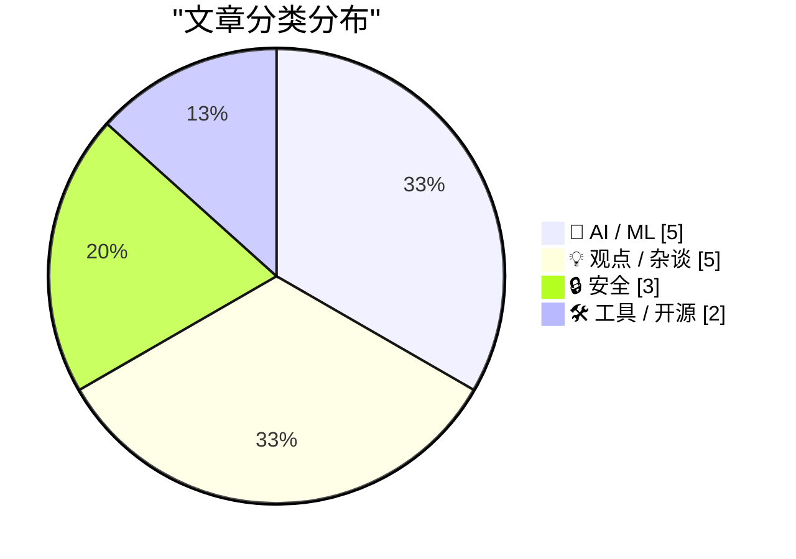
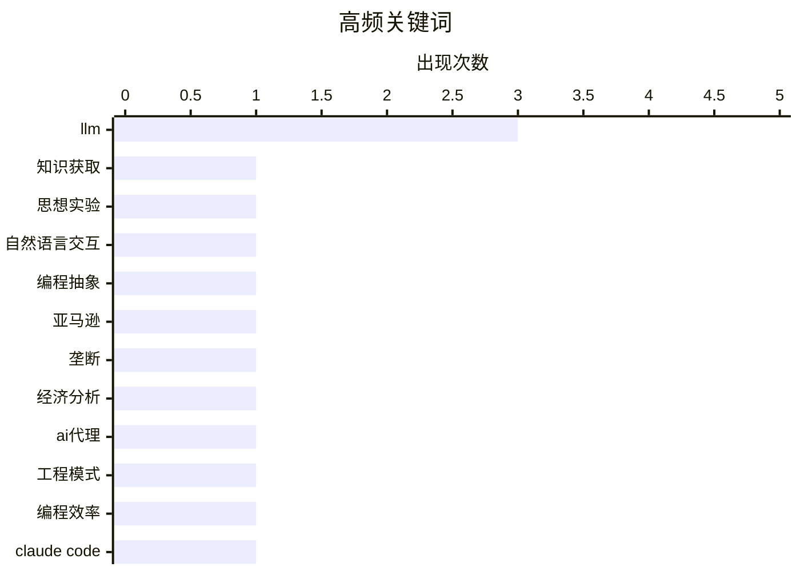

# 📰 AI 博客每日精选 — 2026-02-27

> 来自 Karpathy 推荐的 92 个顶级技术博客，AI 精选 Top 15

## 📝 今日看点

今日技术圈聚焦人工智能的变革性影响与科技垄断的结构性议题。大型语言模型正重塑知识获取和编程协作方式，推动行业进入新阶段。同时，科技巨头的垄断地位持续引发经济成本与政策监管的广泛讨论。信息安全领域也呈现新动态，消费级设备获得高级别认证，但应用程序接口密钥风险暴露潜在隐患。

---

## 🏆 今日必读

🥇 **当获取知识不再是限制**

[当获取知识不再是限制](https://idiallo.com/blog/access-to-knowledge-is-no-longer-a-limitation?src=feed) — idiallo.com · 1 天前 · 🤖 AI / ML

> 文章探讨了大型语言模型如何从根本上改变了人类获取知识的门槛。作者提议通过一个思想实验，暂时搁置所有对大型语言模型的批评，转而聚焦其带来的积极变革。核心论点是，这些模型将世界信息置于人们指尖，使得几乎任何问题都能获得即时解答。这标志着知识获取本身已不再是学习和创造的主要瓶颈。作者认为，我们应充分拥抱并利用这种前所未有的、便捷的知识获取能力。

💡 **为什么值得读**: 这篇文章提供了一个独特的视角，帮助读者超越技术争议，思考人工智能在赋能个体认知层面的革命性意义。

🏷️ LLM, 知识获取, 思想实验

🥈 **格雷格·克瑙斯：‘迷失自我’**

[格雷格·克瑙斯：‘迷失自我’](https://www.eod.com/blog/2026/02/lose-myself/) — daringfireball.net · 1 天前 · 🤖 AI / ML

> 文章反驳了认为用英语与大型语言模型交流是‘过度抽象’的批评。作者承认这在技术层面属实，但指出这种批评忽略了工业化的本质。他以蛋糕为例，说明工厂生产的点心、面包师制作的蛋糕与直接咀嚼原料是三种截然不同的体验和产物。工业化以量子跃迁般的程度根本性地改变了事物。结论是，大型语言模型带来的交互方式变革本身就是一种有价值的进步，而非需要被剥离的‘抽象层’。

💡 **为什么值得读**: 通过生动的类比，文章深刻揭示了技术普及与工业化带来的范式转变，挑战了人们对‘本真性’的固有认知。

🏷️ LLM, 自然语言交互, 编程抽象

🥉 **多元主义：整个经济都在支付亚马逊税**

[多元主义：整个经济都在支付亚马逊税](https://pluralistic.net/2026/02/25/most-favored-nation/) — pluralistic.net · 1 天前 · 💡 观点 / 杂谈

> 文章核心议题是亚马逊的垄断地位对整体经济造成的广泛成本。作者指出，垄断权力使得亚马逊可以向其平台上的卖家和消费者征收一种隐形的‘税’。这种成本无法通过个人消费选择来规避，因为垄断影响了市场结构和定价权。最终，所有市场参与者，乃至整个经济体系，都需要为这种垄断权力买单。文章的核心观点是，对抗垄断需要结构性解决方案，而非依赖个体消费者的选择。

💡 **为什么值得读**: 它清晰地剖析了垄断权力的外部性，将企业行为与宏观经济成本联系起来，具有重要的政策启示。

🏷️ 亚马逊, 垄断, 经济分析

---

## 📊 数据概览

| 扫描源 | 抓取文章 | 时间范围 | 精选 |
|:---:|:---:|:---:|:---:|
| 82/92 | 2396 篇 → 48 篇 | 48h | **15 篇** |

### 分类分布



### 高频关键词



<details>
<summary>📈 纯文本关键词图（终端友好）</summary>

```
llm    │ ████████████████████ 3
知识获取   │ ███████░░░░░░░░░░░░░ 1
思想实验   │ ███████░░░░░░░░░░░░░ 1
自然语言交互 │ ███████░░░░░░░░░░░░░ 1
编程抽象   │ ███████░░░░░░░░░░░░░ 1
亚马逊    │ ███████░░░░░░░░░░░░░ 1
垄断     │ ███████░░░░░░░░░░░░░ 1
经济分析   │ ███████░░░░░░░░░░░░░ 1
ai代理   │ ███████░░░░░░░░░░░░░ 1
工程模式   │ ███████░░░░░░░░░░░░░ 1
```

</details>

### 🏷️ 话题标签

**llm**(3) · **知识获取**(1) · **思想实验**(1) · 自然语言交互(1) · 编程抽象(1) · 亚马逊(1) · 垄断(1) · 经济分析(1) · ai代理(1) · 工程模式(1) · 编程效率(1) · claude code(1) · 远程控制(1) · 开发工具(1) · 科技政策(1) · 特朗普(1) · 反垄断(1) · ai编程(1) · 变革(1) · 效率(1)

---

## 🤖 AI / ML

### 1. 当获取知识不再是限制

[当获取知识不再是限制](https://idiallo.com/blog/access-to-knowledge-is-no-longer-a-limitation?src=feed) — **idiallo.com** · 1 天前 · ⭐ 29/30

> 文章探讨了大型语言模型如何从根本上改变了人类获取知识的门槛。作者提议通过一个思想实验，暂时搁置所有对大型语言模型的批评，转而聚焦其带来的积极变革。核心论点是，这些模型将世界信息置于人们指尖，使得几乎任何问题都能获得即时解答。这标志着知识获取本身已不再是学习和创造的主要瓶颈。作者认为，我们应充分拥抱并利用这种前所未有的、便捷的知识获取能力。

🏷️ LLM, 知识获取, 思想实验

---

### 2. 格雷格·克瑙斯：‘迷失自我’

[格雷格·克瑙斯：‘迷失自我’](https://www.eod.com/blog/2026/02/lose-myself/) — **daringfireball.net** · 1 天前 · ⭐ 26/30

> 文章反驳了认为用英语与大型语言模型交流是‘过度抽象’的批评。作者承认这在技术层面属实，但指出这种批评忽略了工业化的本质。他以蛋糕为例，说明工厂生产的点心、面包师制作的蛋糕与直接咀嚼原料是三种截然不同的体验和产物。工业化以量子跃迁般的程度根本性地改变了事物。结论是，大型语言模型带来的交互方式变革本身就是一种有价值的进步，而非需要被剥离的‘抽象层’。

🏷️ LLM, 自然语言交互, 编程抽象

---

### 3. 积累你所知道如何做的事情

[积累你所知道如何做的事情](https://simonwillison.net/guides/agentic-engineering-patterns/hoard-things-you-know-how-to-do/#atom-everything) — **simonwillison.net** · 7 小时前 · ⭐ 24/30

> 本文提出了一条提升与编程智能体协作效率的核心原则：系统性地积累你知道如何完成的任务与方法。这一原则是作者多年软件工程经验的延伸，其价值在于帮助开发者明确可能性的边界。积累的知识库能让开发者更精准地判断哪些任务可以委托给智能体，以及如何拆解和描述这些任务。这实质上是将个人经验转化为可被智能体理解和执行的元知识。结论是，建立个人‘方法仓库’是智能体时代一项关键的增效技能。

🏷️ AI代理, 工程模式, 编程效率

---

### 4. 引用安德烈·卡帕西

[引用安德烈·卡帕西](https://simonwillison.net/2026/Feb/26/andrej-karpathy/#atom-everything) — **simonwillison.net** · 8 小时前 · ⭐ 23/30

> 文章引述了人工智能专家安德烈·卡帕西关于编程领域因人工智能发生剧变的观点。卡帕西强调，变化并非通常的渐进式进步，而是在去年十二月出现了质的飞跃。他认为，在十二月之前，编码智能体基本不可用，而在此之后则基本可用，因为模型在质量、长期连贯性和持久性上取得了显著提升。这种变化使得智能体能够处理大型复杂任务，并开始展现出‘超线性’的回报。核心结论是，人工智能正在以非线性的、颠覆性的方式重塑编程工作。

🏷️ AI编程, 变革, 效率

---

### 5. 一夜之间随性开发：我为自己打造了梦想中的苹果电脑演示应用

[一夜之间随性开发：我为自己打造了梦想中的苹果电脑演示应用](https://simonwillison.net/2026/Feb/25/present/#atom-everything) — **simonwillison.net** · 1 天前 · ⭐ 22/30

> 作者为一场关于“2026年2月大语言模型现状”的即兴演讲，在演讲前夜快速开发了一款定制化的苹果电脑演示应用。该应用使用苹果的SwiftUI框架开发，并借助GPT-4o模型通过自然语言交互生成代码和解决难题。应用核心功能包括实时编辑演示文稿、分屏显示演讲者视图与观众视图，并能通过手机远程控制翻页，完全替代了传统的幻灯片软件。整个过程展示了在人工智能辅助下，开发者能够以极高的效率和创意响应临时的技术需求。作者通过这次实践，成功完成演讲并验证了该工作流程的可行性。

🏷️ LLM, 快速开发, macOS应用

---

## 💡 观点 / 杂谈

### 6. 多元主义：整个经济都在支付亚马逊税

[多元主义：整个经济都在支付亚马逊税](https://pluralistic.net/2026/02/25/most-favored-nation/) — **pluralistic.net** · 1 天前 · ⭐ 25/30

> 文章核心议题是亚马逊的垄断地位对整体经济造成的广泛成本。作者指出，垄断权力使得亚马逊可以向其平台上的卖家和消费者征收一种隐形的‘税’。这种成本无法通过个人消费选择来规避，因为垄断影响了市场结构和定价权。最终，所有市场参与者，乃至整个经济体系，都需要为这种垄断权力买单。文章的核心观点是，对抗垄断需要结构性解决方案，而非依赖个体消费者的选择。

🏷️ 亚马逊, 垄断, 经济分析

---

### 7. 多元主义：如果你建成它（并且它有效），特朗普就会来（并夺走它）

[多元主义：如果你建成它（并且它有效），特朗普就会来（并夺走它）](https://pluralistic.net/2026/02/26/hanged-for-a-sheep/) — **pluralistic.net** · 16 小时前 · ⭐ 24/30

> 文章分析了特朗普政府对大型科技公司的监管立场可能带来的后果。核心论点是，特朗普的政策目标并非确保公平竞争，而是帮助大型科技公司巩固并赢得垄断地位。这种‘赢家通吃’的导向会进一步削弱市场中的小型竞争者和创新者。作者警示，任何有效但可能挑战现有巨头的新兴技术或企业，都可能面临被收编或压制的命运。结论是，这种政治环境将对科技创新生态产生深远的负面影响。

🏷️ 科技政策, 特朗普, 反垄断

---

### 8. ★ 我的2025年苹果成绩单

[★ 我的2025年苹果成绩单](https://daringfireball.net/2026/02/my_2025_apple_report_card) — **daringfireball.net** · 1 天前 · ⭐ 23/30

> 作者约翰·格鲁伯对苹果公司2025年的整体表现给出了‘混合’的评价。文章从产品、软件、服务、环保等多个维度进行了具体分析。成绩单中既有对某些产品迭代或政策决策的批评，也肯定了苹果在其他方面的进展和优势。这种‘混合’结论意味着苹果在过去一年中表现优劣参半，未达到全面卓越。最终评价反映了苹果作为科技巨头在复杂市场环境中面临的挑战与取得的成就。

🏷️ 苹果, 产品评价, 年度总结

---

### 9. 引述本尼迪克特·埃文斯

[引述本尼迪克特·埃文斯](https://simonwillison.net/2026/Feb/26/benedict-evans/#atom-everything) — **simonwillison.net** · 23 小时前 · ⭐ 22/30

> 文章聚焦于OpenAI面临的核心挑战：其先进的人工智能模型并未真正融入用户的日常生活，反映出产品与市场不契合的根本问题。行业观察家本尼迪克特·埃文斯指出，用户使用频率极低，每周最多几次，且在日常中想不出应用场景。OpenAI将之归因为模型能力与用户使用之间的‘能力差距’，但埃文斯认为这只是对缺乏明确产品市场契合的委婉说法。其核心观点在于，强大的技术能力本身并不自动转化为用户需求或成功的产品。

🏷️ OpenAI, 使用频率, 产品影响

---

### 10. 氛围编程工具正被用于制造垃圾邮件

[氛围编程工具正被用于制造垃圾邮件](https://feed.tedium.co/link/15204/17283566/vibe-coded-email-spam) — **tedium.co** · 1 天前 · ⭐ 22/30

> 低代码与人工智能编程工具的普及，在降低开发门槛的同时，也显著降低了制造大规模个性化垃圾邮件的技术成本与时间成本。这些工具能快速生成逼真的邮件模板、个性化内容并自动化发送流程，使得垃圾邮件活动呈现出更专业、更难以被传统过滤器识别的趋势。其后果是垃圾邮件数量可能激增，内容更具欺骗性，而防御方则需要投入更多资源进行识别与对抗。技术普及带来的效率提升是一把双刃剑，其滥用正对网络安全构成新的现实威胁。

🏷️ 编码垃圾邮件, 低代码, 安全风险

---

## 🔒 安全

### 11. 苹果手机与平板电脑获准处理北约机密信息

[苹果手机与平板电脑获准处理北约机密信息](https://nr.apple.com/Do0I6B8WX0) — **daringfireball.net** · 5 小时前 · ⭐ 23/30

> 文章报道了苹果手机和平板电脑成为首批也是目前唯一符合北约成员国信息保障要求的消费级设备。这一认证意味着它们无需特殊软件或设置，即可处理最高至‘北约限制级’的机密信息。苹果强调，这是其他消费级移动设备从未达到过的政府认证级别。然而，文章也略带讽刺地指出，苹果手机仅是第二款获准处理机密信息的手机。该认证标志着消费电子设备在安全可靠性上达到了前所未有的政府级标准。

🏷️ iPhone安全, 北约认证, 信息安全

---

### 12. 谷歌应用程序接口密钥不再是秘密？但随后双子座改变了规则

[谷歌应用程序接口密钥不再是秘密？但随后双子座改变了规则](https://simonwillison.net/2026/Feb/26/google-api-keys/#atom-everything) — **simonwillison.net** · 23 小时前 · ⭐ 22/30

> 文章揭示了一个重大的安全风险：谷歌地图与双子座等服务的应用程序接口密钥是通用的。问题在于，谷歌地图的应用程序接口密钥设计为可公开，因为它需要被嵌入网页前端；而双子座的应用程序接口密钥却能用于访问私人文件和发起计费请求，本应是机密。这种密钥共享机制意味着，一个原本公开的谷歌地图密钥可能被意外地用于访问敏感的双子座应用程序接口。文章核心是指出谷歌在密钥管理和服务隔离上存在设计缺陷，导致了新的攻击面。

🏷️ API密钥, 安全漏洞, Gemini

---

### 13. 三星 S26 超旗舰手机隐私显示屏实机演示

[三星 S26 超旗舰手机隐私显示屏实机演示](https://9to5google.com/2026/02/25/samsung-galaxy-s26-ultra-privacy-display-demo-hands-on/) — **daringfireball.net** · 1 天前 · ⭐ 22/30

> 三星 S26 超旗舰手机搭载隐私显示屏技术，旨在防止侧视偷窥屏幕内容。该技术通过调整像素发光模式，使屏幕在偏离正面角度时内容变得模糊或难以观看。默认设置下，隐私保护有效，但在较浅侧视角度下内容仍可辨识。三星提供最大隐私模式，能进一步降低侧视可见度并大幅收窄可视范围。这一功能为用户在公共场合使用手机提供了可调节的隐私安全保障。

🏷️ 隐私屏幕, 硬件安全, 显示技术

---

## 🛠 工具 / 开源

### 14. 克劳德代码远程控制

[克劳德代码远程控制](https://simonwillison.net/2026/Feb/25/claude-code-remote-control/#atom-everything) — **simonwillison.net** · 1 天前 · ⭐ 24/30

> 文章介绍了克劳德代码新推出的‘远程控制’功能，允许用户在本地计算机运行会话，然后通过网络或移动端界面向其发送指令。作者指出该功能目前仍有些粗糙，并分享了初次尝试时遇到的账户权限错误及后续的解决过程。这一功能的意义在于实现了工作环境的分离与控制端的灵活化。尽管处于早期阶段，但它展示了将智能体深度集成到本地开发工作流的未来方向。

🏷️ Claude Code, 远程控制, 开发工具

---

### 15. 介绍吉兹皮克：解析吉兹普元数据的工具

[介绍吉兹皮克：解析吉兹普元数据的工具](https://evanhahn.com/introducing-gzpeek/) — **evanhahn.com** · 1 天前 · ⭐ 22/30

> 吉兹普压缩格式不仅包含压缩数据，还嵌入了元数据，例如压缩时使用的操作系统信息。作者通过阅读文件格式规范，发现吉兹普格式有意外之喜，打破了其仅用于压缩的常见误解。为此，他开发了工具吉兹皮克来读取和解析吉兹普流中的元数据。该工具能提取诸如操作系统类型等细节，帮助用户深入了解压缩文件的来源。这揭示了文件格式中常被忽略的隐藏信息，鼓励技术探索。

🏷️ gzip, 元数据, 工具开发

---

*生成于 2026-02-27 03:40 | 扫描 82 源 → 获取 2396 篇 → 精选 15 篇*
*基于 [Hacker News Popularity Contest 2025](https://refactoringenglish.com/tools/hn-popularity/) RSS 源列表，由 [Andrej Karpathy](https://x.com/karpathy) 推荐*
