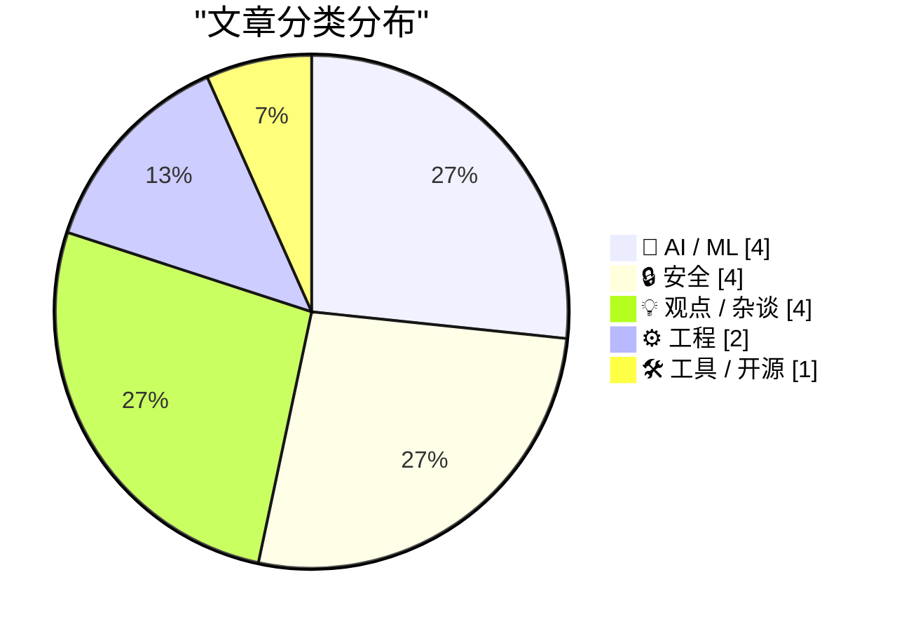
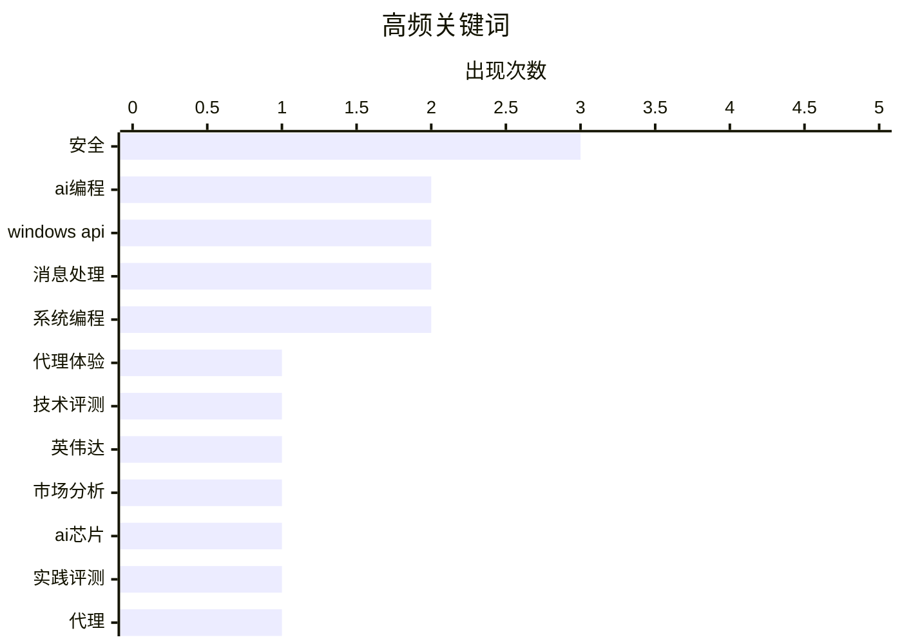

# 📰 AI 博客每日精选 — 2026-02-28

> 来自 Karpathy 推荐的 92 个顶级技术博客，AI 精选 Top 15

## 📝 今日看点

今日技术圈看点集中呈现两大趋势。人工智能编码代理实现关键突破，正深刻改变软件开发范式；网络安全与隐私保护议题持续升温，从设备认证到法律风险凸显多重挑战。此外，人工智能伦理决策日益重要，企业责任成为行业焦点。

---

## 🏆 今日必读

🥇 **一位人工智能编码代理怀疑论者的详尽实践记录**

[一位人工智能编码代理怀疑论者的详尽实践记录](https://simonwillison.net/2026/Feb/27/ai-agent-coding-in-excessive-detail/#atom-everything) — simonwillison.net · 6 小时前 · 🤖 AI / ML

> 文章记录了作者从怀疑到实际测试人工智能编码代理能力的全过程。作者通过一系列难度递增的项目进行测试，从简单的元数据抓取工具开始，最终挑战了复杂的代码移植任务。测试发现，自去年十二月以来，编码代理在模型质量、长期连贯性和持久性方面取得了显著突破，变得真正可用。结论是，人工智能编码代理的能力在近期发生了质变，已从基本不可用转变为能够实际工作的工具。

💡 **为什么值得读**: 通过一位前怀疑者的亲身实践，为开发者提供了关于人工智能编码代理当前能力边界与实用性的第一手、可信评估。

🏷️ AI编程, 代理体验, 技术评测

🥈 **论英伟达与分析困境**

[论英伟达与分析困境](https://www.wheresyoured.at/on-nvidia-and-analyslop/) — wheresyoured.at · 1 天前 · 🤖 AI / ML

> 文章批判性地分析了当前围绕英伟达的市场狂热与分析师报告中的问题。作者指出，许多分析缺乏深度，流于表面，存在一种“分析困境”。核心论点是市场对英伟达的叙事过于单一，忽略了潜在风险与技术竞争的复杂性。文章呼吁进行更细致、更具批判性的行业观察。

💡 **为什么值得读**: 为过热的技术投资市场提供了一剂清醒剂，促使读者超越主流叙事进行独立思考。

🏷️ 英伟达, 市场分析, AI芯片

🥉 **一位人工智能编码代理怀疑论者的详尽实践记录**

[一位人工智能编码代理怀疑论者的详尽实践记录](https://minimaxir.com/2026/02/ai-agent-coding/) — minimaxir.com · 9 小时前 · 🤖 AI / ML

> 本文核心是验证人工智能编码代理的实际效能。作者作为最初的怀疑者，设计并执行了一系列逐步复杂的编程任务来测试代理。关键发现是，编码代理在去年十二月经历了一个关键转折点，其底层模型的质量和任务执行的连贯性得到了根本性改善。最终观点是，人工智能辅助编程已进入一个全新的、可用的阶段。

💡 **为什么值得读**: 以详尽的实验项目和具体的时间节点（去年十二月），实证了人工智能编程工具能力的跃迁，对开发者具有直接参考价值。

🏷️ AI编程, 实践评测, 代理

---

## 📊 数据概览

| 扫描源 | 抓取文章 | 时间范围 | 精选 |
|:---:|:---:|:---:|:---:|
| 85/92 | 2434 篇 → 44 篇 | 48h | **15 篇** |

### 分类分布



### 高频关键词



<details>
<summary>📈 纯文本关键词图（终端友好）</summary>

```
安全          │ ████████████████████ 3
ai编程        │ █████████████░░░░░░░ 2
windows api │ █████████████░░░░░░░ 2
消息处理        │ █████████████░░░░░░░ 2
系统编程        │ █████████████░░░░░░░ 2
代理体验        │ ███████░░░░░░░░░░░░░ 1
技术评测        │ ███████░░░░░░░░░░░░░ 1
英伟达         │ ███████░░░░░░░░░░░░░ 1
市场分析        │ ███████░░░░░░░░░░░░░ 1
ai芯片        │ ███████░░░░░░░░░░░░░ 1
```

</details>

### 🏷️ 话题标签

**安全**(3) · **ai编程**(2) · **windows api**(2) · 消息处理(2) · 系统编程(2) · 代理体验(1) · 技术评测(1) · 英伟达(1) · 市场分析(1) · ai芯片(1) · 实践评测(1) · 代理(1) · 认证(1) · 苹果(1) · 北约(1) · ai伦理(1) · 责任(1) · 密码学(1) · 用户数据(1) · 安全警告(1)

---

## 🤖 AI / ML

### 1. 一位人工智能编码代理怀疑论者的详尽实践记录

[一位人工智能编码代理怀疑论者的详尽实践记录](https://simonwillison.net/2026/Feb/27/ai-agent-coding-in-excessive-detail/#atom-everything) — **simonwillison.net** · 6 小时前 · ⭐ 26/30

> 文章记录了作者从怀疑到实际测试人工智能编码代理能力的全过程。作者通过一系列难度递增的项目进行测试，从简单的元数据抓取工具开始，最终挑战了复杂的代码移植任务。测试发现，自去年十二月以来，编码代理在模型质量、长期连贯性和持久性方面取得了显著突破，变得真正可用。结论是，人工智能编码代理的能力在近期发生了质变，已从基本不可用转变为能够实际工作的工具。

🏷️ AI编程, 代理体验, 技术评测

---

### 2. 论英伟达与分析困境

[论英伟达与分析困境](https://www.wheresyoured.at/on-nvidia-and-analyslop/) — **wheresyoured.at** · 1 天前 · ⭐ 26/30

> 文章批判性地分析了当前围绕英伟达的市场狂热与分析师报告中的问题。作者指出，许多分析缺乏深度，流于表面，存在一种“分析困境”。核心论点是市场对英伟达的叙事过于单一，忽略了潜在风险与技术竞争的复杂性。文章呼吁进行更细致、更具批判性的行业观察。

🏷️ 英伟达, 市场分析, AI芯片

---

### 3. 一位人工智能编码代理怀疑论者的详尽实践记录

[一位人工智能编码代理怀疑论者的详尽实践记录](https://minimaxir.com/2026/02/ai-agent-coding/) — **minimaxir.com** · 9 小时前 · ⭐ 26/30

> 本文核心是验证人工智能编码代理的实际效能。作者作为最初的怀疑者，设计并执行了一系列逐步复杂的编程任务来测试代理。关键发现是，编码代理在去年十二月经历了一个关键转折点，其底层模型的质量和任务执行的连贯性得到了根本性改善。最终观点是，人工智能辅助编程已进入一个全新的、可用的阶段。

🏷️ AI编程, 实践评测, 代理

---

### 4. 给达里奥一块饼干？——Anthropic公司与死亡交易

[给达里奥一块饼干？——Anthropic公司与死亡交易](https://anildash.com/2026/02/27/a-cookie-for-dario/) — **anildash.com** · 3 小时前 · ⭐ 25/30

> 文章讨论了人工智能公司Anthropic及其首席执行官达里奥·阿莫代伊拒绝美国国防部修改其克劳德大语言模型平台以支持潜在战争罪行的请求。作者指出，政府将请求包装为“合法目的”，但其近期行为表明其对“合法”的定义存在争议。Anthropic的拒绝被视为在科技伦理上的一个重要立场。核心观点是，科技公司有责任拒绝将其技术用于不道德的目的，即使面对政府压力。

🏷️ AI伦理, 安全, 责任

---

## 🔒 安全

### 5. 苹果手机与平板获准处理北约机密信息

[苹果手机与平板获准处理北约机密信息](https://nr.apple.com/Do0I6B8WX0) — **daringfireball.net** · 1 天前 · ⭐ 25/30

> 苹果公司宣布其手机与平板电脑已通过北约信息安全保障要求认证。这使得这两款设备成为首批、也是目前唯一能处理最高至“北约限制级”机密信息的消费级移动设备，且无需额外软件或特殊设置。这意味着苹果设备在政府级安全认证方面达到了独一无二的水平。此认证标志着消费电子产品在高端安全领域取得了重大突破。

🏷️ 安全, 认证, 苹果, 北约

---

### 6. 恳请立即停止使用密码钥匙加密用户数据

[恳请立即停止使用密码钥匙加密用户数据](https://simonwillison.net/2026/Feb/27/passkeys/#atom-everything) — **simonwillison.net** · 4 小时前 · ⭐ 24/30

> 文章强烈警告开发者不要使用密码钥匙技术来加密用户数据。核心问题是，密码钥匙丢失率很高，而用户可能并不知晓其数据已被不可逆地加密绑定，导致永久性数据丢失。作者解释，密码钥匙的设计初衷是身份验证，而非数据加密。使用它加密数据会引入无法恢复的单点故障风险。结论是，行业应停止推广这种危险做法，让密码钥匙回归其身份验证的本质。

🏷️ 密码学, 用户数据, 安全警告

---

### 7. 谷歌应用程序编程接口密钥本非秘密，直至双子座模型改变了规则

[谷歌应用程序编程接口密钥本非秘密，直至双子座模型改变了规则](https://simonwillison.net/2026/Feb/26/google-api-keys/#atom-everything) — **simonwillison.net** · 1 天前 · ⭐ 24/30

> 文章揭示了一个重大的安全风险：谷歌地图的应用程序编程接口密钥与双子座大语言模型等服务共享同一套密钥体系。问题在于，谷歌地图密钥被设计为公开可读，通常直接嵌入网页前端；而双子座密钥却可用于访问私人文件和发起计费请求，本应是机密。这种混淆导致了严重的安全隐患，公开的地图密钥可能被滥用来盗用双子座服务的资源与数据。

🏷️ API安全, 密钥管理, 云服务

---

### 8. 西弗吉尼亚州反苹果儿童性虐待材料诉讼或将助长罪犯逍遥法外

[西弗吉尼亚州反苹果儿童性虐待材料诉讼或将助长罪犯逍遥法外](https://www.techdirt.com/2026/02/25/west-virginias-anti-apple-csam-lawsuit-would-help-child-predators-walk-free/) — **daringfireball.net** · 7 小时前 · ⭐ 24/30

> 文章分析了西弗吉尼亚州起诉苹果公司，要求其扫描云端服务以查找儿童性虐待材料所可能引发的法律后果。核心论点是，如果法院强制苹果进行扫描，那么所有由此获得的证据都将被视为无搜查令、无合理理由的政府非法搜查所得。根据美国宪法第四修正案的“排除规则”，辩护律师完全可以要求法庭排除这些证据。这反而可能导致定罪的儿童性犯罪者因证据无效而被释放。

🏷️ 隐私, 法律, 安全

---

## 💡 观点 / 杂谈

### 9. 引用安德烈·卡帕西的话

[引用安德烈·卡帕西的话](https://simonwillison.net/2026/Feb/26/andrej-karpathy/#atom-everything) — **simonwillison.net** · 1 天前 · ⭐ 23/30

> 文章引用了人工智能专家安德烈·卡帕西关于人工智能如何改变编程的观察。卡帕西指出，编程在过去两个月（特别是去年十二月）发生了根本性变化，而非渐进式改进。他认为，在此之前编码代理基本无效，而此后则基本可用，因为模型在质量、长期连贯性和韧性上取得了显著提升。这标志着人工智能辅助编程进入了一个新的、实用的阶段。

🏷️ AI变革, 编程未来, 行业观点

---

### 10. Netflix为何不收购华纳兄弟探索频道

[Netflix为何不收购华纳兄弟探索频道](https://spyglass.org/netflix-warner-bros-paramount-deal/) — **daringfireball.net** · 10 小时前 · ⭐ 22/30

> 文章核心分析了流媒体巨头Netflix未选择收购华纳兄弟探索频道，而派拉蒙与Skydance却达成交易背后的财务与战略逻辑。Netflix市值高达4000亿美元，完全有能力承担收购成本，其健康的业务增长也为偿还债务提供了清晰路径。相比之下，市值仅110亿美元的派拉蒙-天空舞蹈组合，却要承担高出自身价值近1000亿美元的收购，此举被作者视为高杠杆的冒险行为。作者的核心观点在于，Netflix的决策是基于财务审慎与内生增长的战略选择，而非缺乏收购能力。

🏷️ 流媒体, 收购, 商业

---

### 11. 史蒂夫·乔布斯的荒野岁月

[史蒂夫·乔布斯的荒野岁月](https://geoffreycain.net/steve-jobs-in-exile/) — **daringfireball.net** · 1 天前 · ⭐ 22/30

> 文章聚焦史蒂夫·乔布斯在1985年至1997年离开苹果后，领导NeXT公司十二年的艰难历程。这段时期充满了惊人的失败、濒临破产的危机以及残酷的羞辱。然而，正是这段在挫折熔炉中的历练，塑造了后来创造iPod、iPhone和iPad的远见卓识的领导者。最终，乔布斯携带着从NeXT获得的经验与技术重返苹果，并将其打造成全球最具价值的公司。作者杰弗里·凯恩运用了大量此前未公开的材料以及对关键人物的新访谈来还原这段历史。

🏷️ 史蒂夫·乔布斯, 传记, 历史

---

### 12. 这次真的不一样吗？

[这次真的不一样吗？](https://shkspr.mobi/blog/2026/02/this-time-is-different/) — **shkspr.mobi** · 1 天前 · ⭐ 22/30

> 文章批判了科技领域反复出现的炒作与幻灭周期。作者列举了包括3D电视、区块链、元宇宙、非同质化代币、量子计算、智能眼镜等在内的二十余项曾被狂热追捧但最终未达预期或已沉寂的技术与概念。其核心论点是，当前对人工智能的狂热与上述历次炒作模式高度相似，由同一批人推动并宣称“这次不同”。结论是，我们应从历史中吸取教训，对新技术浪潮保持审慎与理性的怀疑态度。

🏷️ 技术趋势, 炒作周期, 反思

---

## ⚙️ 工程

### 13. 在对话框消息函数内部拦截消息：微调消息过滤器

[在对话框消息函数内部拦截消息：微调消息过滤器](https://devblogs.microsoft.com/oldnewthing/20260227-00/?p=112094) — **devblogs.microsoft.com/oldnewthing** · 12 小时前 · ⭐ 23/30

> 这是一篇微软技术博客文章，探讨了在窗口程序开发中如何精确控制对话框消息处理函数内部的消息拦截。核心问题是确保消息过滤器在需要时被触发，而在不需要时不被误触发。文章提供了微调消息过滤器的具体技术方法，以实现更精细的消息处理逻辑。这对于开发需要复杂用户交互的桌面应用程序具有实际指导意义。

🏷️ Windows API, 消息处理, 系统编程

---

### 14. 在对话框消息处理函数内部拦截消息与安装消息过滤器

[在对话框消息处理函数内部拦截消息与安装消息过滤器](https://devblogs.microsoft.com/oldnewthing/20260226-00/?p=112090) — **devblogs.microsoft.com/oldnewthing** · 1 天前 · ⭐ 23/30

> 文章探讨了在窗口消息循环中，当使用对话框消息处理函数时，如何拦截并处理那些被其内部消耗而无法到达应用程序的消息。对话框消息处理函数会消耗某些特定消息，导致应用程序无法在自己的消息循环中捕获它们。为解决此问题，文章介绍了两种技术方案：一是使用设置窗口钩子函数安装线程级钩子进行拦截，二是更推荐使用设置消息过滤器函数。设置消息过滤器函数允许应用程序重新声明对特定消息的所有权，是一种更直接和官方的解决方案。作者最终指出，使用设置消息过滤器是处理此类需求更清晰、更受支持的方法。

🏷️ Windows API, 消息处理, 系统编程

---

## 🛠 工具 / 开源

### 15. 面向（大型项目）开源维护者的免费Claude Max计划

[面向（大型项目）开源维护者的免费Claude Max计划](https://simonwillison.net/2026/Feb/27/claude-max-oss-six-months/#atom-everything) — **simonwillison.net** · 9 小时前 · ⭐ 22/30

> Anthropic公司宣布为其高级AI模型Claude Max推出针对开源维护者的专项扶持计划。该计划向符合条件的开源项目主要维护者免费提供价值每月200美元的Claude Max 20x服务，有效期长达六个月。申请者需是拥有5000以上GitHub星标或月均超过100万次NPM下载量的公共代码库的核心团队成员。此举旨在通过提供强大的AI编程辅助工具，直接支持对开源生态有显著贡献的关键开发者与项目。

🏷️ AI工具, 开源, 免费计划

---

*生成于 2026-02-28 03:16 | 扫描 85 源 → 获取 2434 篇 → 精选 15 篇*
*基于 [Hacker News Popularity Contest 2025](https://refactoringenglish.com/tools/hn-popularity/) RSS 源列表，由 [Andrej Karpathy](https://x.com/karpathy) 推荐*
