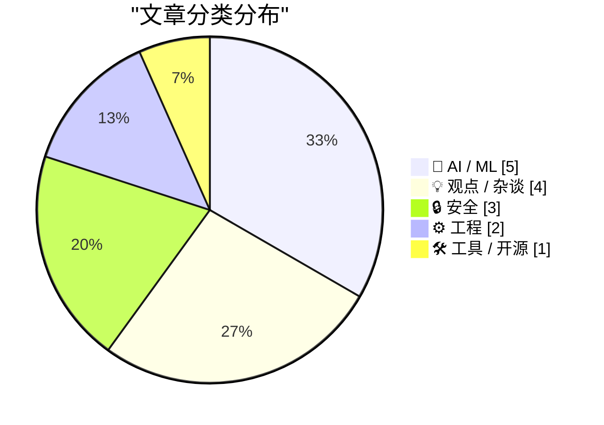
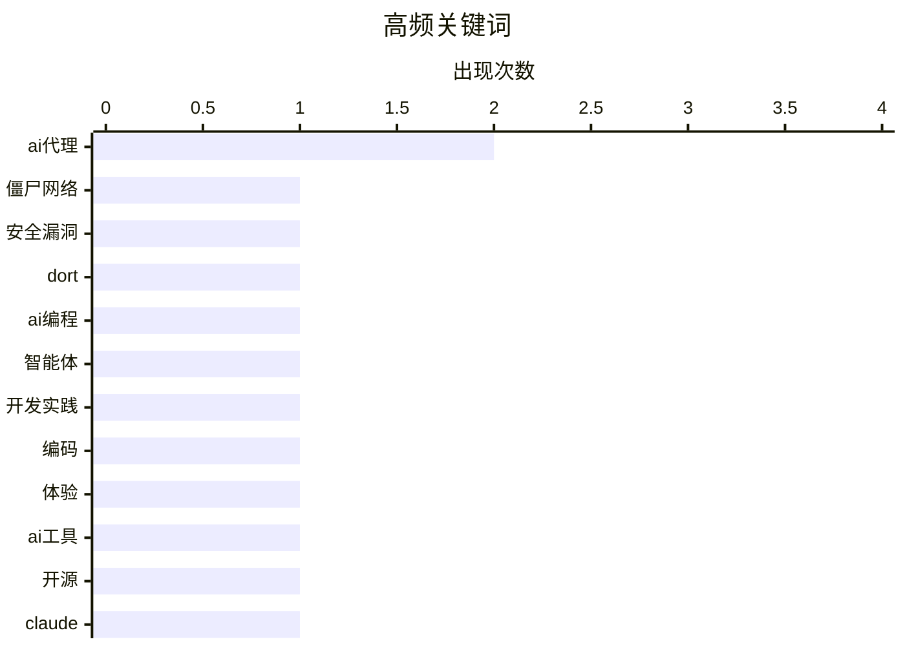

# 📰 AI 博客每日精选 — 2026-03-01

> 来自 Karpathy 推荐的 92 个顶级技术博客，AI 精选 Top 15

## 📝 今日看点

今日技术圈聚焦于两大核心趋势：网络安全威胁与法律挑战持续升级，从僵尸网络追踪到用户数据加密争议凸显隐私保护紧迫性；人工智能实践深入发展，编码代理的能力提升与伦理风险并存，引发对技术边界与责任的广泛讨论。这些动态共同映射出技术创新中的安全与治理关键议题。

---

## 🏆 今日必读

🥇 **谁是金狼僵尸网络主控“多特”？**

[谁是金狼僵尸网络主控“多特”？](https://krebsonsecurity.com/2026/02/who-is-the-kimwolf-botmaster-dort/) — krebsonsecurity.com · 15 小时前 · 🔒 安全

> 文章追踪了全球最大、最具破坏性的僵尸网络金狼背后的控制者“多特”。该文作者因揭露金狼漏洞而遭到“多特”组织的分布式拒绝服务攻击、人肉搜索和邮件轰炸，甚至导致特警队被派往研究员家中。文章深入调查了“多特”的身份、攻击动机及其对网络安全研究人员构成的威胁。核心观点揭示了网络犯罪者如何通过极端手段报复和恐吓安全社区。

💡 **为什么值得读**: 此文揭露了网络安全前沿斗争中真实且危险的个人报复案例，对安全从业者有直接的警示意义。

🏷️ 僵尸网络, 安全漏洞, Dort

🥈 **一位AI编码代理怀疑论者的详尽实践**

[一位AI编码代理怀疑论者的详尽实践](https://minimaxir.com/2026/02/ai-agent-coding/) — minimaxir.com · 1 天前 · 🤖 AI / ML

> 文章记录了作者从怀疑到实践AI编码代理的完整过程。作者进行了一系列逐级递进的实验，从简单的YouTube元数据抓取工具开始，逐步挑战更复杂的项目。通过详尽的细节，文章展示了AI编码代理当前的实际能力、工作流程与局限性。最终结论基于亲身实践，为评估AI编程工具提供了扎实的一手经验。

💡 **为什么值得读**: 通过从简单到复杂的系列实践项目，为读者提供了评估AI编码代理能力的可靠基准和直观感受。

🏷️ AI编程, 智能体, 开发实践

🥉 **一位AI编码代理怀疑论者的详尽实践**

[一位AI编码代理怀疑论者的详尽实践](https://simonwillison.net/2026/Feb/27/ai-agent-coding-in-excessive-detail/#atom-everything) — simonwillison.net · 1 天前 · 🤖 AI / ML

> 此文是对马克斯·伍尔夫同名文章的推荐与引述，属于“编码代理在去年十一月变强了”系列。文章描述了作者进行的一系列雄心渐增的编码代理项目。推荐者认为该文非常值得花费时间阅读，因其提供了深入的技术实践细节。

💡 **为什么值得读**: 由知名技术博主推荐，指向一篇关于AI编码代理实践的高质量深度分析。

🏷️ AI代理, 编码, 体验

---

## 📊 数据概览

| 扫描源 | 抓取文章 | 时间范围 | 精选 |
|:---:|:---:|:---:|:---:|
| 83/92 | 2406 篇 → 34 篇 | 48h | **15 篇** |

### 分类分布



### 高频关键词



<details>
<summary>📈 纯文本关键词图（终端友好）</summary>

```
ai代理 │ ████████████████████ 2
僵尸网络 │ ██████████░░░░░░░░░░ 1
安全漏洞 │ ██████████░░░░░░░░░░ 1
dort │ ██████████░░░░░░░░░░ 1
ai编程 │ ██████████░░░░░░░░░░ 1
智能体  │ ██████████░░░░░░░░░░ 1
开发实践 │ ██████████░░░░░░░░░░ 1
编码   │ ██████████░░░░░░░░░░ 1
体验   │ ██████████░░░░░░░░░░ 1
ai工具 │ ██████████░░░░░░░░░░ 1
```

</details>

### 🏷️ 话题标签

**ai代理**(2) · **僵尸网络**(1) · **安全漏洞**(1) · dort(1) · ai编程(1) · 智能体(1) · 开发实践(1) · 编码(1) · 体验(1) · ai工具(1) · 开源(1) · claude(1) · 工程模式(1) · 认知债务(1) · 密码学(1) · 用户数据(1) · 安全(1) · ai伦理(1) · 国防合作(1) · 用户抵制(1)

---

## 🤖 AI / ML

### 1. 一位AI编码代理怀疑论者的详尽实践

[一位AI编码代理怀疑论者的详尽实践](https://minimaxir.com/2026/02/ai-agent-coding/) — **minimaxir.com** · 1 天前 · ⭐ 28/30

> 文章记录了作者从怀疑到实践AI编码代理的完整过程。作者进行了一系列逐级递进的实验，从简单的YouTube元数据抓取工具开始，逐步挑战更复杂的项目。通过详尽的细节，文章展示了AI编码代理当前的实际能力、工作流程与局限性。最终结论基于亲身实践，为评估AI编程工具提供了扎实的一手经验。

🏷️ AI编程, 智能体, 开发实践

---

### 2. 一位AI编码代理怀疑论者的详尽实践

[一位AI编码代理怀疑论者的详尽实践](https://simonwillison.net/2026/Feb/27/ai-agent-coding-in-excessive-detail/#atom-everything) — **simonwillison.net** · 1 天前 · ⭐ 26/30

> 此文是对马克斯·伍尔夫同名文章的推荐与引述，属于“编码代理在去年十一月变强了”系列。文章描述了作者进行的一系列雄心渐增的编码代理项目。推荐者认为该文非常值得花费时间阅读，因其提供了深入的技术实践细节。

🏷️ AI代理, 编码, 体验

---

### 3. 交互式解释

[交互式解释](https://simonwillison.net/guides/agentic-engineering-patterns/interactive-explanations/#atom-everything) — **simonwillison.net** · 4 小时前 · ⭐ 24/30

> 文章探讨了AI代理工程模式中的一个关键问题：认知债务。当开发者无法理解AI代理所编写代码的工作原理时，就会承担这种债务。作者指出，对于简单的任务这或许无关紧要，但对于复杂逻辑，缺乏理解将带来风险。文章提出了“交互式解释”作为应对这一挑战的模式。

🏷️ AI代理, 工程模式, 认知债务

---

### 4. 就这样，我要取消我的ChatGPT订阅

[就这样，我要取消我的ChatGPT订阅](https://idiallo.com/byte-size/im-cancelling-my-chatgpt-openai-account?src=feed) — **idiallo.com** · 10 小时前 · ⭐ 24/30

> 作者针对山姆·奥特曼关于ChatGPT接入所谓“战争部”机密网络的推文做出反应。文章认为这是大规模监控的开端，并将使该技术被用于武器部署。作者指出，大规模监控的基础设施早已就位，而此举正是其“助推器”。这与Anthropic首席执行官公开拒绝与“战争部”合作的信函形成对比。

🏷️ AI伦理, 国防合作, 用户抵制

---

### 5. 大语言模型在Python源代码中的使用痕迹

[大语言模型在Python源代码中的使用痕迹](https://blog.miguelgrinberg.com/post/llm-use-in-the-python-source-code) — **miguelgrinberg.com** · 12 小时前 · ⭐ 21/30

> 文章探讨了如何在开源项目中识别由大语言模型生成的代码。作者介绍了一种在社交媒体上流传的技巧：在代码托管平台上屏蔽特定用户后，访问包含该用户提交的代码库时，页面顶部会出现提示横幅。作者将此方法应用于Python语言的官方实现代码库，发现了两个由相关人工智能编码助手提交的修改。这表明，即使在Python这样的核心开源项目中，人工智能辅助编码已悄然开始应用。这一现象引发了关于人工智能生成代码对开源项目透明度和代码质量影响的思考。

🏷️ 大型语言模型, GitHub, 代码审查

---

## 💡 观点 / 杂谈

### 6. 西弗吉尼亚州的反苹果儿童性虐待材料诉讼将让儿童 predators 逍遥法外

[西弗吉尼亚州的反苹果儿童性虐待材料诉讼将让儿童 predators 逍遥法外](https://www.techdirt.com/2026/02/25/west-virginias-anti-apple-csam-lawsuit-would-help-child-predators-walk-free/) — **daringfireball.net** · 1 天前 · ⭐ 22/30

> 文章分析了西弗吉尼亚州起诉苹果公司，要求其扫描iCloud以查找儿童性虐待材料可能引发的法律后果。核心论点是，如果法院强制苹果进行扫描，那么所有被标记的图像都将成为无搜查令、无合理理由的政府搜查所获得的证据。根据美国宪法第四修正案的排除规则，辩护律师可以要求法庭排除这些证据并很可能成功。作者迈克·马斯尼克指出，这反而会让真正的罪犯因证据无效而逃脱法律制裁。

🏷️ 隐私, 法律, 苹果

---

### 7. 布洛克公司裁员四千人，占员工总数近半

[布洛克公司裁员四千人，占员工总数近半](https://www.cnbc.com/2026/02/26/block-laying-off-about-4000-employees-nearly-half-of-its-workforce.html) — **daringfireball.net** · 1 天前 · ⭐ 21/30

> 金融科技公司布洛克宣布大规模裁员，计划裁减超过四千名员工。此次裁员规模约占其员工总数的百分之四十，公司总人数将从一万余人缩减至六千人以下。公司联合创始人兼首席执行官杰克·多尔西在致股东信中确认了这一艰难决定。消息公布后，公司股价在盘后交易中一度飙升百分之二十四。这一事件揭示了科技公司在调整结构时，市场往往以短期财务表现作为积极信号。

🏷️ 裁员, 股价, 科技公司

---

### 8. 计算机与互联网：一把双刃剑

[计算机与互联网：一把双刃剑](https://blog.jim-nielsen.com/2026/two-edged-sword-of-computers-and-internet/) — **blog.jim-nielsen.com** · 1 天前 · ⭐ 21/30

> 文章探讨了数字技术对个人生活的复杂影响，核心在于其既是强大工具也是潜在干扰源。作者借戴夫·鲁珀特的观点指出，计算机和互联网可能对个人有害，这一认知令人难以接受，因为工作、爱好乃至社交都已深度依赖网络。技术已从纯粹的赋能工具，演变为一种可能消耗注意力、引发焦虑的“闲手优先”设备。关键在于认识到技术本身并无善恶，而在于人们如何使用它。结论是，我们需要有意识地审视和管理自己与数字世界的关系，而非简单地全盘接受或拒绝。

🏷️ 技术反思, 数字生活, 工具哲学

---

### 9. 加州有能力阻止拉里·埃里森收购华纳公司

[加州有能力阻止拉里·埃里森收购华纳公司](https://pluralistic.net/2026/02/28/golden-mean/) — **pluralistic.net** · 16 小时前 · ⭐ 19/30

> 文章探讨了美国加州如何利用州级权力阻止甲骨文创始人拉里·埃里森收购华纳兄弟探索公司这类大型科技媒体并购案。核心论点是加州可以依据本州更严格的反垄断法与消费者保护法，对交易进行独立审查与干预，这比依赖联邦层面的审查更为直接有效。作者援引了“黄金分割”原则，指出州级行动是制衡科技巨头无限扩张、防止媒体垄断的关键法律工具。结论是，州级监管机构应积极行使权力，成为遏制大型科技公司收购潮的一道坚实防线。

🏷️ 反垄断, 科技监管, 加州法律

---

## 🔒 安全

### 10. 谁是金狼僵尸网络主控“多特”？

[谁是金狼僵尸网络主控“多特”？](https://krebsonsecurity.com/2026/02/who-is-the-kimwolf-botmaster-dort/) — **krebsonsecurity.com** · 15 小时前 · ⭐ 28/30

> 文章追踪了全球最大、最具破坏性的僵尸网络金狼背后的控制者“多特”。该文作者因揭露金狼漏洞而遭到“多特”组织的分布式拒绝服务攻击、人肉搜索和邮件轰炸，甚至导致特警队被派往研究员家中。文章深入调查了“多特”的身份、攻击动机及其对网络安全研究人员构成的威胁。核心观点揭示了网络犯罪者如何通过极端手段报复和恐吓安全社区。

🏷️ 僵尸网络, 安全漏洞, Dort

---

### 11. 求求你们，别再使用通行密钥加密用户数据了

[求求你们，别再使用通行密钥加密用户数据了](https://simonwillison.net/2026/Feb/27/passkeys/#atom-everything) — **simonwillison.net** · 1 天前 · ⭐ 24/30

> 文章强烈反对使用通行密钥加密用户数据。核心论点是用户经常会丢失他们的通行密钥，并且可能无法理解其数据已被不可逆地加密且无法恢复。作者蒂姆·卡帕利恳请身份认证行业停止推广和使用此做法。这主要源于对用户数据永久性丢失风险的担忧。

🏷️ 密码学, 用户数据, 安全

---

### 12. “你多大了？”操作系统问道

[“你多大了？”操作系统问道](https://idiallo.com/byte-size/how-old-are-you-asked-the-os?src=feed) — **idiallo.com** · 2 小时前 · ⭐ 23/30

> 文章讨论了加利福尼亚州在2025年10月通过的一项新法律AB-1043，该法要求操作系统在创建账户时收集用户年龄。作者提出了一系列实践性质疑：法律如何执行？是否适用于离线系统？家庭用户设置树莓派是否受约束？提供错误年龄是否违法？孩子使用设备怎么办？作者认为该法律无法强制执行，但其立法意图可能另有所指。

🏷️ 隐私法规, 年龄验证, 操作系统

---

## ⚙️ 工程

### 13. ★ 一个有时隐藏的设置控制着你在iOS 26电话应用中点击通话时的行为

[★ 一个有时隐藏的设置控制着你在iOS 26电话应用中点击通话时的行为](https://daringfireball.net/2026/02/sometimes_hidden_setting_phone_app) — **daringfireball.net** · 1 天前 · ⭐ 21/30

> 文章批评了苹果在iOS 26电话应用中对“点击最近通话以呼叫”功能设置的交互设计。该设置仅在“统一”视图为当前选项时，才会在设置中显示。作者认为这种根据当前应用状态动态隐藏设置的做法是懒惰的设计，导致了用户的困惑。

🏷️ iOS设置, 用户体验, UI设计

---

### 14. 在对话框消息处理函数内部拦截消息并微调过滤器

[在对话框消息处理函数内部拦截消息并微调过滤器](https://devblogs.microsoft.com/oldnewthing/20260227-00/?p=112094) — **devblogs.microsoft.com/oldnewthing** · 1 天前 · ⭐ 21/30

> 文章探讨了 Windows 编程中使用 IsDialogMessage 函数时，如何精确控制消息拦截和过滤器触发时机以避免误操作。作者分析了 IsDialogMessage 的默认消息处理机制，指出其可能在不必要场景下激活过滤器，导致性能问题或逻辑错误。通过引入自定义消息过滤钩子，动态检查消息类型和对话框状态，实现仅针对特定条件启用拦截。示例代码展示了如何集成过滤函数到消息循环中，设置条件判断逻辑。结论是这种微调能确保消息处理仅在需要时触发，提升应用程序响应性和稳定性。

🏷️ Windows API, 消息处理, 对话框

---

## 🛠 工具 / 开源

### 15. 为大型开源项目维护者免费提供Claude Max

[为大型开源项目维护者免费提供Claude Max](https://simonwillison.net/2026/Feb/27/claude-max-oss-six-months/#atom-everything) — **simonwillison.net** · 1 天前 · ⭐ 25/30

> Anthropic公司宣布为符合条件的开源维护者免费提供价值每月200美元的Claude Max 20x计划，为期六个月。申请者需是拥有5000以上GitHub星标或月下载量超过100万的公共代码库的主要维护者或核心团队成员。此举旨在支持大型开源项目的发展。

🏷️ AI工具, 开源, Claude

---

*生成于 2026-03-01 03:47 | 扫描 83 源 → 获取 2406 篇 → 精选 15 篇*
*基于 [Hacker News Popularity Contest 2025](https://refactoringenglish.com/tools/hn-popularity/) RSS 源列表，由 [Andrej Karpathy](https://x.com/karpathy) 推荐*
