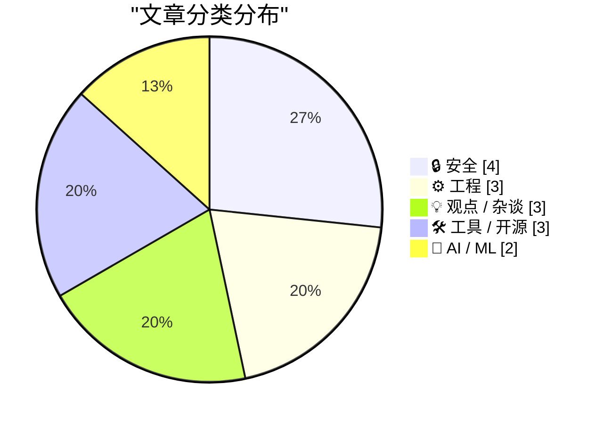
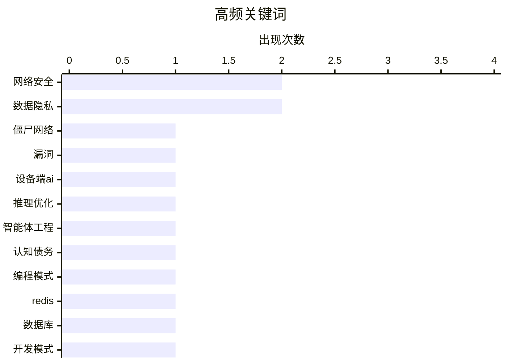

# 📰 AI 博客每日精选 — 2026-03-02

> 来自 Karpathy 推荐的 92 个顶级技术博客，AI 精选 Top 15

## 📝 今日看点

今日技术圈看点聚焦于网络安全与人工智能两大核心趋势。黑客攻击事件持续发酵，揭示出技术安全与政治动机的复杂交织。人工智能发展面临设备端瓶颈和工程可维护性挑战，同时伦理争议日益凸显。开发者生态正朝着灵活多能的个体主导方向演变，预示技术普及的新阶段。

---

## 🏆 今日必读

🥇 **金沃尔夫僵尸网络掌控者‘多特’究竟是谁？**

[金沃尔夫僵尸网络掌控者‘多特’究竟是谁？](https://krebsonsecurity.com/2026/02/who-is-the-kimwolf-botmaster-dort/) — krebsonsecurity.com · 1 天前 · 🔒 安全

> 文章深入调查了全球最大破坏性僵尸网络‘金沃尔夫’背后控制者‘多特’的身份与行为。自该僵尸网络的漏洞被安全研究员披露后，‘多特’对研究员和本文作者发起了一系列分布式拒绝服务攻击、人肉搜索和邮件洪水攻击，近期甚至策划了对研究员家庭的特警队突袭。文章通过分析线索，试图揭示这名恶意行为者的真实身份和动机。核心观点是，这种针对安全研究人员的升级报复行为，凸显了网络犯罪领域的极端威胁。

💡 **为什么值得读**: 本文揭露了顶级网络犯罪分子的嚣张行径及其对安全生态的直接威胁，具有强烈的警示意义。

🏷️ 僵尸网络, 网络安全, 漏洞

🥈 **为何设备端智能体人工智能难以跟上发展步伐**

[为何设备端智能体人工智能难以跟上发展步伐](https://martinalderson.com/posts/why-on-device-agentic-ai-cant-keep-up/?utm_source=rss) — martinalderson.com · 1 天前 · 🤖 AI / ML

> 文章核心探讨了设备端智能体人工智能在理论上可行，但在实践中面临的根本性技术瓶颈。关键论点在于，从键值缓存扩展、内存预算和推理速度的数学计算来看，本地设备的计算与存储资源严重限制了智能体模型的复杂性和响应能力。这使得设备端智能体在性能上无法与云端方案竞争，难以处理需要大量上下文或复杂推理的任务。结论是，受限于硬件，设备端智能体人工智能目前难以实现其理论承诺。

💡 **为什么值得读**: 文章从底层数学原理切入，清晰驳斥了关于设备端智能体的常见技术误解，观点硬核且具有说服力。

🏷️ 设备端AI, 推理优化

🥉 **交互式解释：化解智能体工程中的认知债务**

[交互式解释：化解智能体工程中的认知债务](https://simonwillison.net/guides/agentic-engineering-patterns/interactive-explanations/#atom-everything) — simonwillison.net · 1 天前 · 🤖 AI / ML

> 主题聚焦于智能体工程中因代码可理解性缺失而产生的‘认知债务’问题。当智能体生成的代码逻辑变得难以追踪时，开发者将承担巨大的维护和理解成本。文章提出‘交互式解释’作为一种工程模式，通过让智能体对其生成的代码提供动态、可查询的解释，来直接化解这种债务。这种模式对于复杂或关键的代码逻辑尤为重要，能确保开发者始终掌握系统的工作原理。作者认为，主动管理认知债务是构建可靠智能体系统的关键。

💡 **为什么值得读**: 该模式为解决人工智能生成代码的可维护性这一核心痛点提供了具体且可操作的思路。

🏷️ 智能体工程, 认知债务, 编程模式

---

## 📊 数据概览

| 扫描源 | 抓取文章 | 时间范围 | 精选 |
|:---:|:---:|:---:|:---:|
| 84/92 | 2420 篇 → 26 篇 | 48h | **15 篇** |

### 分类分布



### 高频关键词



<details>
<summary>📈 纯文本关键词图（终端友好）</summary>

```
网络安全  │ ████████████████████ 2
数据隐私  │ ████████████████████ 2
僵尸网络  │ ██████████░░░░░░░░░░ 1
漏洞    │ ██████████░░░░░░░░░░ 1
设备端ai │ ██████████░░░░░░░░░░ 1
推理优化  │ ██████████░░░░░░░░░░ 1
智能体工程 │ ██████████░░░░░░░░░░ 1
认知债务  │ ██████████░░░░░░░░░░ 1
编程模式  │ ██████████░░░░░░░░░░ 1
redis │ ██████████░░░░░░░░░░ 1
```

</details>

### 🏷️ 话题标签

**网络安全**(2) · **数据隐私**(2) · **僵尸网络**(1) · 漏洞(1) · 设备端ai(1) · 推理优化(1) · 智能体工程(1) · 认知债务(1) · 编程模式(1) · redis(1) · 数据库(1) · 开发模式(1) · 数据泄露(1) · llm时代(1) · 专家初学者(1) · 技术文化(1) · 法规合规(1) · 操作系统(1) · 算法(1) · 数学(1)

---

## 🔒 安全

### 1. 金沃尔夫僵尸网络掌控者‘多特’究竟是谁？

[金沃尔夫僵尸网络掌控者‘多特’究竟是谁？](https://krebsonsecurity.com/2026/02/who-is-the-kimwolf-botmaster-dort/) — **krebsonsecurity.com** · 1 天前 · ⭐ 27/30

> 文章深入调查了全球最大破坏性僵尸网络‘金沃尔夫’背后控制者‘多特’的身份与行为。自该僵尸网络的漏洞被安全研究员披露后，‘多特’对研究员和本文作者发起了一系列分布式拒绝服务攻击、人肉搜索和邮件洪水攻击，近期甚至策划了对研究员家庭的特警队突袭。文章通过分析线索，试图揭示这名恶意行为者的真实身份和动机。核心观点是，这种针对安全研究人员的升级报复行为，凸显了网络犯罪领域的极端威胁。

🏷️ 僵尸网络, 网络安全, 漏洞

---

### 2. “为何入侵国土安全部？我有几个相当好的理由！”

[“为何入侵国土安全部？我有几个相当好的理由！”](https://micahflee.com/why-hack-the-dhs-i-can-think-of-a-couple-pretti-good-reasons/) — **micahflee.com** · 6 小时前 · ⭐ 23/30

> 文章报道了黑客组织‘和平部’入侵美国国土安全部行业合作办公室并泄露移民海关执法合同数据的事件。核心内容是分析黑客组织在其声明中给出的攻击理由，即抗议国土安全部及其下属机构的杀伤性行为。作者通过引用黑客的声明‘国土安全部正在杀人’，将此次数据泄露置于政治抗议的语境下进行审视。事件揭示了黑客行动主义如何将数据泄露作为对抗政府机构的一种手段。

🏷️ 网络安全, 数据泄露

---

### 3. “你多大了？”操作系统发问道

[“你多大了？”操作系统发问道](https://idiallo.com/byte-size/how-old-are-you-asked-the-os?src=feed) — **idiallo.com** · 1 天前 · ⭐ 22/30

> 文章讨论了加州于2025年10月通过的要求操作系统在账户创建时收集用户年龄的新法律。核心问题是分析这项代号为‘第1043号议会法案’的法律在技术层面的可行性与现实矛盾。作者提出一系列具体质疑：法律如何适用于家庭离线设备如树莓派？提供错误年龄是否违法？儿童使用已正确设置的家庭设备如何处理？文章最终指出，该法律在技术上无法强制执行，但其立法意图可能不在于实际执行，而在于树立规范或传递信号。

🏷️ 数据隐私, 法规合规, 操作系统

---

### 4. Node包管理器数据主体访问请求响应

[Node包管理器数据主体访问请求响应](https://nesbitt.io/2026/02/28/npm-data-subject-access-request.html) — **nesbitt.io** · 1 天前 · ⭐ 20/30

> 作者向Node包管理器提交通用数据保护条例数据主体访问请求，以获取个人数据。Node包管理器在30天内回应，提供用户资料、包元数据和活动日志等数据。回应显示平台收集登录时间戳、包版本发布记录和依赖关系信息。数据以JavaScript对象表示法格式提供，但部分字段缺乏结构化解释。作者认为响应符合法规要求，但数据呈现方式有待优化。

🏷️ 数据隐私, GDPR

---

## ⚙️ 工程

### 5. 面向编程的雷迪斯模式文档

[面向编程的雷迪斯模式文档](http://antirez.com/news/161) — **antirez.com** · 17 小时前 · ⭐ 24/30

> 文章核心是介绍一份专门为大型语言模型和编程智能体编写的雷迪斯使用指南。该文档详尽涵盖了雷迪斯命令、数据类型、常用模式、配置提示以及可用雷迪斯命令组合实现的算法。作者指出，这份文档虽然旨在辅助人工智能进行编码，但对人类开发者同样极具实用价值。其目的是系统化地展示雷迪斯在解决各类编程问题时的最佳实践和模式。

🏷️ Redis, 数据库, 开发模式

---

### 6. 拉格朗日插值多项式笔记

[拉格朗日插值多项式笔记](https://eli.thegreenplace.net/2026/notes-on-lagrange-interpolating-polynomials/) — **eli.thegreenplace.net** · 1 天前 · ⭐ 22/30

> 这是一篇关于多项式插值方法中拉格朗日插值多项式的技术笔记。文章首先明确了多项式插值的定义：寻找一个恰好通过给定一组数据点的多项式函数。接着，它详细推导并解释了拉格朗日插值多项式的标准形式及其构造方法。笔记可能涉及该方法的数学原理、公式推导以及其特性。其目的是为读者提供关于拉格朗日插值法的清晰、系统的理解和参考。

🏷️ 算法, 数学

---

### 7. 两种错误

[两种错误](https://evanhahn.com/the-two-kinds-of-error/) — **evanhahn.com** · 1 天前 · ⭐ 21/30

> 文章核心是将程序错误明确划分为‘预期错误’与‘意外错误’两类。‘预期错误’是正常操作的一部分，如用户输入无效数据，并非开发者过错，应当被妥善处理。‘意外错误’则是开发者的过错，如空指针异常，通常意味着存在程序缺陷，应当允许其崩溃以便暴露问题。作者强调，清晰区分这两类错误是改善错误处理和用户体验的关键。正确的分类有助于开发者制定更合理的错误处理策略。

🏷️ 错误处理, 软件开发

---

## 💡 观点 / 杂谈

### 8. 专家初学者与独狼将主导早期大型语言模型时代

[专家初学者与独狼将主导早期大型语言模型时代](https://www.jeffgeerling.com/blog/2026/expert-beginners-and-lone-wolves-dominate-llm-era/) — **jeffgeerling.com** · 5 小时前 · ⭐ 22/30

> 文章预言在大型语言模型技术发展的早期阶段，‘专家初学者’和‘独狼’型开发者将占据主导地位。‘专家初学者’指那些知识面广但深度不足、善于快速利用新工具解决问题的人；‘独狼’则指能独立完成端到端项目的全能型开发者。大型语言模型极大地降低了广泛领域知识的获取门槛并提升了个人生产力，恰好放大了这两类人的优势。相反，传统意义上在狭窄领域精耕细作的专家，其相对优势在此阶段可能被削弱。

🏷️ LLM时代, 专家初学者, 技术文化

---

### 9. 就这样，我注销了我的查特吉皮提账户

[就这样，我注销了我的查特吉皮提账户](https://idiallo.com/byte-size/im-cancelling-my-chatgpt-openai-account?src=feed) — **idiallo.com** · 1 天前 · ⭐ 21/30

> 文章阐述了作者在得知萨姆·奥尔特曼宣布查特吉皮提将接入美国战争部机密网络后，决定注销其账户的理由。作者认为，此举是大型语言模型技术被用于大规模监控和武器部署的‘助推器’。他将此与安斯罗皮克公司首席执行官公开拒绝与战争部合作的决定进行对比，批判了奥本爱公司的选择。核心观点是，技术公司与军事部门的深度合作越过了道德红线，将加速监控与军事化应用，因此作者用个人行动表示抗议。

🏷️ AI伦理, ChatGPT, 技术政策

---

### 10. 脱口秀第442期：产品发布前的期待与担忧

[脱口秀第442期：产品发布前的期待与担忧](https://daringfireball.net/thetalkshow/2026/02/28/ep-442) — **daringfireball.net** · 11 小时前 · ⭐ 19/30

> 本期节目邀请科技评论员杰森·斯内尔回归，围绕苹果公司近期的软件更新与即将到来的硬件发布展开深度讨论。核心议题包括对《六色》网站发布的2025年苹果年度报告卡进行解读，分析MacOS 26太浩湖系统的新特性与苹果创作者工作室工具的现状。谈话重点聚焦于对下周苹果新品发布会的预测与期待，涵盖了可能亮相的硬件产品及其市场策略。整体讨论为听众提供了苹果生态在软件服务与硬件路线图方面的关键洞察与前瞻性分析。

🏷️ 苹果生态, 产品发布, 技术播客

---

## 🛠 工具 / 开源

### 11. Python 源代码中大语言模型的使用

[Python 源代码中大语言模型的使用](https://blog.miguelgrinberg.com/post/llm-use-in-the-python-source-code) — **miguelgrinberg.com** · 1 天前 · ⭐ 21/30

> 检测开源项目中大语言模型生成代码的简单方法是屏蔽代码托管平台上的特定用户。屏蔽用户克劳德后，访问包含其提交的仓库时，平台会显示提示横幅，从而暴露项目对克劳德代码等编码代理的依赖。作者以 Python 官方实现为例，展示该技巧如何识别人工智能生成的代码贡献。这种社交工程方法能有效揭示 AI 工具在软件开发中的渗透，提醒开发者关注代码质量与维护风险。

🏷️ LLM, 编程技巧

---

### 12. 外壳变量~-

[外壳变量~-](https://www.johndcook.com/blog/2026/03/01/tilde-dash/) — **johndcook.com** · 9 小时前 · ⭐ 19/30

> 波浪线减号（~-）是外壳程序中一个快捷方式变量，用于快速引用上一个工作目录。它是环境变量“上一个工作目录”的简写形式，比常用的返回上一个目录命令更灵活。作者在查阅外壳文档时偶然发现此功能，之前仅知使用返回命令而不知变量快捷方式。掌握~-可以在命令行中直接嵌入路径，简化导航操作。这一技巧能有效提升终端使用效率。

🏷️ bash, shell变量

---

### 13. 在命令行脚本中处理文件扩展名

[在命令行脚本中处理文件扩展名](https://www.johndcook.com/blog/2026/02/28/file-extensions-bash/) — **johndcook.com** · 1 天前 · ⭐ 19/30

> 文章探讨在命令行脚本中高效处理文件扩展名的实用技巧。作者比较了使用通用编程语言与命令行脚本的优劣，指出命令行脚本能以更简洁的语法解决常见问题。具体介绍了利用参数扩展等内置功能提取或修改文件扩展名的方法。这些技巧虽然看似晦涩，但能显著简化文件系统任务。因此，掌握命令行脚本中的文件扩展名处理技巧，对于提升日常工作效率很有价值。

🏷️ bash脚本, 文件处理

---

## 🤖 AI / ML

### 14. 为何设备端智能体人工智能难以跟上发展步伐

[为何设备端智能体人工智能难以跟上发展步伐](https://martinalderson.com/posts/why-on-device-agentic-ai-cant-keep-up/?utm_source=rss) — **martinalderson.com** · 1 天前 · ⭐ 26/30

> 文章核心探讨了设备端智能体人工智能在理论上可行，但在实践中面临的根本性技术瓶颈。关键论点在于，从键值缓存扩展、内存预算和推理速度的数学计算来看，本地设备的计算与存储资源严重限制了智能体模型的复杂性和响应能力。这使得设备端智能体在性能上无法与云端方案竞争，难以处理需要大量上下文或复杂推理的任务。结论是，受限于硬件，设备端智能体人工智能目前难以实现其理论承诺。

🏷️ 设备端AI, 推理优化

---

### 15. 交互式解释：化解智能体工程中的认知债务

[交互式解释：化解智能体工程中的认知债务](https://simonwillison.net/guides/agentic-engineering-patterns/interactive-explanations/#atom-everything) — **simonwillison.net** · 1 天前 · ⭐ 25/30

> 主题聚焦于智能体工程中因代码可理解性缺失而产生的‘认知债务’问题。当智能体生成的代码逻辑变得难以追踪时，开发者将承担巨大的维护和理解成本。文章提出‘交互式解释’作为一种工程模式，通过让智能体对其生成的代码提供动态、可查询的解释，来直接化解这种债务。这种模式对于复杂或关键的代码逻辑尤为重要，能确保开发者始终掌握系统的工作原理。作者认为，主动管理认知债务是构建可靠智能体系统的关键。

🏷️ 智能体工程, 认知债务, 编程模式

---

*生成于 2026-03-02 03:40 | 扫描 84 源 → 获取 2420 篇 → 精选 15 篇*
*基于 [Hacker News Popularity Contest 2025](https://refactoringenglish.com/tools/hn-popularity/) RSS 源列表，由 [Andrej Karpathy](https://x.com/karpathy) 推荐*
