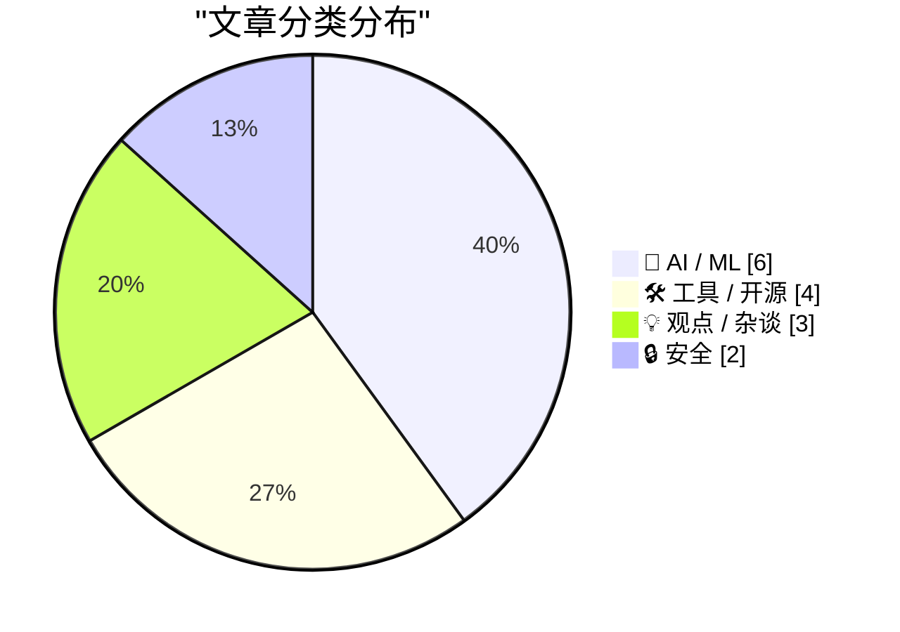
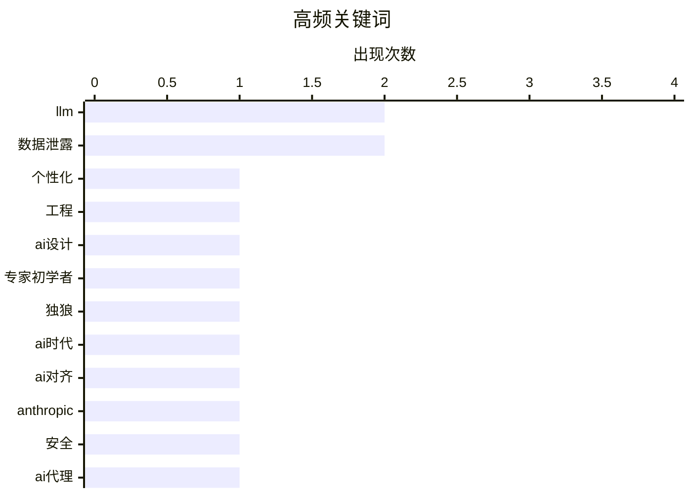

# 📰 AI 博客每日精选 — 2026-03-03

> 来自 Karpathy 推荐的 92 个顶级技术博客，AI 精选 Top 15

## 📝 今日看点

今日技术圈聚焦人工智能的深层演进与工具生态创新。大语言模型的人格化设计和对齐困境成为热议焦点，同时其生成内容的滥用问题引发广泛批评。另一方面，智能代理工具和硬件升级正推动开发者效率提升，而安全事件则警示数据保护的重要性。

---

## 🏆 今日必读

🥇 **赋予大语言模型人格是优秀的工程实践**

[赋予大语言模型人格是优秀的工程实践](https://seangoedecke.com/giving-llms-a-personality/) — seangoedecke.com · 3 小时前 · 🤖 AI / ML

> 文章探讨了是否应赋予大语言模型拟人化人格的争议。反对者认为模型应保持工具属性，以避免用户高估其能力或产生不当依赖。作者反驳了这一观点，指出精心设计的人格化能显著提升用户体验、指令遵循的准确性与输出的一致性。结论是，人格化并非伦理陷阱，而是提升模型实用性和安全性的有效工程手段。

💡 **为什么值得读**: 文章从工程实践角度，为当前AI人格化的争议提供了清晰的技术辩护和实用价值分析。

🏷️ LLM, 个性化, 工程, AI设计

🥈 **专家型新手与独狼将主导早期大语言模型时代**

[专家型新手与独狼将主导早期大语言模型时代](https://www.jeffgeerling.com/blog/2026/expert-beginners-and-lone-wolves-dominate-llm-era/) — jeffgeerling.com · 1 天前 · 💡 观点 / 杂谈

> 本文预测了当前大语言模型技术扩散期的赢家特征。作者指出，传统的资深专家可能因思维固化而落后。能够快速学习并整合LLM新能力的“专家型新手”将占据优势。同时，擅长独立利用这些工具完成端到端项目的“独狼”型开发者也将脱颖而出。这标志着一个技术实践能力重于传统资历的新阶段。

💡 **为什么值得读**: 它对技术变革中个人竞争力的重塑进行了敏锐洞察，为开发者的职业发展提供了方向性参考。

🏷️ LLM, 专家初学者, 独狼, AI时代

🥉 **Anthropic公司与AI对齐困境**

[Anthropic公司与AI对齐困境](https://stratechery.com/2026/anthropic-and-alignment/) — daringfireball.net · 9 小时前 · 🤖 AI / ML

> 文章分析了Anthropic公司因拒绝五角大楼的全面使用要求而引发的冲突。核心矛盾在于私营AI公司试图为强大技术设定使用“护栏”与国家力量之间的根本冲突。作者引用核武器的类比，指出国际规则最终由实力决定。当私营公司掌控堪比核武器的AI能力时，主权国家必然寻求控制或压制。这揭示了AI治理中商业伦理与国家安全的深层张力。

💡 **为什么值得读**: 文章以地缘政治视角剖析AI伦理，将技术公司的困境置于国际权力结构的框架下，视角宏大。

🏷️ AI对齐, Anthropic, 安全

---

## 📊 数据概览

| 扫描源 | 抓取文章 | 时间范围 | 精选 |
|:---:|:---:|:---:|:---:|
| 83/92 | 2410 篇 → 35 篇 | 48h | **15 篇** |

### 分类分布



### 高频关键词



<details>
<summary>📈 纯文本关键词图（终端友好）</summary>

```
llm       │ ████████████████████ 2
数据泄露      │ ████████████████████ 2
个性化       │ ██████████░░░░░░░░░░ 1
工程        │ ██████████░░░░░░░░░░ 1
ai设计      │ ██████████░░░░░░░░░░ 1
专家初学者     │ ██████████░░░░░░░░░░ 1
独狼        │ ██████████░░░░░░░░░░ 1
ai时代      │ ██████████░░░░░░░░░░ 1
ai对齐      │ ██████████░░░░░░░░░░ 1
anthropic │ ██████████░░░░░░░░░░ 1
```

</details>

### 🏷️ 话题标签

**llm**(2) · **数据泄露**(2) · **个性化**(1) · 工程(1) · ai设计(1) · 专家初学者(1) · 独狼(1) · ai时代(1) · ai对齐(1) · anthropic(1) · 安全(1) · ai代理(1) · 身份验证(1) · 代码生成(1) · 开发工具(1) · ai生成(1) · 内容质量(1) · 行业观点(1) · 安全周报(1) · 事件响应(1)

---

## 🤖 AI / ML

### 1. 赋予大语言模型人格是优秀的工程实践

[赋予大语言模型人格是优秀的工程实践](https://seangoedecke.com/giving-llms-a-personality/) — **seangoedecke.com** · 3 小时前 · ⭐ 26/30

> 文章探讨了是否应赋予大语言模型拟人化人格的争议。反对者认为模型应保持工具属性，以避免用户高估其能力或产生不当依赖。作者反驳了这一观点，指出精心设计的人格化能显著提升用户体验、指令遵循的准确性与输出的一致性。结论是，人格化并非伦理陷阱，而是提升模型实用性和安全性的有效工程手段。

🏷️ LLM, 个性化, 工程, AI设计

---

### 2. Anthropic公司与AI对齐困境

[Anthropic公司与AI对齐困境](https://stratechery.com/2026/anthropic-and-alignment/) — **daringfireball.net** · 9 小时前 · ⭐ 25/30

> 文章分析了Anthropic公司因拒绝五角大楼的全面使用要求而引发的冲突。核心矛盾在于私营AI公司试图为强大技术设定使用“护栏”与国家力量之间的根本冲突。作者引用核武器的类比，指出国际规则最终由实力决定。当私营公司掌控堪比核武器的AI能力时，主权国家必然寻求控制或压制。这揭示了AI治理中商业伦理与国家安全的深层张力。

🏷️ AI对齐, Anthropic, 安全

---

### 3. 无人想读你的AI生成废话

[无人想读你的AI生成废话](https://pluralistic.net/2026/03/02/nonconsensual-slopping/) — **pluralistic.net** · 18 小时前 · ⭐ 24/30

> 文章猛烈抨击了在公共交流中滥用AI生成内容的现象。作者指出，大量低质、同质化的AI“废话”正在污染信息环境。这种非自愿的“信息投喂”侵犯了读者的注意力与选择权。核心观点是，如果非要使用AI生成内容，也应限于私人领域。公开场合应保持人类创作的真实性与价值密度，尊重信息接收者。

🏷️ AI生成, 内容质量, 行业观点

---

### 4. 华尔街日报：特朗普政府冷落Anthropic，在监管冲突中拥抱OpenAI

[华尔街日报：特朗普政府冷落Anthropic，在监管冲突中拥抱OpenAI](https://www.wsj.com/tech/ai/trump-will-end-government-use-of-anthropics-ai-models-ff3550d9) — **daringfireball.net** · 9 小时前 · ⭐ 22/30

> 报道披露了美国特朗普政府在与Anthropic公司的AI使用谈判破裂后转向OpenAI的内幕。冲突焦点在于五角大楼要求Anthropic同意其模型可用于所有合法用途，包括国内大规模监控和自主武器，这触及了Anthropic的伦理红线。公司首席执行官达里奥·阿莫迪以良知为由拒绝，导致合作终止。此举迫使美国政府寻求与限制更少的OpenAI合作，凸显了AI商业伦理与国家安全需求之间的尖锐矛盾。

🏷️ AI政策, 特朗普政府, OpenAI

---

### 5. 人工智能奥德赛，第一部分：正确性难题

[人工智能奥德赛，第一部分：正确性难题](https://www.johndcook.com/blog/2026/03/02/an-ai-odyssey-part-1-correctness-conundrum/) — **johndcook.com** · 1 小时前 · ⭐ 21/30

> 文章探讨了代理式人工智能系统在专业金融管理等关键任务中，其产出正确性无法得到保证的核心矛盾。作者通过与业内人士的交流指出，尽管这类工具能显著提升工作效率，但它们本质上不确保结果正确。因此，若将其用于管理关键资产，将伴随巨大风险。作者的核心结论是，使用者必须对此保持高度警惕，并实施严格的人类监督。

🏷️ AI应用, 金融, 正确性

---

### 6. 克劳德人工智能导入记忆功能解析

[克劳德人工智能导入记忆功能解析](https://simonwillison.net/2026/Mar/1/claude-import-memory/#atom-everything) — **simonwillison.net** · 1 天前 · ⭐ 20/30

> 文章探讨了人工智能助手克劳德如何响应用户导出记忆数据的请求。用户可通过发送特定指令，要求克劳德以代码块形式列出所有存储的记忆和上下文，每个条目包含保存日期和记忆内容，并逐字保留用户指令。该功能实现了数据可移植性，支持用户迁移到其他服务。作者通过实际示例展示了克劳德的记忆管理机制，并指出人工智能记忆导出是用户数据主权的重要体现。

🏷️ AI助手, 数据导出, 隐私

---

## 🛠 工具 / 开源

### 7. npx workos：一个能将身份验证代码直接写入你代码库的AI智能体

[npx workos：一个能将身份验证代码直接写入你代码库的AI智能体](https://workos.com/docs/authkit/cli-installer?utm_source=tldrdev&amp;utm_medium=newsletter&amp;utm_campaign=q12026) — **daringfireball.net** · 3 小时前 · ⭐ 24/30

> 介绍了一款由Claude驱动的AI智能体工具npx workos。该工具能直接读取用户项目代码，自动检测技术栈框架。其核心功能是理解上下文后，将完整的身份验证集成代码直接写入现有代码库。它并非简单的模板生成器，而是包含自动类型检查、构建和错误反馈修复的智能编码流程。这代表了一种高度集成和自动化的开发辅助新范式。

🏷️ AI代理, 身份验证, 代码生成, 开发工具

---

### 8. 苹果发布搭载M4芯片的新款iPad Air

[苹果发布搭载M4芯片的新款iPad Air](https://www.apple.com/newsroom/2026/03/apple-introduces-the-new-ipad-air-powered-by-m4/) — **daringfireball.net** · 10 小时前 · ⭐ 23/30

> 苹果公司发布了搭载M4芯片的新款iPad Air。新款在起售价不变的情况下，性能大幅提升。其CPU和GPU更快，神经引擎增强，统一内存带宽更高，内存容量比前代增加50%。相比搭载M3芯片的iPad Air，性能提升最高达30%；相比搭载M1芯片的型号，性能提升最高达2.3倍。这标志着iPad Air产品线在AI计算和综合性能上的一次显著飞跃。

🏷️ iPad Air, M4芯片, 苹果发布

---

### 9. 使用WebAssembly和Gifsicle的GIF优化工具

[使用WebAssembly和Gifsicle的GIF优化工具](https://simonwillison.net/guides/agentic-engineering-patterns/gif-optimization/#atom-everything) — **simonwillison.net** · 11 小时前 · ⭐ 22/30

> 文章介绍了一种优化网站中演示用GIF动图文件大小的技术方案。作者常用LICEcap录制GIF，但文件体积较大。他尝试了多种优化工具后，找到了一种高效方法。该方案结合WebAssembly技术，将命令行工具Gifsicle移植到浏览器环境中运行。这使得用户可以直接在网页端完成GIF的压缩优化，无需依赖本地安装或上传服务器。

🏷️ GIF优化, WebAssembly, 工具

---

### 10. Sentry：iOS应用崩溃报告、追踪与日志实践研讨会

[Sentry：iOS应用崩溃报告、追踪与日志实践研讨会](https://sentry.io/resources/ios-workshop-jan-2026/?utm_source=daringfireball&amp;utm_medium=paid-display&amp;utm_campaign=general-fy27q1-evergreen&amp;utm_content=static-ad-mobilerss-trysentry) — **daringfireball.net** · 1 天前 · ⭐ 22/30

> 这是一则关于Sentry公司举办的iOS开发技术研讨会的推广信息。研讨会主题聚焦于iOS应用中的崩溃报告、性能追踪与日志管理实践。内容旨在教导开发者如何利用Sentry平台关联应用崩溃、性能瓶颈与用户体验问题。具体包括设置高效告警、使用日志和面包屑溯源崩溃原因，以及定位性能瓶颈。该活动以在线点播形式提供。

🏷️ Sentry, iOS崩溃报告, 性能监控

---

## 💡 观点 / 杂谈

### 11. 专家型新手与独狼将主导早期大语言模型时代

[专家型新手与独狼将主导早期大语言模型时代](https://www.jeffgeerling.com/blog/2026/expert-beginners-and-lone-wolves-dominate-llm-era/) — **jeffgeerling.com** · 1 天前 · ⭐ 25/30

> 本文预测了当前大语言模型技术扩散期的赢家特征。作者指出，传统的资深专家可能因思维固化而落后。能够快速学习并整合LLM新能力的“专家型新手”将占据优势。同时，擅长独立利用这些工具完成端到端项目的“独狼”型开发者也将脱颖而出。这标志着一个技术实践能力重于传统资历的新阶段。

🏷️ LLM, 专家初学者, 独狼, AI时代

---

### 12. 塞尔帕皮提交动议要求驳回谷歌诉讼

[塞尔帕皮提交动议要求驳回谷歌诉讼](https://serpapi.com/blog/google-v-serpapi-motion-to-dismiss-why-were-in-the-right/) — **daringfireball.net** · 7 小时前 · ⭐ 21/30

> 谷歌起诉数据服务商塞尔帕皮，塞尔帕皮提出动议寻求驳回诉讼。塞尔帕皮首席执行官朱利安·卡莱吉指出，谷歌的诉讼隐含声称拥有互联网所有权，但法律明确规定无人拥有互联网。公司承诺保护其商业模式，为依赖其技术的研究人员和创新者提供数据访问支持。2026年2月20日，塞尔帕皮正式提交动议，标志着法律反击进入新阶段。此案核心争议在于互联网数据的所有权与公共访问权的法律界限。

🏷️ 法律诉讼, 谷歌, 互联网所有权

---

### 13. 脱口秀：'糟糕的发布日期'

[脱口秀：'糟糕的发布日期'](https://daringfireball.net/thetalkshow/2026/02/28/ep-442) — **daringfireball.net** · 1 天前 · ⭐ 21/30

> 本期节目邀请科技评论员杰森·斯内尔回归，共同探讨苹果公司近期的动态与未来展望。核心内容包括对《六色》网站发布的2025年度苹果报告卡进行解读与评分，并深入讨论了新操作系统麦克欧埃斯二十六塔霍版本的特性。谈话还涉及苹果为内容创作者推出的“创作者工作室”新服务，并预测了即将于下周发布的苹果新产品。整体而言，节目提供了对苹果生态当前发展与未来方向的深度分析和前瞻性预测。

🏷️ 苹果播客, 行业讨论, 产品评测

---

## 🔒 安全

### 14. 每周安全更新493期

[每周安全更新493期](https://www.troyhunt.com/weekly-update-493/) — **troyhunt.com** · 19 小时前 · ⭐ 24/30

> 本期周报聚焦于Odido数据泄露事件。报告指出，泄露数据在本周初开始出现，并在短时间内经历了多次数据倾倒。作者在第二次数据倾倒后录制了更新，随后又发生了第三次及最终的全部数据倾倒。内容基于事件进展的实时追踪与分析，提供了关于该重大数据泄露事件时间线与影响的初步信息。

🏷️ 数据泄露, 安全周报, 事件响应

---

### 15. 为什么要黑掉国土安全部？我能想到几个相当好的理由！

[为什么要黑掉国土安全部？我能想到几个相当好的理由！](https://micahflee.com/why-hack-the-dhs-i-can-think-of-a-couple-pretti-good-reasons/) — **micahflee.com** · 1 天前 · ⭐ 22/30

> 黑客组织'和平部'攻击美国国土安全部，泄露其行业合作办公室的移民和海关执法局合同数据。该组织声明攻击动机是揭露国土安全部的不当行为，例如涉嫌杀戮等非法活动。数据泄露秘密平台公开了这些文件，供公众审查和问责。作者支持这一行动，认为它暴露了政府机构的隐秘操作，促进透明度和监督。

🏷️ 网络安全, 数据泄露, 黑客

---

*生成于 2026-03-03 03:42 | 扫描 83 源 → 获取 2410 篇 → 精选 15 篇*
*基于 [Hacker News Popularity Contest 2025](https://refactoringenglish.com/tools/hn-popularity/) RSS 源列表，由 [Andrej Karpathy](https://x.com/karpathy) 推荐*
