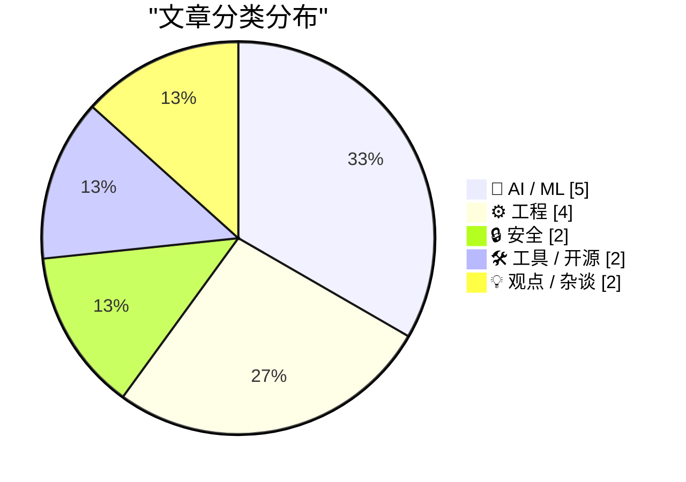
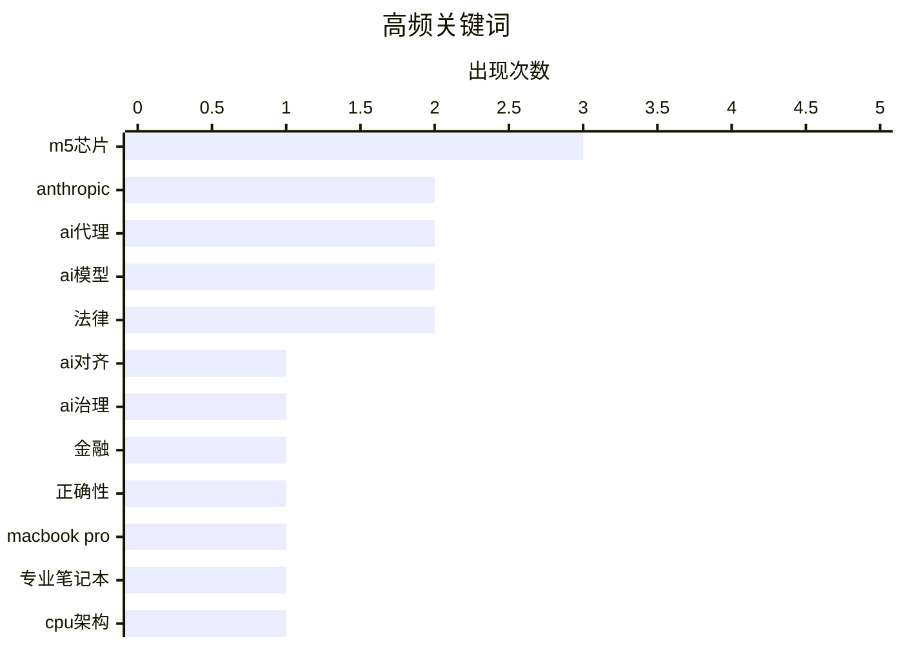

# 📰 AI 博客每日精选 — 2026-03-04

> 来自 Karpathy 推荐的 92 个顶级技术博客，AI 精选 Top 15

## 📝 今日看点

今日技术圈看点聚焦于两大核心动向。人工智能领域正面临深刻的伦理与治理挑战，私营公司与国家权力在军事应用等关键问题上博弈加剧，引发广泛关注。与此同时，苹果公司引领硬件创新浪潮，多款新品搭载自研芯片亮相，持续推动消费电子性能突破。此外，人工智能模型解决复杂问题的能力突飞猛进，成本降低进一步加速其行业渗透。

---

## 🏆 今日必读

🥇 **Anthropic 与对齐问题**

[Anthropic 与对齐问题](https://stratechery.com/2026/anthropic-and-alignment/) — daringfireball.net · 1 天前 · 🤖 AI / ML

> 文章探讨了拥有强大能力的私营人工智能公司与国家权力之间的根本冲突。作者以核武器作类比，指出若一家私营公司掌握了类似能力并试图向美国军方发号施令，美国政府将有强烈动机摧毁该公司。其核心论点是，国际法的本质是权力，强权即公理。这揭示了 Anthropic 等公司在 AI 安全（对齐）问题上与政府产生摩擦的深层原因。

💡 **为什么值得读**: 本文以尖锐的类比揭示了 AI 治理中私营巨头与国家主权之间不可避免的权力冲突，对理解当前 AI 监管困境极具启发性。

🏷️ AI对齐, AI治理, Anthropic

🥈 **AI 奥德赛，第一部分：正确性难题**

[AI 奥德赛，第一部分：正确性难题](https://www.johndcook.com/blog/2026/03/02/an-ai-odyssey-part-1-correctness-conundrum/) — johndcook.com · 1 天前 · 🤖 AI / ML

> 文章聚焦于 AI 代理系统在专业金融管理等关键任务中存在的正确性风险。作者指出，尽管此类 AI 能极大提升生产力，但它们无法保证输出结果的绝对正确。在涉及资产管理的场景中，盲目依赖 AI 可能导致严重后果。核心观点是，使用者必须对 AI 工具保持高度警惕，不能因其高效而忽视其潜在的错误风险。

💡 **为什么值得读**: 它冷静地指出了当前狂热追捧 AI 生产力工具背后被忽视的核心隐患，对任何计划在关键领域部署 AI 的决策者是一剂必要的清醒剂。

🏷️ AI代理, 金融, 正确性

🥉 **苹果推出搭载 M5 Pro 和 M5 Max 芯片的新款 MacBook Pro**

[苹果推出搭载 M5 Pro 和 M5 Max 芯片的新款 MacBook Pro](https://www.apple.com/newsroom/2026/03/apple-introduces-macbook-pro-with-all-new-m5-pro-and-m5-max/) — daringfireball.net · 7 小时前 · ⚙️ 工程

> 苹果发布了新一代 14 英寸和 16 英寸 MacBook Pro，首次搭载 M5 Pro 和 M5 Max 芯片。新芯片采用了全新的 CPU 核心与下一代 GPU，每个核心均配备神经网络加速器。其 AI 性能相比前代提升高达 4 倍，统一内存带宽也更高。这些升级旨在为专业笔记本电脑用户带来变革性的性能和 AI 能力。

💡 **为什么值得读**: 该发布标志着苹果专业笔记本平台的一次重大迭代，其宣称的 4 倍 AI 性能提升对创意和专业工作流程有直接影响。

🏷️ MacBook Pro, M5芯片, 专业笔记本

---

## 📊 数据概览

| 扫描源 | 抓取文章 | 时间范围 | 精选 |
|:---:|:---:|:---:|:---:|
| 82/92 | 2379 篇 → 43 篇 | 48h | **15 篇** |

### 分类分布



### 高频关键词



<details>
<summary>📈 纯文本关键词图（终端友好）</summary>

```
m5芯片        │ ████████████████████ 3
anthropic   │ █████████████░░░░░░░ 2
ai代理        │ █████████████░░░░░░░ 2
ai模型        │ █████████████░░░░░░░ 2
法律          │ █████████████░░░░░░░ 2
ai对齐        │ ███████░░░░░░░░░░░░░ 1
ai治理        │ ███████░░░░░░░░░░░░░ 1
金融          │ ███████░░░░░░░░░░░░░ 1
正确性         │ ███████░░░░░░░░░░░░░ 1
macbook pro │ ███████░░░░░░░░░░░░░ 1
```

</details>

### 🏷️ 话题标签

**m5芯片**(3) · **anthropic**(2) · **ai代理**(2) · ai模型(2) · 法律(2) · ai对齐(1) · ai治理(1) · 金融(1) · 正确性(1) · macbook pro(1) · 专业笔记本(1) · cpu架构(1) · 硬件创新(1) · ai政策(1) · 政府关系(1) · 数据泄露(1) · 安全更新(1) · 隐私(1) · 问题求解(1) · 大语言模型(1)

---

## 🤖 AI / ML

### 1. Anthropic 与对齐问题

[Anthropic 与对齐问题](https://stratechery.com/2026/anthropic-and-alignment/) — **daringfireball.net** · 1 天前 · ⭐ 27/30

> 文章探讨了拥有强大能力的私营人工智能公司与国家权力之间的根本冲突。作者以核武器作类比，指出若一家私营公司掌握了类似能力并试图向美国军方发号施令，美国政府将有强烈动机摧毁该公司。其核心论点是，国际法的本质是权力，强权即公理。这揭示了 Anthropic 等公司在 AI 安全（对齐）问题上与政府产生摩擦的深层原因。

🏷️ AI对齐, AI治理, Anthropic

---

### 2. AI 奥德赛，第一部分：正确性难题

[AI 奥德赛，第一部分：正确性难题](https://www.johndcook.com/blog/2026/03/02/an-ai-odyssey-part-1-correctness-conundrum/) — **johndcook.com** · 1 天前 · ⭐ 27/30

> 文章聚焦于 AI 代理系统在专业金融管理等关键任务中存在的正确性风险。作者指出，尽管此类 AI 能极大提升生产力，但它们无法保证输出结果的绝对正确。在涉及资产管理的场景中，盲目依赖 AI 可能导致严重后果。核心观点是，使用者必须对 AI 工具保持高度警惕，不能因其高效而忽视其潜在的错误风险。

🏷️ AI代理, 金融, 正确性

---

### 3. 华尔街日报：特朗普政府冷落 Anthropic，在护栏问题上拥抱 OpenAI

[华尔街日报：特朗普政府冷落 Anthropic，在护栏问题上拥抱 OpenAI](https://www.wsj.com/tech/ai/trump-will-end-government-use-of-anthropics-ai-models-ff3550d9) — **daringfireball.net** · 1 天前 · ⭐ 25/30

> 报道揭示了特朗普政府与 AI 公司 Anthropic 在模型军事应用上的冲突。美国国防部要求 Anthropic 同意其模型可用于所有合法用途，包括国内大规模监控和自主武器，但遭到了公司的拒绝。Anthropic 首席执行官达里奥·阿莫迪表示“无法昧着良心答应其要求”。这一僵局导致政府转向与 OpenAI 合作。

🏷️ AI政策, Anthropic, 政府关系

---

### 4. 引用唐纳德·克努特

[引用唐纳德·克努特](https://simonwillison.net/2026/Mar/3/donald-knuth/#atom-everything) — **simonwillison.net** · 3 小时前 · ⭐ 24/30

> 文章引用了计算机科学先驱唐纳德·克努特的一段趣闻。克努特表示，他研究数周的一个未解问题，刚刚被 Anthropic 三周前发布的 Claude Opus 4.6 混合推理模型解决了。他对此感到震惊，并认为这将促使他重新评估对“生成式 AI”的看法。此事例展示了尖端 AI 在解决复杂学术问题上的潜力。

🏷️ AI模型, 问题求解, 大语言模型

---

### 5. Gemini 3.1 Flash-Lite

[Gemini 3.1 Flash-Lite](https://simonwillison.net/2026/Mar/3/gemini-31-flash-lite/#atom-everything) — **simonwillison.net** · 5 小时前 · ⭐ 24/30

> 谷歌发布了其低成本模型家族的最新成员 Gemini 3.1 Flash-Lite。该模型输入价格为每百万令牌 0.25 美元，输出为每百万令牌 1.5 美元，仅为 Gemini 3.1 Pro 价格的八分之一。它支持四种不同的“思考”层级，允许用户在速度与推理深度之间进行权衡。这一更新旨在以极低成本提供可定制的 AI 推理能力。

🏷️ Gemini, AI模型, 成本优化

---

## ⚙️ 工程

### 6. 苹果推出搭载 M5 Pro 和 M5 Max 芯片的新款 MacBook Pro

[苹果推出搭载 M5 Pro 和 M5 Max 芯片的新款 MacBook Pro](https://www.apple.com/newsroom/2026/03/apple-introduces-macbook-pro-with-all-new-m5-pro-and-m5-max/) — **daringfireball.net** · 7 小时前 · ⭐ 26/30

> 苹果发布了新一代 14 英寸和 16 英寸 MacBook Pro，首次搭载 M5 Pro 和 M5 Max 芯片。新芯片采用了全新的 CPU 核心与下一代 GPU，每个核心均配备神经网络加速器。其 AI 性能相比前代提升高达 4 倍，统一内存带宽也更高。这些升级旨在为专业笔记本电脑用户带来变革性的性能和 AI 能力。

🏷️ MacBook Pro, M5芯片, 专业笔记本

---

### 7. 苹果首发 M5 Pro 与 M5 Max 芯片，并重新命名其 M 系列 CPU 核心

[苹果首发 M5 Pro 与 M5 Max 芯片，并重新命名其 M 系列 CPU 核心](https://www.apple.com/newsroom/2026/03/apple-debuts-m5-pro-and-m5-max-to-supercharge-the-most-demanding-pro-workflows/) — **daringfireball.net** · 9 小时前 · ⭐ 26/30

> 苹果推出了专为高端笔记本电脑设计的 M5 Pro 和 M5 Max 芯片。新芯片采用创新的融合架构设计，将两块晶粒整合为一个系统级芯片。它包含强大的 18 核 CPU、可扩展 GPU、媒体引擎、统一内存控制器、神经网络引擎并支持雷雳 5。此设计旨在满足最苛刻的专业工作流需求，标志着苹果自研芯片的又一次架构演进。

🏷️ M5芯片, CPU架构, 硬件创新

---

### 8. 苹果发布新款 Studio Display 及全新 Studio Display XDR

[苹果发布新款 Studio Display 及全新 Studio Display XDR](https://www.apple.com/newsroom/2026/03/apple-unveils-new-studio-display-and-all-new-studio-display-xdr/) — **daringfireball.net** · 6 小时前 · ⭐ 24/30

> 苹果更新了 Studio Display 产品线，推出了新款 Studio Display 和全新的高端 Studio Display XDR。新款 Studio Display 配备了升级的 1200 万像素摄像头、三麦克风阵列和六扬声器空间音频系统。最重要的是引入了支持更高速下游连接的雷雳 5 接口。这些升级旨在满足从普通用户到专业创作者的不同显示需求。

🏷️ Apple显示器, 硬件发布, 专业显示

---

### 9. 搭载 M5 芯片的新款 MacBook Air

[搭载 M5 芯片的新款 MacBook Air](https://www.apple.com/newsroom/2026/03/apple-introduces-the-new-macbook-air-with-m5/) — **daringfireball.net** · 6 小时前 · ⭐ 24/30

> 苹果推出了搭载 M5 芯片的新款 MacBook Air。其起步存储容量翻倍至 512GB，并可配置高达 4TB 的存储。新品采用了更快的固态硬盘技术，并内置 N1 无线芯片以支持 Wi-Fi 7 和蓝牙 6。它保持了轻薄耐用的铝金属设计，配备 Liquid 视网膜显示屏，电池续航最长达 18 小时。此次更新全面提升了 MacBook Air 的性能、连接性和存储选项。

🏷️ MacBook Air, M5芯片, 硬件升级

---

## 🔒 安全

### 10. 每周更新 493

[每周更新 493](https://www.troyhunt.com/weekly-update-493/) — **troyhunt.com** · 1 天前 · ⭐ 25/30

> 内容涉及 Odido 数据泄露事件的持续进展。作者指出，数据泄露在本周初开始发生，在第一次数据转储之后，紧接着发生了第二次，几小时后又有第三次，次日则出现了最终的全部数据转储。这暗示了该安全事件影响的持续扩大和数据的逐步曝光过程。

🏷️ 数据泄露, 安全更新, 隐私

---

### 11. 摘要生成失败（可重试）

[摘要生成失败（可重试）](https://serpapi.com/blog/google-v-serpapi-motion-to-dismiss-why-were-in-the-right/) — **daringfireball.net** · 1 天前 · ⭐ 23/30

> 未能生成中文摘要，请稍后重试。

🏷️ 反垄断, 搜索引擎, 法律

---

## 🛠 工具 / 开源

### 12. 沃科斯人工智能代理：一键将身份验证代码集成到现有项目

[沃科斯人工智能代理：一键将身份验证代码集成到现有项目](https://workos.com/docs/authkit/cli-installer?utm_source=tldrdev&amp;utm_medium=newsletter&amp;utm_campaign=q12026) — **daringfireball.net** · 1 天前 · ⭐ 24/30

> 沃科斯推出一个由先进人工智能驱动的人工智能代理，用于自动化解决身份验证功能集成到代码库的难题。该代理能智能读取项目代码、识别技术框架，并直接编写完整的定制化身份验证集成代码。它并非传统模板生成器，而是基于深度理解代码栈来生成适配方案，同时集成类型检查和构建流程以自动检测并修复错误。这工具显著简化了开发中的身份验证集成工作，提升效率与准确性。

🏷️ 身份认证, AI代理, 代码生成

---

### 13. 摘要生成失败（可重试）

[摘要生成失败（可重试）](https://www.apple.com/newsroom/2026/03/apple-introduces-the-new-ipad-air-powered-by-m4/) — **daringfireball.net** · 1 天前 · ⭐ 23/30

> 未能生成中文摘要，请稍后重试。

🏷️ iPad Air, M4芯片, 苹果发布

---

## 💡 观点 / 杂谈

### 14. 最高法院拯救艺术家免受人工智能侵权

[最高法院拯救艺术家免受人工智能侵权](https://pluralistic.net/2026/03/03/its-a-trap-2/) — **pluralistic.net** · 9 小时前 · ⭐ 24/30

> 文章探讨美国最高法院如何通过法律裁决保护艺术家版权，防止人工智能工具未经许可使用其作品进行模型训练。最高法院的判决被视为艺术家的胜利，但作者指出机构支持可能不真诚，'站在你一边不代表为你着想'。链接内容涉及英国广告拦截诉讼、火星创意案例等，显示知识产权斗争的复杂性。作者结论是艺术家必须保持批判性，不盲目依赖法律保护，而应主动维护自身权益。

🏷️ AI监管, 法律, 版权

---

### 15. 多元视角：没人想读你的AI垃圾（2026年3月2日）

[多元视角：没人想读你的AI垃圾（2026年3月2日）](https://pluralistic.net/2026/03/02/nonconsensual-slopping/) — **pluralistic.net** · 1 天前 · ⭐ 24/30

> AI生成内容（俗称AI垃圾）引发读者广泛不满与抵制。作者指出公开分享低质量AI内容浪费读者时间，并建议此类操作应保持私密性。文章通过类比美国在线电子邮件税和电子书读者权利法案等案例，强调维护内容质量与读者权益的重要性。最终结论是，AI工具的使用需注重选择性，以避免污染公共信息空间。

🏷️ AI生成, 内容质量, 伦理

---

*生成于 2026-03-04 03:40 | 扫描 82 源 → 获取 2379 篇 → 精选 15 篇*
*基于 [Hacker News Popularity Contest 2025](https://refactoringenglish.com/tools/hn-popularity/) RSS 源列表，由 [Andrej Karpathy](https://x.com/karpathy) 推荐*
