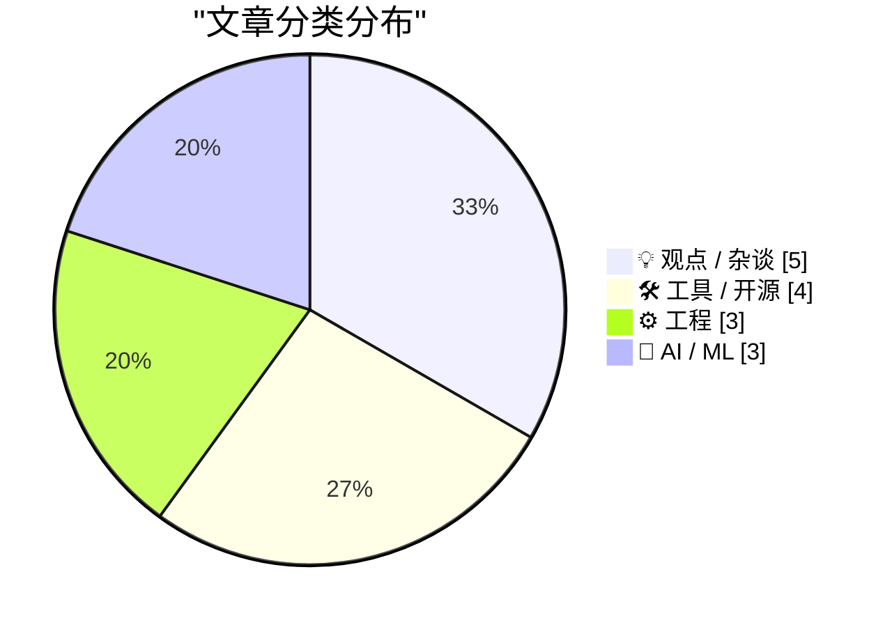
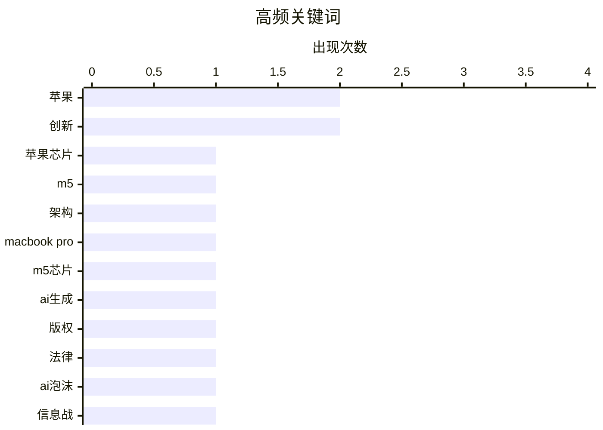

# 📰 AI 博客每日精选 — 2026-03-05

> 来自 Karpathy 推荐的 92 个顶级技术博客，AI 精选 Top 15

## 📝 今日看点

今日技术圈聚焦于人工智能的法律伦理争议与头部企业的硬件革新两大主线。人工智能领域迎来关键版权裁决，凸显训练数据侵权风险与行业炒作反思；同时，苹果公司推出新一代高性能芯片与笔记本电脑，持续引领移动计算创新。软件工程中对于工具可靠性及设计简洁性的深层讨论，也折射出技术实践的持续演进。

---

## 🏆 今日必读

🥇 **苹果推出M5专业版与M5 Max芯片，并重新命名其M系列CPU核心**

[苹果推出M5专业版与M5 Max芯片，并重新命名其M系列CPU核心](https://www.apple.com/newsroom/2026/03/apple-debuts-m5-pro-and-m5-max-to-supercharge-the-most-demanding-pro-workflows/) — daringfireball.net · 1 天前 · ⚙️ 工程

> 苹果发布了专为高端专业笔记本电脑设计的新一代M5专业版和M5 Max芯片。新芯片采用创新的融合架构设计，将两块晶片集成至单一系统芯片中，并配备了全新的十八核中央处理器架构。该架构包含六个高性能核心与十二个高能效核心，同时集成了可扩展图形处理器、媒体引擎、统一内存控制器、神经网络引擎并支持雷电五接口。这些升级旨在为最苛刻的专业工作流程提供前所未有的性能支持。

💡 **为什么值得读**: 本文详细解读了苹果最新自研芯片的核心架构创新与技术细节，是了解下一代Mac专业性能飞跃的关键资料。

🏷️ 苹果芯片, M5, 架构

🥈 **苹果推出搭载M5专业版与M5 Max芯片的新款MacBook Pro**

[苹果推出搭载M5专业版与M5 Max芯片的新款MacBook Pro](https://www.apple.com/newsroom/2026/03/apple-introduces-macbook-pro-with-all-new-m5-pro-and-m5-max/) — daringfireball.net · 1 天前 · 🛠 工具 / 开源

> 苹果发布了搭载全新M5专业版和M5 Max芯片的十四英寸与十六英寸MacBook Pro。新款芯片带来了全球最快的中央处理器核心，以及每个核心均集成神经网络加速器的下一代图形处理器，同时提供了更高的统一内存带宽。相比前代产品，其人工智能性能提升高达四倍，在某些场景下甚至可达八倍。此次更新旨在为全球顶级的专业笔记本电脑带来变革性的性能与人工智能能力。

💡 **为什么值得读**: 文章清晰展示了新款MacBook Pro在人工智能与综合性能上的巨大跃升，对于专业用户和设备选型极具参考价值。

🏷️ 苹果, MacBook Pro, M5芯片

🥉 **多元视角：最高法院将艺术家从人工智能侵权中解救出来**

[多元视角：最高法院将艺术家从人工智能侵权中解救出来](https://pluralistic.net/2026/03/03/its-a-trap-2/) — pluralistic.net · 1 天前 · 🤖 AI / ML

> 文章核心讨论了美国最高法院近期一项关于人工智能训练数据版权的关键裁决。该裁决明确，未经许可将受版权保护的作品用于训练人工智能模型构成侵权，驳回了科技公司基于“合理使用”的抗辩。这一判决为艺术家和创作者维护自身权益提供了强有力的法律武器，可能重塑人工智能行业的合规路径。作者同时警示，即使判决结果符合艺术家期望，也需警惕司法系统更深层的结构性立场。

💡 **为什么值得读**: 该文深入剖析了人工智能时代版权问题的里程碑式判决，对理解创意产业与科技巨头之间的法律博弈至关重要。

🏷️ AI生成, 版权, 法律

---

## 📊 数据概览

| 扫描源 | 抓取文章 | 时间范围 | 精选 |
|:---:|:---:|:---:|:---:|
| 85/92 | 2437 篇 → 33 篇 | 48h | **15 篇** |

### 分类分布



### 高频关键词



<details>
<summary>📈 纯文本关键词图（终端友好）</summary>

```
苹果          │ ████████████████████ 2
创新          │ ████████████████████ 2
苹果芯片        │ ██████████░░░░░░░░░░ 1
m5          │ ██████████░░░░░░░░░░ 1
架构          │ ██████████░░░░░░░░░░ 1
macbook pro │ ██████████░░░░░░░░░░ 1
m5芯片        │ ██████████░░░░░░░░░░ 1
ai生成        │ ██████████░░░░░░░░░░ 1
版权          │ ██████████░░░░░░░░░░ 1
法律          │ ██████████░░░░░░░░░░ 1
```

</details>

### 🏷️ 话题标签

**苹果**(2) · **创新**(2) · **苹果芯片**(1) · m5(1) · 架构(1) · macbook pro(1) · m5芯片(1) · ai生成(1) · 版权(1) · 法律(1) · ai泡沫(1) · 信息战(1) · 行业趋势(1) · 提示工程(1) · api调用(1) · 推理优化(1) · windows api(1) · 性能计数器(1) · 文档(1) · 逻辑回归(1)

---

## 💡 观点 / 杂谈

### 1. 人工智能泡沫实为一场信息战

[人工智能泡沫实为一场信息战](https://www.wheresyoured.at/the-ai-bubble-is-an-information-war/) — **wheresyoured.at** · 1 天前 · ⭐ 24/30

> 文章指出当前围绕人工智能的热潮本质上是一场由资本和媒体主导的信息战争。其核心论点是，大量炒作旨在制造技术必然性的叙事，以吸引投资并掩盖人工智能在能力、可靠性与经济效益上的根本局限。作者揭示了信息操纵如何制造市场泡沫，并引导公众接受可能存在缺陷的技术未来。这场信息战的目的是塑造认知，而非单纯传播信息。

🏷️ AI泡沫, 信息战, 行业趋势

---

### 2. 无人因追求简洁而获得晋升

[无人因追求简洁而获得晋升](https://terriblesoftware.org/2026/03/03/nobody-gets-promoted-for-simplicity/) — **terriblesoftware.org** · 1 天前 · ⭐ 20/30

> 文章尖锐地指出，在当今许多技术组织中，复杂的设计往往比简洁的方案更受奖励，这种现象贯穿于面试、设计评审和晋升评估中。作者分析了导致这一问题的系统性原因，即复杂性更容易被感知和度量，而简洁性的价值则难以被充分认可。文章最后提出了如何改变评估体系，以真正鼓励和奖励简洁、高效的设计方案。

🏷️ 软件工程, 职业发展, 复杂性

---

### 3. 摘要生成失败（可重试）

[摘要生成失败（可重试）](https://www.experimental-history.com/p/the-one-science-reform-we-can-all) — **experimental-history.com** · 1 天前 · ⭐ 20/30

> 未能生成中文摘要，请稍后重试。

🏷️ 科学改革, 政策, 创新

---

### 4. 摘要生成失败（可重试）

[摘要生成失败（可重试）](https://dynomight.net/pattern/) — **dynomight.net** · 1 天前 · ⭐ 18/30

> 未能生成中文摘要，请稍后重试。

🏷️ 创新, 发明, 模式

---

### 5. 摘要生成失败（可重试）

[摘要生成失败（可重试）](https://idiallo.com/blog/interruption-driven-development?src=feed) — **idiallo.com** · 15 小时前 · ⭐ 17/30

> 未能生成中文摘要，请稍后重试。

🏷️ 工作效率, 干扰, 开发习惯

---

## 🛠 工具 / 开源

### 6. 苹果推出搭载M5专业版与M5 Max芯片的新款MacBook Pro

[苹果推出搭载M5专业版与M5 Max芯片的新款MacBook Pro](https://www.apple.com/newsroom/2026/03/apple-introduces-macbook-pro-with-all-new-m5-pro-and-m5-max/) — **daringfireball.net** · 1 天前 · ⭐ 24/30

> 苹果发布了搭载全新M5专业版和M5 Max芯片的十四英寸与十六英寸MacBook Pro。新款芯片带来了全球最快的中央处理器核心，以及每个核心均集成神经网络加速器的下一代图形处理器，同时提供了更高的统一内存带宽。相比前代产品，其人工智能性能提升高达四倍，在某些场景下甚至可达八倍。此次更新旨在为全球顶级的专业笔记本电脑带来变革性的性能与人工智能能力。

🏷️ 苹果, MacBook Pro, M5芯片

---

### 7. 苹果可能意外提前泄露了‘MacBook Neo’的名称

[苹果可能意外提前泄露了‘MacBook Neo’的名称](https://www.macrumors.com/2026/03/03/apple-accidentally-leaks-macbook-neo/) — **daringfireball.net** · 1 天前 · ⭐ 20/30

> 一份型号为A三千四百零四的“MacBook Neo”监管文件出现在苹果官方网站上，暗示这可能是一款未发布的新产品。尽管文件本身未包含具体名称，但该名称短暂出现在欧盟合规页面的链接中。目前尚无关于这款设备的进一步细节或图像信息。此次泄露表明苹果可能正在准备一条新的MacBook产品线。

🏷️ 苹果, MacBook, 新品泄露

---

### 8. 软件包管理器亟需‘冷静期’功能

[软件包管理器亟需‘冷静期’功能](https://nesbitt.io/2026/03/04/package-managers-need-to-cool-down.html) — **nesbitt.io** · 17 小时前 · ⭐ 20/30

> 文章主张软件包管理器应引入“依赖项冷静期”功能，即在自动更新前等待一段时间，以观察新版本是否存在严重问题。作者调查了主流包管理器和更新工具对此功能的支持情况，发现目前普遍缺失。引入冷静期能有效降低因依赖项突发错误或恶意更新导致的系统故障风险。这是提升软件供应链安全性与稳定性的一个具体且可行的改进措施。

🏷️ 包管理器, 依赖管理, 冷却期

---

### 9. 摘要生成失败（可重试）

[摘要生成失败（可重试）](https://buttondown.com/hillelwayne/archive/free-books/) — **buttondown.com/hillelwayne** · 1 天前 · ⭐ 18/30

> 未能生成中文摘要，请稍后重试。

🏷️ 免费书籍, 逻辑编程, 程序员资源

---

## ⚙️ 工程

### 10. 苹果推出M5专业版与M5 Max芯片，并重新命名其M系列CPU核心

[苹果推出M5专业版与M5 Max芯片，并重新命名其M系列CPU核心](https://www.apple.com/newsroom/2026/03/apple-debuts-m5-pro-and-m5-max-to-supercharge-the-most-demanding-pro-workflows/) — **daringfireball.net** · 1 天前 · ⭐ 25/30

> 苹果发布了专为高端专业笔记本电脑设计的新一代M5专业版和M5 Max芯片。新芯片采用创新的融合架构设计，将两块晶片集成至单一系统芯片中，并配备了全新的十八核中央处理器架构。该架构包含六个高性能核心与十二个高能效核心，同时集成了可扩展图形处理器、媒体引擎、统一内存控制器、神经网络引擎并支持雷电五接口。这些升级旨在为最苛刻的专业工作流程提供前所未有的性能支持。

🏷️ 苹果芯片, M5, 架构

---

### 11. 找到了文档说查询性能计数器永不失效的反例

[找到了文档说查询性能计数器永不失效的反例](https://devblogs.microsoft.com/oldnewthing/20260304-00/?p=112110) — **devblogs.microsoft.com/oldnewthing** · 12 小时前 · ⭐ 21/30

> 作者发现了一个微软官方文档中关于“查询性能计数器永不失败”说法的反例。关键在于，当程序违反规则（例如在多处理器系统上未正确设置线程亲缘性）时，这一保证便会失效。文章强调了在极端或非规范使用场景下，即使被广泛认为绝对可靠的应用程序接口也可能出现意外行为。这印证了软件开发中的一个基本原则：任何保证都有其前提条件。

🏷️ Windows API, 性能计数器, 文档

---

### 12. 摘要生成失败（可重试）

[摘要生成失败（可重试）](https://nesbitt.io/2026/03/03/package-management-is-naming-all-the-way-down.html) — **nesbitt.io** · 1 天前 · ⭐ 20/30

> 未能生成中文摘要，请稍后重试。

🏷️ 包管理, 计算机科学, 命名问题

---

## 🤖 AI / ML

### 13. 多元视角：最高法院将艺术家从人工智能侵权中解救出来

[多元视角：最高法院将艺术家从人工智能侵权中解救出来](https://pluralistic.net/2026/03/03/its-a-trap-2/) — **pluralistic.net** · 1 天前 · ⭐ 24/30

> 文章核心讨论了美国最高法院近期一项关于人工智能训练数据版权的关键裁决。该裁决明确，未经许可将受版权保护的作品用于训练人工智能模型构成侵权，驳回了科技公司基于“合理使用”的抗辩。这一判决为艺术家和创作者维护自身权益提供了强有力的法律武器，可能重塑人工智能行业的合规路径。作者同时警示，即使判决结果符合艺术家期望，也需警惕司法系统更深层的结构性立场。

🏷️ AI生成, 版权, 法律

---

### 14. 人工智能奥德赛（第二部分）：提示词的风险

[人工智能奥德赛（第二部分）：提示词的风险](https://www.johndcook.com/blog/2026/03/04/an-ai-odyssey-part-2-prompting-peril/) — **johndcook.com** · 13 小时前 · ⭐ 23/30

> 文章通过一个实际案例探讨了通过调整应用程序接口调用参数以提升大型语言模型推理准确性的想法。作者同事直接向聊天机器人咨询此方法的可行性，并得到了看似合理但未经证实的肯定答复。这揭示了在开发中过度依赖人工智能生成答案而非查阅权威文档或进行测试所带来的风险。盲目相信模型的建议可能导致项目走入歧途或引入错误。

🏷️ 提示工程, API调用, 推理优化

---

### 15. 从逻辑回归到人工智能

[从逻辑回归到人工智能](https://www.johndcook.com/blog/2026/03/04/from-logistic-regression-to-ai/) — **johndcook.com** · 13 小时前 · ⭐ 21/30

> 文章探讨了神经网络（包括大型语言模型）与逻辑回归之间的理论联系与本质区别。虽然神经网络在数学基础上可视为参数极多的逻辑回归，但“量变引起质变”。海量参数带来的规模效应催生了小型模型中无法预见的新现象和能力，例如涌现行为。因此，不能简单地将现代人工智能模型等同于传统的逻辑回归模型。

🏷️ 逻辑回归, 神经网络, AI基础

---

*生成于 2026-03-05 03:34 | 扫描 85 源 → 获取 2437 篇 → 精选 15 篇*
*基于 [Hacker News Popularity Contest 2025](https://refactoringenglish.com/tools/hn-popularity/) RSS 源列表，由 [Andrej Karpathy](https://x.com/karpathy) 推荐*
