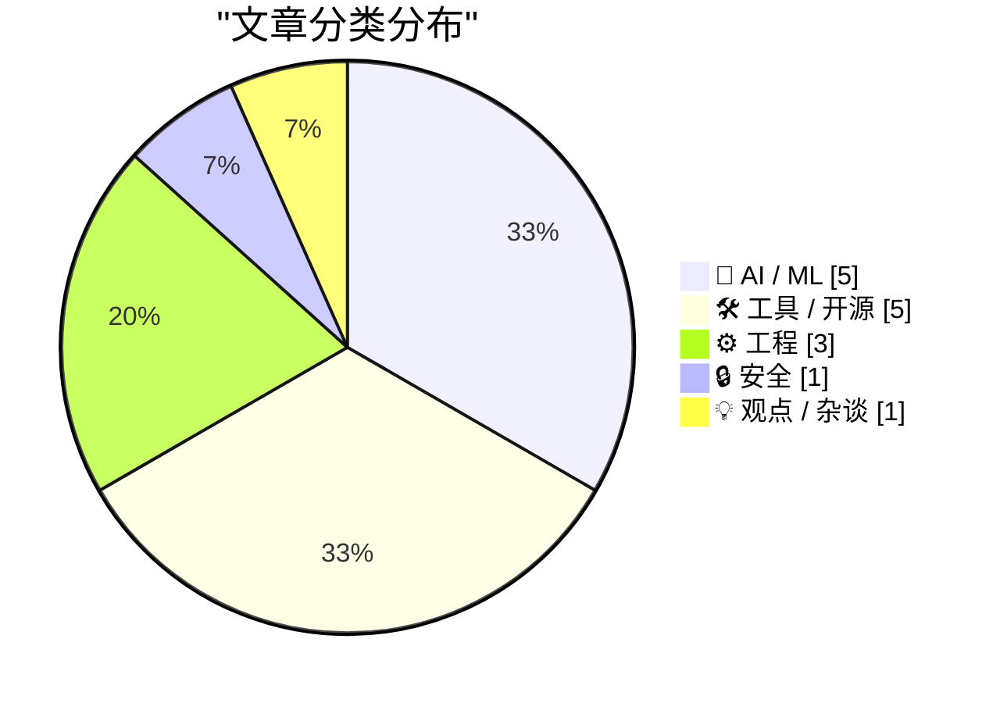
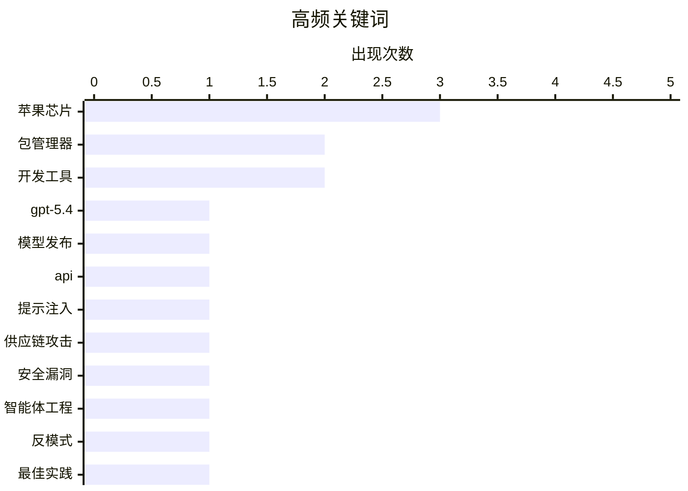

# 📰 AI 博客每日精选 — 2026-03-06

> 来自 Karpathy 推荐的 92 个顶级技术博客，AI 精选 Top 15

## 📝 今日看点

今日技术圈聚焦于人工智能的深度渗透与工程实践的同步演进。大模型持续迭代并深入代码开发等核心场景，但安全漏洞、哲学悖论与法律风险也随之凸显。工程界正反思代理使用中的反模式，并通过工具优化来应对新时代的稳定性挑战。

---

## 🏆 今日必读

🥇 **GPT-5.4模型发布介绍**

[GPT-5.4模型发布介绍](https://simonwillison.net/2026/Mar/5/introducing-gpt54/#atom-everything) — simonwillison.net · 3 小时前 · 🤖 AI / ML

> 文章介绍了开放人工智能最新发布的两个应用程序接口模型，分别是GPT-5.4及其专业版GPT-5.4-Pro。这两个模型的知识截止日期为2025年8月31日，并支持高达一百万令牌的上下文窗口。新模型已在聊天机器人与代码命令行界面中提供，其定价相比前代模型有所调整。此次更新标志着大语言模型在知识广度与上下文处理能力上的又一次重要迭代。

💡 **为什么值得读**: 此文是了解当前最前沿大语言模型核心特性与定价策略的一手信息源。

🏷️ GPT-5.4, 模型发布, API

🥈 **克莱恩仓库提示注入攻击案例**

[克莱恩仓库提示注入攻击案例](https://simonwillison.net/2026/Mar/6/clinejection/#atom-everything) — simonwillison.net · 53 分钟前 · 🔒 安全

> 文章披露了一种针对名为克莱恩的代码仓库的复杂攻击链。攻击始于在仓库议题标题中植入恶意提示，利用了仓库配置的、基于人工智能的自动议题分类工作流。该工作流使用了特定版本的人工智能代码动作，攻击者通过精心构造的提示，诱使该人工智能代理执行恶意代码，最终成功将恶意代码提交并合并至项目的生产发布分支。此案例揭示了在开发工作流中集成人工智能代理时，若缺乏严格审查，可能带来严重的安全风险。

💡 **为什么值得读**: 该文通过一个真实的安全事件，生动揭示了人工智能代理在软件供应链中可能引发的全新攻击面，对开发者具有重要警示意义。

🏷️ 提示注入, 供应链攻击, 安全漏洞

🥉 **代理工程中的常见反模式**

[代理工程中的常见反模式](https://simonwillison.net/guides/agentic-engineering-patterns/anti-patterns/#atom-everything) — simonwillison.net · 1 天前 · ⚙️ 工程

> 文章列举了在代理工程这一新兴领域中应当避免的几种不良实践。首要反模式是向协作者提交未经自行审查的代码，这会给团队带来困扰。另一个常见问题是过度依赖或完全信任人工智能工具生成的代码与计划，而不进行批判性评估。作者强调，开发者必须对人工智能生成的所有产出保持最终责任和审查权。这些反模式的核心在于忽视了人类在开发流程中的主导和监督角色。

💡 **为什么值得读**: 文章直指当前利用人工智能辅助编码时的常见误区，提供了避免团队协作混乱和项目风险的实用指导。

🏷️ 智能体工程, 反模式, 最佳实践

---

## 📊 数据概览

| 扫描源 | 抓取文章 | 时间范围 | 精选 |
|:---:|:---:|:---:|:---:|
| 84/92 | 2420 篇 → 24 篇 | 48h | **15 篇** |

### 分类分布



### 高频关键词



<details>
<summary>📈 纯文本关键词图（终端友好）</summary>

```
苹果芯片    │ ████████████████████ 3
包管理器    │ █████████████░░░░░░░ 2
开发工具    │ █████████████░░░░░░░ 2
gpt-5.4 │ ███████░░░░░░░░░░░░░ 1
模型发布    │ ███████░░░░░░░░░░░░░ 1
api     │ ███████░░░░░░░░░░░░░ 1
提示注入    │ ███████░░░░░░░░░░░░░ 1
供应链攻击   │ ███████░░░░░░░░░░░░░ 1
安全漏洞    │ ███████░░░░░░░░░░░░░ 1
智能体工程   │ ███████░░░░░░░░░░░░░ 1
```

</details>

### 🏷️ 话题标签

**苹果芯片**(3) · **包管理器**(2) · **开发工具**(2) · gpt-5.4(1) · 模型发布(1) · api(1) · 提示注入(1) · 供应链攻击(1) · 安全漏洞(1) · 智能体工程(1) · 反模式(1) · 最佳实践(1) · ai编程(1) · 代码生成(1) · 软件工程(1) · prompt工程(1) · api优化(1) · 推理准确率(1) · 编码代理(1) · 开源许可(1)

---

## 🤖 AI / ML

### 1. GPT-5.4模型发布介绍

[GPT-5.4模型发布介绍](https://simonwillison.net/2026/Mar/5/introducing-gpt54/#atom-everything) — **simonwillison.net** · 3 小时前 · ⭐ 27/30

> 文章介绍了开放人工智能最新发布的两个应用程序接口模型，分别是GPT-5.4及其专业版GPT-5.4-Pro。这两个模型的知识截止日期为2025年8月31日，并支持高达一百万令牌的上下文窗口。新模型已在聊天机器人与代码命令行界面中提供，其定价相比前代模型有所调整。此次更新标志着大语言模型在知识广度与上下文处理能力上的又一次重要迭代。

🏷️ GPT-5.4, 模型发布, API

---

### 2. 人工智能与忒修斯之船悖论

[人工智能与忒修斯之船悖论](https://lucumr.pocoo.org/2026/3/5/theseus/) — **lucumr.pocoo.org** · 1 天前 · ⭐ 25/30

> 文章探讨了人工智能大规模重写代码所引发的软件身份哲学问题。随着编写代码的成本急剧下降，人工智能可以轻松地将一个库移植到另一种语言，但过程中可能选择完全不同的实现设计。例如，一个字符编码检测库的现任维护者就使用人工智能从头重写了整个库。当代码的功能保持不变，但每一行代码都被替换时，这就引发了类似“忒修斯之船”的悖论：重写后的软件还是原来的那个软件吗？作者认为，这种现象正在模糊软件项目的身份边界。

🏷️ AI编程, 代码生成, 软件工程

---

### 3. 人工智能探索之旅第二部分：提示的风险

[人工智能探索之旅第二部分：提示的风险](https://www.johndcook.com/blog/2026/03/04/an-ai-odyssey-part-2-prompting-peril/) — **johndcook.com** · 1 天前 · ⭐ 24/30

> 文章通过一个具体案例，揭示了在调用大语言模型应用程序接口时存在的认知误区。一位同事试图通过直接询问聊天机器人来验证“修改应用程序接口调用以增加推理量是否能提高准确性”这一技术想法。这种做法错误地将聊天机器人视为权威的技术信息源，而非一个可能产生不准确信息的语言模型。作者指出，正确的做法应当是查阅官方文档或进行实际的代码测试。这个案例提醒开发者，应避免盲目相信人工智能对自身技术问题的评价。

🏷️ Prompt工程, API优化, 推理准确率

---

### 4. 通义千问团队核心人员离职风波

[通义千问团队核心人员离职风波](https://simonwillison.net/2026/Mar/4/qwen/#atom-everything) — **simonwillison.net** · 1 天前 · ⭐ 23/30

> 文章报道了阿里巴巴通义千问团队在发布备受好评的三点五模型系列后，遭遇的核心人员离职风波。通义千问三点五模型家族在过去几周发布，获得了广泛认可。然而，团队重要负责人林俊阳及其他多名核心成员在近期相继宣布离职。这一系列高层变动引发了业界对该项目未来发展的深切担忧。事件反映了中国人工智能开源领域在激烈竞争和人才流动下面临的挑战与不确定性。

🏷️ Qwen, 开源模型, 团队变动

---

### 5. 从逻辑回归到人工智能

[从逻辑回归到人工智能](https://www.johndcook.com/blog/2026/03/04/from-logistic-regression-to-ai/) — **johndcook.com** · 1 天前 · ⭐ 20/30

> 讨论神经网络与逻辑回归之间的理论联系。神经网络常被视为参数数量极大的逻辑回归，但规模扩大后产生质变，涌现出小规模时无法预见的新现象。作者强调“更多就是不同”，指出大规模参数带来的复杂性不可简单外推。这解释了为什么当前大型语言模型表现出超越传统统计方法的能力。结论是人工智能的进展离不开对规模效应的深刻理解。

🏷️ 神经网络, 逻辑回归, AI基础

---

## 🛠 工具 / 开源

### 6. 包管理器应引入“依赖冷静期”

[包管理器应引入“依赖冷静期”](https://nesbitt.io/2026/03/04/package-managers-need-to-cool-down.html) — **nesbitt.io** · 1 天前 · ⭐ 22/30

> 文章主张包管理器应引入“依赖冷静期”功能，以提升软件项目的稳定性。所谓冷静期，是指在自动升级到最新版本前，强制等待一段预设的时间，从而避开刚发布版本可能存在的初始缺陷。作者调查了主流包管理器与更新工具对此功能的支持情况，发现目前仅有少数工具原生支持此机制。引入冷静期是一种简单有效的工程实践，能让社区有时间发现新版本中的关键问题，避免下游用户遭受波及。

🏷️ 包管理器, 依赖管理, 冷却支持

---

### 7. 对苹果MacBook Neo的评析与观察

[对苹果MacBook Neo的评析与观察](https://daringfireball.net/2026/03/599_not_a_piece_of_junk_macbook_neo) — **daringfireball.net** · 1 天前 · ⭐ 21/30

> 文章评析了苹果在自研芯片时代面向消费市场推出的首款重要新机型MacBook Neo。这款电脑旨在以更具竞争力的价格和均衡的设计，显著提升Mac在整个个人电脑市场中的份额。它并非旗舰产品，而是在性能、便携性和成本之间取得了精妙的平衡，旨在吸引更广泛的普通消费者。MacBook Neo的推出标志着苹果战略的一个关键转变，即更积极地利用自研芯片的优势来争夺主流市场份额。

🏷️ MacBook Neo, 苹果芯片, 消费市场

---

### 8. JJ 语言服务器协议后续跟进

[JJ 语言服务器协议后续跟进](https://matklad.github.io/2026/03/05/jj-lsp-followup.html) — **matklad.github.io** · 1 天前 · ⭐ 21/30

> 文章探讨在版本控制系统 JJ 中实现类似 Magit 风格用户体验的技术方案。核心方案是利用语言服务器协议，特别是即将发布的 3.18 版本新增的文本文档内容请求特性。这一新功能大幅简化了实现过程，减少了之前所需的复杂变通方法。最终，该集成将使 JJ 用户获得更流畅的界面操作体验。

🏷️ 版本控制, LSP, 开发工具

---

### 9. 包管理器魔法文件

[包管理器魔法文件](https://nesbitt.io/2026/03/05/package-manager-magic-files.html) — **nesbitt.io** · 17 小时前 · ⭐ 21/30

> 主题是包管理器中关键配置文件的作用与位置。列举了包括点 npm 配置、清单文件、目录包属性文件以及 pnpm 脚本文件在内的多种魔法文件。这些文件控制依赖解析、构建过程和包发布行为。掌握它们能帮助开发者定制包管理流程，提升项目维护效率。结论是合理配置这些文件是高效依赖管理的基础。

🏷️ 包管理器, 配置文件, 开发工具

---

### 10. 新 Studio Display 兼容性说明

[新 Studio Display 兼容性说明](https://www.macrumors.com/2026/03/03/apple-studio-display-no-intel-mac-support/) — **daringfireball.net** · 1 天前 · ⭐ 20/30

> 核心问题是苹果新 Studio Display 与 Mac 硬件的兼容性限制。关键发现是两款新显示器均不兼容基于英特尔处理器的 Mac 电脑。此外，配备基础 M1、M2 或 M3 芯片的 Mac 只能以 60 赫兹驱动 Studio Display XDR，而需要专业版或更高版本 M2 或 M3 芯片，或任何 M4 或 M5 芯片才能实现 120 赫兹刷新率。这提示用户在升级显示设备时必须考虑硬件匹配。

🏷️ Studio Display, 兼容性, 苹果芯片

---

## ⚙️ 工程

### 11. 代理工程中的常见反模式

[代理工程中的常见反模式](https://simonwillison.net/guides/agentic-engineering-patterns/anti-patterns/#atom-everything) — **simonwillison.net** · 1 天前 · ⭐ 26/30

> 文章列举了在代理工程这一新兴领域中应当避免的几种不良实践。首要反模式是向协作者提交未经自行审查的代码，这会给团队带来困扰。另一个常见问题是过度依赖或完全信任人工智能工具生成的代码与计划，而不进行批判性评估。作者强调，开发者必须对人工智能生成的所有产出保持最终责任和审查权。这些反模式的核心在于忽视了人类在开发流程中的主导和监督角色。

🏷️ 智能体工程, 反模式, 最佳实践

---

### 12. 苹果芯片核心更名：从性能与能效到猛禽与雕翼

[苹果芯片核心更名：从性能与能效到猛禽与雕翼](https://sixcolors.com/post/2026/03/apple-gives-in-to-temptation-and-renames-its-cpu-cores/) — **daringfireball.net** · 1 天前 · ⭐ 21/30

> 文章解释了苹果公司为何决定从第四代自研芯片开始，将其处理器核心的名称从“性能核心与能效核心”改为“猛禽核心与雕翼核心”。苹果长期以来对其能效核心被外界低估感到不满，因为这些核心本身性能已足够强大。此次改名是为了更准确地反映两类核心的实际能力差距，并赋予其更鲜明的品牌个性。“猛禽”与“雕翼”的比喻旨在向消费者传达，即使是所谓的“小核”也拥有迅猛的速度与敏捷性。这一变化本质上是苹果对其芯片卓越性能进行的一次营销策略升级。

🏷️ 苹果芯片, 性能核心, 能效核心

---

### 13. 中断驱动开发

[中断驱动开发](https://idiallo.com/blog/interruption-driven-development?src=feed) — **idiallo.com** · 1 天前 · ⭐ 19/30

> 聚焦于软件开发中频繁被打断对工作效率的影响。作者以戴耳机作为物理信号为例，说明其虽能减少干扰，但中断本身仍会破坏专注力。关键观点是即使短暂对话也可能打断深度工作流，导致效率下降。文章建议开发者需要主动管理中断而非完全避免。结论是制定应对中断的策略比追求零干扰更为实际和有效。

🏷️ 工作效率, 专注, 开发习惯

---

## 🔒 安全

### 14. 克莱恩仓库提示注入攻击案例

[克莱恩仓库提示注入攻击案例](https://simonwillison.net/2026/Mar/6/clinejection/#atom-everything) — **simonwillison.net** · 53 分钟前 · ⭐ 26/30

> 文章披露了一种针对名为克莱恩的代码仓库的复杂攻击链。攻击始于在仓库议题标题中植入恶意提示，利用了仓库配置的、基于人工智能的自动议题分类工作流。该工作流使用了特定版本的人工智能代码动作，攻击者通过精心构造的提示，诱使该人工智能代理执行恶意代码，最终成功将恶意代码提交并合并至项目的生产发布分支。此案例揭示了在开发工作流中集成人工智能代理时，若缺乏严格审查，可能带来严重的安全风险。

🏷️ 提示注入, 供应链攻击, 安全漏洞

---

## 💡 观点 / 杂谈

### 15. 编码代理的“净室”实现与开源许可风险

[编码代理的“净室”实现与开源许可风险](https://simonwillison.net/2026/Mar/5/chardet/#atom-everything) — **simonwillison.net** · 10 小时前 · ⭐ 23/30

> 文章探讨了人工智能编码代理通过“净室”方式重现代码所引发的开源许可与法律风险。编码代理非常擅长根据现有代码的功能描述或测试套件，生成一个功能相同但实现不同的新版本，这类似于历史上为规避版权而进行的净室逆向工程。然而，这种由人工智能完成的“净室实现”是否真能绕开原代码的版权与许可约束，目前存在巨大法律灰色地带。作者警告，这种行为可能对开源软件生态的可持续性构成严重威胁。

🏷️ 编码代理, 开源许可, 净室实现

---

*生成于 2026-03-06 03:32 | 扫描 84 源 → 获取 2420 篇 → 精选 15 篇*
*基于 [Hacker News Popularity Contest 2025](https://refactoringenglish.com/tools/hn-popularity/) RSS 源列表，由 [Andrej Karpathy](https://x.com/karpathy) 推荐*
