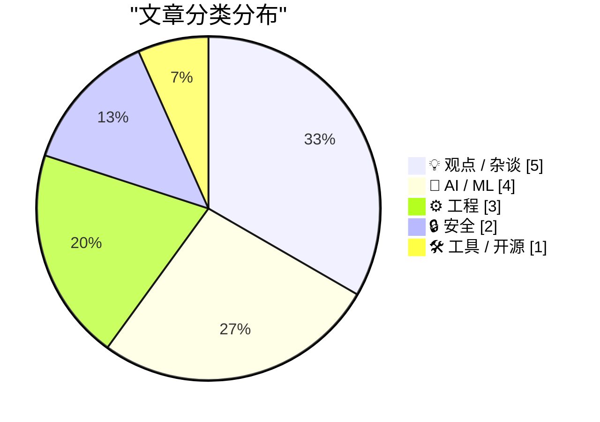
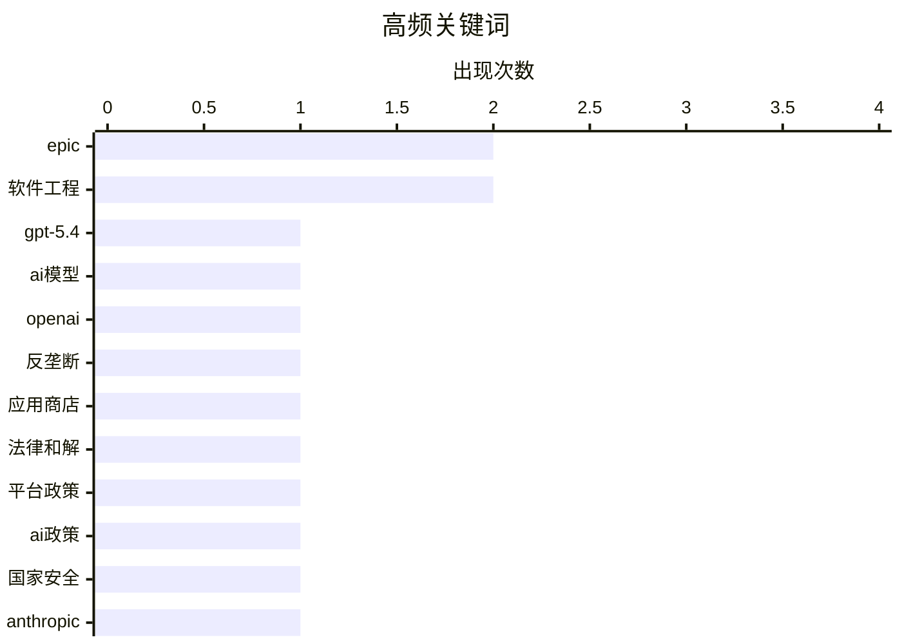

# 📰 AI 博客每日精选 — 2026-03-07

> 来自 Karpathy 推荐的 92 个顶级技术博客，AI 精选 Top 15

## 📝 今日看点

今日技术圈呈现三大焦点：人工智能领域模型持续迭代并涉足军事合作，引发性能趋同与伦理争议；科技巨头反垄断斗争以和解告终，却暴露出市场垄断与言论自由之间的复杂博弈；网络安全威胁升级，新型漏洞利用工具与针对人工智能系统的攻击手法凸显防护紧迫性。

---

## 🏆 今日必读

🥇 **发布GPT-5.4**

[发布GPT-5.4](https://simonwillison.net/2026/Mar/5/introducing-gpt54/#atom-everything) — simonwillison.net · 1 天前 · 🤖 AI / ML

> 文章介绍了OpenAI最新发布的两个应用程序接口模型GPT-5.4和GPT-5.4专业版。新模型的知识截止日期更新至2025年8月31日，并提供了高达100万token的上下文窗口。其定价信息已在相关价格对比网站上公布，开发者可通过ChatGPT和Codex命令行界面使用。这标志着大型语言模型在长上下文处理能力和知识新鲜度上取得了重要进展。

💡 **为什么值得读**: 该文提供了关于GPT-5.4核心技术参数和获取方式的一手信息，对关注人工智能前沿发展的开发者和技术决策者具有直接参考价值。

🏷️ GPT-5.4, AI模型, OpenAI

🥈 **胜诉谷歌后，《边缘》杂志专访蒂姆·斯威尼**

[胜诉谷歌后，《边缘》杂志专访蒂姆·斯威尼](https://www.theverge.com/23996474/epic-tim-sweeney-interview-win-google-antitrust-lawsuit-district-court) — daringfireball.net · 9 小时前 · 💡 观点 / 杂谈

> 文章核心是史诗游戏公司首席执行官蒂姆·斯威尼在赢得对谷歌的反垄断诉讼后接受的专访。斯威尼用‘苹果是冰，谷歌是火’的比喻来区分两家公司的垄断策略，指出苹果的垄断行为主要内化于其商店和支付系统等内部生态。相比之下，谷歌为了实现安卓系统的控制，采取了向外收买游戏开发者等更主动、更具攻击性的手段。这一对比揭示了科技巨头为维持市场主导地位所采取的不同路径。

💡 **为什么值得读**: 通过关键当事人的直接比喻，本文为理解苹果与谷歌两大生态系统的垄断本质提供了生动而深刻的视角。

🏷️ 反垄断, 应用商店, Epic

🥉 **蒂姆·斯威尼签署协议，放弃批评谷歌应用商店的权利直至2032年**

[蒂姆·斯威尼签署协议，放弃批评谷歌应用商店的权利直至2032年](https://www.theverge.com/news/889595/tim-sweeney-signed-away-his-right-to-criticize-google-until-2032) — daringfireball.net · 9 小时前 · 💡 观点 / 杂谈

> 文章披露了史诗游戏公司与谷歌和解协议中的一项关键条款，限制了其首席执行官蒂姆·斯威尼的言论自由。根据3月3日签署的具有约束力的条款清单，斯威尼不仅放弃了就谷歌应用分发实践、收费和应用待遇等问题起诉或贬损该公司的权利。他还放弃了倡导进一步改变谷歌应用商店政策的权利， effectively被禁止批评谷歌的应用商店。这份协议的有效期将持续到2032年，实质上在长期内封住了这位著名批评者的嘴。

💡 **为什么值得读**: 本文揭露了商业和解中隐藏的言论限制条款，对理解科技巨头如何通过法律手段压制批评具有警示意义。

🏷️ 法律和解, 平台政策, Epic

---

## 📊 数据概览

| 扫描源 | 抓取文章 | 时间范围 | 精选 |
|:---:|:---:|:---:|:---:|
| 84/92 | 2421 篇 → 34 篇 | 48h | **15 篇** |

### 分类分布



### 高频关键词



<details>
<summary>📈 纯文本关键词图（终端友好）</summary>

```
epic    │ ████████████████████ 2
软件工程    │ ████████████████████ 2
gpt-5.4 │ ██████████░░░░░░░░░░ 1
ai模型    │ ██████████░░░░░░░░░░ 1
openai  │ ██████████░░░░░░░░░░ 1
反垄断     │ ██████████░░░░░░░░░░ 1
应用商店    │ ██████████░░░░░░░░░░ 1
法律和解    │ ██████████░░░░░░░░░░ 1
平台政策    │ ██████████░░░░░░░░░░ 1
ai政策    │ ██████████░░░░░░░░░░ 1
```

</details>

### 🏷️ 话题标签

**epic**(2) · **软件工程**(2) · **gpt-5.4**(1) · ai模型(1) · openai(1) · 反垄断(1) · 应用商店(1) · 法律和解(1) · 平台政策(1) · ai政策(1) · 国家安全(1) · anthropic(1) · ai代理(1) · 工程模式(1) · 编码执行(1) · ios漏洞(1) · 漏洞利用(1) · 安全威胁(1) · 最佳实践(1) · 技术决策(1)

---

## 💡 观点 / 杂谈

### 1. 胜诉谷歌后，《边缘》杂志专访蒂姆·斯威尼

[胜诉谷歌后，《边缘》杂志专访蒂姆·斯威尼](https://www.theverge.com/23996474/epic-tim-sweeney-interview-win-google-antitrust-lawsuit-district-court) — **daringfireball.net** · 9 小时前 · ⭐ 27/30

> 文章核心是史诗游戏公司首席执行官蒂姆·斯威尼在赢得对谷歌的反垄断诉讼后接受的专访。斯威尼用‘苹果是冰，谷歌是火’的比喻来区分两家公司的垄断策略，指出苹果的垄断行为主要内化于其商店和支付系统等内部生态。相比之下，谷歌为了实现安卓系统的控制，采取了向外收买游戏开发者等更主动、更具攻击性的手段。这一对比揭示了科技巨头为维持市场主导地位所采取的不同路径。

🏷️ 反垄断, 应用商店, Epic

---

### 2. 蒂姆·斯威尼签署协议，放弃批评谷歌应用商店的权利直至2032年

[蒂姆·斯威尼签署协议，放弃批评谷歌应用商店的权利直至2032年](https://www.theverge.com/news/889595/tim-sweeney-signed-away-his-right-to-criticize-google-until-2032) — **daringfireball.net** · 9 小时前 · ⭐ 26/30

> 文章披露了史诗游戏公司与谷歌和解协议中的一项关键条款，限制了其首席执行官蒂姆·斯威尼的言论自由。根据3月3日签署的具有约束力的条款清单，斯威尼不仅放弃了就谷歌应用分发实践、收费和应用待遇等问题起诉或贬损该公司的权利。他还放弃了倡导进一步改变谷歌应用商店政策的权利， effectively被禁止批评谷歌的应用商店。这份协议的有效期将持续到2032年，实质上在长期内封住了这位著名批评者的嘴。

🏷️ 法律和解, 平台政策, Epic

---

### 3. 天啊，我以前对联邦宇宙的看法错了

[天啊，我以前对联邦宇宙的看法错了](https://matduggan.com/boy-i-was-wrong-about-the-fediverse/) — **matduggan.com** · 15 小时前 · ⭐ 23/30

> 作者坦诚地分享了自己对联邦宇宙看法的重要转变。他过去并非一个以线上社区为先的人，主要将互联网视为维系现实人际关系的工具，也不热衷于在社交媒体上与名人互动。作者承认自己从未有趣到能成为推特上最幽默的人，这暗示了他对传统中心化社交平台的疏离感。文章的基调是反思性的，表明作者可能发现了联邦宇宙这种去中心化社交网络模式具有不同于传统平台的价值。这代表了一种个人认知的更新和对新型网络社交模式的重新评估。

🏷️ Fediverse, 去中心化, 社交媒体

---

### 4. 十年后，我的工作还会存在吗？

[十年后，我的工作还会存在吗？](https://seangoedecke.com/will-my-job-still-exist/) — **seangoedecke.com** · 1 天前 · ⭐ 22/30

> 一位软件工程师对自身职业在未来十年是否存续的深刻焦虑。作者观察到，人工智能编码工具（如GPT工程师）的兴起正在从根本上改变软件构建方式，可能使传统的手动编码需求大幅减少。尽管当前市场对工程师的需求依然旺盛，但技术迭代的速度让作者怀疑，到2036年，纯粹的“软件工程师”岗位或将不复存在。作者最终认为，虽然基础编码工作可能被自动化，但理解复杂系统、进行高层设计和判断的能力仍将至关重要。

🏷️ 职业未来, 软件工程, AI影响

---

### 5. 我们不满意的窗口装饰

[我们不满意的窗口装饰](https://pxlnv.com/blog/window-chrome-of-our-discontent/) — **daringfireball.net** · 7 小时前 · ⭐ 21/30

> 文章批评了苹果公司近年来在macOS和应用设计中不断弱化乃至隐藏窗口边框与工具栏图标（即“窗口装饰”）的设计趋势。作者以苹果自家软件（如Pages从2009版至今的演变）为例，指出这种为了所谓“聚焦内容”而消除视觉界面的做法，实际上损害了软件的可用性与用户的方向感。核心论点是，清晰的视觉层次和界面元素并非干扰，而是高效交互的基础，苹果的设计选择可能源于对“简洁”的误解。作者质疑这种设计哲学是否真的有益于用户的实际工作效率。

🏷️ 界面设计, 苹果, 用户体验

---

## 🤖 AI / ML

### 6. 发布GPT-5.4

[发布GPT-5.4](https://simonwillison.net/2026/Mar/5/introducing-gpt54/#atom-everything) — **simonwillison.net** · 1 天前 · ⭐ 28/30

> 文章介绍了OpenAI最新发布的两个应用程序接口模型GPT-5.4和GPT-5.4专业版。新模型的知识截止日期更新至2025年8月31日，并提供了高达100万token的上下文窗口。其定价信息已在相关价格对比网站上公布，开发者可通过ChatGPT和Codex命令行界面使用。这标志着大型语言模型在长上下文处理能力和知识新鲜度上取得了重要进展。

🏷️ GPT-5.4, AI模型, OpenAI

---

### 7. Anthropic与五角大楼

[Anthropic与五角大楼](https://simonwillison.net/2026/Mar/6/anthropic-and-the-pentagon/#atom-everything) — **simonwillison.net** · 9 小时前 · ⭐ 25/30

> 文章转述了布鲁斯·施奈尔和内森·桑德斯对Anthropic与五角大楼合同争议的深度分析。作者认为这是对该事件最深思熟虑且立足实际的报道。核心观点指出，顶级人工智能模型的性能日益趋同，商品化趋势明显，不同模型之间已缺乏显著差异性。这种同质化使得模型供应商的商业模式和地缘政治考量，而非纯粹的技术优势，成为合同决策的关键因素。文章最终引导读者思考在技术趋同背景下，企业与政府合作的深层逻辑。

🏷️ AI政策, 国家安全, Anthropic

---

### 8. 智能体手动测试

[智能体手动测试](https://simonwillison.net/guides/agentic-engineering-patterns/agentic-manual-testing/#atom-everything) — **simonwillison.net** · 21 小时前 · ⭐ 25/30

> 文章阐述了智能体工程模式中编码智能体的一个核心特征与最佳实践。编码智能体的定义性特征在于它能够执行自己编写的代码，这使其比仅能输出代码而无法验证的大型语言模型有用得多。作者强调，绝不能假设大型语言模型生成的代码可以工作，除非该代码已被实际执行。因此，编码智能体具备通过运行测试来确认代码功能的能力，手动测试是其验证逻辑的关键一环。这确立了‘执行验证’在智能体辅助编程中的根本重要性。

🏷️ AI代理, 工程模式, 编码执行

---

### 9. 编码智能体能否通过‘净室’实现重新授权？

[编码智能体能否通过‘净室’实现重新授权？](https://simonwillison.net/2026/Mar/5/chardet/#atom-everything) — **simonwillison.net** · 1 天前 · ⭐ 22/30

> 文章探讨了编码智能体是否能够通过创建‘净室’实现来绕过开源代码的原始授权协议。作者指出，近几个月来，编码智能体已展现出非凡的能力，能够构建一种奇特的‘净室’式代码实现，这让人联想到1982年康柏克隆IBM BIOS的经典案例。智能体可以分析现有开源代码的功能，然后生成实现相同功能但代码完全不同的新版本。然而，这种做法在法律和伦理上存在巨大风险，可能构成对原作品创意的侵权，并不能自动解决重新授权问题。

🏷️ 编码代理, 开源许可, 干净室

---

## ⚙️ 工程

### 10. 视情况而定

[视情况而定](https://idiallo.com/blog/it-depends-experts-never-give-straight-answers?src=feed) — **idiallo.com** · 15 小时前 · ⭐ 24/30

> 文章探讨了技术专家为何经常给出‘视情况而定’这种看似模糊的回答。作者回忆了早期向团队首席开发者寻求明确答案却总是得到此回应的经历，涉及数据库升级、系统更新等具体技术决策。随着经验增长，作者意识到这种回答并非推诿，而是反映了现实世界的复杂性。每一个技术决策都依赖于具体的上下文、约束条件和权衡因素，不存在放之四海而皆准的简单答案。因此，‘视情况而定’恰恰是经验丰富者负责任和深思熟虑的表现。

🏷️ 软件工程, 最佳实践, 技术决策

---

### 11. 如何托管你自己的邮件服务器

[如何托管你自己的邮件服务器](https://blog.miguelgrinberg.com/post/how-to-host-your-own-email-server) — **miguelgrinberg.com** · 11 小时前 · ⭐ 22/30

> 文章驳斥了“自建邮件服务器极其困难”的普遍观点，并提供了实践指南。作者为个人学习平台搭建邮件服务时，没有选择Mailgun或SendGrid等第三方服务，而是成功配置了自托管方案。关键步骤包括使用Postfix作为邮件传输代理、Dovecot处理IMAP/POP3、以及Rspamd进行垃圾邮件过滤，并详细说明了DNS记录（SPF、DKIM、DMARC）的配置。结论是，自建邮件服务器不仅能避免供应商锁定、节省成本，还能提供更佳的数据控制权和送达率。

🏷️ 电子邮件服务器, 自托管, 系统管理

---

### 12. 引用艾莉·皮霍夫斯基

[引用艾莉·皮霍夫斯基](https://simonwillison.net/2026/Mar/6/ally-piechowski/#atom-everything) — **simonwillison.net** · 5 小时前 · ⭐ 20/30

> 文章引用了一组用于快速审计遗留Rails代码库的尖锐提问清单。这些问题旨在绕过表面文档，直击技术债务与团队协作的痛点。面向开发者的问题包括“你最不敢碰哪个部分？”、“上次周五部署是什么时候？”，以探查代码脆弱性和部署信心。面向技术负责人或经理的问题包括“哪个功能被阻塞超过一年了？”、“是否有生产环境错误的实时可见性？”，以评估管理流程与监控能力。这套问题被设计为能在30分钟内暴露代码库的主要风险区域。

🏷️ 遗留代码, 审计, Rails

---

## 🔒 安全

### 13. 谷歌威胁情报小组报告：来源神秘的强大iOS漏洞利用工具包‘科鲁纳’

[谷歌威胁情报小组报告：来源神秘的强大iOS漏洞利用工具包‘科鲁纳’](https://cloud.google.com/blog/topics/threat-intelligence/coruna-powerful-ios-exploit-kit) — **daringfireball.net** · 6 小时前 · ⭐ 25/30

> 谷歌威胁情报小组报告发现了一个名为‘科鲁纳’的新型、强大的iOS漏洞利用工具包。该工具包针对运行iOS 13.0至17.2.1版本的苹果iPhone机型，覆盖了从2019年9月到2023年12月发布的系统。科鲁纳包含五条完整的iOS漏洞利用链，总计23个独立漏洞，其核心价值在于拥有针对四年间多个iOS版本的全面漏洞收集。目前该工具包的开发者身份和来源仍是一个谜。这一发现凸显了iOS生态系统面临持续且复杂的威胁。

🏷️ iOS漏洞, 漏洞利用, 安全威胁

---

### 14. 克莱恩注入攻击——仅通过提示问题分类员即可危害克莱恩的生产版本

[克莱恩注入攻击——仅通过提示问题分类员即可危害克莱恩的生产版本](https://simonwillison.net/2026/Mar/6/clinejection/#atom-everything) — **simonwillison.net** · 1 天前 · ⭐ 23/30

> 文章描述了一次针对克莱恩GitHub代码库的精巧攻击链。攻击始于在代码库议题标题中发起的提示注入攻击。克莱恩项目当时正在运行基于克劳德代码模型的AI自动议题分类工作流，该工作流被配置为自动对带有特定标签的议题执行代码操作。攻击者通过精心构造的议题标题，诱使AI工作流执行了恶意指令，最终成功将攻击代码提交并合并到项目的主分支。这暴露了在软件开发流程中集成AI代理时，提示注入可能带来的严重供应链安全风险。

🏷️ 提示注入, 安全攻击, GitHub

---

## 🛠 工具 / 开源

### 15. Treedix TRX5-0816电缆测试仪固件更新

[Treedix TRX5-0816电缆测试仪固件更新](https://shkspr.mobi/blog/2026/03/firmware-update-for-the-treedix-trx5-0816-cable-tester/) — **shkspr.mobi** · 14 小时前 · ⭐ 21/30

> 本文记录了作者为Treedix TRX5-0816 USB电缆测试仪查找并安装固件更新的过程。作者发现该设备存在一些微小缺陷后，联系制造商获取了非公开的固件更新文件。文章指出，许多中国硬件制造商不习惯在官网发布更新，而是通过网盘等私下渠道提供。作者详细说明了使用`libusb`和`dfu-util`工具在Linux系统下完成固件刷写的具体命令与步骤。最终成功更新设备，并分享了固件文件以供其他用户使用。

🏷️ 硬件评测, 固件更新, 开发工具

---

*生成于 2026-03-07 03:21 | 扫描 84 源 → 获取 2421 篇 → 精选 15 篇*
*基于 [Hacker News Popularity Contest 2025](https://refactoringenglish.com/tools/hn-popularity/) RSS 源列表，由 [Andrej Karpathy](https://x.com/karpathy) 推荐*
