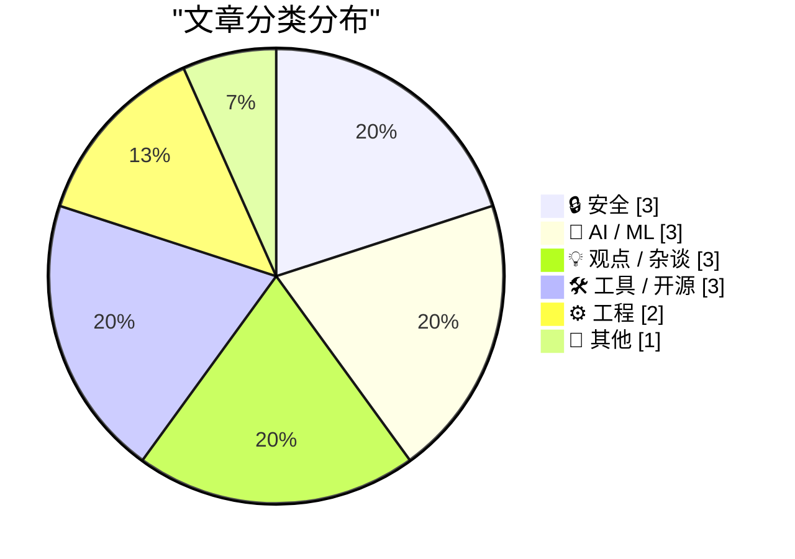
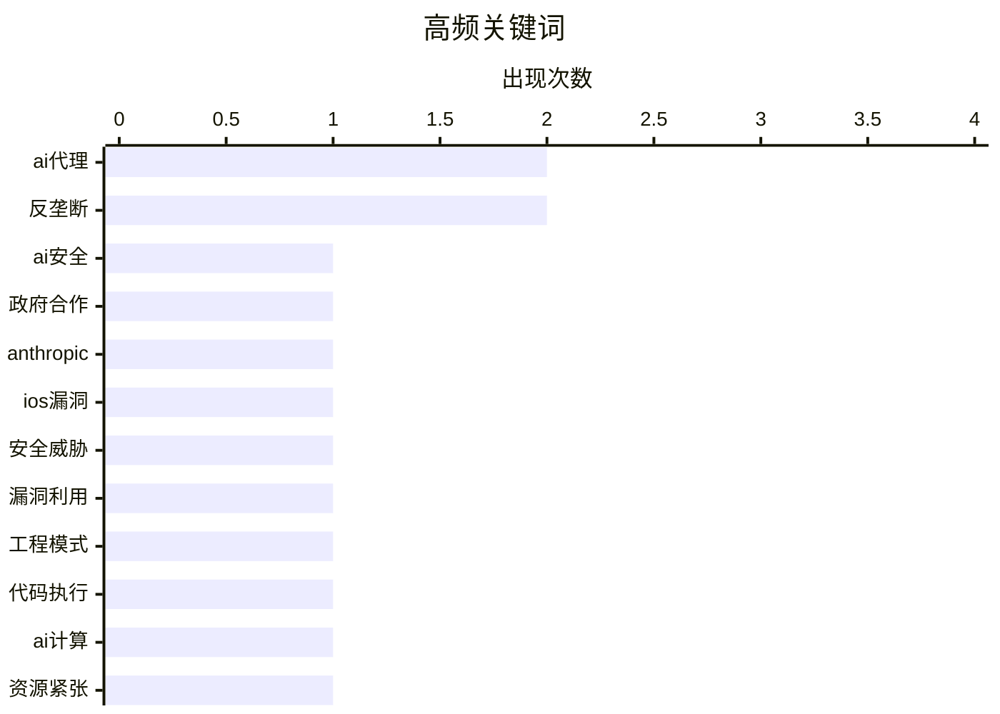

# 📰 AI 博客每日精选 — 2026-03-08

> 来自 Karpathy 推荐的 92 个顶级技术博客，AI 精选 Top 15

## 📝 今日看点

今日技术圈聚焦于人工智能的深度应用与网络安全的前沿挑战。智能体工程和算力短缺预警揭示技术发展瓶颈，而高级漏洞利用工具及国防合同伦理争议则凸显行业治理压力。开源生态正通过组织化协作应对这些复杂趋势。

---

## 🏆 今日必读

🥇 **Anthropic与五角大楼**

[Anthropic与五角大楼](https://simonwillison.net/2026/Mar/6/anthropic-and-the-pentagon/#atom-everything) — simonwillison.net · 1 天前 · 🔒 安全

> 文章探讨了人工智能公司与美国国防部签订合同所引发的行业与伦理争议。核心观点认为，顶级人工智能模型的性能已趋于同质化，成为商品，这使得合同授予更多基于商业关系而非技术优势。作者指出，此类国防合同可能重塑行业格局，并引发关于技术军事化应用的广泛担忧。结论是，这一事件标志着人工智能行业与国家安全之间日益紧密且复杂的联系进入了新阶段。

💡 **为什么值得读**: 本文提供了对当前人工智能巨头与政府合作这一敏感议题最深思熟虑且立足现实的分析视角。

🏷️ AI安全, 政府合作, Anthropic

🥈 **谷歌威胁情报组揭秘Coruna：一个来源神秘且功能强大的iOS漏洞利用工具包**

[谷歌威胁情报组揭秘Coruna：一个来源神秘且功能强大的iOS漏洞利用工具包](https://cloud.google.com/blog/topics/threat-intelligence/coruna-powerful-ios-exploit-kit) — daringfireball.net · 1 天前 · 🔒 安全

> 谷歌威胁情报组发现了一个针对苹果iPhone的新型高级漏洞利用工具包“Coruna”。该工具包针对从2019年9月发布的iOS 13.0到2023年12月发布的iOS 17.2.1之间的广泛系统版本。其核心价值在于包含了五条完整的iOS漏洞利用链，总计二十三个独立漏洞，构成了一个全面的iOS漏洞集合。这一发现揭示了针对iOS设备的高级持续威胁的存在。

💡 **为什么值得读**: 该报告详细披露了一个影响数亿iPhone用户、跨越多年系统版本的高危漏洞工具包，对理解移动安全威胁态势至关重要。

🏷️ iOS漏洞, 安全威胁, 漏洞利用

🥉 **智能体手动测试**

[智能体手动测试](https://simonwillison.net/guides/agentic-engineering-patterns/agentic-manual-testing/#atom-everything) — simonwillison.net · 1 天前 · 🤖 AI / ML

> 文章阐述了智能体工程中编码智能体的核心特征与验证原则。编码智能体的定义性特征在于其能够执行自身编写的代码，这使其比仅输出代码的大语言模型有用得多。关键原则是：绝不能假设大语言模型生成的代码可以工作，除非该代码已被执行。因此，手动测试环节对于验证智能体生成的代码是否符合预期至关重要，是确保结果可靠性的必要步骤。

💡 **为什么值得读**: 它清晰指出了在实际工程中安全、有效地使用编码智能体必须遵循的核心工作模式与验证底线。

🏷️ AI代理, 工程模式, 代码执行

---

## 📊 数据概览

| 扫描源 | 抓取文章 | 时间范围 | 精选 |
|:---:|:---:|:---:|:---:|
| 83/92 | 2404 篇 → 33 篇 | 48h | **15 篇** |

### 分类分布



### 高频关键词



<details>
<summary>📈 纯文本关键词图（终端友好）</summary>

```
ai代理      │ ████████████████████ 2
反垄断       │ ████████████████████ 2
ai安全      │ ██████████░░░░░░░░░░ 1
政府合作      │ ██████████░░░░░░░░░░ 1
anthropic │ ██████████░░░░░░░░░░ 1
ios漏洞     │ ██████████░░░░░░░░░░ 1
安全威胁      │ ██████████░░░░░░░░░░ 1
漏洞利用      │ ██████████░░░░░░░░░░ 1
工程模式      │ ██████████░░░░░░░░░░ 1
代码执行      │ ██████████░░░░░░░░░░ 1
```

</details>

### 🏷️ 话题标签

**ai代理**(2) · **反垄断**(2) · **ai安全**(1) · 政府合作(1) · anthropic(1) · ios漏洞(1) · 安全威胁(1) · 漏洞利用(1) · 工程模式(1) · 代码执行(1) · ai计算(1) · 资源紧张(1) · 大模型(1) · 应用商店(1) · 法律协议(1) · ai开源(1) · claude(1) · 维护者(1) · epic(1) · google(1)

---

## 🔒 安全

### 1. Anthropic与五角大楼

[Anthropic与五角大楼](https://simonwillison.net/2026/Mar/6/anthropic-and-the-pentagon/#atom-everything) — **simonwillison.net** · 1 天前 · ⭐ 26/30

> 文章探讨了人工智能公司与美国国防部签订合同所引发的行业与伦理争议。核心观点认为，顶级人工智能模型的性能已趋于同质化，成为商品，这使得合同授予更多基于商业关系而非技术优势。作者指出，此类国防合同可能重塑行业格局，并引发关于技术军事化应用的广泛担忧。结论是，这一事件标志着人工智能行业与国家安全之间日益紧密且复杂的联系进入了新阶段。

🏷️ AI安全, 政府合作, Anthropic

---

### 2. 谷歌威胁情报组揭秘Coruna：一个来源神秘且功能强大的iOS漏洞利用工具包

[谷歌威胁情报组揭秘Coruna：一个来源神秘且功能强大的iOS漏洞利用工具包](https://cloud.google.com/blog/topics/threat-intelligence/coruna-powerful-ios-exploit-kit) — **daringfireball.net** · 1 天前 · ⭐ 26/30

> 谷歌威胁情报组发现了一个针对苹果iPhone的新型高级漏洞利用工具包“Coruna”。该工具包针对从2019年9月发布的iOS 13.0到2023年12月发布的iOS 17.2.1之间的广泛系统版本。其核心价值在于包含了五条完整的iOS漏洞利用链，总计二十三个独立漏洞，构成了一个全面的iOS漏洞集合。这一发现揭示了针对iOS设备的高级持续威胁的存在。

🏷️ iOS漏洞, 安全威胁, 漏洞利用

---

### 3. 如何搭建自己的邮件服务器

[如何搭建自己的邮件服务器](https://blog.miguelgrinberg.com/post/how-to-host-your-own-email-server) — **miguelgrinberg.com** · 1 天前 · ⭐ 20/30

> 文章针对需要从自有平台发送账户邮件的场景，挑战了“自建邮件服务器极其困难”的普遍认知。作者详细介绍了使用开源邮件传输代理Postfix、搭配域名密钥识别邮件协议和发件人策略框架来保障送达率的步骤。通过自建方案，作者成功避免了依赖第三方邮件服务，实现了对关键通信链路的完全控制并节省了成本。实践表明，在云服务时代，自主托管核心基础设施仍是可行且富有价值的选项。

🏷️ 电子邮件服务器, 自托管, 配置

---

## 🤖 AI / ML

### 4. 智能体手动测试

[智能体手动测试](https://simonwillison.net/guides/agentic-engineering-patterns/agentic-manual-testing/#atom-everything) — **simonwillison.net** · 1 天前 · ⭐ 25/30

> 文章阐述了智能体工程中编码智能体的核心特征与验证原则。编码智能体的定义性特征在于其能够执行自身编写的代码，这使其比仅输出代码的大语言模型有用得多。关键原则是：绝不能假设大语言模型生成的代码可以工作，除非该代码已被执行。因此，手动测试环节对于验证智能体生成的代码是否符合预期至关重要，是确保结果可靠性的必要步骤。

🏷️ AI代理, 工程模式, 代码执行

---

### 5. AI算力短缺时代到来了吗

[AI算力短缺时代到来了吗](https://martinalderson.com/posts/is-the-ai-compute-crunch-here/?utm_source=rss&amp;utm_medium=rss&amp;utm_campaign=feed) — **martinalderson.com** · 1 天前 · ⭐ 25/30

> 文章基于当前人工智能应用的普及数据，对即将到来的算力短缺危机发出预警。仅Claude Code这一产品就拥有两三百万用户，约占知识工作者的百分之一。作者指出，从这个基数出发进行推算，未来人工智能算力需求将呈现指数级增长。现有的计算基础设施可能无法满足这种爆发式的需求增长。结论是，人工智能的广泛采用正将行业推向一个严峻的算力瓶颈。

🏷️ AI计算, 资源紧张, 大模型

---

### 6. 面向开源的Codex计划

[面向开源的Codex计划](https://simonwillison.net/2026/Mar/7/codex-for-open-source/#atom-everything) — **simonwillison.net** · 9 小时前 · ⭐ 23/30

> OpenAI宣布推出“面向开源的Codex”计划，为受欢迎的开源项目维护者提供免费高级访问权限。此举被视为对Anthropic此前类似计划的直接回应。该计划为符合条件的项目（如获得五千星标或百万次NPM下载）提供为期六个月的ChatGPT Pro订阅，并包含Codex模型访问权限。这体现了主流人工智能公司正在积极争夺开源开发者生态。

🏷️ AI开源, Claude, 维护者

---

## 💡 观点 / 杂谈

### 7. 蒂姆·斯威尼签署协议，放弃批评谷歌应用商店的权利直至2032年

[蒂姆·斯威尼签署协议，放弃批评谷歌应用商店的权利直至2032年](https://www.theverge.com/news/889595/tim-sweeney-signed-away-his-right-to-criticize-google-until-2032) — **daringfireball.net** · 1 天前 · ⭐ 24/30

> Epic Games首席执行官蒂姆·斯威尼在与谷歌达成和解后，签署了一份具有约束力的条款清单。该条款不仅放弃了就谷歌应用分发实践、费用等事项起诉或贬损该公司的权利，还限制他倡导对谷歌应用商店政策进行任何进一步修改。这份协议的有效期将持续到2032年，实质上在法律层面限制了他对谷歌的公开批评。此举标志着这位长期批评者被“禁声”。

🏷️ 应用商店, 反垄断, 法律协议

---

### 8. 胜诉‘Epic诉谷歌’案后，The Verge专访蒂姆·斯威尼

[胜诉‘Epic诉谷歌’案后，The Verge专访蒂姆·斯威尼](https://www.theverge.com/23996474/epic-tim-sweeney-interview-win-google-antitrust-lawsuit-district-court) — **daringfireball.net** · 1 天前 · ⭐ 23/30

> Epic Games首席执行官蒂姆·斯威尼在赢得对谷歌的反垄断诉讼后接受采访，对比了苹果与谷歌在反竞争策略上的差异。他用“苹果是冰，谷歌是火”的比喻来概括：苹果的垄断手段主要内化于其公司体系，强制推行统一条款；而谷歌则通过外部手段达成目标，例如四处收买游戏开发商、原始设备制造商和运营商。这一对比揭示了两种不同的平台控制模式。

🏷️ 反垄断, Epic, Google, 平台政策

---

### 9. 我过去对联邦宇宙的看法大错特错

[我过去对联邦宇宙的看法大错特错](https://matduggan.com/boy-i-was-wrong-about-the-fediverse/) — **matduggan.com** · 1 天前 · ⭐ 20/30

> 作者分享了对去中心化社交网络“联邦宇宙”的看法从质疑到认可的转变过程。最初，作者认为自己并非以线上社区为先的人，更倾向于将互联网作为维系现实关系的工具。然而，亲身体验后发现，联邦宇宙通过基于兴趣的社区和更友善的互动，成功构建了高质量的讨论环境。这一经历颠覆了作者认为去中心化平台难以形成有凝聚力社区的先入之见。

🏷️ 去中心化, 社交网络, Fediverse

---

## 🛠 工具 / 开源

### 10. npx workos

[npx workos](https://workos.com/docs/authkit/cli-installer?utm_source=tldrdev&amp;utm_medium=newsletter&amp;utm_campaign=q12026) — **daringfireball.net** · 4 小时前 · ⭐ 21/30

> WorkOS推出了一款名为“npx workos”的命令行工具，它本质上是一个由Claude驱动的AI智能体。该智能体能读取用户的项目代码，自动检测其技术栈框架，并将一套完整的身份验证集成方案直接写入现有代码库。它不是简单的模板生成器，而是能理解上下文并编写适配代码，之后还会进行类型检查与构建，并自动修复错误。这代表了一种高度自动化的开发集成新范式。

🏷️ CLI工具, AI代理, 认证

---

### 11. 宣布成立新的工作组

[宣布成立新的工作组](https://nesbitt.io/2026/03/07/announcing-new-working-groups.html) — **nesbitt.io** · 17 小时前 · ⭐ 21/30

> 开源基金会联盟宣布成立七个新的工作组。该联盟是一个由多个开源基金会组成的合作性组织。新工作组的成立旨在针对开源生态中的特定关键领域进行深入协作与规范制定。此举反映了开源社区正通过更紧密的组织化方式来应对共同挑战与推动发展。

🏷️ 开源, 基金会, 协作

---

### 12. 多元主义：网络因RSS与阅读模式而可忍受

[多元主义：网络因RSS与阅读模式而可忍受](https://pluralistic.net/2026/03/07/reader-mode/) — **pluralistic.net** · 9 小时前 · ⭐ 19/30

> 文章核心主张是使用RSS订阅和浏览器的阅读模式来对抗现代网络的碎片化与干扰，重塑宁静的阅读体验。RSS允许用户主动拉取信息，将控制权从算法推荐和平台设计中夺回，从而关注内容本身。阅读模式则能剥离网页上无关的广告、追踪器和杂乱布局，提供干净的文字界面。作者认为，这些工具是将网络从注意力经济中解放出来的实用手段。采用这些“慢网络”工具是重建个人在线信息主权、实现可持续数字生活的关键一步。

🏷️ RSS, 信息获取, 阅读模式

---

## ⚙️ 工程

### 13. 看情况

[看情况](https://idiallo.com/blog/it-depends-experts-never-give-straight-answers?src=feed) — **idiallo.com** · 1 天前 · ⭐ 21/30

> 文章探讨了资深技术专家在回答问题时为何常常给出“看情况”而非绝对答案的现象。作者通过早年与团队技术负责人的互动经历，指出诸如是否应立即升级数据库、操作系统或编程语言版本等问题，往往没有简单的“是”或“否”。这种回答方式背后反映的是对技术决策复杂性的尊重，需要考虑具体上下文、权衡利弊与潜在风险。结论是，“看情况”是一个负责任的专家在面对复杂系统时诚实且专业的体现。

🏷️ 软件工程, 决策, 沟通

---

### 14. 引用艾莉·皮霍夫斯基：审计遗留代码库的关键问题

[引用艾莉·皮霍夫斯基：审计遗留代码库的关键问题](https://simonwillison.net/2026/Mar/6/ally-piechowski/#atom-everything) — **simonwillison.net** · 1 天前 · ⭐ 19/30

> 文章引用了艾莉·皮霍夫斯基提出的一套用于评估遗留代码库健康状况的尖锐问题。面向开发者的问题旨在揭示代码中最脆弱、最令人恐惧的部分以及测试覆盖的盲区。面向技术主管或工程经理的问题则聚焦于长期被阻塞的功能、生产环境故障的可见性以及团队的技术债务认知。这套问题清单是快速诊断团队信心与系统稳定性的高效工具。

🏷️ Rails, 代码审计, 遗留系统

---

## 📝 其他

### 15. 阅读清单：数据中心离网运行与太阳能电池效率突破

[阅读清单：数据中心离网运行与太阳能电池效率突破](https://www.construction-physics.com/p/reading-list-03072026) — **construction-physics.com** · 14 小时前 · ⭐ 20/30

> 本期阅读清单聚焦能源与科技行业的关键动态。数据中心开始探索脱离电网独立运行，太阳能电池实验室效率创下33.9%的新纪录。同时，清单还涉及战略石油储备设施的维修争议、福特公司在电动车战略上的失误，以及OpenAI前首席技术官的新创业项目。这些动态共同勾勒出当前基础设施与技术前沿的挑战与机遇。

🏷️ 数据中心, AI, 能源

---

*生成于 2026-03-08 03:36 | 扫描 83 源 → 获取 2404 篇 → 精选 15 篇*
*基于 [Hacker News Popularity Contest 2025](https://refactoringenglish.com/tools/hn-popularity/) RSS 源列表，由 [Andrej Karpathy](https://x.com/karpathy) 推荐*
