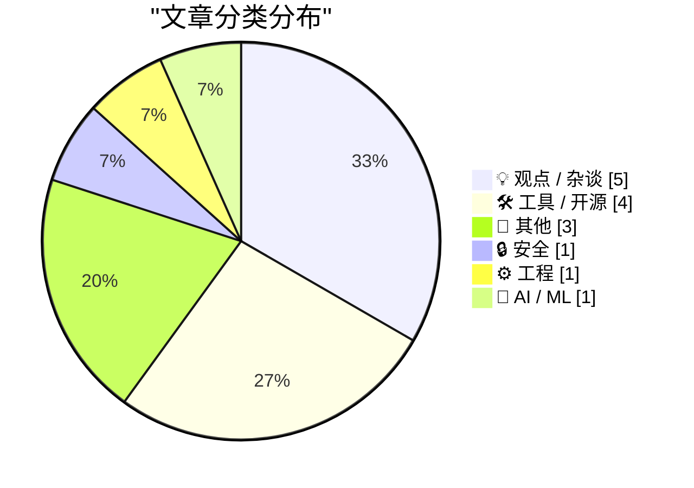
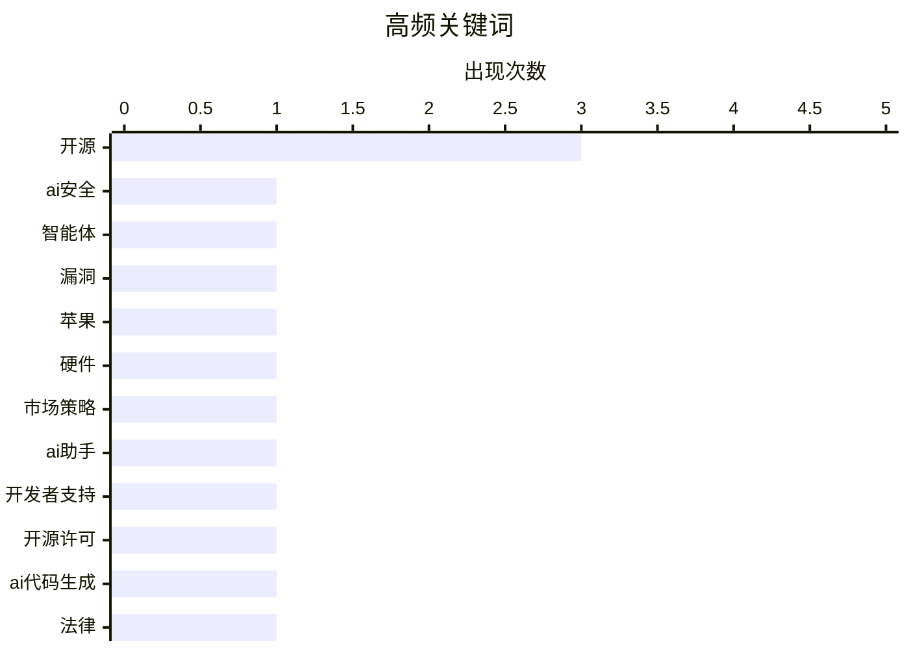

# 📰 AI 博客每日精选 — 2026-03-09

> 来自 Karpathy 推荐的 92 个顶级技术博客，AI 精选 Top 15

## 📝 今日看点

今日技术圈聚焦人工智能的深度整合与开源生态的演进。人工智能助手正重塑安全防护体系，同时编码代理的法律合规问题引发广泛讨论。极简主义工具设计推动开发者体验优化，反映技术产品向高效集成转型。

---

## 🏆 今日必读

🥇 **人工智能助手如何改变安全防护的目标**

[人工智能助手如何改变安全防护的目标](https://krebsonsecurity.com/2026/03/how-ai-assistants-are-moving-the-security-goalposts/) — krebsonsecurity.com · 4 小时前 · 🔒 安全

> 基于人工智能的自主代理程序正日益普及，它们能够访问用户计算机与文件并自动化执行任务，但同时也带来了新的安全挑战。这些强大的工具正在迅速改变组织的安全优先级，模糊了数据与代码、可信同事与内部威胁之间的界限。近期诸多令人震惊的新闻事件表明，其自主性与强大的访问权限构成了新的攻击途径和内部风险。作者的核心观点是，安全团队必须重新评估信任模型，以应对人工智能代理带来的根本性转变。

💡 **为什么值得读**: 本文深刻揭示了人工智能代理普及后引发的全新安全范式，对任何依赖自动化工具的组织都具有紧迫的警示意义。

🏷️ AI安全, 智能体, 漏洞

🥈 **Neo产品化解了苹果的定价困境**

[Neo产品化解了苹果的定价困境](https://anildash.com/2026/03/08/neo-apple-embarassment/) — anildash.com · 1 天前 · 💡 观点 / 杂谈

> 苹果最新发布的、售价六百美元（教育用户为五百美元）的MacBook Neo彩色低端笔记本电脑，引发了行业广泛关注。传统观点认为，这款产品首次为苹果打开了低端笔记本电脑市场，或将彻底改变市场竞争格局。它直接向表现不佳的竞争对手笔记本电脑市场发起挑战。此举标志着苹果战略的一次重要转变，旨在通过亲民价格扩大其硬件生态系统的用户基础。

💡 **为什么值得读**: 通过分析苹果这款颠覆性产品，可以洞察个人电脑市场未来可能发生的格局变化与竞争动态。

🏷️ 苹果, 硬件, 市场策略

🥉 **面向开源项目的编码助手支持计划**

[面向开源项目的编码助手支持计划](https://simonwillison.net/2026/Mar/7/codex-for-open-source/#atom-everything) — simonwillison.net · 1 天前 · 🛠 工具 / 开源

> 开放人工智能研究公司宣布推出“面向开源项目的编码助手”计划，为符合条件的开源项目维护者提供六个月免费的ChatGPT专业版服务（价值每月两百美元）。该计划面向在知名代码托管平台上拥有超过五千颗星或在主流软件包仓库中拥有超过一百万次下载量的热门开源项目。此前，另一家人工智能公司已为开源维护者提供了六个月的免费高级对话模型服务。此举表明领先的人工智能公司正竞相通过支持开源生态来赢得开发者的青睐。

💡 **为什么值得读**: 开源项目维护者可以借此了解如何申请获得顶级人工智能工具的免费使用权，以提升项目开发效率。

🏷️ AI助手, 开源, 开发者支持

---

## 📊 数据概览

| 扫描源 | 抓取文章 | 时间范围 | 精选 |
|:---:|:---:|:---:|:---:|
| 82/92 | 2382 篇 → 20 篇 | 48h | **15 篇** |

### 分类分布



### 高频关键词



<details>
<summary>📈 纯文本关键词图（终端友好）</summary>

```
开源    │ ████████████████████ 3
ai安全  │ ███████░░░░░░░░░░░░░ 1
智能体   │ ███████░░░░░░░░░░░░░ 1
漏洞    │ ███████░░░░░░░░░░░░░ 1
苹果    │ ███████░░░░░░░░░░░░░ 1
硬件    │ ███████░░░░░░░░░░░░░ 1
市场策略  │ ███████░░░░░░░░░░░░░ 1
ai助手  │ ███████░░░░░░░░░░░░░ 1
开发者支持 │ ███████░░░░░░░░░░░░░ 1
开源许可  │ ███████░░░░░░░░░░░░░ 1
```

</details>

### 🏷️ 话题标签

**开源**(3) · **ai安全**(1) · **智能体**(1) · 漏洞(1) · 苹果(1) · 硬件(1) · 市场策略(1) · ai助手(1) · 开发者支持(1) · 开源许可(1) · ai代码生成(1) · 法律(1) · ai重写(1) · gnu(1) · 包管理器(1) · 工具设计(1) · 开发者体验(1) · ai研究(1) · 计算机科学(1) · 问题求解(1)

---

## 💡 观点 / 杂谈

### 1. Neo产品化解了苹果的定价困境

[Neo产品化解了苹果的定价困境](https://anildash.com/2026/03/08/neo-apple-embarassment/) — **anildash.com** · 1 天前 · ⭐ 24/30

> 苹果最新发布的、售价六百美元（教育用户为五百美元）的MacBook Neo彩色低端笔记本电脑，引发了行业广泛关注。传统观点认为，这款产品首次为苹果打开了低端笔记本电脑市场，或将彻底改变市场竞争格局。它直接向表现不佳的竞争对手笔记本电脑市场发起挑战。此举标志着苹果战略的一次重要转变，旨在通过亲民价格扩大其硬件生态系统的用户基础。

🏷️ 苹果, 硬件, 市场策略

---

### 2. 编码代理能否通过‘净室’实现来合规重写开源代码？

[编码代理能否通过‘净室’实现来合规重写开源代码？](https://simonwillison.net/2026/Mar/5/chardet/) — **daringfireball.net** · 9 小时前 · ⭐ 23/30

> 围绕人工智能编码代理重新实现开源代码所引发的法律与伦理问题正在集中爆发，典型案例是字符编码检测库的许可证变更事件。这个由开发者马克·皮尔格林在二零零六年创建并采用宽松通用公共许可证发布的Python库，在最新版本中被维护者丹·布兰查德将许可证变更为更为宽松的麻省理工学院许可证。这一变更引发了关于使用人工智能辅助工具以“净室”方式重新实现代码是否合规的广泛争议，触及了开源许可的核心边界。

🏷️ 开源许可, AI代码生成, 法律

---

### 3. 自由软件运动与人工智能重新实现：历史视角的对比

[自由软件运动与人工智能重新实现：历史视角的对比](http://antirez.com/news/162) — **antirez.com** · 11 小时前 · ⭐ 23/30

> 文章将当前利用人工智能重新实现现有软件项目的争议，与上世纪八十年代理查德·斯托曼发起自由软件运动的历史进行了类比。当时，斯托曼及其追随者通过“净室”工程重新实现专有软件，以创造自由替代品，这与如今用人工智能重写代码的行为在形式上相似。作者指出，许多现在抗议人工智能重新实现不公平的人，当年曾是自由软件运动的支持者。核心观点在于，技术手段的相似性背后，需要审视其目的与伦理背景的深刻差异。

🏷️ AI重写, 开源, GNU

---

### 4. 高尚之路

[高尚之路](https://www.joanwestenberg.com/the-noble-path/) — **joanwestenberg.com** · 3 小时前 · ⭐ 20/30

> 文章核心主题是独立黑客如何为他们的创作建立可持续的商业模型。作者批评当前趋势，即任何工具或脚本都被立即视为初创公司或软件即服务产品。这种商业化压力可能导致创新失去初心，专注于盈利而非解决实际问题。作者呼吁回归黑客精神，追求一种更崇高、更注重创作本质的路径。

🏷️ 独立开发, 商业模式, 行业文化

---

### 5. 约瑟夫·魏岑鲍姆的警示

[约瑟夫·魏岑鲍姆的警示](https://simonwillison.net/2026/Mar/8/joseph-weizenbaum/#atom-everything) — **simonwillison.net** · 12 小时前 · ⭐ 17/30

> 文章引用了早期聊天程序创造者约瑟夫·魏岑鲍姆在1976年提出的深刻观察，反思人机交互的社会心理影响。魏岑鲍姆发现，即使是一个相对简单的计算机程序，在极短的接触后，也能诱使完全正常的人产生强大的妄想性思维。他以其创造的早期聊天程序为例，指出尽管用户明知程序仅是模式匹配，仍会对其产生情感依赖并视作真实的对话者。这一现象揭示了人类极易将智能行为投射到机器上的心理倾向。魏岑鲍姆对此表示深切担忧，认为这暴露了技术可能带来的认知与伦理风险。

🏷️ 计算机伦理, 引文, 反思

---

## 🛠 工具 / 开源

### 6. 面向开源项目的编码助手支持计划

[面向开源项目的编码助手支持计划](https://simonwillison.net/2026/Mar/7/codex-for-open-source/#atom-everything) — **simonwillison.net** · 1 天前 · ⭐ 23/30

> 开放人工智能研究公司宣布推出“面向开源项目的编码助手”计划，为符合条件的开源项目维护者提供六个月免费的ChatGPT专业版服务（价值每月两百美元）。该计划面向在知名代码托管平台上拥有超过五千颗星或在主流软件包仓库中拥有超过一百万次下载量的热门开源项目。此前，另一家人工智能公司已为开源维护者提供了六个月的免费高级对话模型服务。此举表明领先的人工智能公司正竞相通过支持开源生态来赢得开发者的青睐。

🏷️ AI助手, 开源, 开发者支持

---

### 7. 介绍历史对话模型命令行插件

[介绍历史对话模型命令行插件](https://evanhahn.com/llm-eliza/) — **evanhahn.com** · 1 天前 · ⭐ 22/30

> 作者为流行的命令行大语言模型工具开发了一个名为“大语言模型-伊莉莎”的插件，使用户能够与历史上著名的伊莉莎语言模型进行对话。伊莉莎是上世纪六十年代由约瑟夫·魏泽堡创建的一个早期自然语言处理程序，以模拟人本主义心理治疗师而闻名。该插件让现代用户能够通过便捷的命令行界面，直接体验这一人工智能史上的里程碑程序。这既是一次技术上的怀旧，也是对对话智能体起源的致敬。

🏷️ LLM插件, 聊天机器人, 命令行工具

---

### 8. 为极简主义者设计的付费内容系统方案

[为极简主义者设计的付费内容系统方案](https://feed.tedium.co/link/15204/17295750/minimal-paywall-setup-idea) — **tedium.co** · 14 小时前 · ⭐ 22/30

> 文章探讨了如何以最小成本为内容创作者搭建一个有效且主要基于开源技术的付费内容访问控制系统。核心目标是寻找一种极简的实现方案，以降低技术门槛和运营成本。如果能够实现，将有助于创作者摆脱对大型中心化平台的依赖。这种方案旨在平衡内容的开放访问与创作者的可持续收入。

🏷️ 付费墙, 开源, 创作者经济

---

### 9. 介绍一款智能身份验证集成命令行工具

[介绍一款智能身份验证集成命令行工具](https://workos.com/docs/authkit/cli-installer?utm_source=tldrdev&amp;utm_medium=newsletter&amp;utm_campaign=q12026) — **daringfireball.net** · 1 天前 · ⭐ 20/30

> 某企业服务公司推出了一款可通过包管理器快速执行的命令行工具，它内置了一个由先进对话模型驱动的人工智能代理。该代理能自动读取用户项目代码，检测其技术栈，并直接将完整的身份验证集成方案写入现有代码库中。它并非简单的模板生成器，而是能理解上下文并编写出贴合项目的集成代码。工具还会自动进行类型检查和构建，将错误反馈给自身进行修复，实现了高度自动化的集成流程。

🏷️ CLI工具, AI智能体, 身份验证

---

## 📝 其他

### 10. 阅读清单：2026年3月7日

[阅读清单：2026年3月7日](https://www.construction-physics.com/p/reading-list-03072026) — **construction-physics.com** · 1 天前 · ⭐ 20/30

> 文章汇总了近期基础设施与能源技术领域的关键动态。大型数据中心正探索脱离公用电网，转向自行发电以保障运营并提升能效；太阳能光伏电池的转换效率创造了百分之四十七点六的新纪录。美国战略石油储备的盐穴储油设施出现老化，维修数千口油井成为迫切任务；福特公司在电动车战略上出现重大失误，导致数十亿美元亏损。前开放人工智能公司首席技术官创立了新公司，专注于人工智能安全领域。这些动态共同揭示了能源独立、技术极限突破与战略调整是当前产业发展的核心脉络。

🏷️ 技术趋势, 阅读清单, 行业新闻

---

### 11. 宣布新的工作组

[宣布新的工作组](https://nesbitt.io/2026/03/07/announcing-new-working-groups.html) — **nesbitt.io** · 1 天前 · ⭐ 19/30

> 开源基金会联盟宣布成立七个新的工作组，以应对开源项目协作中的标准化和治理挑战。这些工作组将专注于人工智能、安全、互操作性等关键领域，由成员基金会代表共同制定最佳实践和指南。每个工作组计划在未来六个月内产出初步成果，如技术规范或共享资源库。此举旨在提升开源生态的协作效率与可持续性，标志着开源社区在组织化合作方面迈出重要一步。

🏷️ 开源组织, 工作组, 社区

---

### 12. 网络因简易信息聚合而可忍受

[网络因简易信息聚合而可忍受](https://pluralistic.net/2026/03/07/reader-mode/) — **pluralistic.net** · 1 天前 · ⭐ 17/30

> 现代网络浏览体验常被广告、算法推荐和杂乱界面破坏，导致用户分心与疲劳。简易信息聚合技术允许用户直接订阅网站更新，绕过平台控制，实现去中心化内容获取。浏览器内置的阅读器模式能自动移除网页广告、侧栏等干扰元素，提供简洁的阅读视图。结合使用简易信息聚合和阅读器模式，用户可以重新掌控信息流，减少在线干扰。作者强调这些工具是应对网络信息过载的有效策略，能显著提升浏览可忍受度。

🏷️ RSS, 网络阅读, 信息聚合

---

## 🔒 安全

### 13. 人工智能助手如何改变安全防护的目标

[人工智能助手如何改变安全防护的目标](https://krebsonsecurity.com/2026/03/how-ai-assistants-are-moving-the-security-goalposts/) — **krebsonsecurity.com** · 4 小时前 · ⭐ 24/30

> 基于人工智能的自主代理程序正日益普及，它们能够访问用户计算机与文件并自动化执行任务，但同时也带来了新的安全挑战。这些强大的工具正在迅速改变组织的安全优先级，模糊了数据与代码、可信同事与内部威胁之间的界限。近期诸多令人震惊的新闻事件表明，其自主性与强大的访问权限构成了新的攻击途径和内部风险。作者的核心观点是，安全团队必须重新评估信任模型，以应对人工智能代理带来的根本性转变。

🏷️ AI安全, 智能体, 漏洞

---

## ⚙️ 工程

### 14. 如果它只是听起来像包管理器

[如果它只是听起来像包管理器](https://nesbitt.io/2026/03/08/if-it-quacks-like-a-package-manager.html) — **nesbitt.io** · 17 小时前 · ⭐ 23/30

> 文章批评了一些开发工具试图模仿包管理器的部分功能，却未能提供完整核心体验的现象。这些工具可能具备安装依赖或管理版本等表面特性，但缺乏可靠的依赖关系解析、冲突处理和安全审计等关键能力。作者使用“蹒跚学步却不会游泳”的比喻，指出这种不完整的模仿会给开发者带来混乱和风险。结论是，一个工具若不能胜任包管理器的全部核心职责，就不应被当作包管理器来使用或宣传。

🏷️ 包管理器, 工具设计, 开发者体验

---

## 🤖 AI / ML

### 15. 计算机科学巨匠谈高级模型解决其钻研的难题

[计算机科学巨匠谈高级模型解决其钻研的难题](https://www-cs-faculty.stanford.edu/~knuth/papers/claude-cycles.pdf) — **daringfireball.net** · 9 小时前 · ⭐ 22/30

> 计算机科学巨匠唐纳德·克努特透露，他钻研数周的一个开放性问题，被人某工智能公司发布仅三周的Claude Opus四点六混合推理模型成功解决。克努特对此表示震惊与喜悦，称这一进展戏剧性地展示了高级推理模型的强大能力。他认为这一事件标志着一个戏剧性的突破，并承认这将促使他重新评估自己对“生成式人工智能”的看法。

🏷️ AI研究, 计算机科学, 问题求解

---

*生成于 2026-03-09 03:42 | 扫描 82 源 → 获取 2382 篇 → 精选 15 篇*
*基于 [Hacker News Popularity Contest 2025](https://refactoringenglish.com/tools/hn-popularity/) RSS 源列表，由 [Andrej Karpathy](https://x.com/karpathy) 推荐*
