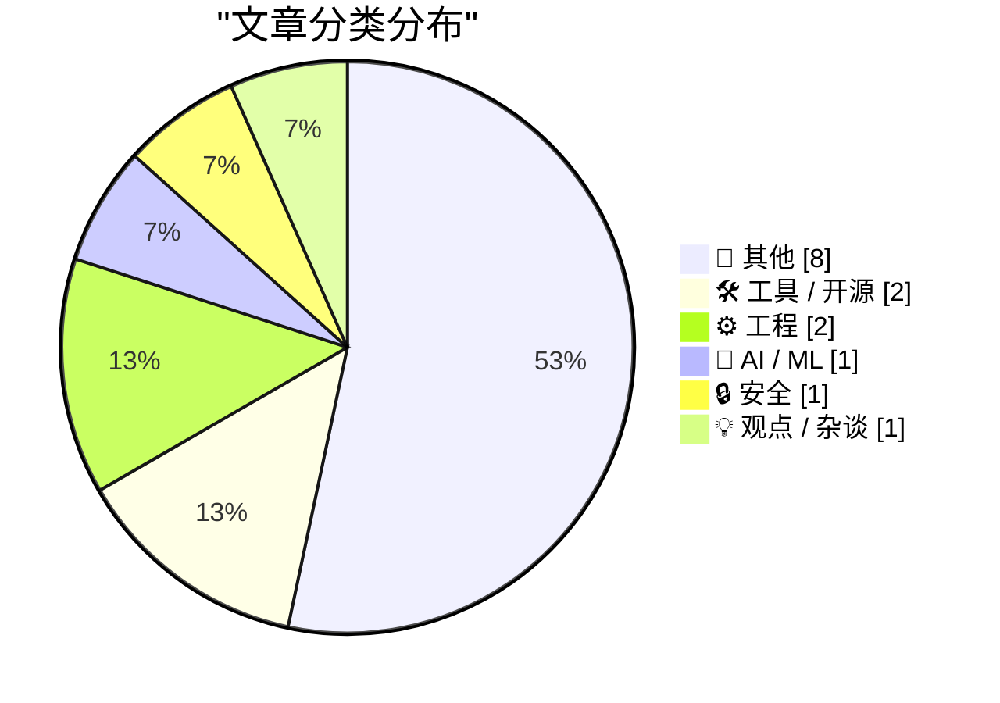
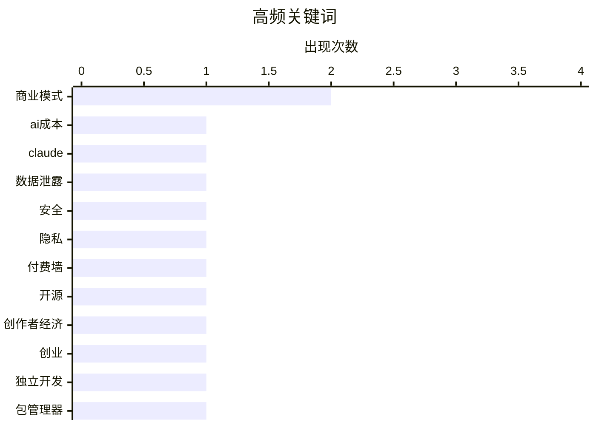

# 📰 AI 博客每日精选 — 2026-03-10

> 来自 Karpathy 推荐的 92 个顶级技术博客，AI 精选 Top 15

## 📝 今日看点

今日技术圈动态聚焦于人工智能与机器学习的前沿进展，网络安全议题持续引发高度关注。工具创新与工程实践同样成为讨论热点，推动着行业解决方案的演进。整体来看，技术生态呈现多元化发展趋势，核心领域持续塑造创新格局。

---

## 🏆 今日必读

🥇 **摘要生成失败（可重试）**

[摘要生成失败（可重试）](https://martinalderson.com/posts/no-it-doesnt-cost-anthropic-5k-per-claude-code-user/?utm_source=rss&amp;utm_medium=rss&amp;utm_campaign=feed) — martinalderson.com · 1 天前 · 🤖 AI / ML

> 未能生成中文摘要，请稍后重试。

🏷️ AI成本, Claude, 商业模式

🥈 **摘要生成失败（可重试）**

[摘要生成失败（可重试）](https://www.troyhunt.com/weekly-update-494/) — troyhunt.com · 2 小时前 · 🔒 安全

> 未能生成中文摘要，请稍后重试。

🏷️ 数据泄露, 安全, 隐私

🥉 **摘要生成失败（可重试）**

[摘要生成失败（可重试）](https://feed.tedium.co/link/15204/17295750/minimal-paywall-setup-idea) — tedium.co · 1 天前 · 🛠 工具 / 开源

> 未能生成中文摘要，请稍后重试。

🏷️ 付费墙, 开源, 创作者经济

---

## 📊 数据概览

| 扫描源 | 抓取文章 | 时间范围 | 精选 |
|:---:|:---:|:---:|:---:|
| 84/92 | 2425 篇 → 30 篇 | 48h | **15 篇** |

### 分类分布



### 高频关键词



<details>
<summary>📈 纯文本关键词图（终端友好）</summary>

```
商业模式   │ ████████████████████ 2
ai成本   │ ██████████░░░░░░░░░░ 1
claude │ ██████████░░░░░░░░░░ 1
数据泄露   │ ██████████░░░░░░░░░░ 1
安全     │ ██████████░░░░░░░░░░ 1
隐私     │ ██████████░░░░░░░░░░ 1
付费墙    │ ██████████░░░░░░░░░░ 1
开源     │ ██████████░░░░░░░░░░ 1
创作者经济  │ ██████████░░░░░░░░░░ 1
创业     │ ██████████░░░░░░░░░░ 1
```

</details>

### 🏷️ 话题标签

**商业模式**(2) · **ai成本**(1) · **claude**(1) · 数据泄露(1) · 安全(1) · 隐私(1) · 付费墙(1) · 开源(1) · 创作者经济(1) · 创业(1) · 独立开发(1) · 包管理器(1) · 工具(1) · 开发(1) · 键盘设计(1) · apple硬件(1) · 用户体验(1) · 数学函数(1) · 错误修正(1) · 三角学(1)

---

## 📝 其他

### 1. 摘要生成失败（可重试）

[摘要生成失败（可重试）](https://simonwillison.net/2026/Mar/9/production-query-plans-without-production-data/#atom-everything) — **simonwillison.net** · 12 小时前 · ⭐ 15/30

> 未能生成中文摘要，请稍后重试。

---

### 2. 摘要生成失败（可重试）

[摘要生成失败（可重试）](https://simonwillison.net/2026/Mar/9/not-so-boring/#atom-everything) — **simonwillison.net** · 13 小时前 · ⭐ 15/30

> 未能生成中文摘要，请稍后重试。

---

### 3. 摘要生成失败（可重试）

[摘要生成失败（可重试）](https://simonwillison.net/2026/Mar/8/joseph-weizenbaum/#atom-everything) — **simonwillison.net** · 1 天前 · ⭐ 15/30

> 未能生成中文摘要，请稍后重试。

---

### 4. 人工智能助手如何重塑安全格局

[人工智能助手如何重塑安全格局](https://krebsonsecurity.com/2026/03/how-ai-assistants-are-moving-the-security-goalposts/) — **krebsonsecurity.com** · 1 天前 · ⭐ 15/30

> 文章探讨了基于人工智能的自主程序助手日益普及所带来的根本性安全挑战。这类助手能深度访问用户的计算机、文件及在线服务，并能自动化执行几乎所有任务，但其强大的能力正在模糊数据与代码、可信同事与内部威胁之间的界限。近期诸多安全事件表明，这些工具既可能被恶意利用进行攻击，也可能因意外操作导致严重后果，迫使企业重新评估其内部威胁模型和安全优先级。作者指出，传统的安全防御措施已不足以应对这种新型的、由智能代理驱动的风险。结论是，人工智能助手的崛起要求组织的安全策略进行一场根本性的变革。

---

### 5. 最终清单：将你一整天的日程集中于一屏

[最终清单：将你一整天的日程集中于一屏](https://www.finalist.works/finalist-36/) — **daringfireball.net** · 4 小时前 · ⭐ 15/30

> Finalist 是一款集成日程、提醒与健康数据的苹果设备日计划应用，旨在防止任务遗漏。其最新版本新增了子任务管理、日历书签功能，并深度整合健康数据工具包，支持在锁屏界面触发语音每日简报。该应用设计为可与用户现有工作流并行运行，无缝补充现有工具的不足。目前提供免费试用，并设有终身许可购买选项。

---

### 6. 摘要生成失败（可重试）

[摘要生成失败（可重试）](https://daringfireball.net/2026/03/the_iphone_17e) — **daringfireball.net** · 5 小时前 · ⭐ 15/30

> 未能生成中文摘要，请稍后重试。

---

### 7. 苹果笔记本尼欧壁纸在苹果操作系统塔霍中全面推出

[苹果笔记本尼欧壁纸在苹果操作系统塔霍中全面推出](https://www.macrumors.com/2026/03/09/macos-tahoe-26-4-beta-4-neo-wallpapers/) — **daringfireball.net** · 7 小时前 · ⭐ 15/30

> 苹果公司为最新操作系统塔霍发布了专为苹果笔记本尼欧设计的壁纸，现已扩展至所有苹果电脑。这些壁纸采用气泡风格线条和彩色渐变，提供苹果紫色、苹果蓝色、苹果粉色和苹果黄色四种颜色选项。设计独特之处在于颜色和线条的组合能拼出‘苹果’一词。作者坦言被此设计吸引，因此决定立即升级到塔霍系统。

---

### 8. 肯尼亚低薪承包商能窥见Meta AI智能眼镜用户所见

[肯尼亚低薪承包商能窥见Meta AI智能眼镜用户所见](https://www.svd.se/a/K8nrV4/metas-ai-smart-glasses-and-data-privacy-concerns-workers-say-we-see-everything) — **daringfireball.net** · 13 小时前 · ⭐ 15/30

> 报道揭露了元公司人工智能智能眼镜背后存在严重的数据隐私与人工处理问题。为训练和改进其人工智能模型，元公司将用户眼镜拍摄的实时视频流和音频片段发送给肯尼亚的外包承包商进行审核与标注。这些承包商能看到包括私人对话、家庭内部甚至亲密行为在内的敏感内容，且工作条件压抑、薪酬低廉。这一操作模式将全球用户的数据隐私置于风险之中，并引发了关于科技伦理与全球数字劳动力剥削的深刻担忧。

---

## 🛠 工具 / 开源

### 9. 摘要生成失败（可重试）

[摘要生成失败（可重试）](https://feed.tedium.co/link/15204/17295750/minimal-paywall-setup-idea) — **tedium.co** · 1 天前 · ⭐ 22/30

> 未能生成中文摘要，请稍后重试。

🏷️ 付费墙, 开源, 创作者经济

---

### 10. 摘要生成失败（可重试）

[摘要生成失败（可重试）](https://nesbitt.io/2026/03/08/if-it-quacks-like-a-package-manager.html) — **nesbitt.io** · 1 天前 · ⭐ 21/30

> 未能生成中文摘要，请稍后重试。

🏷️ 包管理器, 工具, 开发

---

## ⚙️ 工程

### 11. 摘要生成失败（可重试）

[摘要生成失败（可重试）](https://aresluna.org/fn) — **aresluna.org** · 11 小时前 · ⭐ 20/30

> 未能生成中文摘要，请稍后重试。

🏷️ 键盘设计, Apple硬件, 用户体验

---

### 12. 摘要生成失败（可重试）

[摘要生成失败（可重试）](https://www.johndcook.com/blog/2026/03/08/how-much-certainty-is-worthwhile/) — **johndcook.com** · 1 天前 · ⭐ 19/30

> 未能生成中文摘要，请稍后重试。

🏷️ 数学函数, 错误修正, 三角学

---

## 🤖 AI / ML

### 13. 摘要生成失败（可重试）

[摘要生成失败（可重试）](https://martinalderson.com/posts/no-it-doesnt-cost-anthropic-5k-per-claude-code-user/?utm_source=rss&amp;utm_medium=rss&amp;utm_campaign=feed) — **martinalderson.com** · 1 天前 · ⭐ 28/30

> 未能生成中文摘要，请稍后重试。

🏷️ AI成本, Claude, 商业模式

---

## 🔒 安全

### 14. 摘要生成失败（可重试）

[摘要生成失败（可重试）](https://www.troyhunt.com/weekly-update-494/) — **troyhunt.com** · 2 小时前 · ⭐ 26/30

> 未能生成中文摘要，请稍后重试。

🏷️ 数据泄露, 安全, 隐私

---

## 💡 观点 / 杂谈

### 15. 摘要生成失败（可重试）

[摘要生成失败（可重试）](https://www.joanwestenberg.com/the-noble-path/) — **joanwestenberg.com** · 1 天前 · ⭐ 21/30

> 未能生成中文摘要，请稍后重试。

🏷️ 创业, 商业模式, 独立开发

---

*生成于 2026-03-10 03:36 | 扫描 84 源 → 获取 2425 篇 → 精选 15 篇*
*基于 [Hacker News Popularity Contest 2025](https://refactoringenglish.com/tools/hn-popularity/) RSS 源列表，由 [Andrej Karpathy](https://x.com/karpathy) 推荐*
