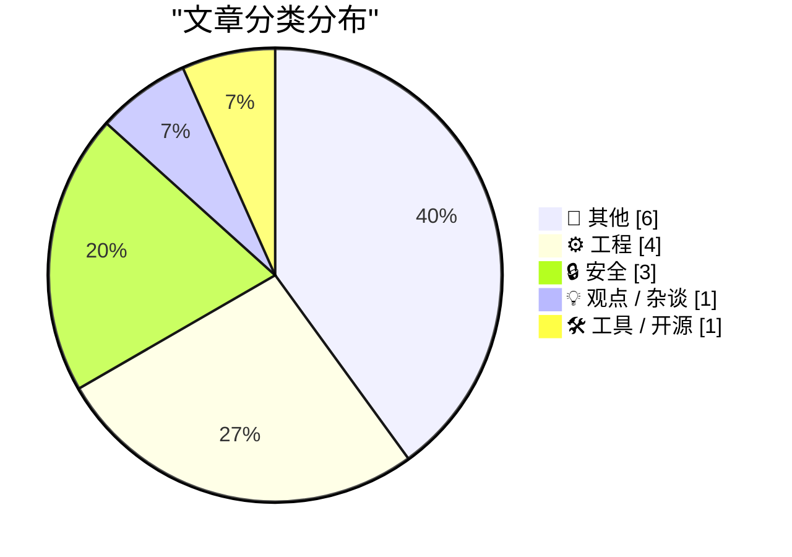
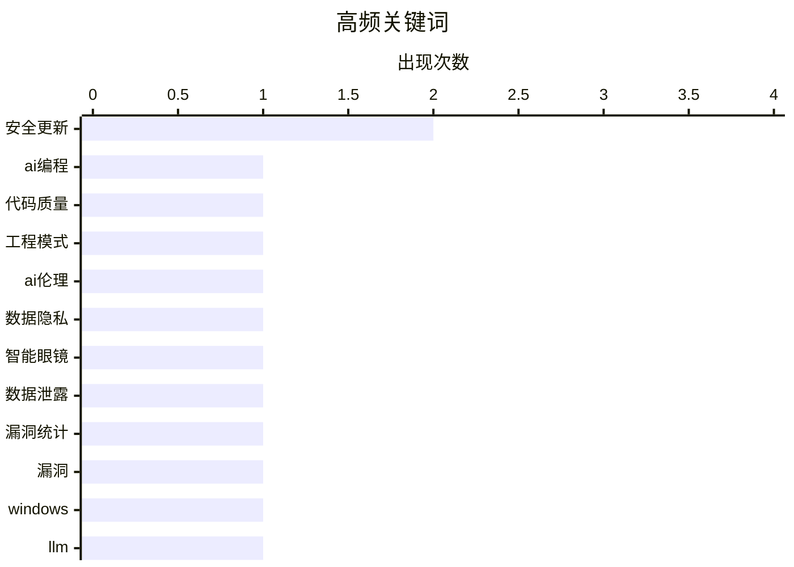

# 📰 AI 博客每日精选 — 2026-03-11

> 来自 Karpathy 推荐的 92 个顶级技术博客，AI 精选 Top 15

## 📝 今日看点

今日技术圈持续聚焦工程实践与网络安全两大主线。工程领域围绕系统优化与创新方法展开深入探讨，安全议题则凸显对潜在威胁的强化应对。此外，工具迭代与行业观点碰撞也为技术发展注入新动能。

---

## 🏆 今日必读

🥇 **摘要生成失败（可重试）**

[摘要生成失败（可重试）](https://simonwillison.net/guides/agentic-engineering-patterns/better-code/#atom-everything) — simonwillison.net · 5 小时前 · ⚙️ 工程

> 未能生成中文摘要，请稍后重试。

🏷️ AI编程, 代码质量, 工程模式

🥈 **摘要生成失败（可重试）**

[摘要生成失败（可重试）](https://www.svd.se/a/K8nrV4/metas-ai-smart-glasses-and-data-privacy-concerns-workers-say-we-see-everything) — daringfireball.net · 1 天前 · 🔒 安全

> 未能生成中文摘要，请稍后重试。

🏷️ AI伦理, 数据隐私, 智能眼镜

🥉 **摘要生成失败（可重试）**

[摘要生成失败（可重试）](https://www.troyhunt.com/weekly-update-494/) — troyhunt.com · 1 天前 · 🔒 安全

> 未能生成中文摘要，请稍后重试。

🏷️ 数据泄露, 安全更新, 漏洞统计

---

## 📊 数据概览

| 扫描源 | 抓取文章 | 时间范围 | 精选 |
|:---:|:---:|:---:|:---:|
| 82/92 | 2388 篇 → 34 篇 | 48h | **15 篇** |

### 分类分布



### 高频关键词



<details>
<summary>📈 纯文本关键词图（终端友好）</summary>

```
安全更新 │ ████████████████████ 2
ai编程 │ ██████████░░░░░░░░░░ 1
代码质量 │ ██████████░░░░░░░░░░ 1
工程模式 │ ██████████░░░░░░░░░░ 1
ai伦理 │ ██████████░░░░░░░░░░ 1
数据隐私 │ ██████████░░░░░░░░░░ 1
智能眼镜 │ ██████████░░░░░░░░░░ 1
数据泄露 │ ██████████░░░░░░░░░░ 1
漏洞统计 │ ██████████░░░░░░░░░░ 1
漏洞   │ ██████████░░░░░░░░░░ 1
```

</details>

### 🏷️ 话题标签

**安全更新**(2) · **ai编程**(1) · **代码质量**(1) · 工程模式(1) · ai伦理(1) · 数据隐私(1) · 智能眼镜(1) · 数据泄露(1) · 漏洞统计(1) · 漏洞(1) · windows(1) · llm(1) · 技术选型(1) · 编程工具(1) · 数据库(1) · 查询优化(1) · postgresql(1) · macbook(1) · 硬件传闻(1) · iphone(1)

---

## 📝 其他

### 1. 摘要生成失败（可重试）

[摘要生成失败（可重试）](https://daringfireball.net/2026/03/the_macbook_neo) — **daringfireball.net** · 4 小时前 · ⭐ 17/30

> 未能生成中文摘要，请稍后重试。

🏷️ MacBook, 硬件传闻

---

### 2. 摘要生成失败（可重试）

[摘要生成失败（可重试）](https://daringfireball.net/2026/03/the_iphone_17e) — **daringfireball.net** · 1 天前 · ⭐ 17/30

> 未能生成中文摘要，请稍后重试。

🏷️ iPhone, 硬件更新

---

### 3. 我没有撒谎，我只是在幻觉

[我没有撒谎，我只是在幻觉](https://idiallo.com/byte-size/im-not-lying-im-hallucinating?src=feed) — **idiallo.com** · 6 小时前 · ⭐ 15/30

> 文章探讨了人工智能领域术语‘幻觉’的起源与语义演变。安德烈·卡帕西擅长创造如‘氛围编码’这类精准描述开发者体验的流行术语。‘幻觉’一词并非其发明，其技术含义可追溯至1970年代，最初被用来描述文本摘要程序无法准确概括源材料的失败现象。该术语如今被广泛用于指代大语言模型生成不准确或虚构内容的行为，其含义随技术发展被重新定义和普及。

---

### 4. 你说我为何如此多疑？

[你说我为何如此多疑？](https://idiallo.com/blog/why-am-i-paranoid?src=feed) — **idiallo.com** · 1 天前 · ⭐ 15/30

> 文章探讨了现代科技在带来惊人便利的同时，如何以牺牲个人隐私为代价。作者以拒绝电视遥控器的服务条款为例，指出智能家居设备、社交媒体平台等都在持续收集用户数据以训练模型和推送广告。这种无处不在的数据监控让作者感到不安，并选择主动放弃部分科技便利以保护个人隐私。最终，作者的核心观点是，对科技便利的追求不应以无条件交出隐私为代价，保持警惕是合理的。

---

### 5. 广告技术即法西斯技术

[广告技术即法西斯技术](https://pluralistic.net/2026/03/10/ice-tech/) — **pluralistic.net** · 12 小时前 · ⭐ 15/30

> 文章批判了现代广告技术本质上是一种服务于监控与压迫的政治工具，而非单纯的商业行为。核心论点是，以监控为基础的广告技术，其数据收集与精准投放能力极易被国家暴力机器所利用，例如美国移民和海关执法局就通过广告网络追踪和逮捕移民。作者进一步指出，这种技术体系在运作逻辑上与法西斯主义对人群的分类、监控和控制具有同构性。因此，所谓的‘监控广告’就是纯粹的监控，其商业外衣掩盖了其政治危害。结论是，必须从政治层面认识和抵制广告技术，将其视为一种需要被监管和废除的危险基础设施。

---

### 6. 多元视角：亿万富翁对自身及（尤其）我们构成危险

[多元视角：亿万富翁对自身及（尤其）我们构成危险](https://pluralistic.net/2026/03/09/autocrats-of-trade-2/) — **pluralistic.net** · 1 天前 · ⭐ 15/30

> 亿万富翁是制造大规模政策失败的机器，通过财富影响力扭曲政策导致系统性失败。关键论点包括数字版权管理争议中图书馆员的抵抗、版权极端主义议员的伪善行为，以及自毁电子书等文化技术现象的荒谬性。文章还链接到太空歌剧陈词滥调、社交软件政治等跨领域批评，揭示财富集中对政策与文化的破坏。结论强调亿万富翁不仅危及自身，更对社会构成严重威胁。

---

## ⚙️ 工程

### 7. 摘要生成失败（可重试）

[摘要生成失败（可重试）](https://simonwillison.net/guides/agentic-engineering-patterns/better-code/#atom-everything) — **simonwillison.net** · 5 小时前 · ⭐ 24/30

> 未能生成中文摘要，请稍后重试。

🏷️ AI编程, 代码质量, 工程模式

---

### 8. 摘要生成失败（可重试）

[摘要生成失败（可重试）](https://simonwillison.net/2026/Mar/9/production-query-plans-without-production-data/#atom-everything) — **simonwillison.net** · 1 天前 · ⭐ 18/30

> 未能生成中文摘要，请稍后重试。

🏷️ 数据库, 查询优化, PostgreSQL

---

### 9. 摘要生成失败（可重试）

[摘要生成失败（可重试）](https://idiallo.com/byte-size/my-server-is-older-than-my-kids?src=feed) — **idiallo.com** · 1 小时前 · ⭐ 16/30

> 未能生成中文摘要，请稍后重试。

🏷️ 服务器运维, 高可用架构

---

### 10. 我不确定苹果为Fn/Globe键设定的终极目标是什么，甚至怀疑苹果自己也不清楚

[我不确定苹果为Fn/Globe键设定的终极目标是什么，甚至怀疑苹果自己也不清楚](https://aresluna.org/fn) — **aresluna.org** · 1 天前 · ⭐ 16/30

> 文章剖析了苹果键盘上最令人困惑的Fn/Globe功能键其混乱的功能定义与演变历程。该键最初在PowerBook G4上作为硬件功能键出现，后在历代MacBook、妙控键盘及带触控栏的机型上，其图标、位置与功能（如切换输入法、调用Siri、启动听写）不断变化且缺乏一致性。作者详细梳理了其在macOS系统设置中选项的多次改动，指出其角色在“修饰键”、“操作键”与“Siri专用键”之间摇摆。最终结论是，该键的设计缺乏清晰的顶层规划，更像是针对不同硬件形态和软件功能的临时妥协，反映了苹果在追求简洁与多功能性之间的内在矛盾。

🏷️ Apple键盘, Fn键, 用户界面

---

## 🔒 安全

### 11. 摘要生成失败（可重试）

[摘要生成失败（可重试）](https://www.svd.se/a/K8nrV4/metas-ai-smart-glasses-and-data-privacy-concerns-workers-say-we-see-everything) — **daringfireball.net** · 1 天前 · ⭐ 23/30

> 未能生成中文摘要，请稍后重试。

🏷️ AI伦理, 数据隐私, 智能眼镜

---

### 12. 摘要生成失败（可重试）

[摘要生成失败（可重试）](https://www.troyhunt.com/weekly-update-494/) — **troyhunt.com** · 1 天前 · ⭐ 22/30

> 未能生成中文摘要，请稍后重试。

🏷️ 数据泄露, 安全更新, 漏洞统计

---

### 13. 摘要生成失败（可重试）

[摘要生成失败（可重试）](https://krebsonsecurity.com/2026/03/microsoft-patch-tuesday-march-2026-edition/) — **krebsonsecurity.com** · 3 小时前 · ⭐ 21/30

> 未能生成中文摘要，请稍后重试。

🏷️ 安全更新, 漏洞, Windows

---

## 💡 观点 / 杂谈

### 14. 摘要生成失败（可重试）

[摘要生成失败（可重试）](https://simonwillison.net/2026/Mar/9/not-so-boring/#atom-everything) — **simonwillison.net** · 1 天前 · ⭐ 19/30

> 未能生成中文摘要，请稍后重试。

🏷️ LLM, 技术选型, 编程工具

---

## 🛠 工具 / 开源

### 15. 摘要生成失败（可重试）

[摘要生成失败（可重试）](https://matduggan.com/update-to-the-ghost-theme-that-powers-this-site/) — **matduggan.com** · 18 小时前 · ⭐ 16/30

> 未能生成中文摘要，请稍后重试。

🏷️ Ghost主题, 网站开发, 开源

---

*生成于 2026-03-11 03:36 | 扫描 82 源 → 获取 2388 篇 → 精选 15 篇*
*基于 [Hacker News Popularity Contest 2025](https://refactoringenglish.com/tools/hn-popularity/) RSS 源列表，由 [Andrej Karpathy](https://x.com/karpathy) 推荐*
