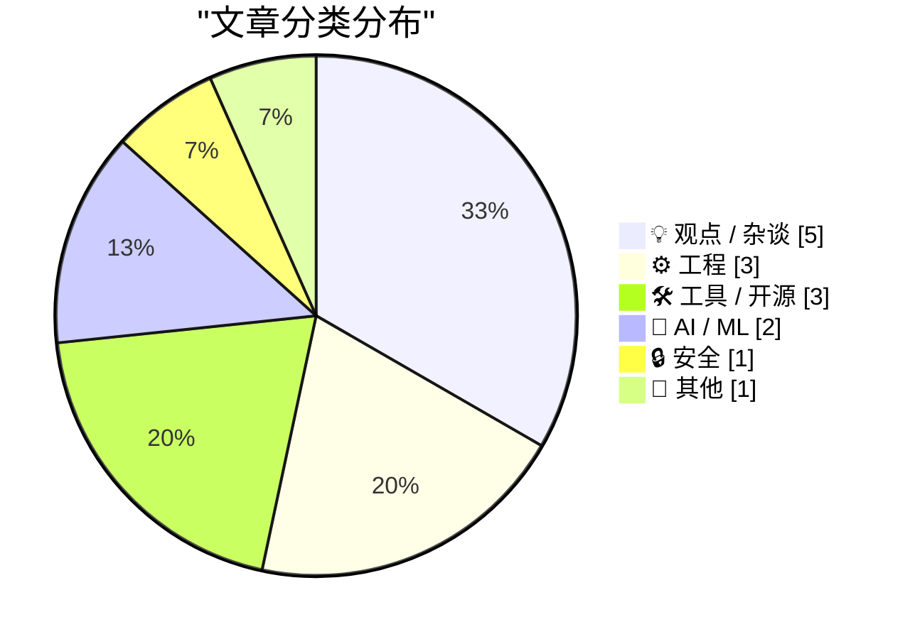
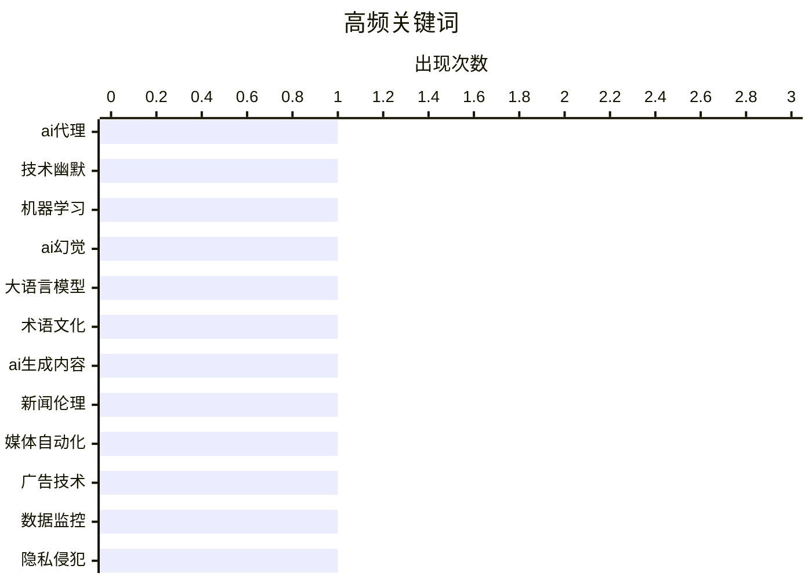

# 📰 AI 博客每日精选 — 2026-03-12

> 来自 Karpathy 推荐的 92 个顶级技术博客，AI 精选 Top 15

## 📝 今日看点

今日技术圈聚焦于人工智能的深度渗透与引发的广泛争议。人工智能工具正重塑从代码开发到新闻生产的多个领域，但代码质量担忧与“幻觉”问题凸显其应用隐忧。同时，技术伦理成为焦点，监控式广告与媒体滥用人工智能暴露了资本对隐私与专业性的漠视。此外，技术抽象化趋势加剧，开发者面对效率提升时，也对控制权流失和思维依赖保持警惕。

---

## 🏆 今日必读

🥇 **人工智能应助力我们产出更优质的代码**

[人工智能应助力我们产出更优质的代码](https://simonwillison.net/guides/agentic-engineering-patterns/better-code/#atom-everything) — simonwillison.net · 1 天前 · 🤖 AI / ML

> 文章探讨了开发者对使用人工智能编码工具可能导致代码质量下降的普遍担忧。作者认为，如果引入编码智能体确实降低了代码质量，就应该直接解决这个问题，而非放弃使用。他提出了一系列工程模式，旨在将人工智能定位为提升代码质量的辅助工具，而非仅仅追求速度的代码生成器。核心观点是，通过精心设计的人机协作流程，人工智能能够也应该帮助我们编写出比单纯人工编写更可靠、更优秀的代码。

💡 **为什么值得读**: 为担忧人工智能影响代码质量的开发者提供了具体、可操作的工程实践思路，而非空谈利弊。

🏷️ AI代理, 技术幽默, 机器学习

🥈 **我不是在撒谎，我是在产生幻觉**

[我不是在撒谎，我是在产生幻觉](https://idiallo.com/byte-size/im-not-lying-im-hallucinating?src=feed) — idiallo.com · 1 天前 · 🤖 AI / ML

> 文章探讨了人工智能领域“幻觉”这一术语的起源与流行。该术语并非由安德烈·卡帕西首创，早在上世纪七十年代就被用来描述文本摘要程序无法准确概括原文的失败案例。如今，“幻觉”精准地描述了大型语言模型生成看似合理但实则虚构或错误内容的现象。作者通过“氛围编码”等流行语的传播，说明了卡帕西在塑造技术话语方面的独特影响力。文章揭示了技术术语如何反映并塑造我们对人工智能局限性的理解。

💡 **为什么值得读**: 通过追溯“幻觉”一词的渊源，帮助我们更深刻地理解当前人工智能技术的本质缺陷与话语构建。

🏷️ AI幻觉, 大语言模型, 术语文化

🥉 **人工智能‘记者’证明媒体老板根本不在乎**

[人工智能‘记者’证明媒体老板根本不在乎](https://pluralistic.net/2026/03/11/modal-dialog-a-palooza/) — pluralistic.net · 8 小时前 · 💡 观点 / 杂谈

> 文章批判了媒体机构滥用人工智能生成新闻内容的现象。作者指出，媒体老板采用人工智能“记者”并非为了提升新闻质量或效率，而是赤裸裸地削减人力成本的举措。这证明了资本方对新闻专业主义与内容质量毫不在意，只关注利润最大化。使用人工智能生成内容本质上是将新闻业等同于低价值的内容填充，彻底背离了媒体的公共职责。这一行为彻底暴露了媒体管理层对新闻业核心价值的漠视。

💡 **为什么值得读**: 犀利地揭露了人工智能在媒体行业应用的资本逻辑，对理解当代新闻业的危机具有警示意义。

🏷️ AI生成内容, 新闻伦理, 媒体自动化

---

## 📊 数据概览

| 扫描源 | 抓取文章 | 时间范围 | 精选 |
|:---:|:---:|:---:|:---:|
| 84/92 | 2425 篇 → 36 篇 | 48h | **15 篇** |

### 分类分布



### 高频关键词



<details>
<summary>📈 纯文本关键词图（终端友好）</summary>

```
ai代理   │ ████████████████████ 1
技术幽默   │ ████████████████████ 1
机器学习   │ ████████████████████ 1
ai幻觉   │ ████████████████████ 1
大语言模型  │ ████████████████████ 1
术语文化   │ ████████████████████ 1
ai生成内容 │ ████████████████████ 1
新闻伦理   │ ████████████████████ 1
媒体自动化  │ ████████████████████ 1
广告技术   │ ████████████████████ 1
```

</details>

### 🏷️ 话题标签

**ai代理**(1) · **技术幽默**(1) · **机器学习**(1) · ai幻觉(1) · 大语言模型(1) · 术语文化(1) · ai生成内容(1) · 新闻伦理(1) · 媒体自动化(1) · 广告技术(1) · 数据监控(1) · 隐私侵犯(1) · ai依赖(1) · 工具滥用(1) · 认知习惯(1) · 抽象层次(1) · 编程思维(1) · ai工具(1) · ghost主题(1) · 网站开发(1)

---

## 💡 观点 / 杂谈

### 1. 人工智能‘记者’证明媒体老板根本不在乎

[人工智能‘记者’证明媒体老板根本不在乎](https://pluralistic.net/2026/03/11/modal-dialog-a-palooza/) — **pluralistic.net** · 8 小时前 · ⭐ 24/30

> 文章批判了媒体机构滥用人工智能生成新闻内容的现象。作者指出，媒体老板采用人工智能“记者”并非为了提升新闻质量或效率，而是赤裸裸地削减人力成本的举措。这证明了资本方对新闻专业主义与内容质量毫不在意，只关注利润最大化。使用人工智能生成内容本质上是将新闻业等同于低价值的内容填充，彻底背离了媒体的公共职责。这一行为彻底暴露了媒体管理层对新闻业核心价值的漠视。

🏷️ AI生成内容, 新闻伦理, 媒体自动化

---

### 2. 广告技术即法西斯技术

[广告技术即法西斯技术](https://pluralistic.net/2026/03/10/ice-tech/) — **pluralistic.net** · 1 天前 · ⭐ 24/30

> 文章提出了一个尖锐论点：基于监控的广告技术本质上是法西斯技术。作者认为，大规模的用户数据收集、分析与精准行为操纵，与法西斯主义的监控与控制逻辑同构。这种技术不是为了提供更好的服务，而是为了建立一套无处不在的 surveillance 体系，服务于商业与政治控制。它将人简化为可预测、可操控的数据点，侵蚀个人自主与隐私。因此，反对监控广告就是反对一种技术赋权的压迫性体系。

🏷️ 广告技术, 数据监控, 隐私侵犯

---

### 3. 非结构化数据与让他物替你思考的乐趣

[非结构化数据与让他物替你思考的乐趣](https://shkspr.mobi/blog/2026/03/unstructured-data-and-the-joy-of-having-something-else-think-for-you/) — **shkspr.mobi** · 1 天前 · ⭐ 24/30

> 文章观察并反思了一种日益普遍的现象：人们过度依赖人工智能处理甚至是最简单的查询。作者举例有人宁愿询问聊天机器人明天的天气，也不愿直接打开天气应用。这种行为表明，人工智能正在成为一种默认的思维“拐杖”，导致人们主动放弃基本的信息检索与判断能力。过度依赖会导致我们与原始信息（非结构化数据）以及独立思考的乐趣脱节。这引发了关于技术如何塑造我们认知习惯的担忧。

🏷️ AI依赖, 工具滥用, 认知习惯

---

### 4. 微软2026年3月“补丁星期二”安全更新

[微软2026年3月“补丁星期二”安全更新](https://krebsonsecurity.com/2026/03/microsoft-patch-tuesday-march-2026-edition/) — **krebsonsecurity.com** · 1 天前 · ⭐ 19/30

> 微软发布了2026年3月周期的安全更新，共修复了其Windows操作系统及其他软件中的至少77个安全漏洞。本月没有需要紧急处理的“零日”漏洞，这与二月份修复了五个零日漏洞的情况不同。然而，其中部分补丁对于使用Windows系统的机构而言，仍需要给予优先关注。文章旨在提醒系统管理员关注本次更新的重点内容，以便及时部署，保障系统安全。

🏷️ 互联网泡沫, 科技历史, 经济

---

### 5. 哈立德相机联合创始人塞巴斯蒂安·德威斯于一月加入苹果设计团队

[哈立德相机联合创始人塞巴斯蒂安·德威斯于一月加入苹果设计团队](https://9to5mac.com/2026/01/28/halide-cofounder-sebastiaan-de-with-joins-apples-design-team/) — **daringfireball.net** · 4 小时前 · ⭐ 15/30

> 知名第三方相机应用哈立德及其兄弟应用勒克斯的联合创始人兼设计师塞巴斯蒂安·德威斯，已于一月正式加入苹果公司的人机界面设计团队。这是他第二次为苹果工作，此前他曾以自由职业者身份参与过包括“查找我的”、“移动我”和“云端服务”在内的多个关键项目。此次回归表明苹果正积极吸纳外部顶尖设计人才，以加强其软件生态的用户体验设计实力。德威斯以其卓越的视觉设计和对摄影技术的深刻理解而闻名，他的加入预计将为苹果的相机、照片及相关系统应用的设计带来新的视角。

🏷️ 人事变动, 设计团队, 苹果

---

## ⚙️ 工程

### 6. 我不确定自己是否喜欢在更高抽象层次上工作

[我不确定自己是否喜欢在更高抽象层次上工作](https://xeiaso.net/blog/2026/ai-abstraction/) — **xeiaso.net** · 1 天前 · ⭐ 24/30

> 作者表达了对人工智能工具将编程工作推向更高抽象层次的疑虑。他认为，虽然抽象能提升效率，但也让开发者远离了底层的实现细节与控制权。这种距离感可能导致对系统原理的理解变得模糊，调试和优化变得更加困难。人工智能辅助编程在带来便利的同时，也付出了让开发者“失根”于技术栈的代价。文章的核心是对技术进步中“得”与“失”的审慎思考。

🏷️ 抽象层次, 编程思维, AI工具

---

### 7. 服务器比我的孩子还老！

[服务器比我的孩子还老！](https://idiallo.com/byte-size/my-server-is-older-than-my-kids?src=feed) — **idiallo.com** · 1 天前 · ⭐ 18/30

> 作者分享了其个人博客在应对突发高流量时，因服务器老化而崩溃的真实经历。博客架构由一台处理逻辑与数据库的主服务器和一台服务静态文件的服务器组成。当一篇文章同时登上黑客新闻和红迪网榜首时，流量激增导致服务器不堪重负，作者不得不每隔几分钟就手动重启。通过分析发现，承载流量的页面总共加载了17个资源，这促使作者深入思考并实施了优化。最终，这次危机成为了宝贵的实战经验，让作者对系统性能和可扩展性有了深刻理解。

🏷️ 服务器运维, 流量处理, 博客架构

---

### 8. 伊朗支持的黑客组织宣称对医疗技术巨头史赛克发动数据擦除攻击

[伊朗支持的黑客组织宣称对医疗技术巨头史赛克发动数据擦除攻击](https://krebsonsecurity.com/2026/03/iran-backed-hackers-claim-wiper-attack-on-medtech-firm-stryker/) — **krebsonsecurity.com** · 11 小时前 · ⭐ 17/30

> 一个与伊朗情报机构有关联的黑客组织声称，对总部位于密歇根州的全球医疗技术公司史赛克发动了数据擦除攻击。此次攻击导致史赛克在美国以外最大的运营中心爱尔兰遣散了超过5000名员工，公司运营受到严重干扰。美国总部的语音留言也证实公司正面临紧急状况，表明攻击已对全球业务造成实际影响。攻击使用了旨在破坏系统数据的擦除恶意软件，而非传统的勒索软件。这起事件凸显了国家级黑客组织对关键医疗基础设施构成的直接威胁。

🏷️ 复古计算, Amiga, 硬件历史

---

## 🛠 工具 / 开源

### 9. 杰森·斯内尔将参加下周的《危险边缘》节目

[杰森·斯内尔将参加下周的《危险边缘》节目](https://sixcolors.com/post/2026/03/ill-take-beach-reading-for-1000-ken/) — **daringfireball.net** · 2 小时前 · ⭐ 23/30

> 这是一则简短的公告，确认科技播客主持人兼作家杰森·斯内尔将参与录制美国著名电视智力竞赛节目《危险边缘》。该消息使得其所在的“六色”网站贡献者中出现了第三位该节目的参赛者。文章以轻松幽默的口吻提及了另一位同事尚未参赛的情况。这主要是一则关于个人动态的趣味性消息。

🏷️ Ghost主题, 网站开发, 开源

---

### 10. 苹果在其最新款MacBook键盘上将多个按键的文字标签改为符号

[苹果在其最新款MacBook键盘上将多个按键的文字标签改为符号](https://x.com/ClassicII_MrMac/status/2028869838870069447) — **daringfireball.net** · 4 小时前 · ⭐ 19/30

> 文章指出，苹果在最新发布的搭载M5芯片的16英寸MacBook Pro等新款笔记本电脑上，对键盘设计进行了一项细微调整。退格键、回车键、Shift键和Tab键上原有的英文单词标签被移除，取而代之的是通用的符号图标。这一变化覆盖了包括M5版Air和A18 Pro版Neo在内的所有新款MacBook键盘。爆料者“麦金托什先生”对此表示并不喜欢，但也承认这可能只是长期习惯带来的主观偏好。此举反映了苹果在键盘设计语言上进一步走向国际化与极简主义。

🏷️ 键盘设计, 符号标签, MacBook

---

### 11. 键盘快捷键中修饰键的顺序

[键盘快捷键中修饰键的顺序](https://daringfireball.net/2026/03/modifier_key_order_for_keyboard_shortcuts) — **daringfireball.net** · 3 小时前 · ⭐ 17/30

> 键盘快捷键中修饰键的正确顺序是功能键、控制键、选项键、上档键、命令键。这一顺序基于逻辑层次和行业惯例，无论使用文字描述还是符号图标都保持不变。遵循此顺序能确保快捷键设计的清晰性和一致性，避免用户操作混淆。作者主张将此作为标准规范以提升界面用户体验。

🏷️ 键盘快捷键, 修饰键, Mac

---

## 🤖 AI / ML

### 12. 人工智能应助力我们产出更优质的代码

[人工智能应助力我们产出更优质的代码](https://simonwillison.net/guides/agentic-engineering-patterns/better-code/#atom-everything) — **simonwillison.net** · 1 天前 · ⭐ 24/30

> 文章探讨了开发者对使用人工智能编码工具可能导致代码质量下降的普遍担忧。作者认为，如果引入编码智能体确实降低了代码质量，就应该直接解决这个问题，而非放弃使用。他提出了一系列工程模式，旨在将人工智能定位为提升代码质量的辅助工具，而非仅仅追求速度的代码生成器。核心观点是，通过精心设计的人机协作流程，人工智能能够也应该帮助我们编写出比单纯人工编写更可靠、更优秀的代码。

🏷️ AI代理, 技术幽默, 机器学习

---

### 13. 我不是在撒谎，我是在产生幻觉

[我不是在撒谎，我是在产生幻觉](https://idiallo.com/byte-size/im-not-lying-im-hallucinating?src=feed) — **idiallo.com** · 1 天前 · ⭐ 24/30

> 文章探讨了人工智能领域“幻觉”这一术语的起源与流行。该术语并非由安德烈·卡帕西首创，早在上世纪七十年代就被用来描述文本摘要程序无法准确概括原文的失败案例。如今，“幻觉”精准地描述了大型语言模型生成看似合理但实则虚构或错误内容的现象。作者通过“氛围编码”等流行语的传播，说明了卡帕西在塑造技术话语方面的独特影响力。文章揭示了技术术语如何反映并塑造我们对人工智能局限性的理解。

🏷️ AI幻觉, 大语言模型, 术语文化

---

## 🔒 安全

### 14. 你以为训练数据是从哪里来的？

[你以为训练数据是从哪里来的？](https://idiallo.com/blog/where-did-the-training-data-come-from-meta-ai-rayban-glasses?src=feed) — **idiallo.com** · 15 小时前 · ⭐ 23/30

> 文章针对Meta公司智能眼镜将用户数据直传服务器引发的隐私争议发表了评论。作者以讽刺的口吻指出，对具备秘密录制功能的AI眼镜抱有隐私期待本身就是天真的。他类比了笔记本电脑摄像头同样存在的监控风险，并提及了扎克伯格曾经的类似隐私事件。核心论点是，任何连接网络并配备传感器的AI设备，其数据最终都会流向服务提供商。公众的惊讶反应恰恰说明了对科技公司数据收集行为普遍性的认知不足。

🏷️ 数据隐私, AI伦理, 智能眼镜

---

## 📝 其他

### 15. 编译器如何确保大型栈分配不会跳过保护页？

[编译器如何确保大型栈分配不会跳过保护页？](https://devblogs.microsoft.com/oldnewthing/20260311-00/?p=112134) — **devblogs.microsoft.com/oldnewthing** · 13 小时前 · ⭐ 15/30

> 文章探讨了编译器在处理超出保护页大小的栈内存分配时，如何防止程序因跳过保护页而直接导致栈溢出崩溃。核心方案是编译器不会一次性分配大块栈内存，而是采用分步探测策略，每次仅分配并访问一页内存，以此触发操作系统的保护页异常机制。这种保守的逐页“踩踏”确保了任何栈增长都会在触及保护页时被正常捕获，从而安全地扩展栈空间。因此，编译器通过主动、小步长的内存访问来保证栈扩展的安全性，而非依赖单次大分配。

---

*生成于 2026-03-12 03:41 | 扫描 84 源 → 获取 2425 篇 → 精选 15 篇*
*基于 [Hacker News Popularity Contest 2025](https://refactoringenglish.com/tools/hn-popularity/) RSS 源列表，由 [Andrej Karpathy](https://x.com/karpathy) 推荐*
