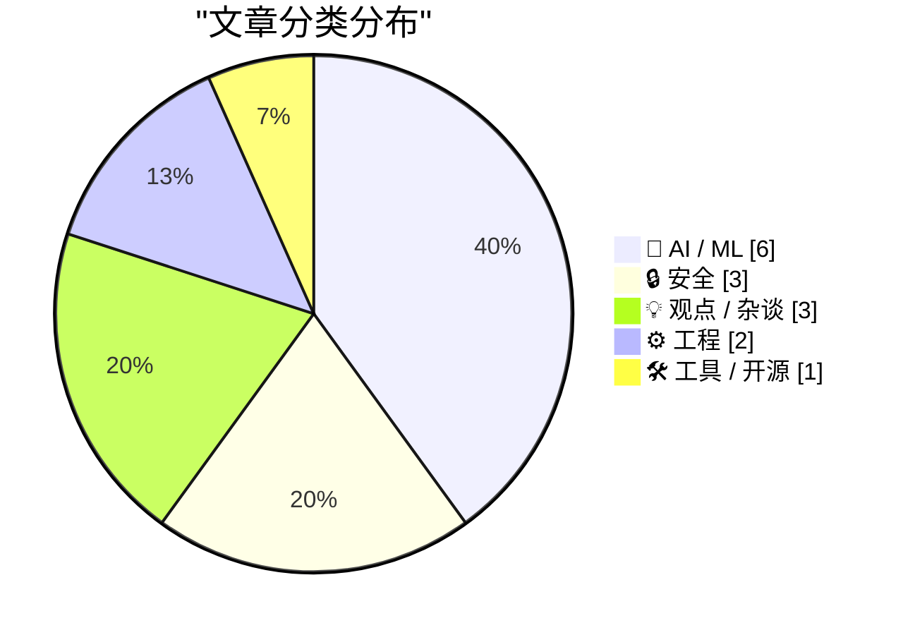
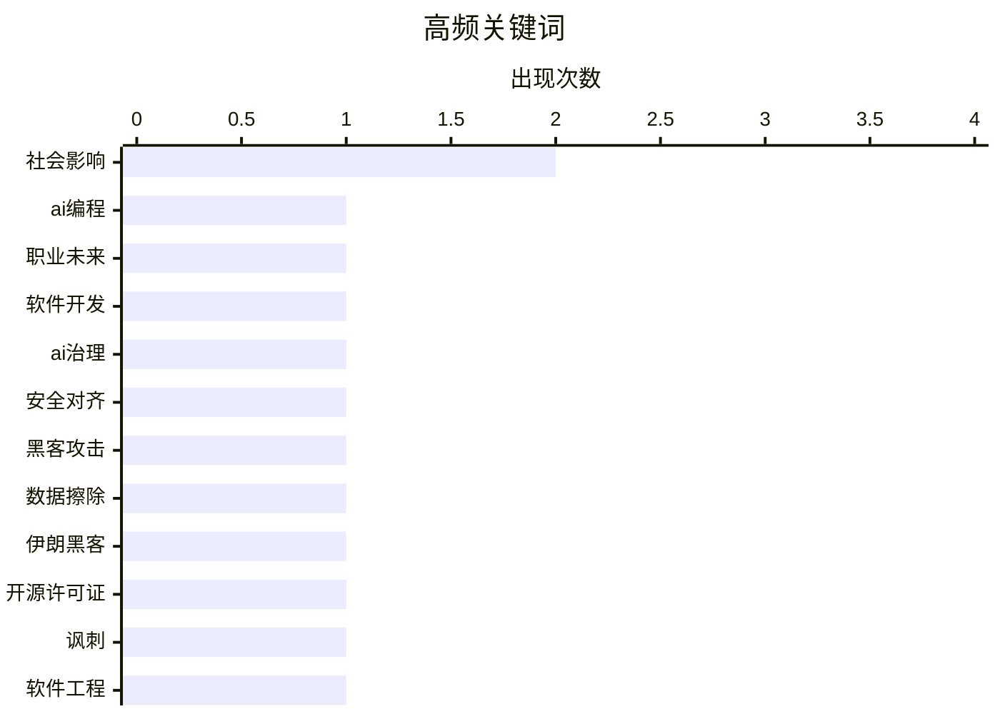

# 📰 AI 博客每日精选 — 2026-03-13

> 来自 Karpathy 推荐的 92 个顶级技术博客，AI 精选 Top 15

## 📝 今日看点

今日技术圈聚焦于人工智能的深度渗透与网络安全威胁的升级。AI正重塑编程职业本质并冲击媒体行业，同时其安全治理与伦理争议引发广泛关注。国际黑客攻击关键基础设施事件警示防护紧迫性，推动安全规范持续演进。开发者社群在工具变革中呈现分化，开源生态与实用技术发展备受重视。

---

## 🏆 今日必读

🥇 **程序员之后：我们所知的计算机编程的终结**

[程序员之后：我们所知的计算机编程的终结](https://simonwillison.net/2026/Mar/12/coding-after-coders/#atom-everything) — simonwillison.net · 8 小时前 · 🤖 AI / ML

> 文章探讨了人工智能辅助开发如何从根本上改变软件编程的职业与本质。基于对谷歌、亚马逊、微软、苹果等公司七十多位开发者的采访，揭示了人工智能工具正使编程能力民主化，让非专业背景者也能构建软件。同时，开发者群体内部出现分化，一方是注重代码工艺的“工匠”，另一方是追求快速实现功能的“效率派”。作者认为，编程正从一门需要精深技艺的手艺，转变为一种更广泛、由人类意图驱动、人工智能执行的协作活动。

💡 **为什么值得读**: 该文通过大量一线从业者的真实经历，深刻描绘了人工智能浪潮下程序员职业身份与工作方式的剧变，对任何关心技术未来与职业规划的人都有重要启示。

🏷️ AI编程, 职业未来, 软件开发

🥈 **关于人工智能，无人问津的最重要问题**

[关于人工智能，无人问津的最重要问题](https://www.dwarkesh.com/p/dow-anthropic) — dwarkesh.com · 1 天前 · 🤖 AI / ML

> 文章聚焦于当前人工智能安全治理中一个被普遍忽视的核心问题。作者指出，在关于人工智能风险的激烈辩论中，各方可能都未触及最关键的谈判要点与风险根源。这被形容为“史上最高风险谈判的序言”，暗示其关乎人类未来的根本性安排。核心观点是，必须超越表面争议，识别并直面那个真正决定成败却无人提及的问题。

💡 **为什么值得读**: 此文挑战常规思维，试图揭示人工智能安全争论背后的深层盲点，为理解这场塑造未来的关键博弈提供了独特且紧迫的视角。

🏷️ AI治理, 安全对齐, 社会影响

🥉 **伊朗支持的黑客宣称对医疗技术公司史赛克发起数据擦除攻击**

[伊朗支持的黑客宣称对医疗技术公司史赛克发起数据擦除攻击](https://krebsonsecurity.com/2026/03/iran-backed-hackers-claim-wiper-attack-on-medtech-firm-stryker/) — krebsonsecurity.com · 1 天前 · 🔒 安全

> 文章报道了一起针对全球医疗技术公司史赛克的重大网络攻击事件。一个与伊朗情报机构有关联的黑客组织声称，对史赛克发动了具有破坏性的数据擦除攻击。此次攻击影响广泛，导致史赛克在爱尔兰的最大海外枢纽紧急遣散了超过五千名员工。美国总部也因“大楼紧急情况”而中断运营，表明攻击可能已造成严重的物理运营中断。事件凸显了地缘政治背景下的黑客组织对关键民生基础设施的威胁正在升级。

💡 **为什么值得读**: 报道结合了攻击者声明、公司应急措施与地缘政治背景，清晰呈现了一起针对医疗行业的高破坏性真实网络战案例，具有极强的警示意义。

🏷️ 黑客攻击, 数据擦除, 伊朗黑客

---

## 📊 数据概览

| 扫描源 | 抓取文章 | 时间范围 | 精选 |
|:---:|:---:|:---:|:---:|
| 83/92 | 2402 篇 → 43 篇 | 48h | **15 篇** |

### 分类分布



### 高频关键词



<details>
<summary>📈 纯文本关键词图（终端友好）</summary>

```
社会影响  │ ████████████████████ 2
ai编程  │ ██████████░░░░░░░░░░ 1
职业未来  │ ██████████░░░░░░░░░░ 1
软件开发  │ ██████████░░░░░░░░░░ 1
ai治理  │ ██████████░░░░░░░░░░ 1
安全对齐  │ ██████████░░░░░░░░░░ 1
黑客攻击  │ ██████████░░░░░░░░░░ 1
数据擦除  │ ██████████░░░░░░░░░░ 1
伊朗黑客  │ ██████████░░░░░░░░░░ 1
开源许可证 │ ██████████░░░░░░░░░░ 1
```

</details>

### 🏷️ 话题标签

**社会影响**(2) · **ai编程**(1) · **职业未来**(1) · 软件开发(1) · ai治理(1) · 安全对齐(1) · 黑客攻击(1) · 数据擦除(1) · 伊朗黑客(1) · 开源许可证(1) · 讽刺(1) · 软件工程(1) · 包管理器(1) · 软件供应链安全(1) · 漏洞(1) · 大语言模型(1) · 性能评估(1) · 技术进步(1) · sqlalchemy(1) · python orm(1)

---

## 🤖 AI / ML

### 1. 程序员之后：我们所知的计算机编程的终结

[程序员之后：我们所知的计算机编程的终结](https://simonwillison.net/2026/Mar/12/coding-after-coders/#atom-everything) — **simonwillison.net** · 8 小时前 · ⭐ 29/30

> 文章探讨了人工智能辅助开发如何从根本上改变软件编程的职业与本质。基于对谷歌、亚马逊、微软、苹果等公司七十多位开发者的采访，揭示了人工智能工具正使编程能力民主化，让非专业背景者也能构建软件。同时，开发者群体内部出现分化，一方是注重代码工艺的“工匠”，另一方是追求快速实现功能的“效率派”。作者认为，编程正从一门需要精深技艺的手艺，转变为一种更广泛、由人类意图驱动、人工智能执行的协作活动。

🏷️ AI编程, 职业未来, 软件开发

---

### 2. 关于人工智能，无人问津的最重要问题

[关于人工智能，无人问津的最重要问题](https://www.dwarkesh.com/p/dow-anthropic) — **dwarkesh.com** · 1 天前 · ⭐ 27/30

> 文章聚焦于当前人工智能安全治理中一个被普遍忽视的核心问题。作者指出，在关于人工智能风险的激烈辩论中，各方可能都未触及最关键的谈判要点与风险根源。这被形容为“史上最高风险谈判的序言”，暗示其关乎人类未来的根本性安排。核心观点是，必须超越表面争议，识别并直面那个真正决定成败却无人提及的问题。

🏷️ AI治理, 安全对齐, 社会影响

---

### 3. 大语言模型没有变得更好吗？

[大语言模型没有变得更好吗？](https://entropicthoughts.com/no-swe-bench-improvement) — **entropicthoughts.com** · 1 天前 · ⭐ 24/30

> 文章质疑当前大语言模型在真实编程任务上的性能是否取得了实质进步。作者通过分析“软件工程基准”等评估数据集的结果，指出最新模型相比前代并未显示出显著的性能提升。这种停滞可能源于评估基准本身的局限性，或模型在泛化与解决复杂、新颖问题方面遇到瓶颈。核心观点是，单纯增加模型参数和训练数据可能已无法持续提升其解决实际复杂任务的能力，需要新的突破方向。

🏷️ 大语言模型, 性能评估, 技术进步

---

### 4. 多元化：另外三种人工智能精神病症

[多元化：另外三种人工智能精神病症](https://pluralistic.net/2026/03/12/normal-technology/) — **pluralistic.net** · 1 小时前 · ⭐ 23/30

> 文章延续了对“人工智能精神病症”系列的批判，即社会对人工智能技术非理性的、脱离现实的恐惧与炒作。作者剖析了三种新的“病症”表现，可能是针对人工智能在特定领域（如创作、决策）被夸大或误解的能力所引发的公众焦虑。核心论点是，许多关于人工智能的讨论脱离了其作为“正常技术”的本质，被赋予了超自然的恐慌或期待。作者呼吁以更冷静、务实的态度看待人工智能的技术现实与局限性。

🏷️ AI局限性, 社会影响, 模型行为

---

### 5. 多元化：人工智能‘记者’证明媒体老板根本不在乎

[多元化：人工智能‘记者’证明媒体老板根本不在乎](https://pluralistic.net/2026/03/11/modal-dialog-a-palooza/) — **pluralistic.net** · 1 天前 · ⭐ 23/30

> 文章抨击了媒体机构使用人工智能生成内容以替代人类记者的现象。作者指出，此举并非为了提升新闻质量或效率，而是赤裸裸地暴露了媒体管理层对新闻业核心价值（如调查、问责、社区联系）的漠视。人工智能“记者”的涌现，实质是资本追求成本削减而牺牲公共利益的体现，进一步削弱了新闻媒体的社会功能与公信力。结论是，这证明了媒体老板关心的不是新闻使命，而是利润。

🏷️ AI生成内容, 媒体伦理, 自动化

---

### 6. 我如何在博客中使用生成式人工智能

[我如何在博客中使用生成式人工智能](https://evanhahn.com/how-i-use-gen-ai-on-this-blog/) — **evanhahn.com** · 1 天前 · ⭐ 23/30

> 作者分享在个人博客写作中应用生成式人工智能的具体实践。他认为该技术利弊并存，但负面影响远超正面效益，世界没有它会更好。尽管持批判立场，他在工作中被迫使用生成式人工智能，并在博客中借助大型语言模型辅助内容创作。这种矛盾使用揭示了技术在现实应用中的复杂性和工具性价值。

🏷️ AI辅助写作, 内容创作, 工作流

---

## 🔒 安全

### 7. 伊朗支持的黑客宣称对医疗技术公司史赛克发起数据擦除攻击

[伊朗支持的黑客宣称对医疗技术公司史赛克发起数据擦除攻击](https://krebsonsecurity.com/2026/03/iran-backed-hackers-claim-wiper-attack-on-medtech-firm-stryker/) — **krebsonsecurity.com** · 1 天前 · ⭐ 26/30

> 文章报道了一起针对全球医疗技术公司史赛克的重大网络攻击事件。一个与伊朗情报机构有关联的黑客组织声称，对史赛克发动了具有破坏性的数据擦除攻击。此次攻击影响广泛，导致史赛克在爱尔兰的最大海外枢纽紧急遣散了超过五千名员工。美国总部也因“大楼紧急情况”而中断运营，表明攻击可能已造成严重的物理运营中断。事件凸显了地缘政治背景下的黑客组织对关键民生基础设施的威胁正在升级。

🏷️ 黑客攻击, 数据擦除, 伊朗黑客

---

### 8. 评欧盟网络安全局软件包管理器安全建议

[评欧盟网络安全局软件包管理器安全建议](https://nesbitt.io/2026/03/12/reviewing-enisas-package-manager-advisory.html) — **nesbitt.io** · 17 小时前 · ⭐ 24/30

> 文章是对欧盟网络安全局发布的《软件包管理器安全使用技术建议》的解读与评论。该建议旨在应对软件供应链中因依赖包管理器而日益增长的安全风险。评论可能分析了建议中提出的关键措施，如验证包完整性、管理依赖关系、审计开源组件等。文章旨在帮助开发者和安全团队理解官方指南，并更安全地使用诸如npm、PyPI、Maven等主流的软件包管理工具。

🏷️ 包管理器, 软件供应链安全, 漏洞

---

### 9. 苹果平台安全指南新增关于MacBook Neo屏幕摄像头指示灯的说明

[苹果平台安全指南新增关于MacBook Neo屏幕摄像头指示灯的说明](https://support.apple.com/guide/security/mac-on-screen-camera-indicator-light-sec75a2d237d/1/web/1) — **daringfireball.net** · 3 小时前 · ⭐ 21/30

> 苹果在其平台安全指南中，为MacBook Neo新增了关于屏幕摄像头指示灯安全机制的简要说明。该机制的核心是结合系统软件与集成在A18 Pro芯片内的专用硅元件，共同保护摄像头数据流。其架构设计旨在确保，任何不受信任的软件——即使拥有macOS系统的根权限或内核特权——都无法在同时点亮屏幕摄像头指示灯的情况下私自启用摄像头。这一设计从硬件层面强制实现了视觉指示，但当前指南并未披露具体的技术实现细节。苹果通过此设计，从根本上堵住了恶意软件秘密激活摄像头的可能性。

🏷️ 硬件安全, 摄像头, 苹果安全

---

## 💡 观点 / 杂谈

### 10. 马尔乌斯——洁净室即服务

[马尔乌斯——洁净室即服务](https://simonwillison.net/2026/Mar/12/malus/#atom-everything) — **simonwillison.net** · 7 小时前 · ⭐ 24/30

> 这是一篇针对“开源许可清洗”现象的尖锐讽刺作品。文中虚构的“马尔乌斯”服务宣称，其专有人工智能机器人可以独立地从头开始重建任何开源项目，从而产生“法律上截然不同的代码”。该服务声称能帮助企业免除开源许可证规定的义务（如署名要求），提供对企业友好的专有许可。其本质是讽刺那些试图利用人工智能工具绕过开源法律与伦理约束的商业行为。文章批判了这种将开源精神与合规要求置于不顾的“氛围移植”与许可洗白趋势。

🏷️ 开源许可证, 讽刺, 软件工程

---

### 11. 引用莱斯·奥查德

[引用莱斯·奥查德](https://simonwillison.net/2026/Mar/12/les-orchard/#atom-everything) — **simonwillison.net** · 11 小时前 · ⭐ 23/30

> 文章引用了开发者莱斯·奥查德关于人工智能编程加剧开发者社群分化的观点。奥查德认为，人工智能辅助编程暴露并扩大了一直存在于开发者中的两种根本取向：热爱编程工艺的“工匠型”和只关心让代码跑起来的“效率型”。在人工智能工具普及前，这两类人使用相同的工具和工作流，差异不明显。而现在，工具放大了这种理念分歧，可能影响团队协作、代码质量与软件开发的未来文化。

🏷️ AI辅助编程, 开发者分歧, 观点

---

### 12. 论创造：人工智能时代我所怀念的

[论创造：人工智能时代我所怀念的](http://beej.us/blog/data/ai-making/) — **beej.us** · 1 天前 · ⭐ 23/30

> 文章核心探讨了在人工智能工具日益普及的背景下，人类“创造”行为的本质变化及其带来的失落感。作者指出，当前的人工智能辅助工具（如图像生成器）将创造过程简化为结果导向的提示词工程，剥夺了传统手工创造中至关重要的探索、试错与亲手实践环节。这种转变使得创造变得像“点餐”一样高效却肤浅，人们失去了在漫长、混乱的动手过程中获得的深层理解、意外发现与个人成长。因此，作者的核心观点是，真正的创造不仅关乎产出物，更在于那个充满不确定性的、亲力亲为的“制作”过程本身，而这是当前人工智能范式所无法复制的体验。

🏷️ AI反思, 创造, 人工智能

---

## ⚙️ 工程

### 13. Git 中检出、重置与恢复命令对比指南

[Git 中检出、重置与恢复命令对比指南](https://susam.net/git-checkout-reset-restore.html) — **susam.net** · 1 天前 · ⭐ 22/30

> 文章核心是厘清 Git 中用于撤销更改的 checkout、reset 与 restore 命令之间的关系与替代方案。自 Git 2.23 版本起，新增的 restore 命令旨在接管部分原先由 checkout 和 reset 负责的功能，使操作意图更清晰。作者详细记录了如何将旧有操作习惯映射到新命令，例如使用“git restore --staged”替代“git reset HEAD”以从暂存区移除文件，或用“git restore”替代“git checkout --”来丢弃工作区的修改。尽管这些“新”命令自 2019 年就已发布，但本文为仍在使用旧命令的用户提供了清晰的迁移对照表。作者最终建议，在 Git 2.23 及以上版本中，应优先使用语义更明确的 restore 命令来完成工作区和暂存区的文件恢复操作。

🏷️ Git, 版本控制, 命令解析

---

### 14. Windows栈限制检查回顾：x86-32架构篇

[Windows栈限制检查回顾：x86-32架构篇](https://devblogs.microsoft.com/oldnewthing/20260312-00/?p=112136) — **devblogs.microsoft.com/oldnewthing** · 13 小时前 · ⭐ 21/30

> 文章回顾了Windows操作系统在经典的x86-32位架构下，为实现栈空间检查而采用的一种独特且高效的机制。该机制通过在进程启动时预先设置栈底指针和栈顶指针，并利用硬件特性在栈溢出时触发访问违规，从而替代了传统的逐页探测方法。这种设计被作者称为“最奇怪的调用约定之一”，因为它要求编译器生成特殊的函数序言代码来检查栈空间，而非由操作系统内核介入。此方案显著减少了函数调用的开销，并成为当时Windows系统性能优化的关键一环。其核心观点在于，这种精巧的底层设计体现了在硬件资源有限的年代，为兼顾性能与可靠性所做出的工程权衡。

🏷️ 调用约定, 栈检查, x86

---

## 🛠 工具 / 开源

### 15. SQLAlchemy 2实践入门

[SQLAlchemy 2实践入门](https://blog.miguelgrinberg.com/post/introduction-to-sqlalchemy-2-in-practice) — **miguelgrinberg.com** · 17 小时前 · ⭐ 24/30

> 本文是作者对其著作《SQLAlchemy 2实战》的免费发布与介绍。SQLAlchemy是Python生态中最流行的数据库工具库与对象关系映射器，其第二版是目前的主流版本。书籍提供了对SQLAlchemy 2的深入讲解，涵盖核心概念、最佳实践及高级用法。作者遵循将其著作免费公开的传统，使读者无需购买即可系统学习这一关键技术。这为Python开发者掌握高效、安全的数据库操作提供了权威的学习资源。

🏷️ SQLAlchemy, Python ORM, 数据库

---

*生成于 2026-03-13 03:38 | 扫描 83 源 → 获取 2402 篇 → 精选 15 篇*
*基于 [Hacker News Popularity Contest 2025](https://refactoringenglish.com/tools/hn-popularity/) RSS 源列表，由 [Andrej Karpathy](https://x.com/karpathy) 推荐*
