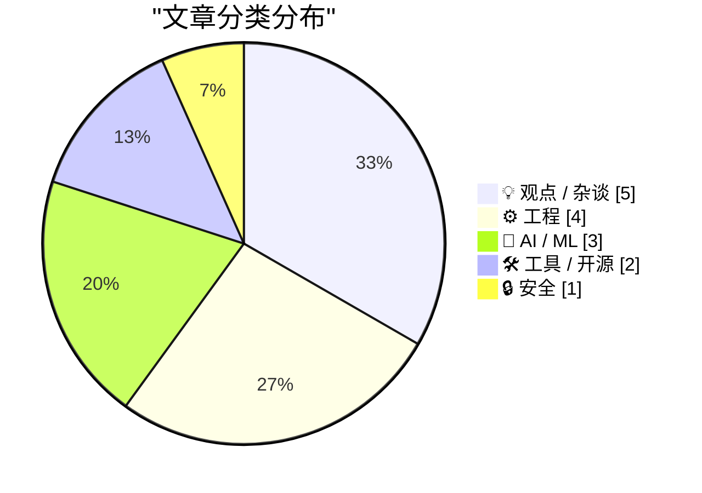
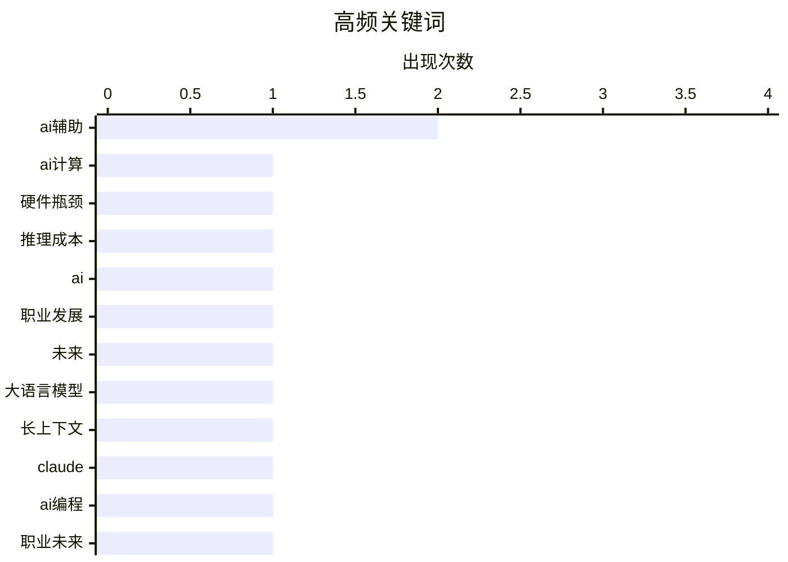

# 📰 AI 博客每日精选 — 2026-03-14

> 来自 Karpathy 推荐的 92 个顶级技术博客，AI 精选 Top 15

## 📝 今日看点

今日技术圈聚焦人工智能领域的双重演进：算力扩展遭遇电力、制造与冷却的硬约束，硬件瓶颈推升高性能芯片价值。与此同时，大语言模型正颠覆传统软件创作模式，编程职业与行业结构面临深刻重构。模型能力持续突破，百万级上下文窗口开放标志应用进入新阶段。

---

## 🏆 今日必读

🥇 **深度剖析：扩展人工智能算力的三大瓶颈，以及为何如今的H100芯片比三年前更值钱**

[深度剖析：扩展人工智能算力的三大瓶颈，以及为何如今的H100芯片比三年前更值钱](https://www.dwarkesh.com/p/dylan-patel) — dwarkesh.com · 11 小时前 · 🤖 AI / ML

> 文章深入探讨了当前扩展人工智能计算能力所面临的根本性限制。扩展算力的三大核心瓶颈在于电力供应、芯片制造产能以及数据中心冷却能力。由于这些硬件层面的约束短期内难以突破，现有高性能计算硬件（例如英伟达H100芯片）的稀缺性使其经济价值不降反升。作者的核心观点是，人工智能的发展正从软件创新阶段，转向一个受物理世界资源限制的硬约束时代。

💡 **为什么值得读**: 本文从底层物理条件和供应链视角，揭示了人工智能高速发展背后真实的瓶颈，为理解行业现状与未来投资方向提供了关键框架。

🏷️ AI计算, 硬件瓶颈, 推理成本

🥈 **人工智能时代来临，程序员将何去何从？**

[人工智能时代来临，程序员将何去何从？](https://anildash.com/2026/03/13/coders-after-ai/) — anildash.com · 1 天前 · 💡 观点 / 杂谈

> 文章探讨了在大型语言模型能力飞速进化的当下，传统程序员职业所面临的深刻挑战。大型语言模型正快速演变为能够执行全流程软件开发的“软件工厂”，这将从根本上改变软件创造的经济模式和行业权力结构。目前，这种技术变革主要被用于大规模替代技术岗位的劳动力。作者认为，程序员群体需要重新思考自身在人工智能时代的新角色与价值定位。

💡 **为什么值得读**: 文章直面技术从业者最关切的职业未来问题，提供了关于人工智能如何重塑软件开发本质的深刻洞察。

🏷️ AI, 职业发展, 未来

🥉 **克劳德·奥珀斯与桑尼特4.6模型现已全面开放百万级上下文窗口**

[克劳德·奥珀斯与桑尼特4.6模型现已全面开放百万级上下文窗口](https://simonwillison.net/2026/Mar/13/1m-context/#atom-everything) — simonwillison.net · 9 小时前 · 🤖 AI / ML

> 文章宣布了克劳德系列模型在长上下文理解能力上的重大更新。其奥珀斯4.6和桑尼特4.6模型现已正式支持高达一百万个标记的上下文长度。最令人惊讶的是，其标准定价适用于整个百万级窗口，并未收取长上下文溢价。相比之下，其他竞争对手如开放人工智能和双子星等，都对超出特定长度的标记收取额外费用。这一举措显著降低了处理超长文档或复杂任务的门槛。

💡 **为什么值得读**: 该消息揭示了大型语言模型在长上下文能力上的竞争进入新阶段，克劳德的定价策略可能迫使整个行业重新思考其商业模式。

🏷️ 大语言模型, 长上下文, Claude

---

## 📊 数据概览

| 扫描源 | 抓取文章 | 时间范围 | 精选 |
|:---:|:---:|:---:|:---:|
| 85/92 | 2446 篇 → 42 篇 | 48h | **15 篇** |

### 分类分布



### 高频关键词



<details>
<summary>📈 纯文本关键词图（终端友好）</summary>

```
ai辅助   │ ████████████████████ 2
ai计算   │ ██████████░░░░░░░░░░ 1
硬件瓶颈   │ ██████████░░░░░░░░░░ 1
推理成本   │ ██████████░░░░░░░░░░ 1
ai     │ ██████████░░░░░░░░░░ 1
职业发展   │ ██████████░░░░░░░░░░ 1
未来     │ ██████████░░░░░░░░░░ 1
大语言模型  │ ██████████░░░░░░░░░░ 1
长上下文   │ ██████████░░░░░░░░░░ 1
claude │ ██████████░░░░░░░░░░ 1
```

</details>

### 🏷️ 话题标签

**ai辅助**(2) · **ai计算**(1) · **硬件瓶颈**(1) · 推理成本(1) · ai(1) · 职业发展(1) · 未来(1) · 大语言模型(1) · 长上下文(1) · claude(1) · ai编程(1) · 职业未来(1) · 软件开发(1) · saas行业(1) · ai泡沫(1) · 市场分析(1) · ai模型(1) · 性能测试(1) · meta(1) · ocr(1)

---

## 💡 观点 / 杂谈

### 1. 人工智能时代来临，程序员将何去何从？

[人工智能时代来临，程序员将何去何从？](https://anildash.com/2026/03/13/coders-after-ai/) — **anildash.com** · 1 天前 · ⭐ 27/30

> 文章探讨了在大型语言模型能力飞速进化的当下，传统程序员职业所面临的深刻挑战。大型语言模型正快速演变为能够执行全流程软件开发的“软件工厂”，这将从根本上改变软件创造的经济模式和行业权力结构。目前，这种技术变革主要被用于大规模替代技术岗位的劳动力。作者认为，程序员群体需要重新思考自身在人工智能时代的新角色与价值定位。

🏷️ AI, 职业发展, 未来

---

### 2. 程序员之后：我们所知的计算机编程走向终结

[程序员之后：我们所知的计算机编程走向终结](https://simonwillison.net/2026/Mar/12/coding-after-coders/#atom-everything) — **simonwillison.net** · 1 天前 · ⭐ 26/30

> 这是一篇关于人工智能辅助软件开发的深度报道，基于对超过七十位来自谷歌、亚马逊、微软、苹果等公司的软件开发人员及其他行业人士的访谈。文章揭示了人工智能如何从根本上改变编程的本质，将开发者从繁琐的代码编写中解放出来，转向更高层次的设计、架构和提示工程。这导致了开发者社区内部出现分化，一部分人拥抱效率提升，另一部分人则对传统编程技艺的消亡感到惋惜。核心观点是，编程作为一种职业并未消失，但其工作内涵和所需技能正在发生革命性转变。

🏷️ AI编程, 职业未来, 软件开发

---

### 3. 批判者指南：软件即服务行业的末日启示录

[批判者指南：软件即服务行业的末日启示录](https://www.wheresyoured.at/hatersguide-saas/) — **wheresyoured.at** · 10 小时前 · ⭐ 25/30

> 文章试图将当前的人工智能热潮置于一个更宏大的行业背景——即软件行业高速增长时代终结的“腐朽互联网泡沫”——中进行理解。作者认为，要理解人工智能泡沫，必须先认识到它所处的软件即服务行业整体已进入增长停滞的“终局”语境。生成式人工智能最初看似是打破这一僵局的救星，但其发展仍受制于更广泛的行业结构性困境。文章的核心在于剖析表面繁荣之下软件经济模式的深层危机。

🏷️ SaaS行业, AI泡沫, 市场分析

---

### 4. 观点引述：人工智能编程所暴露的开发者分歧

[观点引述：人工智能编程所暴露的开发者分歧](https://simonwillison.net/2026/Mar/12/les-orchard/#atom-everything) — **simonwillison.net** · 1 天前 · ⭐ 23/30

> 文章引用并探讨了一个关于人工智能辅助编程如何加剧开发者社区内部分化的核心观点。在人工智能时代之前，热爱工艺的“工匠型”开发者和追求结果的“实现型”开发者虽然工作方式不同，但外在行为相似。人工智能辅助编程工具的普及，使得这两种根本不同的工作哲学和实践路径变得清晰可见。这并非创造了新的分歧，而是让早已存在的、关于编程本质是“艺术”还是“工具”的认知差异显性化。

🏷️ AI辅助编程, 开发者分歧, 编程工作流

---

### 5. 哀伤与人工智能分野

[哀伤与人工智能分野](https://blog.lmorchard.com/2026/03/11/grief-and-the-ai-split/) — **daringfireball.net** · 13 小时前 · ⭐ 21/30

> 文章探讨了在人工智能辅助编程时代，资深开发者面临的职业身份与技能体系冲击。作者莱斯·奥查德回顾了自1982年以来的编程历程，将每种新语言都视为实现目的的工具。他认为人工智能辅助编程是这一工具演进历程的最新阶梯，而非彻底的断裂。然而，作者清醒地认识到，整个技术基础与行业环境正在发生根本性变化，其最终方向充满不确定性。结论是，在拥抱新工具的同时，必须对技术演进的未知轨迹保持谦逊与开放的态度。

🏷️ 编程历史, AI辅助, 技术演进

---

## ⚙️ 工程

### 6. 软件的本体感觉：当软件能够感知其运行的硬件

[软件的本体感觉：当软件能够感知其运行的硬件](https://unsung.aresluna.org/software-proprioception/) — **daringfireball.net** · 1 天前 · ⭐ 22/30

> 文章提出了“软件本体感觉”这一概念，意指软件能够感知并适应其运行硬件的尺寸与特性。当软件具备这种感知能力时，可以实现许多提升用户体验的巧妙功能。作者提出了一条新的设计原则：“指向，而非描述”，即用直观的视觉指示（如箭头）代替文字描述来引导用户操作，从而降低用户的认知负荷。其核心思想是，更紧密的软硬件协同能带来更自然、更高效的人机交互。

🏷️ 软件设计, 硬件感知, 交互设计

---

### 7. SQLAlchemy 2 实践指南

[SQLAlchemy 2 实践指南](https://blog.miguelgrinberg.com/post/introduction-to-sqlalchemy-2-in-practice) — **miguelgrinberg.com** · 1 天前 · ⭐ 22/30

> 文章是作者米格尔·格林伯格为其出版的《SQLAlchemy 2实战》一书提供的免费在线版本，系统介绍了Python主流数据库库与对象关系映射器SQLAlchemy第2版的实践应用。作者提供了从基础概念到高级特性的完整教程，内容涵盖数据模型定义、会话管理、查询构建以及性能优化等核心主题。教程特别强调了SQLAlchemy 2.0版本与旧版1.x在API设计理念和异步支持上的关键区别，并辅以大量实际代码示例。通过本书，开发者能够系统掌握这一强大工具，以更高效、稳健的方式处理Python应用中的数据库交互。

🏷️ 数据库, Python, SQLAlchemy

---

### 8. Shopify的Liquid模板引擎性能大幅提升：解析渲染提速53%，内存分配减少61%

[Shopify的Liquid模板引擎性能大幅提升：解析渲染提速53%，内存分配减少61%](https://simonwillison.net/2026/Mar/13/liquid/#atom-everything) — **simonwillison.net** · 23 小时前 · ⭐ 21/30

> Shopify首席执行官托比亚斯·吕特克亲自提交代码，对其开源Ruby模板引擎Liquid进行了深度性能优化。通过一系列微优化，使模板解析加渲染的整体速度提升了53%。同时，内存分配次数大幅减少了61%，显著降低了引擎运行时的开销。Liquid最初受Django模板语言启发，自2005年发布以来持续演进。此次优化体现了企业对核心基础设施性能的极致追求和工程实践。

🏷️ 性能优化, Ruby, 模板引擎

---

### 9. 软件也疯狂：我用人工智能五天自制完美记账工具

[软件也疯狂：我用人工智能五天自制完美记账工具](https://craigmod.com/essays/software_bonkers/) — **daringfireball.net** · 12 小时前 · ⭐ 21/30

> 作者因市面通用记账软件无法满足其复杂的多币种与自定义需求，长期受困后决定自行开发解决方案。他利用克劳德代码这一人工智能编程工具，仅耗时约五天便构建出一套完全本地运行的定制化记账系统。该系统不仅运行速度极快，还能自动获取历史汇率以处理多币种交易，并能无缝导入任何格式的通用表格文件。最终成果被作者评价为迄今为止使用过的最佳记账软件，完美契合其独特工作流程。

🏷️ 自定义软件, AI辅助, 会计软件

---

## 🤖 AI / ML

### 10. 深度剖析：扩展人工智能算力的三大瓶颈，以及为何如今的H100芯片比三年前更值钱

[深度剖析：扩展人工智能算力的三大瓶颈，以及为何如今的H100芯片比三年前更值钱](https://www.dwarkesh.com/p/dylan-patel) — **dwarkesh.com** · 11 小时前 · ⭐ 27/30

> 文章深入探讨了当前扩展人工智能计算能力所面临的根本性限制。扩展算力的三大核心瓶颈在于电力供应、芯片制造产能以及数据中心冷却能力。由于这些硬件层面的约束短期内难以突破，现有高性能计算硬件（例如英伟达H100芯片）的稀缺性使其经济价值不降反升。作者的核心观点是，人工智能的发展正从软件创新阶段，转向一个受物理世界资源限制的硬约束时代。

🏷️ AI计算, 硬件瓶颈, 推理成本

---

### 11. 克劳德·奥珀斯与桑尼特4.6模型现已全面开放百万级上下文窗口

[克劳德·奥珀斯与桑尼特4.6模型现已全面开放百万级上下文窗口](https://simonwillison.net/2026/Mar/13/1m-context/#atom-everything) — **simonwillison.net** · 9 小时前 · ⭐ 26/30

> 文章宣布了克劳德系列模型在长上下文理解能力上的重大更新。其奥珀斯4.6和桑尼特4.6模型现已正式支持高达一百万个标记的上下文长度。最令人惊讶的是，其标准定价适用于整个百万级窗口，并未收取长上下文溢价。相比之下，其他竞争对手如开放人工智能和双子星等，都对超出特定长度的标记收取额外费用。这一举措显著降低了处理超长文档或复杂任务的门槛。

🏷️ 大语言模型, 长上下文, Claude

---

### 12. 纽约时报：因性能担忧，元公司推迟发布新人工智能模型

[纽约时报：因性能担忧，元公司推迟发布新人工智能模型](https://www.nytimes.com/2026/03/12/technology/meta-avocado-ai-model-delayed.html?unlocked_article_code=1.S1A.vI_6.4j717gwtFem0) — **daringfireball.net** · 10 小时前 · ⭐ 24/30

> 文章报道了元公司在其新一代基础人工智能模型的开发中遭遇挫折。这款代号为“鳄梨”的模型在内部测试中，于推理、编码和写作等关键能力上未能达到开放人工智能、谷歌和Anthropic等竞争对手的领先水平。尽管“鳄梨”的性能优于元公司上一代模型，并在某些方面超过了谷歌的双子星2.5，但未达到公司的内部预期标准。此次延迟暴露了元公司在尖端人工智能模型竞赛中面临的巨大压力与挑战。

🏷️ AI模型, 性能测试, Meta

---

## 🛠 工具 / 开源

### 13. 如何使用千问3.5大语言模型进行文档文字识别

[如何使用千问3.5大语言模型进行文档文字识别](https://martinalderson.com/posts/how-to-use-qwen-3-5-to-ocr-documents/?utm_source=rss&amp;utm_medium=rss&amp;utm_campaign=feed) — **martinalderson.com** · 1 天前 · ⭐ 24/30

> 文章介绍了一种利用开源千问3.5系列大语言模型来实现文档光学字符识别功能的高效方法。该方法的核心优势在于利用强大的视觉语言模型直接理解和提取扫描版PDF文档中的文字与格式信息。用户可以选择在消费级硬件上本地部署运行，以保护数据隐私；也可以通过开放路由等应用编程接口以极低的成本调用云端服务。这为传统光学字符识别任务提供了一种更智能、更灵活且成本可控的现代化解决方案。

🏷️ OCR, Qwen模型, 本地部署

---

### 14. 苹果笔记本尼欧拆解报告

[苹果笔记本尼欧拆解报告](https://www.youtube.com/watch?v=5k7Lv7f-5CQ) — **daringfireball.net** · 1 天前 · ⭐ 21/30

> 拆解视频展示了苹果笔记本尼欧型号在可维修性与模块化设计上的突出特点。整个拆解过程仅需不到10分钟，远快于传统苹果笔记本的拆解时间。内部设计无粘性胶带或复杂粘合剂，部件全部采用模块化布局且数量最小化，省略了铰链盖等多余结构。这种设计使得笔记本易于维修和升级，同时降低了组装复杂度。作者总结认为，该设计直接优雅，通过简化结构实现了成本控制。因此，尼欧型号在可维修性和成本效益方面树立了新标杆。

🏷️ 硬件拆解, 可维修性, MacBook Neo

---

## 🔒 安全

### 15. 评述欧洲网络与信息安全局的软件包管理器安全建议

[评述欧洲网络与信息安全局的软件包管理器安全建议](https://nesbitt.io/2026/03/12/reviewing-enisas-package-manager-advisory.html) — **nesbitt.io** · 1 天前 · ⭐ 22/30

> 文章是对欧洲网络与信息安全局发布的《软件包管理器安全使用技术建议》的一份详细评述。作者梳理并分析了该建议中关于软件供应链安全的关键要点。评述不仅总结了官方建议，还结合实践提供了额外的见解和需要注意的细节。其核心价值在于帮助开发者和管理员更好地理解并实施针对软件包管理器这一关键攻击面的安全最佳实践。

🏷️ 软件供应链, 包管理器, 安全建议

---

*生成于 2026-03-14 03:35 | 扫描 85 源 → 获取 2446 篇 → 精选 15 篇*
*基于 [Hacker News Popularity Contest 2025](https://refactoringenglish.com/tools/hn-popularity/) RSS 源列表，由 [Andrej Karpathy](https://x.com/karpathy) 推荐*
