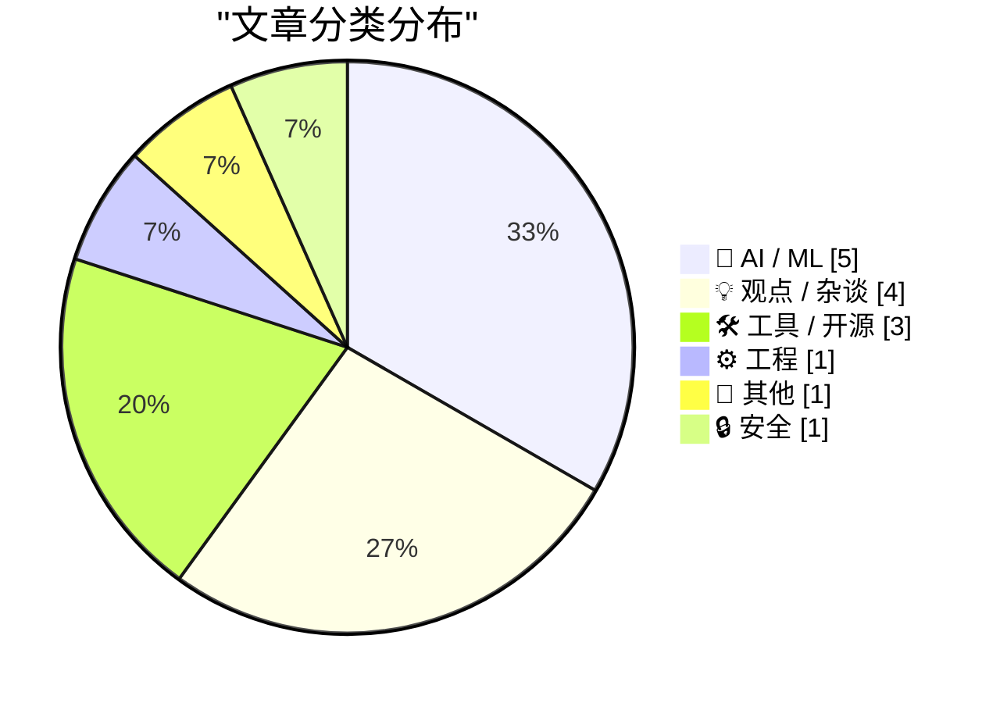
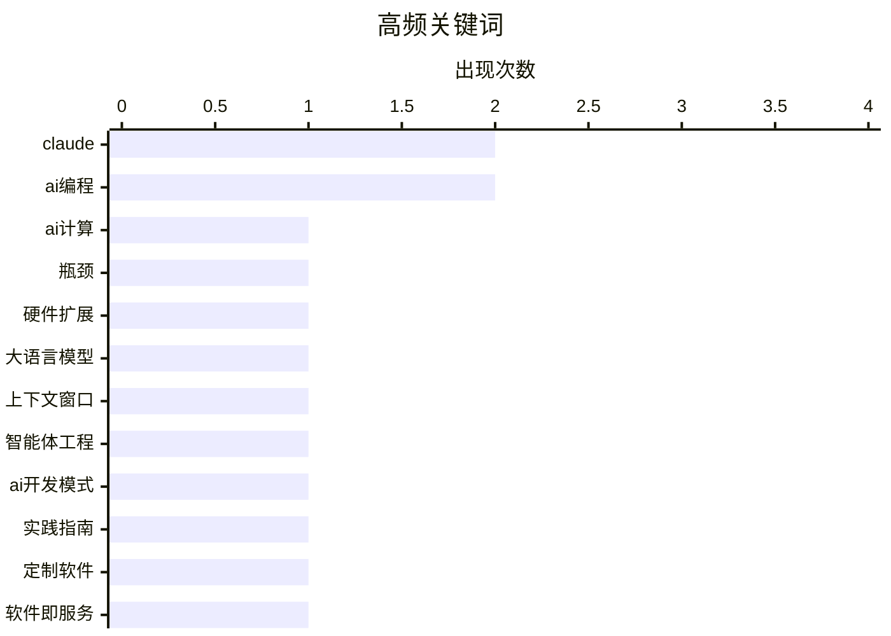

# 📰 AI 博客每日精选 — 2026-03-15

> 来自 Karpathy 推荐的 92 个顶级技术博客，AI 精选 Top 15

## 📝 今日看点

今日技术圈聚焦人工智能的迅猛发展与伴随挑战。算力瓶颈凸显高端芯片稀缺，同时大模型持续突破长上下文限制，智能体工程推动应用创新。然而，人工智能生成内容泛滥冲击开源生态，伦理失范与网络安全威胁引发行业深度反思。

---

## 🏆 今日必读

🥇 **深入探讨：扩展人工智能算力的三大瓶颈，以及为何今天的H100比三年前更值钱**

[深入探讨：扩展人工智能算力的三大瓶颈，以及为何今天的H100比三年前更值钱](https://www.dwarkesh.com/p/dylan-patel) — dwarkesh.com · 1 天前 · 🤖 AI / ML

> 文章深入分析了当前扩展人工智能算力所面临的三个主要瓶颈。这些瓶颈包括内存带宽限制、芯片间互连速度以及电力供应与散热问题。作者指出，由于这些瓶颈短期内难以突破，英伟达H100等现有高端芯片的稀缺性和战略价值不降反增。结论认为，算力基础设施的物理限制正成为人工智能发展的关键制约因素。

💡 **为什么值得读**: 该分析从硬件和供应链的底层视角，揭示了人工智能狂飙背后真实的物理瓶颈与商业逻辑。

🏷️ AI计算, 瓶颈, 硬件扩展

🥈 **克劳德Opus 4.6与Sonnet 4.6模型现已全面开放100万上下文窗口**

[克劳德Opus 4.6与Sonnet 4.6模型现已全面开放100万上下文窗口](https://simonwillison.net/2026/Mar/13/1m-context/#atom-everything) — simonwillison.net · 1 天前 · 🤖 AI / ML

> 人工智能公司Anthropic宣布，其Opus 4.6和Sonnet 4.6模型正式全面支持高达100万令牌的上下文长度。最令人惊讶的是，公司对全部100万上下文窗口统一采用标准定价，不再收取长上下文溢价。相比之下，OpenAI和Gemini等竞争对手对长上下文提示仍会收取更高费用。此举降低了开发者处理超长文档的成本门槛，可能改变大模型长文本处理的市场竞争格局。

💡 **为什么值得读**: 了解这一打破行业惯例的定价策略，有助于评估和选择最具成本效益的长文本处理模型。

🏷️ 大语言模型, 上下文窗口, Claude

🥉 **我在Pragmatic峰会上关于智能体工程的炉边谈话**

[我在Pragmatic峰会上关于智能体工程的炉边谈话](https://simonwillison.net/2026/Mar/14/pragmatic-summit/#atom-everything) — simonwillison.net · 9 小时前 · 🤖 AI / ML

> 文章分享了作者在Pragmatic峰会上关于智能体工程的一次炉边谈话内容。讨论聚焦于如何设计、构建和部署能够自主执行复杂任务的人工智能体。作者介绍了实用的智能体工程模式，并探讨了在实际应用中遇到的挑战与解决方案。谈话强调了将智能体思维融入软件开发生命周期的重要性，以构建更可靠、可协作的人工智能系统。

💡 **为什么值得读**: 对于希望将人工智能体从概念转化为实际产品的开发者而言，这些来自一线的实践模式极具参考价值。

🏷️ 智能体工程, AI开发模式, 实践指南

---

## 📊 数据概览

| 扫描源 | 抓取文章 | 时间范围 | 精选 |
|:---:|:---:|:---:|:---:|
| 85/92 | 2446 篇 → 35 篇 | 48h | **15 篇** |

### 分类分布



### 高频关键词



<details>
<summary>📈 纯文本关键词图（终端友好）</summary>

```
claude │ ████████████████████ 2
ai编程   │ ████████████████████ 2
ai计算   │ ██████████░░░░░░░░░░ 1
瓶颈     │ ██████████░░░░░░░░░░ 1
硬件扩展   │ ██████████░░░░░░░░░░ 1
大语言模型  │ ██████████░░░░░░░░░░ 1
上下文窗口  │ ██████████░░░░░░░░░░ 1
智能体工程  │ ██████████░░░░░░░░░░ 1
ai开发模式 │ ██████████░░░░░░░░░░ 1
实践指南   │ ██████████░░░░░░░░░░ 1
```

</details>

### 🏷️ 话题标签

**claude**(2) · **ai编程**(2) · **ai计算**(1) · 瓶颈(1) · 硬件扩展(1) · 大语言模型(1) · 上下文窗口(1) · 智能体工程(1) · ai开发模式(1) · 实践指南(1) · 定制软件(1) · 软件即服务(1) · 人工智能泡沫(1) · 行业趋势(1) · 开源维护(1) · ai垃圾(1) · github(1) · 硬件拆解(1) · 可维修性(1) · macbook(1)

---

## 🤖 AI / ML

### 1. 深入探讨：扩展人工智能算力的三大瓶颈，以及为何今天的H100比三年前更值钱

[深入探讨：扩展人工智能算力的三大瓶颈，以及为何今天的H100比三年前更值钱](https://www.dwarkesh.com/p/dylan-patel) — **dwarkesh.com** · 1 天前 · ⭐ 29/30

> 文章深入分析了当前扩展人工智能算力所面临的三个主要瓶颈。这些瓶颈包括内存带宽限制、芯片间互连速度以及电力供应与散热问题。作者指出，由于这些瓶颈短期内难以突破，英伟达H100等现有高端芯片的稀缺性和战略价值不降反增。结论认为，算力基础设施的物理限制正成为人工智能发展的关键制约因素。

🏷️ AI计算, 瓶颈, 硬件扩展

---

### 2. 克劳德Opus 4.6与Sonnet 4.6模型现已全面开放100万上下文窗口

[克劳德Opus 4.6与Sonnet 4.6模型现已全面开放100万上下文窗口](https://simonwillison.net/2026/Mar/13/1m-context/#atom-everything) — **simonwillison.net** · 1 天前 · ⭐ 27/30

> 人工智能公司Anthropic宣布，其Opus 4.6和Sonnet 4.6模型正式全面支持高达100万令牌的上下文长度。最令人惊讶的是，公司对全部100万上下文窗口统一采用标准定价，不再收取长上下文溢价。相比之下，OpenAI和Gemini等竞争对手对长上下文提示仍会收取更高费用。此举降低了开发者处理超长文档的成本门槛，可能改变大模型长文本处理的市场竞争格局。

🏷️ 大语言模型, 上下文窗口, Claude

---

### 3. 我在Pragmatic峰会上关于智能体工程的炉边谈话

[我在Pragmatic峰会上关于智能体工程的炉边谈话](https://simonwillison.net/2026/Mar/14/pragmatic-summit/#atom-everything) — **simonwillison.net** · 9 小时前 · ⭐ 26/30

> 文章分享了作者在Pragmatic峰会上关于智能体工程的一次炉边谈话内容。讨论聚焦于如何设计、构建和部署能够自主执行复杂任务的人工智能体。作者介绍了实用的智能体工程模式，并探讨了在实际应用中遇到的挑战与解决方案。谈话强调了将智能体思维融入软件开发生命周期的重要性，以构建更可靠、可协作的人工智能系统。

🏷️ 智能体工程, AI开发模式, 实践指南

---

### 4. 纽约时报：Meta因性能问题延迟发布新款人工智能模型

[纽约时报：Meta因性能问题延迟发布新款人工智能模型](https://www.nytimes.com/2026/03/12/technology/meta-avocado-ai-model-delayed.html?unlocked_article_code=1.S1A.vI_6.4j717gwtFem0) — **daringfireball.net** · 1 天前 · ⭐ 24/30

> 据内部人士透露，Meta公司内部代号为“牛油果”的新一代基础人工智能模型因性能未达预期而被推迟发布。在内部测试中，该模型在推理、编码和写作等关键能力上未能超越谷歌、OpenAI和Anthropic等竞争对手的领先模型。尽管“牛油果”的性能优于Meta前代模型和谷歌的Gemini 2.5，但仍未达到公司设定的与顶尖模型竞争的目标。此次延迟反映了顶级人工智能模型竞赛的白热化，以及性能追赶的难度。

🏷️ Meta, AI模型, 性能延迟

---

### 5. 用人工智能排版乐谱

[用人工智能排版乐谱](https://www.johndcook.com/blog/2026/03/13/typesetting-sheet-music-with-ai/) — **johndcook.com** · 1 天前 · ⭐ 21/30

> 文章探讨了使用人工智能生成专业乐谱排版语言莉莉蓬代码的实践与观察。莉莉蓬是一种类似于特克斯的、用于精确排版乐谱的标记语言。作者发现，尽管莉莉蓬语言相对小众且公开的训练代码数据有限，但人工智能模型仍能生成出质量不错的代码。这些生成的代码主要被作者应用于音乐理论相关的博客文章内容中。这一结果表明，人工智能在处理特定、专业的领域任务时，即使训练数据不充足，也可能表现出乎意料的能力。

🏷️ AI生成, 乐谱排版, Lilypond

---

## 💡 观点 / 杂谈

### 6. 深度解析：憎恨者眼中的软件即服务末日

[深度解析：憎恨者眼中的软件即服务末日](https://www.wheresyoured.at/hatersguide-saas/) — **wheresyoured.at** · 1 天前 · ⭐ 25/30

> 文章将当前的人工智能投资热潮置于更宏大的“软件腐朽泡沫”背景下进行审视。作者认为，生成式人工智能的兴起，最初看似是软件行业在增长停滞期后迎来的新突破。然而，人工智能泡沫实际上植根于软件即服务行业超高速增长时代的终结这一大环境。文章旨在通过分析软件行业的周期性变化，来理解人工智能繁荣背后的深层逻辑与潜在风险。

🏷️ 软件即服务, 人工智能泡沫, 行业趋势

---

### 7. 摘要生成失败（可重试）

[摘要生成失败（可重试）](https://www.theverge.com/report/894090/macbook-neo-pc-windows-laptop-competition-asus-footinmouth) — **daringfireball.net** · 7 小时前 · ⭐ 23/30

> 未能生成中文摘要，请稍后重试。

🏷️ 市场竞争, 产品定位, PC厂商

---

### 8. 悲伤与人工智能的分裂

[悲伤与人工智能的分裂](https://blog.lmorchard.com/2026/03/11/grief-and-the-ai-split/) — **daringfireball.net** · 1 天前 · ⭐ 22/30

> 文章探讨了人工智能辅助编码在编程技术演进中的角色与影响。作者从1982年开始编程，将每个新语言视为实现目的的工具，人工智能辅助编码正是这一进程的最新阶段而非根本性断裂。然而，作者指出技术基础和环境正在快速变化，未来方向难以预测。结论是人工智能辅助编码只是技术阶梯上的又一个台阶，但需以开放心态面对不确定性。

🏷️ AI编程, 技术演进, 情感

---

### 9. 政府如何资助开源软件维护者？

[政府如何资助开源软件维护者？](https://shkspr.mobi/blog/2026/03/how-can-governments-pay-open-source-maintainers/) — **shkspr.mobi** · 15 小时前 · ⭐ 21/30

> 文章探讨了政府为其广泛使用的开源软件寻找合理资助方式时面临的实际困境。英国政府内部开发的大量代码已采用开源促进会批准的开源许可证公开，但直接向分散的维护者支付费用存在诸多障碍。主要困难包括难以确定具体的资助对象、量化个人贡献的价值、设计公平的分配机制以及避免利益冲突。作者基于在政府工作的经验指出，尽管设立集中基金或通过税收减免是潜在方向，但目前尚无简单通用的解决方案。结论是，为公共数字基础设施提供可持续支持，需要设计全新的、适应开源协作特性的创新机制。

🏷️ 开源资金, 政府政策, 维护者

---

## 🛠 工具 / 开源

### 10. 软件狂想曲：用克劳德代码打造专属会计系统

[软件狂想曲：用克劳德代码打造专属会计系统](https://craigmod.com/essays/software_bonkers/) — **daringfireball.net** · 1 天前 · ⭐ 25/30

> 作者因找不到满足其多币种、复杂报表需求的现成会计软件，决定利用克劳德代码自行开发。整个开发过程仅耗时约五天，最终成果是一个完全本地运行、速度极快且能灵活处理各种数据格式的定制化系统。该软件能够自动获取历史汇率并处理多币种账目，完美契合了作者的特殊工作流。这一经历证明，借助先进的人工智能编程助手，个人开发者完全有能力快速构建出超越商业软件的专业工具。

🏷️ AI编程, 定制软件, Claude

---

### 11. iFixit拆解报告：MacBook Neo是14年来最易维修的MacBook

[iFixit拆解报告：MacBook Neo是14年来最易维修的MacBook](https://www.ifixit.com/News/116152/macbook-neo-is-the-most-repairable-macbook-in-14-years) — **daringfireball.net** · 5 小时前 · ⭐ 24/30

> 拆解机构iFixit对苹果最便宜的笔记本电脑MacBook Neo进行了详细拆解。报告指出，该机型采用了螺丝固定的电池托盘、更易维修的键盘设计，并配备了详尽的首日维修手册，显著改善了可维修性。这些设计改变使得它成为近十四年来最易维修的MacBook。iFixit认为，这证明了电子产品完全可以同时做到价格更亲民和更易于维修，反驳了“便宜就必须牺牲可维修性”的常见观点。

🏷️ 硬件拆解, 可维修性, MacBook

---

### 12. 弗吉：一个支持GitHub、GitLab、Gitea、Forgejo和Bitbucket的统一命令行工具

[弗吉：一个支持GitHub、GitLab、Gitea、Forgejo和Bitbucket的统一命令行工具](https://nesbitt.io/2026/03/13/forge.html) — **nesbitt.io** · 1 天前 · ⭐ 21/30

> 文章介绍了一个名为“弗吉”的命令行工具，旨在统一操作多个主流代码托管平台。该工具通过单一命令集，支持在GitHub、GitLab、Gitea、Forgejo和Bitbucket上执行拉取请求、代码审查、问题管理等常见操作。它解决了开发者因平台差异而需要记忆不同命令和流程的痛点，将碎片化的工作流整合为一套简洁的界面。作者认为，弗吉通过抽象底层平台的差异，能显著提升开发者在多平台环境下的工作效率与体验。

🏷️ CLI工具, 版本控制, Forge

---

## ⚙️ 工程

### 13. 引用贾尼斯·莱德尔：人工智能垃圾内容泛滥导致开源项目难以为继

[引用贾尼斯·莱德尔：人工智能垃圾内容泛滥导致开源项目难以为继](https://simonwillison.net/2026/Mar/14/jannis-leidel/#atom-everything) — **simonwillison.net** · 9 小时前 · ⭐ 24/30

> 引述内容揭示了开源项目爵士乐队因人工智能生成的垃圾内容泛滥而决定关闭。项目维护者将GitHub上人工智能生成的垃圾提交和问题激增的现象称为“垃圾内容末日”。这种状况使得该项目基于开放成员制和共享推送权限的运营模式变得无法维持。这一事件凸显了人工智能工具被滥用，正在对开源社区的协作模式和可持续性构成严峻挑战。

🏷️ 开源维护, AI垃圾, GitHub

---

## 📝 其他

### 14.  Ars Technica 记者因报道中使用人工智能伪造引语被解雇

[ Ars Technica 记者因报道中使用人工智能伪造引语被解雇](https://futurism.com/artificial-intelligence/ars-technica-fires-reporter-ai-quotes) — **daringfireball.net** · 10 小时前 · ⭐ 24/30

> 知名科技媒体Ars Technica解雇了其记者本杰·爱德华兹，原因是他发布的报道中包含了人工智能伪造的引语。这篇被撤回的报道涉及一个人工智能代理发布攻击人类工程师的病毒式事件，但其中引述该工程师的话完全是虚构的。在当事人指出问题后，网站主编公开道歉并撤稿。此事引发了关于新闻业在人工智能时代如何维护事实核查与伦理标准的广泛讨论。

🏷️ AI伦理, 新闻失实, 内容审核

---

## 🔒 安全

### 15. 马特·穆伦沃格记录了一次极其狡猾的苹果账户钓鱼攻击

[马特·穆伦沃格记录了一次极其狡猾的苹果账户钓鱼攻击](https://ma.tt/2026/03/gone-almost-phishin/) — **daringfireball.net** · 3 小时前 · ⭐ 23/30

> 作者详细记录了自己遭遇的一次高度复杂的苹果账户钓鱼攻击。攻击者首先滥用苹果官方的密码重置流程，向作者的所有设备密集发送合法的重置提示进行骚扰。在作者忽略这些提示后，攻击者立即致电作者，伪装成苹果客服，利用用户可能因骚扰而误操作的心理，试图套取账户的一次性验证码。这种组合了技术漏洞与社会工程学的攻击手法极具欺骗性，即使开启了锁定模式的用户也可能中招。

🏷️ 网络钓鱼, 账户安全, 社会工程学

---

*生成于 2026-03-15 03:59 | 扫描 85 源 → 获取 2446 篇 → 精选 15 篇*
*基于 [Hacker News Popularity Contest 2025](https://refactoringenglish.com/tools/hn-popularity/) RSS 源列表，由 [Andrej Karpathy](https://x.com/karpathy) 推荐*
