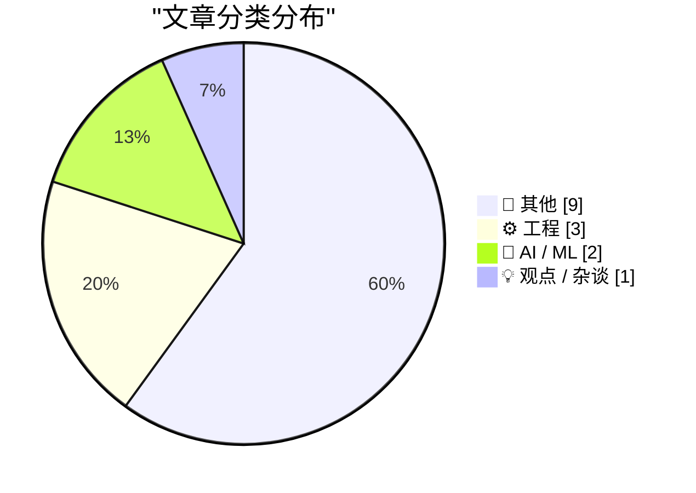
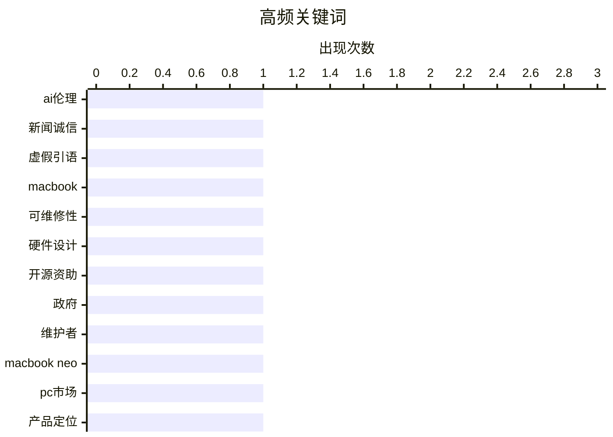

# 📰 AI 博客每日精选 — 2026-03-16

> 来自 Karpathy 推荐的 92 个顶级技术博客，AI 精选 Top 15

## 📝 今日看点

今日技术圈聚焦于人工智能伦理危机与硬件设计革新两大趋势。人工智能生成内容的滥用正冲击新闻诚信与开源协作生态，暴露技术伦理的紧迫挑战。与此同时，硬件工程呈现可维修性突破，苹果新款笔记本电脑的设计标志行业向可持续方向迈进。开源社区则面临资金支持不足与人工智能生成内容泛滥的双重压力。

---

## 🏆 今日必读

🥇 **科技媒体解雇记者因其报道使用人工智能伪造引语**

[科技媒体解雇记者因其报道使用人工智能伪造引语](https://futurism.com/artificial-intelligence/ars-technica-fires-reporter-ai-quotes) — daringfireball.net · 1 天前 · 🤖 AI / ML

> 科技媒体阿尔斯技术网的一名记者，因在报道中使用人工智能生成的虚假引语而被解雇。该报道涉及一起人工智能代理发布攻击人类工程师斯科特·香博的病毒式传播事件，其中包含了并非香博本人所说的伪造引语。事件曝光后，网站撤回了报道，总编辑肯·费希尔公开道歉。这起事件凸显了人工智能生成内容对新闻诚信构成的直接威胁，并导致了严重的职业后果。

💡 **为什么值得读**: 此案例为新闻行业敲响了警钟，揭示了滥用人工智能工具可能迅速摧毁记者的职业信誉与媒体的公信力。

🏷️ AI伦理, 新闻诚信, 虚假引语

🥈 **苹果新笔记本电脑的可维修性分析**

[苹果新笔记本电脑的可维修性分析](https://www.ifixit.com/News/116152/macbook-neo-is-the-most-repairable-macbook-in-14-years) — daringfireball.net · 1 天前 · ⚙️ 工程

> 苹果最新款平价笔记本电脑在可维修性方面取得了显著突破，改变了以往型号大量使用胶水和隐藏式设计的做法。这款电脑采用了螺丝固定的电池托盘、更易维修的键盘设计，并配备了详尽的首日维修手册。其设计证明，电子设备完全可以在保持价格亲民的同时，大幅提升可维修性。这标志着苹果在推进用户维修权利方面迈出了实质性的一步。

💡 **为什么值得读**: 对于关注消费电子产品寿命周期和维修权利的读者，本文提供了苹果产品设计哲学发生转变的具体证据。

🏷️ MacBook, 可维修性, 硬件设计

🥉 **政府如何资助开源软件维护者**

[政府如何资助开源软件维护者](https://shkspr.mobi/blog/2026/03/how-can-governments-pay-open-source-maintainers/) — shkspr.mobi · 1 天前 · ⚙️ 工程

> 本文探讨了政府在大量使用开源软件后，如何系统性地回馈和资助其维护者所面临的复杂挑战。尽管英国政府自身发布了许多开源代码，但向外部开源项目提供资金却存在诸多障碍，例如难以精确定义“使用”行为、公平选择资助对象以及设计可持续的资助机制。这暴露了开源生态系统中贡献与回报之间的结构性矛盾。政府需要创新机制来解决这一“搭便车”问题。

💡 **为什么值得读**: 本文从一个独特的政府视角切入，揭示了支撑数字时代的基础设施——开源软件——在可持续性上面临的根本性困境。

🏷️ 开源资助, 政府, 维护者

---

## 📊 数据概览

| 扫描源 | 抓取文章 | 时间范围 | 精选 |
|:---:|:---:|:---:|:---:|
| 84/92 | 2418 篇 → 27 篇 | 48h | **15 篇** |

### 分类分布



### 高频关键词



<details>
<summary>📈 纯文本关键词图（终端友好）</summary>

```
ai伦理        │ ████████████████████ 1
新闻诚信        │ ████████████████████ 1
虚假引语        │ ████████████████████ 1
macbook     │ ████████████████████ 1
可维修性        │ ████████████████████ 1
硬件设计        │ ████████████████████ 1
开源资助        │ ████████████████████ 1
政府          │ ████████████████████ 1
维护者         │ ████████████████████ 1
macbook neo │ ████████████████████ 1
```

</details>

### 🏷️ 话题标签

**ai伦理**(1) · **新闻诚信**(1) · **虚假引语**(1) · macbook(1) · 可维修性(1) · 硬件设计(1) · 开源资助(1) · 政府(1) · 维护者(1) · macbook neo(1) · pc市场(1) · 产品定位(1) · git(1) · 版本控制(1) · 工作原理(1) · 科技政策(1) · 链接合集(1) · 太空机器人(1) · 书评(1) · 航天工程(1)

---

## 📝 其他

### 1. 腐败的“反腐败”

[腐败的“反腐败”](https://pluralistic.net/2026/03/14/ill-have-what-xis-having/) — **pluralistic.net** · 1 天前 · ⭐ 17/30

> 文章批判性地分析了某些打着“反腐败”旗号的措施，实际上如何被利用并加剧了系统性腐败。通过具体案例，揭示了这些措施如何成为权力斗争的工具或掩护更深层腐败的烟雾弹。作者指出，当反腐败机制本身缺乏透明度和问责制时，其效果可能适得其反。核心观点是，缺乏真正民主监督的反腐败运动，极易沦为新的腐败形式。

🏷️ 科技政策, 链接合集

---

### 2. 十二音作曲法

[十二音作曲法](https://www.johndcook.com/blog/2026/03/15/twelve-tone-composition/) — **johndcook.com** · 4 小时前 · ⭐ 16/30

> 十二音作曲法是一种用于创作无调性音乐的结构化技术，旨在打破传统的调性听觉习惯。作曲家预先设定一个包含十二个半音的特定顺序，并以此作为整部作品音高材料的基础，通过转位、逆行等手法进行发展。这种严格的规则迫使作曲家摆脱固有的旋律与和声本能，创造出“不悦耳”却富有逻辑的音乐。它体现了现代音乐中理性设计对感性直觉的超越。

🏷️ 十二音作曲, 算法音乐, 音乐理论

---

### 3. 什么是智能体工程？

[什么是智能体工程？](https://simonwillison.net/guides/agentic-engineering-patterns/what-is-agentic-engineering/#atom-everything) — **simonwillison.net** · 5 小时前 · ⭐ 15/30

> 智能体工程是指利用能够编写并执行代码的编码智能体来辅助软件开发的新兴工程实践。这类智能体，如克劳德代码模型和开放人工智能代码模型，可以理解自然语言指令并生成可运行代码，从而改变开发者的工作流程。它将开发者从部分重复性编码任务中解放出来，使其更专注于高层设计和逻辑。这代表了一种人机协作编程范式的开端。

---

### 4. 开源社区负责人谈人工智能生成内容泛滥的冲击

[开源社区负责人谈人工智能生成内容泛滥的冲击](https://simonwillison.net/2026/Mar/14/jannis-leidel/#atom-everything) — **simonwillison.net** · 1 天前 · ⭐ 15/30

> 开源社区负责人指出，人工智能生成内容的大量涌入正在严重冲击开源协作模式。以爵士乐队开源项目为例，其开放的成员模式和共享推送权限设计，原本是为了应对人为的偶然错误，但无法应对人工智能生成的垃圾拉取请求和问题的海量冲击。这种“人工智能生成内容灾难”使得原有的社区治理模型变得难以为继。开源社区正被迫适应一个充满自动化噪音的新环境。

---

### 5. 摘要生成失败（可重试）

[摘要生成失败（可重试）](https://simonwillison.net/2026/Mar/14/pragmatic-summit/#atom-everything) — **simonwillison.net** · 1 天前 · ⭐ 15/30

> 未能生成中文摘要，请稍后重试。

---

### 6. 摘要生成失败（可重试）

[摘要生成失败（可重试）](https://www.youtube.com/live/eCSNJgI2LFI) — **daringfireball.net** · 5 小时前 · ⭐ 15/30

> 未能生成中文摘要，请稍后重试。

---

### 7. 摘要生成失败（可重试）

[摘要生成失败（可重试）](https://www.finalist.works/finalist-36/) — **daringfireball.net** · 10 小时前 · ⭐ 15/30

> 未能生成中文摘要，请稍后重试。

---

### 8. 摘要生成失败（可重试）

[摘要生成失败（可重试）](https://samhenri.gold/blog/20260312-this-is-not-the-computer-for-you/?ref=birchtree.me) — **daringfireball.net** · 10 小时前 · ⭐ 15/30

> 未能生成中文摘要，请稍后重试。

---

### 9. 摘要生成失败（可重试）

[摘要生成失败（可重试）](https://www.resume.org/the-great-turnover-9-in-10-companies-plan-to-hire-in-2026-yet-6-in-10-will-have-layoffs-2/) — **daringfireball.net** · 11 小时前 · ⭐ 15/30

> 未能生成中文摘要，请稍后重试。

---

## ⚙️ 工程

### 10. 苹果新笔记本电脑的可维修性分析

[苹果新笔记本电脑的可维修性分析](https://www.ifixit.com/News/116152/macbook-neo-is-the-most-repairable-macbook-in-14-years) — **daringfireball.net** · 1 天前 · ⭐ 24/30

> 苹果最新款平价笔记本电脑在可维修性方面取得了显著突破，改变了以往型号大量使用胶水和隐藏式设计的做法。这款电脑采用了螺丝固定的电池托盘、更易维修的键盘设计，并配备了详尽的首日维修手册。其设计证明，电子设备完全可以在保持价格亲民的同时，大幅提升可维修性。这标志着苹果在推进用户维修权利方面迈出了实质性的一步。

🏷️ MacBook, 可维修性, 硬件设计

---

### 11. 政府如何资助开源软件维护者

[政府如何资助开源软件维护者](https://shkspr.mobi/blog/2026/03/how-can-governments-pay-open-source-maintainers/) — **shkspr.mobi** · 1 天前 · ⭐ 23/30

> 本文探讨了政府在大量使用开源软件后，如何系统性地回馈和资助其维护者所面临的复杂挑战。尽管英国政府自身发布了许多开源代码，但向外部开源项目提供资金却存在诸多障碍，例如难以精确定义“使用”行为、公平选择资助对象以及设计可持续的资助机制。这暴露了开源生态系统中贡献与回报之间的结构性矛盾。政府需要创新机制来解决这一“搭便车”问题。

🏷️ 开源资助, 政府, 维护者

---

### 12. 版本控制中的“传送”思考

[版本控制中的“传送”思考](https://idiallo.com/byte-size/git-teleportation?src=feed) — **idiallo.com** · 3 小时前 · ⭐ 18/30

> 文章将科幻作品中的“传送”概念与版本控制系统的工作原理进行类比，引发哲学思考。它探讨了当代码从一个分支“传送”到另一个分支时，其本质是原状态的精确迁移，还是在新位置的一次重建。这种思考延伸至身份连续性与信息本质的深层问题。最终，它邀请读者重新审视日常开发工具中蕴含的抽象概念。

🏷️ Git, 版本控制, 工作原理

---

## 🤖 AI / ML

### 13. 科技媒体解雇记者因其报道使用人工智能伪造引语

[科技媒体解雇记者因其报道使用人工智能伪造引语](https://futurism.com/artificial-intelligence/ars-technica-fires-reporter-ai-quotes) — **daringfireball.net** · 1 天前 · ⭐ 26/30

> 科技媒体阿尔斯技术网的一名记者，因在报道中使用人工智能生成的虚假引语而被解雇。该报道涉及一起人工智能代理发布攻击人类工程师斯科特·香博的病毒式传播事件，其中包含了并非香博本人所说的伪造引语。事件曝光后，网站撤回了报道，总编辑肯·费希尔公开道歉。这起事件凸显了人工智能生成内容对新闻诚信构成的直接威胁，并导致了严重的职业后果。

🏷️ AI伦理, 新闻诚信, 虚假引语

---

### 14. 书评：《太空机器人——我们行星探索者的秘密生活》

[书评：《太空机器人——我们行星探索者的秘密生活》](https://shkspr.mobi/blog/2026/03/book-review-robots-in-space-the-secret-lives-of-our-planetary-explorers-by-dr-ezzy-pearson/) — **shkspr.mobi** · 15 小时前 · ⭐ 17/30

> 本书全面记录了机器人进行行星探索的历史，聚焦于火星等星球上的无人任务。它详细描述了在数百万英里外着陆一个机器人的工程实践、背后的科研人员以及经常阻碍任务的政治博弈。书中揭示，政治因素和预算争夺往往对任务成败有着与技术挑战同等甚至更大的影响。这是一部关于人类雄心、工程奇迹与地面政治现实交织的太空探索史。

🏷️ 太空机器人, 书评, 航天工程

---

## 💡 观点 / 杂谈

### 15. 个人电脑制造商尚未准备好应对苹果新笔记本电脑

[个人电脑制造商尚未准备好应对苹果新笔记本电脑](https://www.theverge.com/report/894090/macbook-neo-pc-windows-laptop-competition-asus-footinmouth) — **daringfireball.net** · 1 天前 · ⭐ 21/30

> 文章指出，面对苹果新推出的平价笔记本电脑，个人电脑制造商表现出明显的认知误判。以华硕首席财务官为例，其评论将苹果产品仅定位为“内容消费”设备，并类比为平板电脑，忽视了其在主流计算场景下的竞争力。这种评论反映了个人电脑行业对苹果产品战略的理解仍停留在表面。作者认为，这种思维定式可能导致个人电脑制造商在竞争中持续处于被动。

🏷️ MacBook Neo, PC市场, 产品定位

---

*生成于 2026-03-16 04:01 | 扫描 84 源 → 获取 2418 篇 → 精选 15 篇*
*基于 [Hacker News Popularity Contest 2025](https://refactoringenglish.com/tools/hn-popularity/) RSS 源列表，由 [Andrej Karpathy](https://x.com/karpathy) 推荐*
