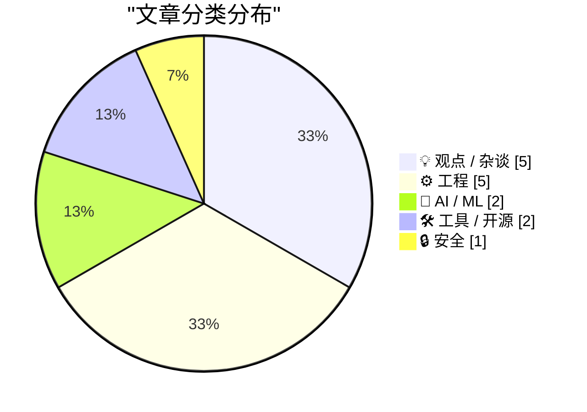
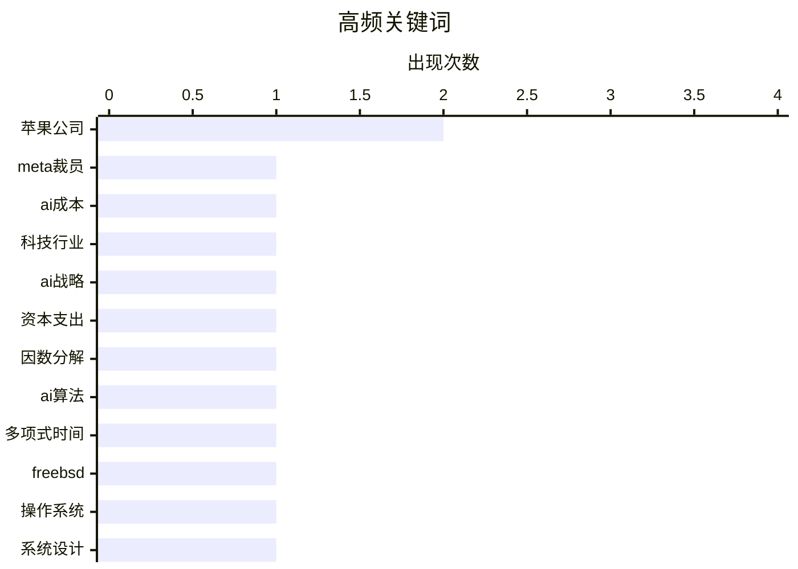

# 📰 AI 博客每日精选 — 2026-03-17

> 来自 Karpathy 推荐的 92 个顶级技术博客，AI 精选 Top 15

## 📝 今日看点

今日技术领域聚焦于人工智能浪潮下的行业变革与系统安全设计的深度演进。一方面，人工智能基础设施的巨额成本正引发科技公司裁员与战略调整，同时其算法突破可能撼动密码学等基础领域。另一方面，从硬件级安全隔离到操作系统哲学，对可靠性与架构优化的追求持续推动技术系统向更稳健方向发展。

---

## 🏆 今日必读

🥇 **路透社：因人工智能成本攀升，元公司计划大规模裁员**

[路透社：因人工智能成本攀升，元公司计划大规模裁员](https://www.reuters.com/business/world-at-work/meta-planning-sweeping-layoffs-ai-costs-mount-2026-03-14/) — daringfireball.net · 1 天前 · 🤖 AI / ML

> 元公司正计划进行一场可能影响百分之二十或更多员工的大规模裁员，以应对高昂的人工智能基础设施投资。此次裁员旨在抵消人工智能领域的巨额资本支出，并为人工智能辅助带来的效率提升做准备。目前裁员的最终规模与具体日期尚未确定，但公司高层已向部分团队传达了相关信号。这表明，在人工智能的军备竞赛中，即便是科技巨头也不得不通过削减人力成本来平衡财务压力。

💡 **为什么值得读**: 本文揭示了人工智能热潮背后真实的财务压力与人力成本博弈，对理解科技行业未来走向具有重要参考价值。

🏷️ Meta裁员, AI成本, 科技行业

🥈 **霍拉斯·德迪乌论苹果置身人工智能支出竞赛之外**

[霍拉斯·德迪乌论苹果置身人工智能支出竞赛之外](https://asymco.com/2026/03/10/the-most-brilliant-move-in-corporate-history/) — daringfireball.net · 1 天前 · 💡 观点 / 杂谈

> 文章对比了科技巨头在人工智能数据中心上的巨额资本支出，突显了苹果公司的独特战略。预计到二零二六年，亚马逊、谷歌、微软和元公司在人工智能数据中心上的支出将分别高达两千亿、一千八百五十亿、一千一百四十亿和一千三百五十亿美元，总和达六千五百亿美元。与此形成鲜明对比的是，苹果公司并未参与这场疯狂的支出竞赛，其资本支出仍主要用于传统硬件制造。作者认为，避开这场消耗战可能是苹果历史上最精明的战略决策之一。

💡 **为什么值得读**: 通过惊人的数据对比和独到视角，为理解苹果与众不同的商业逻辑及人工智能时代的竞争格局提供了关键洞察。

🏷️ AI战略, 苹果公司, 资本支出

🥉 **多项式时间因数分解算法**

[多项式时间因数分解算法](https://geohot.github.io//blog/jekyll/update/2026/03/16/polynomial-time-factoring.html) — geohot.github.io · 1 天前 · 🤖 AI / ML

> 作者断言人工智能很快将发现多项式时间的因数分解算法，这将对现代密码学的基础构成根本性挑战。与布尔可满足性问题不同，作者认为大数因数分解问题本身具有可利用的数学结构，只是现有算法未能充分发掘。人工智能有望通过更深入地洞察问题的内在结构，突破当前计算复杂度的限制。一旦实现，目前广泛使用的非对称加密体系（例如RSA）将变得不再安全。

💡 **为什么值得读**: 文章提出了一个可能颠覆现有网络安全根基的大胆预言，对密码学和安全领域的从业者极具警示和前瞻意义。

🏷️ 因数分解, AI算法, 多项式时间

---

## 📊 数据概览

| 扫描源 | 抓取文章 | 时间范围 | 精选 |
|:---:|:---:|:---:|:---:|
| 84/92 | 2432 篇 → 34 篇 | 48h | **15 篇** |

### 分类分布



### 高频关键词



<details>
<summary>📈 纯文本关键词图（终端友好）</summary>

```
苹果公司    │ ████████████████████ 2
meta裁员  │ ██████████░░░░░░░░░░ 1
ai成本    │ ██████████░░░░░░░░░░ 1
科技行业    │ ██████████░░░░░░░░░░ 1
ai战略    │ ██████████░░░░░░░░░░ 1
资本支出    │ ██████████░░░░░░░░░░ 1
因数分解    │ ██████████░░░░░░░░░░ 1
ai算法    │ ██████████░░░░░░░░░░ 1
多项式时间   │ ██████████░░░░░░░░░░ 1
freebsd │ ██████████░░░░░░░░░░ 1
```

</details>

### 🏷️ 话题标签

**苹果公司**(2) · **meta裁员**(1) · **ai成本**(1) · 科技行业(1) · ai战略(1) · 资本支出(1) · 因数分解(1) · ai算法(1) · 多项式时间(1) · freebsd(1) · 操作系统(1) · 系统设计(1) · 稳定性(1) · 数据库(1) · 服务器less(1) · web开发(1) · 架构更新(1) · ai炒作(1) · 裁员(1) · 商业伦理(1)

---

## 💡 观点 / 杂谈

### 1. 霍拉斯·德迪乌论苹果置身人工智能支出竞赛之外

[霍拉斯·德迪乌论苹果置身人工智能支出竞赛之外](https://asymco.com/2026/03/10/the-most-brilliant-move-in-corporate-history/) — **daringfireball.net** · 1 天前 · ⭐ 23/30

> 文章对比了科技巨头在人工智能数据中心上的巨额资本支出，突显了苹果公司的独特战略。预计到二零二六年，亚马逊、谷歌、微软和元公司在人工智能数据中心上的支出将分别高达两千亿、一千八百五十亿、一千一百四十亿和一千三百五十亿美元，总和达六千五百亿美元。与此形成鲜明对比的是，苹果公司并未参与这场疯狂的支出竞赛，其资本支出仍主要用于传统硬件制造。作者认为，避开这场消耗战可能是苹果历史上最精明的战略决策之一。

🏷️ AI战略, 苹果公司, 资本支出

---

### 2. 将裁员归咎于人工智能：‘这种说法更容易被接受’

[将裁员归咎于人工智能：‘这种说法更容易被接受’](https://www.resume.org/the-great-turnover-9-in-10-companies-plan-to-hire-in-2026-yet-6-in-10-will-have-layoffs-2/) — **daringfireball.net** · 1 天前 · ⭐ 22/30

> 一项针对一千名美国招聘经理的调查揭示，企业在解释裁员时存在策略性归因。高达百分之五十九的招聘经理承认，他们在解释招聘冻结或裁员时，会强调人工智能的影响而非财务约束。这是因为将原因归于人工智能等“技术进步”或“效率提升”，比归咎于公司财务状况不佳更容易让利益相关者接受。这种现象表明，人工智能有时成为了企业进行人事调整的“公关借口”。

🏷️ AI炒作, 裁员, 商业伦理

---

### 3. 计算机历史博物馆直播：苹果五十周年

[计算机历史博物馆直播：苹果五十周年](https://www.youtube.com/live/eCSNJgI2LFI) — **daringfireball.net** · 1 天前 · ⭐ 19/30

> 这次直播活动庆祝苹果公司成立50周年，回顾其历史与创新历程。主持人大卫·波格以专业且风趣的风格掌控全场，特邀嘉宾包括早期员工克里斯·埃斯皮诺萨、前首席执行官约翰·斯卡利和软件架构师阿维·特瓦尼安。嘉宾们分享了苹果发展中的关键决策、技术突破如麦金塔电脑的诞生，以及内部轶事和领导经验。活动内容涵盖从个人电脑革命到现代产品生态的演进，提供了丰富的第一手见解。作者评价此次活动为一次精彩的视听盛宴，值得苹果粉丝和历史爱好者深入观看。

🏷️ 苹果公司, 科技史, 文化

---

### 4. 忠诚宣誓的圣战

[忠诚宣誓的圣战](https://idiallo.com/blog/loyalty-oath-crusade-speak-up?src=feed) — **idiallo.com** · 15 小时前 · ⭐ 19/30

> 文章以《第二十二条军规》第11章为例，揭示军事官僚主义中忠诚宣誓的荒谬性。两名上尉制定复杂规则，如进入食堂需背诵效忠誓言，获得食物需重复背诵，获取盐、胡椒和番茄酱等调味品则需唱美国国歌或签署忠诚誓言。所有人都清楚这些要求毫无意义，却依然盲目服从。作者借此批判了盲目从众和官僚主义对个人自由的侵蚀，强调保持独立思考的重要性。

🏷️ 官僚主义, 流程管理, 软件开发

---

### 5. 这台电脑不适合你

[这台电脑不适合你](https://samhenri.gold/blog/20260312-this-is-not-the-computer-for-you/?ref=birchtree.me) — **daringfireball.net** · 1 天前 · ⭐ 18/30

> 文章探讨了技术狂热者与计算机硬件之间一种反直觉的成长关系。核心论点是技术痴迷往往始于手边任何可用的工具，而非理想的“正确”设备。通过不断突破低性能硬件的极限，其约束本身成为探索计算本质的路线图。正是在为“勉强够用”的硬件支付过高计算成本的过程中，人们才能真正理解计算的底层代价。作者最终认为，从一台“不够好”的电脑开始，是深入理解计算本质的宝贵路径。

🏷️ 工具哲学, 开发者思维, 创新

---

## ⚙️ 工程

### 6. 我为何热爱FreeBSD操作系统

[我为何热爱FreeBSD操作系统](https://it-notes.dragas.net/2026/03/16/why-i-love-freebsd/) — **it-notes.dragas.net** · 19 小时前 · ⭐ 23/30

> 这是一篇个人回顾，阐述了作者自二零零二年接触FreeBSD以来，该系统如何深刻影响其系统设计与运维哲学。FreeBSD的稳定性、一致性以及“一切皆文件”等设计理念，为作者构建可靠系统奠定了坚实基础。其卓越的文档和友善的社区文化，在超过二十年的时间里持续提供着价值。与一些更流行的系统相比，FreeBSD所代表的简洁、专注和工程严谨性至今仍让作者深感共鸣。

🏷️ FreeBSD, 操作系统, 系统设计, 稳定性

---

### 7. 周报第四百九十五期

[周报第四百九十五期](https://www.troyhunt.com/weekly-update-495/) — **troyhunt.com** · 48 分钟前 · ⭐ 23/30

> 本文回顾了“我被攻破了吗”网站从最初简单架构到如今复杂系统的演变历程。服务起步时仅是一个网站加一个数据库，用于查询超过一点五亿个泄露的邮箱地址。随着时间推移，系统引入了无服务器函数、边缘计算代码、新的数据存储结构以及完全不同的查询机制。这些变化反映了现代网络服务为应对规模增长和技术迭代所积累的技术债务与架构复杂性。

🏷️ 数据库, 服务器less, Web开发, 架构更新

---

### 8. Windows栈限制检查回顾：PowerPC处理器架构篇

[Windows栈限制检查回顾：PowerPC处理器架构篇](https://devblogs.microsoft.com/oldnewthing/20260316-00/?p=112140) — **devblogs.microsoft.com/oldnewthing** · 13 小时前 · ⭐ 21/30

> 这是“旧事新说”博客系列中的一篇，深入回顾了Windows操作系统在PowerPC处理器架构上实现栈限制检查的技术细节。文章通过逆向工程和数学推算，剖析了历史代码中如何确定栈的边界以防止溢出。这种对底层机制和历史设计决策的探究，揭示了早期系统编程中的挑战与解决方案。它为理解操作系统内核的安全机制演进提供了具体案例。

🏷️ Windows, 栈检查, PowerPC

---

### 9. 食物、软件与权衡之道

[食物、软件与权衡之道](https://blog.jim-nielsen.com/2026/food-software-and-trade-offs/) — **blog.jim-nielsen.com** · 1 天前 · ⭐ 21/30

> 文章借由格雷格·瑙斯的一个食物类比，探讨了软件开发中个性化与标准化之间的永恒权衡。工厂生产的零食、糕点师精心制作的蛋糕与直接抓取原料塞进嘴里，代表了三种不同的“关怀、个性化与亲密程度”。这个类比精准地映射了软件产品在追求大规模效率与提供深度个性化体验之间的光谱。作者的核心观点是，认识到这种权衡的存在并做出清醒的选择，比盲目追求某种单一标准更为重要。

🏷️ 软件权衡, 设计决策, 类比

---

### 10. 奇思妙想：Git的‘瞬移’机制

[奇思妙想：Git的‘瞬移’机制](https://idiallo.com/byte-size/git-teleportation?src=feed) — **idiallo.com** · 1 天前 · ⭐ 17/30

> 文章以科幻作品中的传送装置为引子，类比探讨分布式版本控制系统在克隆或拉取代码时，底层究竟是传输完整数据还是仅传输差异的核心问题。通过分析该系统的对象模型与传输协议，揭示了其通过哈希值定位并仅获取本地缺失的对象，从而实现高效同步的工作原理。这一过程与科幻设定中‘扫描-复制’与‘分解-重组’两种传送模式的哲学争论形成了巧妙对应。最终结论是，该系统的机制更接近于‘扫描-复制’模式，它通过智能的数据定位与获取，在绝大多数情况下避免了不必要的数据传输，实现了近乎‘瞬移’的高效体验。

🏷️ Git, 版本控制, 开发者文化

---

## 🤖 AI / ML

### 11. 路透社：因人工智能成本攀升，元公司计划大规模裁员

[路透社：因人工智能成本攀升，元公司计划大规模裁员](https://www.reuters.com/business/world-at-work/meta-planning-sweeping-layoffs-ai-costs-mount-2026-03-14/) — **daringfireball.net** · 1 天前 · ⭐ 24/30

> 元公司正计划进行一场可能影响百分之二十或更多员工的大规模裁员，以应对高昂的人工智能基础设施投资。此次裁员旨在抵消人工智能领域的巨额资本支出，并为人工智能辅助带来的效率提升做准备。目前裁员的最终规模与具体日期尚未确定，但公司高层已向部分团队传达了相关信号。这表明，在人工智能的军备竞赛中，即便是科技巨头也不得不通过削减人力成本来平衡财务压力。

🏷️ Meta裁员, AI成本, 科技行业

---

### 12. 多项式时间因数分解算法

[多项式时间因数分解算法](https://geohot.github.io//blog/jekyll/update/2026/03/16/polynomial-time-factoring.html) — **geohot.github.io** · 1 天前 · ⭐ 23/30

> 作者断言人工智能很快将发现多项式时间的因数分解算法，这将对现代密码学的基础构成根本性挑战。与布尔可满足性问题不同，作者认为大数因数分解问题本身具有可利用的数学结构，只是现有算法未能充分发掘。人工智能有望通过更深入地洞察问题的内在结构，突破当前计算复杂度的限制。一旦实现，目前广泛使用的非对称加密体系（例如RSA）将变得不再安全。

🏷️ 因数分解, AI算法, 多项式时间

---

## 🛠 工具 / 开源

### 13. 活动机器人构建工具的一些更新

[活动机器人构建工具的一些更新](https://shkspr.mobi/blog/2026/03/some-updates-to-activitybot/) — **shkspr.mobi** · 15 小时前 · ⭐ 21/30

> 活动机器人构建工具是一个用于快速构建马斯托丹机器人的极简工具，其核心是一个不足八十KB的单一PHP文件。这个文件本身就能运行一个完整的活动流协议服务器，实现了极大的简洁性。文中列举了多个运行中的实例，如展示最新长凳信息的机器人、每日发布颜色的机器人以及展示太阳能数据的机器人。该项目证明了用最小化技术栈实现复杂联邦网络功能的可行性。

🏷️ Mastodon, PHP, 机器人开发

---

### 14. OpenTK三月更新：议会问答提醒、文件档案优化等功能升级

[OpenTK三月更新：议会问答提醒、文件档案优化等功能升级](https://berthub.eu/articles/posts/updates-opentk-maart-2026/) — **berthub.eu** · 8 小时前 · ⭐ 20/30

> OpenTK对荷兰议会文件处理系统进行了功能增强，提升了文件互连与检索效率。核心改进包括自动将文件中引用的其他议会文件转化为可点击链接，此功能上月推出后获得大量积极反馈。本次更新进一步扩展了该功能，使文档编号与案件编号也能被自动识别并转换为可操作链接。这些改进旨在减少手动查找时间，让用户能更直观地追踪文件关联。作者指出，这些优化是基于用户反馈持续迭代的结果，显著提升了系统实用性与信息透明度。

🏷️ 文档处理, 工具更新, 政府技术

---

## 🔒 安全

### 15. 苹果安全飞地与MacBook Neo屏幕摄像头指示灯的安全设计

[苹果安全飞地与MacBook Neo屏幕摄像头指示灯的安全设计](https://daringfireball.net/2026/03/apple_enclaves_neo_camera_indicator) — **daringfireball.net** · 10 小时前 · ⭐ 21/30

> 文章深入介绍了苹果MacBook Neo笔记本电脑摄像头指示灯基于硬件安全飞地的设计原理。该设计将摄像头控制电路与主操作系统完全隔离，置于一个独立的安全区域（即安全飞地）内。这意味着，即使攻击者获得了内核级别的最高权限漏洞，也无法在不触发屏幕指示灯亮起的情况下私自开启摄像头。这种硬件级的安全机制从根本上杜绝了摄像头被恶意软件秘密激活的可能性。

🏷️ 硬件安全, 隐私保护, macOS

---

*生成于 2026-03-17 03:43 | 扫描 84 源 → 获取 2432 篇 → 精选 15 篇*
*基于 [Hacker News Popularity Contest 2025](https://refactoringenglish.com/tools/hn-popularity/) RSS 源列表，由 [Andrej Karpathy](https://x.com/karpathy) 推荐*
