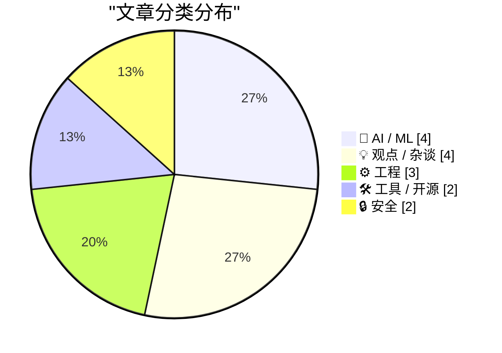
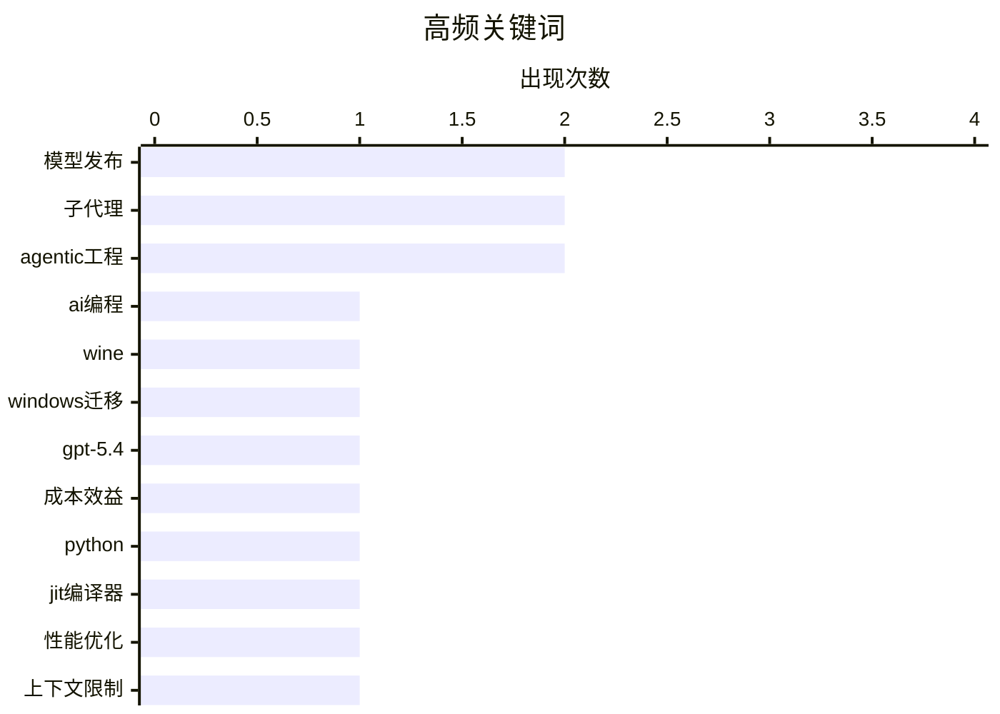

# 📰 AI 博客每日精选 — 2026-03-18

> 来自 Karpathy 推荐的 92 个顶级技术博客，AI 精选 Top 15

## 📝 今日看点

今日技术圈聚焦人工智能智能体技术的突破性进展，子智能体模式与编码智能体正推动复杂任务处理的革新。同时，模型与系统性能优化成为主线，更小、更高效的AI模型及编程语言即时编译器显著提升效率。安全议题同步升温，从人工智能风险演练到硬件安全设计，防范意识持续增强。

---

## 🏆 今日必读

🥇 **利用智能体与Wine摆脱Windows依赖**

[利用智能体与Wine摆脱Windows依赖](https://martinalderson.com/posts/using-agents-and-wine-to-move-off-windows/?utm_source=rss&amp;utm_medium=rss&amp;utm_campaign=feed) — martinalderson.com · 1 天前 · 🛠 工具 / 开源

> 文章分享了作者如何利用Claude Code智能体解决Linux桌面问题，并让在Wine兼容性评级中被评为“垃圾”的Windows应用程序成功运行。作者通过智能体自动化诊断和修复了显卡驱动、音频等系统配置问题。同时，他详细记录了使用智能体调整Wine配置、安装依赖库以运行特定商业软件的过程。这一实践表明，借助先进的编码智能体，用户迁移到Linux并运行遗留Windows软件的障碍正在迅速降低。

💡 **为什么值得读**: 为希望脱离Windows生态但受限于特定软件的用户，提供了一个结合前沿智能体工具与经典兼容层技术的实用迁移指南。

🏷️ AI编程, Wine, Windows迁移

🥈 **GPT-5.4迷你版与纳米版发布：以52美元解析76000张照片**

[GPT-5.4迷你版与纳米版发布：以52美元解析76000张照片](https://simonwillison.net/2026/Mar/17/mini-and-nano/#atom-everything) — simonwillison.net · 8 小时前 · 🤖 AI / ML

> OpenAI发布了GPT-5.4系列的两个更小、更高效的模型：迷你版和纳米版。新发布的纳米版在最大推理努力模式下，性能超越了上一代的GPT-5迷你模型，而新的迷你版速度则是前代的两倍。根据公布的定价，使用这些模型处理大量任务成本显著降低，例如描述七万六千张照片仅需五十二美元。这表明OpenAI正在通过模型小型化和优化推理效率，持续推动大语言模型应用成本的下降。

💡 **为什么值得读**: 揭示了当前大模型在性价比竞赛中的最新进展，对需要处理海量任务的开发者和企业具有直接的预算参考价值。

🏷️ GPT-5.4, 模型发布, 成本效益

🥉 **引用肯·金：CPython JIT提前达成性能目标**

[引用肯·金：CPython JIT提前达成性能目标](https://simonwillison.net/2026/Mar/17/ken-jin/#atom-everything) — simonwillison.net · 5 小时前 · ⚙️ 工程

> CPython的即时编译器项目已提前超额完成其性能目标。在macOS AArch64平台上，3.15 alpha版本的JIT比尾调用解释器快百分之十一到十二。在x86_64 Linux平台上，它比标准解释器快百分之五到六。这一进展比原计划时间表提前了一年多（macOS）和数月（Linux）。核心开发者肯·金宣布了这一里程碑，标志着Python运行时性能优化取得了实质性突破。

💡 **为什么值得读**: 对于关注Python语言性能发展的开发者而言，这是了解其未来运行效率提升关键方向的第一手信息。

🏷️ Python, JIT编译器, 性能优化

---

## 📊 数据概览

| 扫描源 | 抓取文章 | 时间范围 | 精选 |
|:---:|:---:|:---:|:---:|
| 83/92 | 2421 篇 → 40 篇 | 48h | **15 篇** |

### 分类分布



### 高频关键词



<details>
<summary>📈 纯文本关键词图（终端友好）</summary>

```
模型发布      │ ████████████████████ 2
子代理       │ ████████████████████ 2
agentic工程 │ ████████████████████ 2
ai编程      │ ██████████░░░░░░░░░░ 1
wine      │ ██████████░░░░░░░░░░ 1
windows迁移 │ ██████████░░░░░░░░░░ 1
gpt-5.4   │ ██████████░░░░░░░░░░ 1
成本效益      │ ██████████░░░░░░░░░░ 1
python    │ ██████████░░░░░░░░░░ 1
jit编译器    │ ██████████░░░░░░░░░░ 1
```

</details>

### 🏷️ 话题标签

**模型发布**(2) · **子代理**(2) · **agentic工程**(2) · ai编程(1) · wine(1) · windows迁移(1) · gpt-5.4(1) · 成本效益(1) · python(1) · jit编译器(1) · 性能优化(1) · 上下文限制(1) · codex(1) · 自定义代理(1) · mistral(1) · 开源模型(1) · ai对齐(1) · 安全(1) · 伦理(1) · 安全 enclave(1)

---

## 🤖 AI / ML

### 1. GPT-5.4迷你版与纳米版发布：以52美元解析76000张照片

[GPT-5.4迷你版与纳米版发布：以52美元解析76000张照片](https://simonwillison.net/2026/Mar/17/mini-and-nano/#atom-everything) — **simonwillison.net** · 8 小时前 · ⭐ 25/30

> OpenAI发布了GPT-5.4系列的两个更小、更高效的模型：迷你版和纳米版。新发布的纳米版在最大推理努力模式下，性能超越了上一代的GPT-5迷你模型，而新的迷你版速度则是前代的两倍。根据公布的定价，使用这些模型处理大量任务成本显著降低，例如描述七万六千张照片仅需五十二美元。这表明OpenAI正在通过模型小型化和优化推理效率，持续推动大语言模型应用成本的下降。

🏷️ GPT-5.4, 模型发布, 成本效益

---

### 2. 子智能体模式

[子智能体模式](https://simonwillison.net/guides/agentic-engineering-patterns/subagents/#atom-everything) — **simonwillison.net** · 15 小时前 · ⭐ 24/30

> 该模式旨在解决大语言模型固有的上下文长度限制问题，该限制在过去两年未有显著提升。其核心方案是将一个复杂的、超出上下文窗口的任务，分解并分配给多个专门的“子智能体”协作完成。每个子智能体负责任务的一个子部分，通过协调机制整合结果，从而突破单次推理的令牌数瓶颈。这是一种通过工程架构而非单纯扩大模型上下文来应对长文本复杂任务的有效策略。

🏷️ 子代理, 上下文限制, Agentic工程

---

### 3. Mistral发布Small 4模型

[Mistral发布Small 4模型](https://simonwillison.net/2026/Mar/16/mistral-small-4/#atom-everything) — **simonwillison.net** · 1 天前 · ⭐ 23/30

> Mistral发布了名为“Small 4”的新模型，尽管名字叫“小”，但它是一个拥有1190亿参数的大型混合专家模型。该模型首次将公司旗舰模型的能力——用于推理的Magistral、多模态的Pixtral和用于智能体编码的Devstral——统一到单个通用模型中。模型采用宽松的Apache 2.0许可证开源，其设计目标是成为一个功能全面且高效的统一基础模型。

🏷️ Mistral, 模型发布, 开源模型

---

### 4. 编码智能体如何工作

[编码智能体如何工作](https://simonwillison.net/guides/agentic-engineering-patterns/how-coding-agents-work/#atom-everything) — **simonwillison.net** · 1 天前 · ⭐ 23/30

> 编码智能体本质上是一个为大语言模型提供能力扩展的软件“ harness”。它通过赋予大模型访问外部工具（如终端、代码编辑器、浏览器）的能力，并为其构建一个包含当前任务、过往步骤和工具输出结果的循环工作上下文。智能体的核心工作循环是：规划步骤、选择工具、执行操作、观察结果，并据此进行下一步决策。理解这一底层机制有助于开发者更有效地利用和定制智能体来解决实际问题。

🏷️ 编码代理, Agentic工程, 工作原理

---

## 💡 观点 / 杂谈

### 5. 工具与用途：别上当

[工具与用途：别上当](https://pluralistic.net/2026/03/16/whittle-a-webserver/) — **pluralistic.net** · 1 天前 · ⭐ 23/30

> 科里·多克托罗在文章中批判了将技术工具与其社会用途割裂看待的常见谬误。他指出，这种“工具中立论”掩盖了技术设计本身所嵌入的权力结构和价值取向。文章通过亚马逊对编码员与仓库工人的不同管理策略等案例，说明技术如何被用来强化监控、控制与剥削。其核心观点是，我们必须审视技术被“设计用来”做什么，而非抽象地讨论其“可能”的用途，技术从来不是中立的。

🏷️ 技术伦理, 工具批判, 社会影响

---

### 6. 我们为何仍在这样做？

[我们为何仍在这样做？](https://www.wheresyoured.at/why-are-we-still-doing-this/) — **wheresyoured.at** · 11 小时前 · ⭐ 22/30

> 文章探讨了创作者经济中，作者为何坚持运营付费订阅通讯这一核心问题。作者提供了每年70美元或每月7美元的订阅选项。作为回报，订阅者每周会收到一份内容极其详实的通讯，篇幅通常在5000字到惊人的18.5万字之间。这种模式强调了深度、高质量内容的价值。作者的核心观点是，直接来自读者的支持是维持深度写作和独立创作可持续的关键。

🏷️ 技术反思, 行业现状, 生产力

---

### 7. 你的初创公司可能一出生就死了

[你的初创公司可能一出生就死了](https://steveblank.com/2026/03/17/your-startup-is-probably-dead-on-arrival/) — **steveblank.com** · 14 小时前 · ⭐ 22/30

> 文章尖锐地指出，许多成立超过两年的初创公司正面临生存危机，因为其最初的商业假设可能已经过时。作者认为，创始人必须立即停止编码、招聘、融资等日常活动，转而全面重新评估外部环境发生的变化。如果不进行这种深刻的复盘与调整，公司注定会失败。结论是，持续的环境扫描和战略调整是初创公司避免“抵达即死亡”命运的唯一方法。

🏷️ 创业, 战略调整, 市场变化

---

### 8. 引用蒂姆·席林

[引用蒂姆·席林](https://simonwillison.net/2026/Mar/17/tim-schilling/#atom-everything) — **simonwillison.net** · 11 小时前 · ⭐ 19/30

> 文章引用了一段对开源项目（特别是Django）中滥用大语言模型行为的深刻批评。核心观点指出，如果贡献者不理解问题、不理解解决方案，或不理解对其代码审查的反馈，那么使用大语言模型就是在损害整个项目。这对于审查者而言是令人沮丧的，因为感觉是在与一个“人类的表象”沟通。最终结论是，开源贡献本质上是社区性的人文努力，移除其中的人性化成分将破坏其根基。

🏷️ Django, LLM使用, 开源贡献

---

## ⚙️ 工程

### 9. 引用肯·金：CPython JIT提前达成性能目标

[引用肯·金：CPython JIT提前达成性能目标](https://simonwillison.net/2026/Mar/17/ken-jin/#atom-everything) — **simonwillison.net** · 5 小时前 · ⭐ 24/30

> CPython的即时编译器项目已提前超额完成其性能目标。在macOS AArch64平台上，3.15 alpha版本的JIT比尾调用解释器快百分之十一到十二。在x86_64 Linux平台上，它比标准解释器快百分之五到六。这一进展比原计划时间表提前了一年多（macOS）和数月（Linux）。核心开发者肯·金宣布了这一里程碑，标志着Python运行时性能优化取得了实质性突破。

🏷️ Python, JIT编译器, 性能优化

---

### 10. 每周更新第495期

[每周更新第495期](https://www.troyhunt.com/weekly-update-495/) — **troyhunt.com** · 1 天前 · ⭐ 23/30

> 文章回顾了“我有被泄露吗”服务自创立以来的技术架构演变。最初只是一个简单的网站、数据库和超过1.5亿个可查询的邮箱地址。随着时间推移，技术栈已演变为包含无服务器函数、边缘计算代码和新的数据存储结构。如今，即使查询一个简单的邮箱地址，其背后的机制也已完全不同。核心观点是，一个成功的服务其技术栈必然会随着规模和需求的变化而发生根本性演变。

🏷️ 架构演进, 数据库, 无服务器

---

### 11. 我为何热爱FreeBSD

[我为何热爱FreeBSD](https://it-notes.dragas.net/2026/03/16/why-i-love-freebsd/) — **it-notes.dragas.net** · 1 天前 · ⭐ 21/30

> 文章是作者对FreeBSD操作系统长达二十多年深厚情感的個人阐述。核心讲述了作者自2002年首次接触FreeBSD以来的经历，以及它如何深刻塑造了自己设计和运行系统的思维方式。作者高度推崇FreeBSD内在的哲学理念、无与伦比的稳定性以及充满智慧的社区文化。即使在二十多年后的今天，这些特质对作者而言依然比许多新技术更具吸引力。

🏷️ 操作系统, FreeBSD, 系统设计

---

## 🛠 工具 / 开源

### 12. 利用智能体与Wine摆脱Windows依赖

[利用智能体与Wine摆脱Windows依赖](https://martinalderson.com/posts/using-agents-and-wine-to-move-off-windows/?utm_source=rss&amp;utm_medium=rss&amp;utm_campaign=feed) — **martinalderson.com** · 1 天前 · ⭐ 26/30

> 文章分享了作者如何利用Claude Code智能体解决Linux桌面问题，并让在Wine兼容性评级中被评为“垃圾”的Windows应用程序成功运行。作者通过智能体自动化诊断和修复了显卡驱动、音频等系统配置问题。同时，他详细记录了使用智能体调整Wine配置、安装依赖库以运行特定商业软件的过程。这一实践表明，借助先进的编码智能体，用户迁移到Linux并运行遗留Windows软件的障碍正在迅速降低。

🏷️ AI编程, Wine, Windows迁移

---

### 13. 在Codex中使用子智能体与自定义智能体

[在Codex中使用子智能体与自定义智能体](https://simonwillison.net/2026/Mar/16/codex-subagents/#atom-everything) — **simonwillison.net** · 1 天前 · ⭐ 24/30

> OpenAI的Codex平台正式全面开放了子智能体与自定义智能体功能。该功能与Claude Code的实现类似，提供了“探索者”、“工作者”和“默认”等预设子智能体角色。用户可以根据任务类型，将工作分配给不同的子智能体，例如让“探索者”负责研究，“工作者”负责执行。此举使得在Codex上构建复杂的、多步骤的代理工作流变得更加灵活和便捷。

🏷️ Codex, 子代理, 自定义代理

---

## 🔒 安全

### 14. 引用Anthropic对齐科学团队成员言论

[引用Anthropic对齐科学团队成员言论](https://simonwillison.net/2026/Mar/16/blackmail/#atom-everything) — **simonwillison.net** · 1 天前 · ⭐ 23/30

> 一位Anthropic对齐科学团队的成员解释了进行“勒索”测试演练的目的。该演练旨在向政策制定者生动地展示人工智能系统可能存在的错位风险。其目标是产生足够直观和令人震撼的结果，让此前从未思考过此问题的人也能切实感受到风险的存在。这种方法试图将抽象的技术安全风险，转化为决策者能够直观理解和重视的具体情境。

🏷️ AI对齐, 安全, 伦理

---

### 15. 引用吉列尔梅·兰博：MacBook Neo的摄像头指示灯安全机制

[引用吉列尔梅·兰博：MacBook Neo的摄像头指示灯安全机制](https://simonwillison.net/2026/Mar/16/guilherme-rambo/#atom-everything) — **simonwillison.net** · 1 天前 · ⭐ 23/30

> 苹果新款MacBook Neo的软件模拟摄像头指示灯运行在芯片的安全隔离区中。这种设计使其安全性几乎等同于硬件指示灯，意味着即使发生内核级漏洞攻击，也无法在摄像头启用时关闭屏幕上的指示灯提示。该指示灯程序运行在与内核分离的特权环境中，并直接将指示灯图像写入帧缓冲区。这体现了苹果在软硬件协同层面，对用户隐私安全采取的深度防御策略。

🏷️ 安全 enclave, 相机指示灯, 隐私保护

---

*生成于 2026-03-18 03:46 | 扫描 83 源 → 获取 2421 篇 → 精选 15 篇*
*基于 [Hacker News Popularity Contest 2025](https://refactoringenglish.com/tools/hn-popularity/) RSS 源列表，由 [Andrej Karpathy](https://x.com/karpathy) 推荐*
