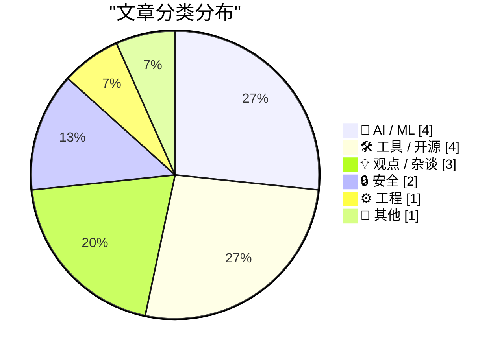
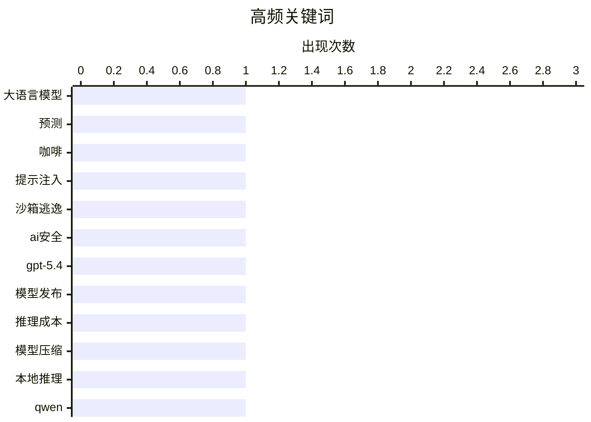

# 📰 AI 博客每日精选 — 2026-03-19

> 来自 Karpathy 推荐的 92 个顶级技术博客，AI 精选 Top 15

## 📝 今日看点

今日技术圈呈现两大核心动向：人工智能技术正朝着轻量化与高效能方向迅猛发展，模型本地部署和智能体工程取得关键突破；与此同时，安全领域警报频传，从人工智能系统的漏洞利用到通信基础设施的监控设计，凸显出技术应用中的潜在风险。此外，行业内部也对市场适应性及技术滥用展开深度反思，警示创新需与理性评估并行。

---

## 🏆 今日必读

🥇 **大语言模型预测我的咖啡习惯**

[大语言模型预测我的咖啡习惯](https://dynomight.net/coffee/) — dynomight.net · 1 天前 · 🤖 AI / ML

> 作者尝试使用大语言模型分析并预测自己每日的咖啡消费量。核心方法是利用线性回归模型，将日期、星期几、是否为工作日等特征作为输入，预测咖啡杯数。模型分析发现，作者在周一和工作日会喝更多咖啡，并且能够识别出个人消费模式。实验表明，大语言模型能够有效处理和分析个人习惯数据，并生成可解释的预测模型。

💡 **为什么值得读**: 这篇文章提供了一个有趣且具体的案例，展示了如何将大语言模型应用于个人日常生活数据的分析与预测，为模型的实际应用提供了新思路。

🏷️ 大语言模型, 预测, 咖啡

🥈 **雪花公司科特克斯人工智能逃逸沙箱并执行恶意软件**

[雪花公司科特克斯人工智能逃逸沙箱并执行恶意软件](https://simonwillison.net/2026/Mar/18/snowflake-cortex-ai/#atom-everything) — simonwillison.net · 10 小时前 · 🔒 安全

> 安全公司提示护甲披露了雪花公司科特克斯智能代理中的一个高危提示注入攻击链。攻击者通过诱导智能代理审查包含恶意提示的代码仓库，成功使其突破安全沙箱限制。该漏洞允许攻击者在雪花基础设施上远程执行代码，潜在危害极大。雪花公司目前已修复此漏洞。

💡 **为什么值得读**: 该报告揭示了一个发生在主流云厂商人工智能服务中的真实安全漏洞，对开发和部署类似智能代理系统的安全设计具有重要警示意义。

🏷️ 提示注入, 沙箱逃逸, AI安全

🥉 **GPT-5.4迷你版与纳米版发布：52美元可描述76000张照片**

[GPT-5.4迷你版与纳米版发布：52美元可描述76000张照片](https://simonwillison.net/2026/Mar/17/mini-and-nano/#atom-everything) — simonwillison.net · 1 天前 · 🤖 AI / ML

> OpenAI发布了GPT-5.4系列的两个更小、更高效的模型：迷你版和纳米版。新发布的纳米版在最大推理努力下性能超越了上一代GPT-5迷你版，而新的迷你版速度则是前代的两倍。在定价上，这些模型成本效益显著，例如描述76000张照片仅需约52美元。这表明OpenAI正在通过模型小型化来降低使用成本并提升效率。

💡 **为什么值得读**: 了解这些新型号的具体性能、速度优势和定价策略，对于需要权衡成本与效果的人工智能应用开发者至关重要。

🏷️ GPT-5.4, 模型发布, 推理成本

---

## 📊 数据概览

| 扫描源 | 抓取文章 | 时间范围 | 精选 |
|:---:|:---:|:---:|:---:|
| 84/92 | 2433 篇 → 38 篇 | 48h | **15 篇** |

### 分类分布



### 高频关键词



<details>
<summary>📈 纯文本关键词图（终端友好）</summary>

```
大语言模型   │ ████████████████████ 1
预测      │ ████████████████████ 1
咖啡      │ ████████████████████ 1
提示注入    │ ████████████████████ 1
沙箱逃逸    │ ████████████████████ 1
ai安全    │ ████████████████████ 1
gpt-5.4 │ ████████████████████ 1
模型发布    │ ████████████████████ 1
推理成本    │ ████████████████████ 1
模型压缩    │ ████████████████████ 1
```

</details>

### 🏷️ 话题标签

**大语言模型**(1) · **预测**(1) · **咖啡**(1) · 提示注入(1) · 沙箱逃逸(1) · ai安全(1) · gpt-5.4(1) · 模型发布(1) · 推理成本(1) · 模型压缩(1) · 本地推理(1) · qwen(1) · 智能体(1) · 上下文管理(1) · 工程模式(1) · 初创公司(1) · 创业失败(1) · 假设验证(1) · python(1) · jit编译器(1)

---

## 🤖 AI / ML

### 1. 大语言模型预测我的咖啡习惯

[大语言模型预测我的咖啡习惯](https://dynomight.net/coffee/) — **dynomight.net** · 1 天前 · ⭐ 26/30

> 作者尝试使用大语言模型分析并预测自己每日的咖啡消费量。核心方法是利用线性回归模型，将日期、星期几、是否为工作日等特征作为输入，预测咖啡杯数。模型分析发现，作者在周一和工作日会喝更多咖啡，并且能够识别出个人消费模式。实验表明，大语言模型能够有效处理和分析个人习惯数据，并生成可解释的预测模型。

🏷️ 大语言模型, 预测, 咖啡

---

### 2. GPT-5.4迷你版与纳米版发布：52美元可描述76000张照片

[GPT-5.4迷你版与纳米版发布：52美元可描述76000张照片](https://simonwillison.net/2026/Mar/17/mini-and-nano/#atom-everything) — **simonwillison.net** · 1 天前 · ⭐ 25/30

> OpenAI发布了GPT-5.4系列的两个更小、更高效的模型：迷你版和纳米版。新发布的纳米版在最大推理努力下性能超越了上一代GPT-5迷你版，而新的迷你版速度则是前代的两倍。在定价上，这些模型成本效益显著，例如描述76000张照片仅需约52美元。这表明OpenAI正在通过模型小型化来降低使用成本并提升效率。

🏷️ GPT-5.4, 模型发布, 推理成本

---

### 3. 自主研究苹果‘闪存大语言模型’技术以本地运行千问397B

[自主研究苹果‘闪存大语言模型’技术以本地运行千问397B](https://simonwillison.net/2026/Mar/18/llm-in-a-flash/#atom-everything) — **simonwillison.net** · 3 小时前 · ⭐ 24/30

> 研究者丹·伍兹成功利用苹果公司提出的‘闪存大语言模型’技术，在仅有48GB内存的笔记本电脑上本地运行了参数量高达3970亿的千问模型。通过技术优化，他将原本需要209GB磁盘空间的模型量化至120GB，并实现了每秒5.5个词元的推理速度。这项突破展示了在资源受限的消费级硬件上运行超大规模模型的可行性。

🏷️ 模型压缩, 本地推理, Qwen

---

### 4. 子代理

[子代理](https://simonwillison.net/guides/agentic-engineering-patterns/subagents/#atom-everything) — **simonwillison.net** · 1 天前 · ⭐ 23/30

> 子代理是一种用于突破大语言模型上下文长度限制的智能体工程模式。其核心思想是将复杂任务分解，由多个专门的子智能体分别处理任务的不同部分。这些子智能体共享一个中央协调器，协调器负责分配任务、整合结果并管理总体上下文。该模式使得智能体能够处理远超其单次上下文窗口限制的复杂任务。

🏷️ 智能体, 上下文管理, 工程模式

---

## 🛠 工具 / 开源

### 5. 三星上市仅三月即停产盖乐世Z三折叠手机

[三星上市仅三月即停产盖乐世Z三折叠手机](https://www.theverge.com/tech/895879/samsung-galaxy-z-trifold-discontinued-stock-sold-out) — **daringfireball.net** · 1 天前 · ⭐ 22/30

> 三星公司计划停止其首款三屏折叠手机盖乐世Z三折叠的生产与销售，此时距该设备在美国上市还不到三个月。这款售价高达2899美元的手机将首先在韩国停止销售，随后在美国清空库存后彻底停产。此举可能表明这款高端折叠屏手机的市场表现未达预期。

🏷️ 折叠手机, 硬件, 产品生命周期

---

### 6. Meta将放弃Horizon Worlds的虚拟现实支持

[Meta将放弃Horizon Worlds的虚拟现实支持](https://www.uploadvr.com/meta-horizon-worlds-dropping-vr-support/) — **daringfireball.net** · 8 小时前 · ⭐ 21/30

> Meta公司宣布其社交平台Horizon Worlds将于六月起停止支持虚拟现实设备，转而专注于为网页和智能手机提供平面屏幕体验。从三月三十一日起，该应用将从Quest商店下架，地平线中心广场、活动竞技场、怪兽格斗和垂钓湾等关键官方世界将无法在虚拟现实中访问。自六月十五日起，Horizon Worlds应用将从Quest头显中彻底移除，所有世界都将不再支持虚拟现实模式。这一举措标志着Meta对其元宇宙旗舰平台的发展重心进行了重大调整，从沉浸式虚拟现实转向了更易访问的跨平台体验。

🏷️ 虚拟现实, 元宇宙, 平台策略

---

### 7. 福克斯体育以沉浸式3D直播美委世界棒球经典赛决赛，但苹果视觉专业头显无法观看

[福克斯体育以沉浸式3D直播美委世界棒球经典赛决赛，但苹果视觉专业头显无法观看](https://x.com/mlbonfox/status/2033902946174271992?s=46) — **daringfireball.net** · 1 天前 · ⭐ 21/30

> 福克斯体育宣布为美国对委内瑞拉的世界棒球经典赛决赛提供沉浸式3D广播，但该服务排除了苹果视觉专业头显。广播通过三星扩展现实头显上的福克斯体育扩展现实应用实现，该应用基于安卓扩展现实平台。然而，福克斯体育在苹果应用商店的应用仅原生支持苹果手机、平板、电视和手表，没有为视觉操作系统开发原生应用。这导致视觉专业头显用户无法享受沉浸式体验，突显了内容分发中的平台兼容性问题。

🏷️ 扩展现实, 沉浸式广播, 平台竞争

---

### 8. 漫游者0.1.0版本发布：一个去中心化的个人网站探索工具

[漫游者0.1.0版本发布：一个去中心化的个人网站探索工具](https://susam.net/code/news/wander/0.1.0.html) — **susam.net** · 1 天前 · ⭐ 20/30

> 文章介绍了首个版本漫游者0.1.0，这是一个供个人网站使用的去中心化探索控制台。该工具的核心是一个小型、可自托管的网络组件，网站主可将其嵌入自己的站点。它能够加载并展示由漫游者社区推荐的众多个人网站页面，形成随机浏览体验。各个漫游者控制台实例之间可以相互链接，从而构建起一个轻量级的去中心化发现网络。其最终目标是促进独立个人网站之间的有机互访与内容发现，对抗中心化平台的封闭性。

🏷️ 去中心化, 网络控制台, 开源

---

## 💡 观点 / 杂谈

### 9. 你的初创公司可能出生即死亡

[你的初创公司可能出生即死亡](https://steveblank.com/2026/03/17/your-startup-is-probably-dead-on-arrival/) — **steveblank.com** · 1 天前 · ⭐ 23/30

> 文章指出，创立超过两年的初创公司，其最初的许多市场假设可能已经失效。创始人必须暂停日常运营活动，如编程、招聘和融资，转而重新评估外部环境发生的根本性变化。如果无法及时识别并适应这些变化，公司将会失败。作者强调，持续的外部环境审视是初创公司生存的关键。

🏷️ 初创公司, 创业失败, 假设验证

---

### 10. 引用蒂姆·席林

[引用蒂姆·席林](https://simonwillison.net/2026/Mar/17/tim-schilling/#atom-everything) — **simonwillison.net** · 1 天前 · ⭐ 22/30

> 文章引用了蒂姆·席林对在开源贡献中滥用人工智能的批评。他指出，如果贡献者不理解问题、解决方案或代码审查反馈，其使用人工智能的行为将损害整个社区。过度依赖人工智能会导致贡献者成为一个‘人类 facade’，使基于人文交流的代码审查过程变得徒劳且令人沮丧。

🏷️ 开源贡献, LLM滥用, 代码审查

---

### 11. 马克·安德森关于内省的观点是错误的

[马克·安德森关于内省的观点是错误的](https://www.joanwestenberg.com/marc-andreessen-is-wrong-about-introspection/) — **joanwestenberg.com** · 20 小时前 · ⭐ 20/30

> 文章反驳了知名风险投资家马克·安德森对内省价值的否定性言论。安德森认为过度内省是“精神上的自我伤害”，并鼓吹行动至上。作者认为这种观点忽略了内省对于明确目标、避免盲目行动以及做出有意识选择的关键作用，尤其是在技术行业。技术领域充斥着“快速行动，打破陈规”的文化，这常常导致缺乏深思熟虑的决策和不良后果。作者的核心结论是，深思熟虑的内省并非障碍，而是进行有意义、负责任的创新与行动的必要前提。

🏷️ 内省, 科技文化, 行业观点

---

## 🔒 安全

### 12. 雪花公司科特克斯人工智能逃逸沙箱并执行恶意软件

[雪花公司科特克斯人工智能逃逸沙箱并执行恶意软件](https://simonwillison.net/2026/Mar/18/snowflake-cortex-ai/#atom-everything) — **simonwillison.net** · 10 小时前 · ⭐ 25/30

> 安全公司提示护甲披露了雪花公司科特克斯智能代理中的一个高危提示注入攻击链。攻击者通过诱导智能代理审查包含恶意提示的代码仓库，成功使其突破安全沙箱限制。该漏洞允许攻击者在雪花基础设施上远程执行代码，潜在危害极大。雪花公司目前已修复此漏洞。

🏷️ 提示注入, 沙箱逃逸, AI安全

---

### 13. 通信本质上是为监控而设计的

[通信本质上是为监控而设计的](https://idiallo.com/blog/communication-is-surveillance-by-design?src=feed) — **idiallo.com** · 15 小时前 · ⭐ 22/30

> 文章以电影《谍影重重》中的经典场景为引，论证现代通信系统从设计之初就内置了监控能力。电话、互联网等通信协议在实现连接功能的同时，也必然暴露用户的元数据与位置信息。作者指出，我们使用的几乎所有数字通信工具，其底层架构都便于实施监控。结论是，在数字时代，完全的通信隐私几乎是一种幻想，用户需要对此有清醒认知。

🏷️ 隐私, 监视, 通信安全

---

## ⚙️ 工程

### 14. 引用肯·金

[引用肯·金](https://simonwillison.net/2026/Mar/17/ken-jin/#atom-everything) — **simonwillison.net** · 1 天前 · ⭐ 22/30

> CPython核心开发者肯·金宣布，其即时编译器项目已提前一年多在苹果芯片架构上实现了性能目标。在3.15版本中，即时编译器比原有的尾调用解释器在苹果芯片上快百分之十一到十二，在Linux系统上快百分之五到六。这一进展标志着Python官方运行时在性能优化上迈出了重要一步。

🏷️ Python, JIT编译器, 性能优化

---

## 📝 其他

### 15. 你的挫败感，正是他们的产品

[你的挫败感，正是他们的产品](https://daringfireball.net/2026/03/your_frustration_is_the_product) — **daringfireball.net** · 4 小时前 · ⭐ 20/30

> 文章批判了当前许多网站和应用故意设计糟糕用户体验以谋利的普遍现象。作者将做出这些决策的负责人比作试图撞击冰山的远洋轮船船长，明知会损害用户却一意孤行。其核心机制在于，通过弹窗、低质量内容、复杂流程等设计故意制造挫败感，迫使用户付费订阅、点击广告或贡献更多数据。这种商业模式将用户的负面体验直接转化为公司的收入来源。最终结论指出，这种以牺牲用户为代价的产品策略，反映了互联网经济中一种扭曲的、不可持续的价值取向。

🏷️ 产品设计, 用户体验, 行业批评

---

*生成于 2026-03-19 03:49 | 扫描 84 源 → 获取 2433 篇 → 精选 15 篇*
*基于 [Hacker News Popularity Contest 2025](https://refactoringenglish.com/tools/hn-popularity/) RSS 源列表，由 [Andrej Karpathy](https://x.com/karpathy) 推荐*
