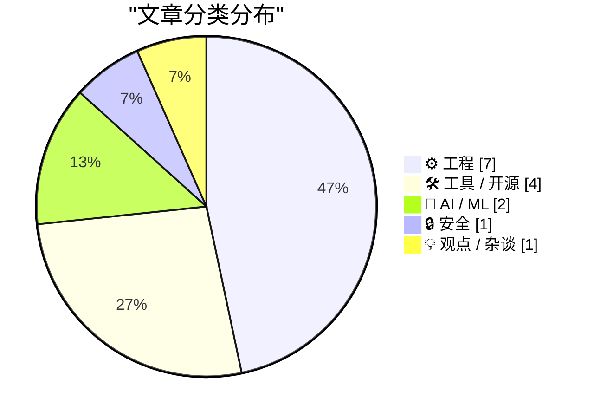
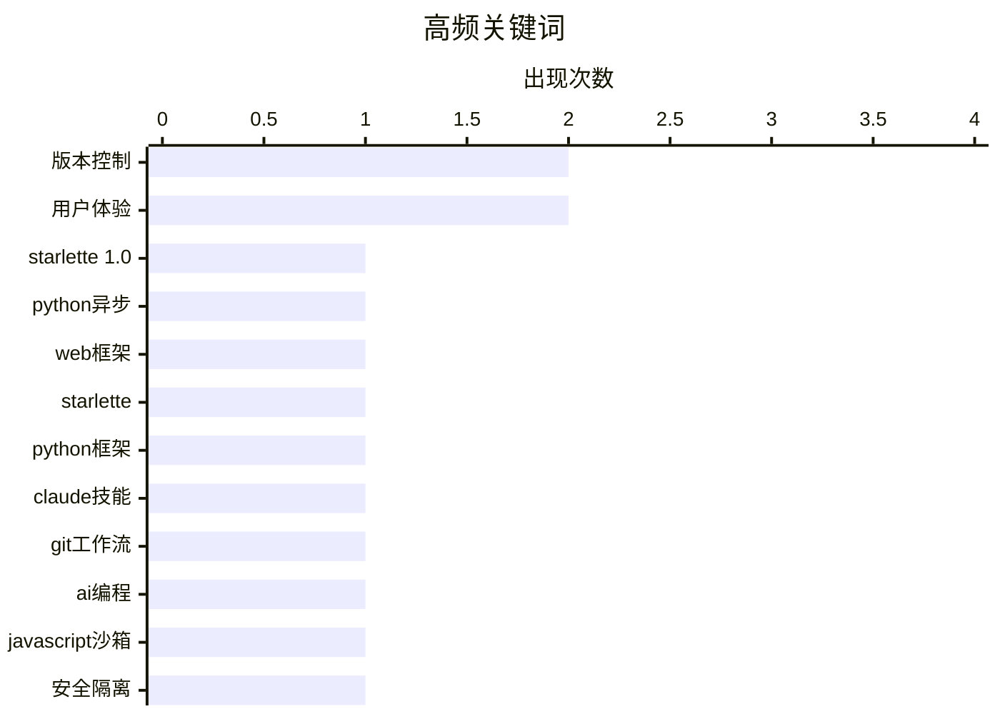

# 📰 AI 博客每日精选 — 2026-03-23

> 来自 Karpathy 推荐的 92 个顶级技术博客，AI 精选 Top 15

## 📝 今日看点

今日技术圈呈现人工智能与开发工具深度融合的鲜明趋势。编码智能体正借助版本控制系统提升自动化水平，同时开源项目积极吸引AI参与以优化生态。关键开发框架迎来里程碑更新，推动异步网络编程进入新阶段。此外，代码安全沙箱与性能优化研究持续深化，彰显业界对稳定与效率的核心关注。

---

## 🏆 今日必读

🥇 **体验 Starlette 1.0 与 Claude 技能**

[体验 Starlette 1.0 与 Claude 技能](https://simonwillison.net/2026/Mar/22/starlette/#atom-everything) — simonwillison.net · 3 小时前 · ⚙️ 工程

> 文章讨论了 Python 异步网络框架 Starlette 发布 1.0 版本这一重要事件。Starlette 是流行框架 FastAPI 的底层基础，但其本身的品牌知名度远低于其实际使用量。作者认为 FastAPI 的巨大成功和声量在一定程度上掩盖了 Starlette 本身的价值。文章核心观点是 Starlette 1.0 的发布是一个重要里程碑，值得开发者关注其作为基础框架的潜力。

💡 **为什么值得读**: 了解这个支撑起 FastAPI 生态但被低估的关键框架，有助于深入理解现代 Python 异步网络开发的基石。

🏷️ Starlette 1.0, Python异步, Web框架

🥈 **Starlette 1.0 技能**

[Starlette 1.0 技能](https://simonwillison.net/2026/Mar/23/starlette-1-skill/#atom-everything) — simonwillison.net · 3 小时前 · 🛠 工具 / 开源

> 文章指向一项关于 Starlette 1.0 框架的技能研究。该研究以代码仓库形式呈现，内容与 Starlette 1.0 的技术实践相关。研究旨在探索或展示如何利用该框架的特定能力。对于关注 Starlette 框架具体应用和深度技术实践的开发者具有参考价值。

💡 **为什么值得读**: 通过具体的研究项目，可以获取 Starlette 1.0 的实践性技能和深入应用示例。

🏷️ Starlette, Python框架, Claude技能

🥉 **在编码智能体中使用 Git**

[在编码智能体中使用 Git](https://simonwillison.net/guides/agentic-engineering-patterns/using-git-with-coding-agents/#atom-everything) — simonwillison.net · 1 天前 · ⚙️ 工程

> 文章核心是指导如何将 Git 版本控制系统与编码智能体协同工作。使用 Git 记录代码变更历史，使得智能体能够追踪、调查甚至回滚错误。作者指出，现代编码智能体已熟练掌握 Git 的基础与高级功能。这使开发者可以更自信地委托智能体进行代码管理，无需亲自记忆所有 Git 命令。结论是利用 Git 是提升编码智能体工作流可靠性和可追溯性的关键模式。

💡 **为什么值得读**: 掌握 Git 与智能体的结合模式，能显著提升自动化编码任务的可靠性和管理效率。

🏷️ Git工作流, AI编程, 版本控制

---

## 📊 数据概览

| 扫描源 | 抓取文章 | 时间范围 | 精选 |
|:---:|:---:|:---:|:---:|
| 83/92 | 2412 篇 → 22 篇 | 48h | **15 篇** |

### 分类分布



### 高频关键词



<details>
<summary>📈 纯文本关键词图（终端友好）</summary>

```
版本控制          │ ████████████████████ 2
用户体验          │ ████████████████████ 2
starlette 1.0 │ ██████████░░░░░░░░░░ 1
python异步      │ ██████████░░░░░░░░░░ 1
web框架         │ ██████████░░░░░░░░░░ 1
starlette     │ ██████████░░░░░░░░░░ 1
python框架      │ ██████████░░░░░░░░░░ 1
claude技能      │ ██████████░░░░░░░░░░ 1
git工作流        │ ██████████░░░░░░░░░░ 1
ai编程          │ ██████████░░░░░░░░░░ 1
```

</details>

### 🏷️ 话题标签

**版本控制**(2) · **用户体验**(2) · **starlette 1.0**(1) · python异步(1) · web框架(1) · starlette(1) · python框架(1) · claude技能(1) · git工作流(1) · ai编程(1) · javascript沙箱(1) · 安全隔离(1) · node.js(1) · 开源项目(1) · ai机器人(1) · seo(1) · 用户画像(1) · 自然语言处理(1) · hacker news(1) · 博客开发(1)

---

## ⚙️ 工程

### 1. 体验 Starlette 1.0 与 Claude 技能

[体验 Starlette 1.0 与 Claude 技能](https://simonwillison.net/2026/Mar/22/starlette/#atom-everything) — **simonwillison.net** · 3 小时前 · ⭐ 26/30

> 文章讨论了 Python 异步网络框架 Starlette 发布 1.0 版本这一重要事件。Starlette 是流行框架 FastAPI 的底层基础，但其本身的品牌知名度远低于其实际使用量。作者认为 FastAPI 的巨大成功和声量在一定程度上掩盖了 Starlette 本身的价值。文章核心观点是 Starlette 1.0 的发布是一个重要里程碑，值得开发者关注其作为基础框架的潜力。

🏷️ Starlette 1.0, Python异步, Web框架

---

### 2. 在编码智能体中使用 Git

[在编码智能体中使用 Git](https://simonwillison.net/guides/agentic-engineering-patterns/using-git-with-coding-agents/#atom-everything) — **simonwillison.net** · 1 天前 · ⭐ 24/30

> 文章核心是指导如何将 Git 版本控制系统与编码智能体协同工作。使用 Git 记录代码变更历史，使得智能体能够追踪、调查甚至回滚错误。作者指出，现代编码智能体已熟练掌握 Git 的基础与高级功能。这使开发者可以更自信地委托智能体进行代码管理，无需亲自记忆所有 Git 命令。结论是利用 Git 是提升编码智能体工作流可靠性和可追溯性的关键模式。

🏷️ Git工作流, AI编程, 版本控制

---

### 3. 博客动态摘要现已支持添加注释

[博客动态摘要现已支持添加注释](https://simonwillison.net/2026/Mar/23/beats-now-have-notes/#atom-everything) — **simonwillison.net** · 1 小时前 · ⭐ 21/30

> 文章介绍了作者为其博客的“动态摘要”功能新增了“注释”支持。动态摘要功能用于聚合展示作者在其他平台发布的内容。新增的注释功能允许为每条摘要添加一段说明文字，从而丰富了内容的呈现形式，使其不再只是一个简单的链接。这提升了博客首页和归档页面的内容可读性和信息量。

🏷️ 博客开发, 内容聚合, 网站架构

---

### 4. PCGamer 文章性能审计

[PCGamer 文章性能审计](https://simonwillison.net/2026/Mar/22/pcgamer-audit/#atom-everything) — **simonwillison.net** · 5 小时前 · ⭐ 21/30

> 文章核心是对 PCGamer 网站上一篇关于推荐 RSS 阅读器的文章进行的性能问题审计。审计发现该文章页面存在严重的性能臃肿问题，页面大小高达 37MB。问题主要源于自动播放的视频广告等元素，导致页面实际加载数据达到数百 MB。这被视为网页性能退化的一个典型案例。审计揭示了现代网页中媒体与广告滥用对用户体验的严重影响。

🏷️ 性能审计, 网页优化, Lighthouse

---

### 5. 路透社：亚马逊计划在 Fire 手机失败十余年后卷土重来

[路透社：亚马逊计划在 Fire 手机失败十余年后卷土重来](https://www.reuters.com/technology/amazon-plans-smartphone-comeback-more-than-decade-after-fire-phone-flop-2026-03-20/) — **daringfireball.net** · 1 天前 · ⭐ 21/30

> 文章报道了亚马逊正计划再次进军智能手机市场，以挽回十余年前 Fire 手机失败的局面。新款手机内部代号为“Transformer”，由亚马逊设备与服务部门研发。其定位是能与 Alexa 语音助手同步的个性化移动设备，旨在成为连接亚马逊用户日常生活的入口。这表明亚马逊仍未放弃通过硬件终端深度整合其服务和电商生态的战略企图。

🏷️ 智能手机, 亚马逊, 硬件

---

### 6. 半吉字节的广告

[半吉字节的广告](https://stuartbreckenridge.net/2026-03-19-pc-gamer-recommends-rss-readers-in-a-37mb-article/) — **daringfireball.net** · 11 小时前 · ⭐ 16/30

> 文章批评了现代网页因过量广告导致的严重资源浪费与糟糕的用户体验。作者以个人电脑玩家网站为例，指出其单个页面初始加载就高达37兆字节，且在短短五分钟内又自动下载了近半吉字节的新广告。作者认为这种设计极不负责且不专业，并质疑网页浏览器为何缺乏默认的资源加载限制机制。其核心观点是，浏览器应默认设置页面加载上限，并在下载额外内容前需获得用户的明确同意。

🏷️ 网页性能, 广告, 用户体验

---

### 7. 翻修周末双响炮：阿尔法微系统AM-1000E与AM-1200

[翻修周末双响炮：阿尔法微系统AM-1000E与AM-1200](https://oldvcr.blogspot.com/feeds/7375694156480962258/comments/default) — **oldvcr.blogspot.com** · 1 天前 · ⭐ 16/30

> 文章记录了作者对两台稀有的阿尔法微系统古董计算机AM-1000E和AM-1200进行翻修与恢复的过程。阿尔法微系统是上世纪八九十年代基于摩托罗拉68000处理器的多用户系统，曾广泛应用于各种垂直市场。翻修过程涉及解决电源问题、修复SCSI硬盘、恢复CP/M-68K操作系统，并让这些沉寂数十年的硬件重新运行。作者通过实际操作，成功唤醒了这两台具有历史意义的商业计算机。整个过程不仅是一次技术修复，更是对一段被遗忘的计算历史的抢救与致敬。

🏷️ 硬件翻新, 老式计算机, 系统修复

---

## 🛠 工具 / 开源

### 8. Starlette 1.0 技能

[Starlette 1.0 技能](https://simonwillison.net/2026/Mar/23/starlette-1-skill/#atom-everything) — **simonwillison.net** · 3 小时前 · ⭐ 24/30

> 文章指向一项关于 Starlette 1.0 框架的技能研究。该研究以代码仓库形式呈现，内容与 Starlette 1.0 的技术实践相关。研究旨在探索或展示如何利用该框架的特定能力。对于关注 Starlette 框架具体应用和深度技术实践的开发者具有参考价值。

🏷️ Starlette, Python框架, Claude技能

---

### 9. 域名系统查询工具

[域名系统查询工具](https://simonwillison.net/2026/Mar/22/dns/#atom-everything) — **simonwillison.net** · 8 小时前 · ⭐ 17/30

> 作者发现Cloudflare的公共域名系统解析服务提供了一个支持跨域请求的应用程序编程接口。该接口允许开发者直接通过代码查询其1.1.1.1、1.1.1.2和1.1.1.3三个解析器地址，后两者分别具备拦截恶意软件、以及恶意软件加成人内容的过滤功能。作者利用Claude Code工具，快速构建了一个可同时向这三个解析器发起查询的用户界面。这个工具现已上线，可供公开使用。

🏷️ DNS查询, 网络工具, Cloudflare API

---

### 10. 合并状态可视化工具

[合并状态可视化工具](https://simonwillison.net/2026/Mar/22/manyana/#atom-everything) — **simonwillison.net** · 8 小时前 · ⭐ 17/30

> 文章探讨了如何解决版本控制中的合并冲突难题。布拉姆·科恩提出了基于无冲突复制数据类型的未来版本控制愿景，并用470行特定代码演示了核心逻辑。作者西蒙·威利森通过克劳德分析了这段代码，并创建了一个合并状态可视化工具来展示其工作原理。该工具将抽象的合并过程转化为直观的图形界面，使复杂的版本控制概念变得易于理解。最终表明，可视化是理解和推广无冲突合并这一先进理念的有效手段。

🏷️ 版本控制, CRDTs, 可视化工具

---

### 11. 面向开发者的视频应用编程接口：Mux

[面向开发者的视频应用编程接口：Mux](https://www.mux.com/?utm_campaign=fireball&amp;utm_source=DF) — **daringfireball.net** · 10 小时前 · ⭐ 16/30

> Mux是一个帮助开发者轻松集成、发布和扩展视频功能的开发平台。该平台不仅能处理视频流，还能从视频中提取字幕、生成剪辑和故事板等结构化数据，用于构建摘要、翻译、内容审核和标签等高级功能。Mux同时维护着网络最流行的开源视频播放器“视频点播脚本”，其第十版进行了完整的架构重建，目前测试版已发布。其核心价值在于将视频从单纯的观看媒介，转变为可供人工智能工作流和其他应用深度利用的数据源。

🏷️ 视频API, 开发者工具, Mux

---

## 🤖 AI / ML

### 12. 如何为你的开源项目吸引 AI 智能体

[如何为你的开源项目吸引 AI 智能体](https://nesbitt.io/2026/03/21/how-to-attract-ai-bots-to-your-open-source-project.html) — **nesbitt.io** · 1 天前 · ⭐ 23/30

> 文章提供了一份关于如何让开源项目获得 AI 智能体（如自动代码分析工具）关注和使用的实用指南。指南旨在帮助项目获得应有的参与度和自动化处理。内容侧重于可操作的方法和策略，而非理论探讨。其核心目标是提升开源项目在自动化时代的可见度和互动性。

🏷️ 开源项目, AI机器人, SEO

---

### 13. 基于评论对 Hacker News 用户进行画像分析

[基于评论对 Hacker News 用户进行画像分析](https://simonwillison.net/2026/Mar/21/profiling-hacker-news-users/#atom-everything) — **simonwillison.net** · 1 天前 · ⭐ 22/30

> 文章介绍了一种利用 AI 对 Hacker News 用户进行自动化画像分析的方法。该方法通过分析用户最近的 1000 条评论来生成其个人特征描述。技术上，可以便捷地通过 Algolia 提供的 Hacker News 应用程序接口按用户获取评论数据。作者自评这种方法略带反乌托邦色彩，但展示了大型语言模型在分析公开文本数据上的能力。

🏷️ 用户画像, 自然语言处理, Hacker News

---

## 🔒 安全

### 14. JavaScript 沙箱化研究

[JavaScript 沙箱化研究](https://simonwillison.net/2026/Mar/22/javascript-sandboxing-research/#atom-everything) — **simonwillison.net** · 7 小时前 · ⭐ 23/30

> 文章主题是关于在安全沙箱中运行 JavaScript 代码的技术研究。研究灵感来源于一篇关于 Node.js 工作线程的文章。作者使用 Claude Code 进行研究，其产出超出了初始问题范围。研究最终对多种 JavaScript 隔离方案进行了比较分析，为选择安全执行不受信任代码的方案提供了参考。

🏷️ JavaScript沙箱, 安全隔离, Node.js

---

## 💡 观点 / 杂谈

### 15. 厌倦了自食其果？试试孤芳自赏吧！

[厌倦了自食其果？试试孤芳自赏吧！](https://shkspr.mobi/blog/2026/03/bored-of-eating-your-own-dogfood-try-smelling-your-own-farts/) — **shkspr.mobi** · 15 小时前 · ⭐ 18/30

> 文章以讽刺的口吻批评了企业过度依赖自动化客服系统而忽视真实用户服务体验的现象。作者通过一次糟糕的客服电话经历，指出企业盲目引导用户使用网站或人工智能助手，却无法解决实际问题。这种“自食其果”式的内部解决方案，最终导致了客户不满和呼叫量激增。文章核心观点是，脱离用户真实需求的技术自嗨，只会让服务变得更糟。

🏷️ AI客服, 用户体验, 自动化

---

*生成于 2026-03-23 03:50 | 扫描 83 源 → 获取 2412 篇 → 精选 15 篇*
*基于 [Hacker News Popularity Contest 2025](https://refactoringenglish.com/tools/hn-popularity/) RSS 源列表，由 [Andrej Karpathy](https://x.com/karpathy) 推荐*
