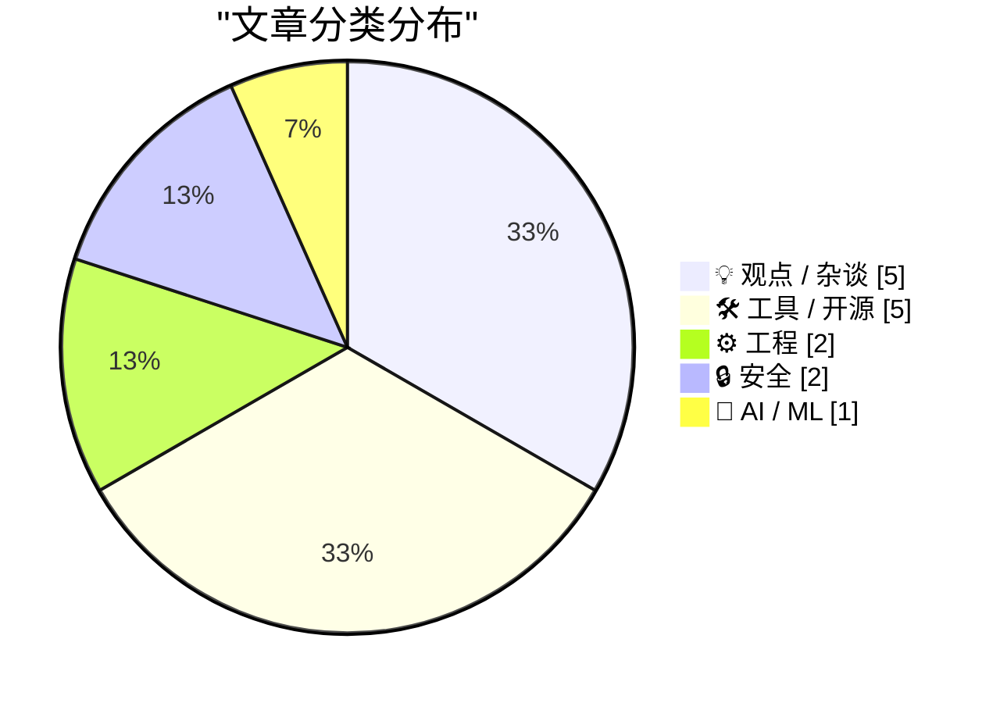
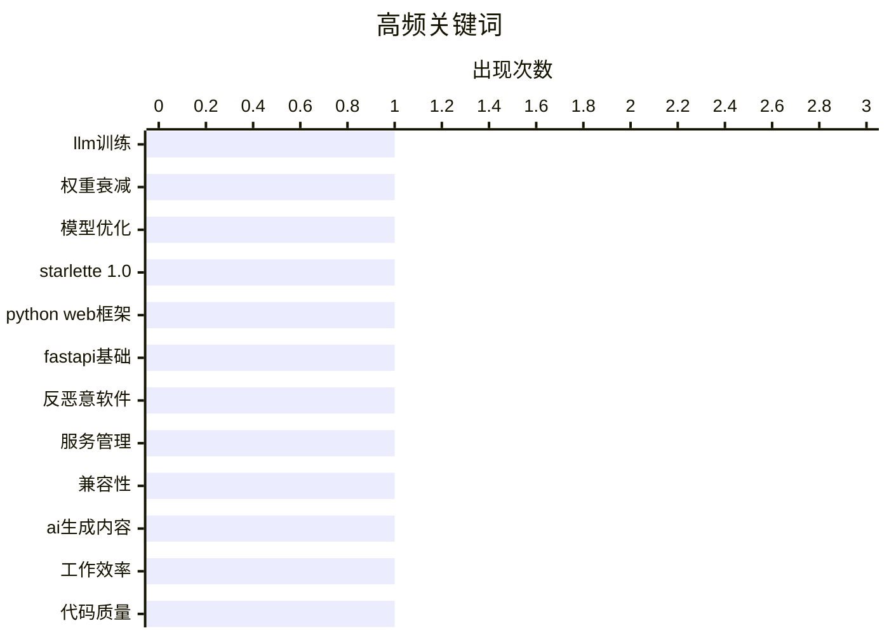

# 📰 AI 博客每日精选 — 2026-03-24

> 来自 Karpathy 推荐的 92 个顶级技术博客，AI 精选 Top 15

## 📝 今日看点

今日技术圈呈现三大核心动向：人工智能领域在模型优化技术上持续深入，同时业界对AI输出滥用现象进行伦理反思；开发工具与框架迭代创新，新版本发布与性能审计推动工程实践效率提升；安全防护贯穿开发运维全流程，从系统配置到代码执行环境均出现针对性解决方案。

---

## 🏆 今日必读

🥇 **从头构建大语言模型，第三十二部分之干预措施：权重衰减**

[从头构建大语言模型，第三十二部分之干预措施：权重衰减](https://www.gilesthomas.com/2026/03/llm-from-scratch-32f-interventions-weight-decay) — gilesthomas.com · 3 小时前 · 🤖 AI / ML

> 作者基于塞巴斯蒂安·拉什卡的著作《从头构建大语言模型》中的代码，继续优化一个从头开始训练的GPT-2小型基础模型的测试损失。本文核心探讨了在优化器配置中引入权重衰减这一技术干预措施。通过具体的训练代码示例，展示了如何实现权重衰减以控制模型复杂度并防止过拟合。此举旨在系统性地提升模型在代码数据上的泛化能力与最终性能。

💡 **为什么值得读**: 对于正在实践大语言模型训练、希望理解并应用权重衰减等具体优化技术的开发者具有直接的参考价值。

🏷️ LLM训练, 权重衰减, 模型优化

🥈 **使用克劳德技能体验星拿铁1.0**

[使用克劳德技能体验星拿铁1.0](https://simonwillison.net/2026/Mar/22/starlette/#atom-everything) — simonwillison.net · 1 天前 · ⚙️ 工程

> 文章聚焦于Python异步网络框架星拿铁1.0版本的发布及其生态影响。作者指出，星拿铁作为快API的底层基础，其实际使用量远超品牌知名度，快API的成功某种程度上掩盖了前者的光芒。作者通过实际使用克劳德代码技能来探索星拿铁1.0的新特性与可能性。这反映了一种结合前沿人工智能工具来学习和评估新发布框架的高效工作流。

💡 **为什么值得读**: 为Python开发者提供了一个结合人工智能工具探索重要框架更新的新颖视角和实用方法。

🏷️ Starlette 1.0, Python Web框架, FastAPI基础

🥉 **如何确保反恶意软件不终止我的自定义服务？**

[如何确保反恶意软件不终止我的自定义服务？](https://devblogs.microsoft.com/oldnewthing/20260323-00/?p=112157) — devblogs.microsoft.com/oldnewthing · 13 小时前 · 🔒 安全

> 文章直接回应了一个系统管理中的常见问题：自定义服务如何避免被反恶意软件误判并终止。核心建议是采取协商与合作的方式，而非对抗。这意味着开发者需要主动遵循安全软件的最佳实践，并通过正当渠道（如将其添加至白名单）与安全软件供应商或企业信息技术策略进行协调。其核心观点是，系统安全需要服务提供者与安全机制之间的相互理解和配合。

💡 **为什么值得读**: 为开发者和系统管理员提供了解决安全软件误报问题的根本性思路和务实建议。

🏷️ 反恶意软件, 服务管理, 兼容性

---

## 📊 数据概览

| 扫描源 | 抓取文章 | 时间范围 | 精选 |
|:---:|:---:|:---:|:---:|
| 82/92 | 2395 篇 → 31 篇 | 48h | **15 篇** |

### 分类分布



### 高频关键词



<details>
<summary>📈 纯文本关键词图（终端友好）</summary>

```
llm训练         │ ████████████████████ 1
权重衰减          │ ████████████████████ 1
模型优化          │ ████████████████████ 1
starlette 1.0 │ ████████████████████ 1
python web框架  │ ████████████████████ 1
fastapi基础     │ ████████████████████ 1
反恶意软件         │ ████████████████████ 1
服务管理          │ ████████████████████ 1
兼容性           │ ████████████████████ 1
ai生成内容        │ ████████████████████ 1
```

</details>

### 🏷️ 话题标签

**llm训练**(1) · **权重衰减**(1) · **模型优化**(1) · starlette 1.0(1) · python web框架(1) · fastapi基础(1) · 反恶意软件(1) · 服务管理(1) · 兼容性(1) · ai生成内容(1) · 工作效率(1) · 代码质量(1) · 编程本质(1) · 系统设计(1) · ai辅助编程(1) · 网站性能(1) · 性能审计(1) · 前端优化(1) · javascript沙箱(1) · 代码隔离(1)

---

## 💡 观点 / 杂谈

### 1. 引用神经吐槽

[引用神经吐槽](https://simonwillison.net/2026/Mar/23/neurotica/#atom-everything) — **simonwillison.net** · 4 小时前 · ⭐ 24/30

> 文章引用了一段关于“数字潦草”现象的尖锐批评。引文将“潦草”定义为一种消耗人类精力大于其生产成本的产出，例如同事直接转发未经处理的人工智能输出。作者认为这种行为并非创造自由，而是对他人时间价值的不尊重。这触及了人工智能时代工作效率与协作伦理的核心矛盾。

🏷️ AI生成内容, 工作效率, 代码质量

---

### 2. 引用大卫·亚伯拉罕

[引用大卫·亚伯拉罕](https://simonwillison.net/2026/Mar/23/david-abram/#atom-everything) — **simonwillison.net** · 8 小时前 · ⭐ 23/30

> 文章引用了一位资深开发者的观点，探讨大语言模型对编程工作的真实影响。作者指出，编程工作中最困难的部分从来不是敲代码，而是理解复杂系统、调试诡异问题、设计高负载架构以及做出具有长远影响的决策。这些核心挑战都无法被当前的大语言模型直接解决，它们只能辅助生成代码或处理样板文件。这澄清了人工智能工具的定位，强调了人类工程师不可替代的深层价值。

🏷️ 编程本质, 系统设计, AI辅助编程

---

### 3. 厌倦了吃自家狗粮？试试闻自己的屁！

[厌倦了吃自家狗粮？试试闻自己的屁！](https://shkspr.mobi/blog/2026/03/bored-of-eating-your-own-dogfood-try-smelling-your-own-farts/) — **shkspr.mobi** · 1 天前 · ⭐ 19/30

> 文章批评大公司过度依赖网站和人工智能助手处理客户查询，导致通话量意外增高。作者亲身经历中，客服反复引导使用在线服务，但实际需求未被满足，暴露预测模型缺陷。这反映了公司“吃自己的狗粮”不足，即未从用户角度测试服务有效性。核心观点是企业不应自满于技术方案，而需正视客户真实痛点，避免自我陶醉。

🏷️ AI客服, 用户体验, 数字化转型

---

### 4. “协作”是胡扯

[“协作”是胡扯](https://www.joanwestenberg.com/collaboration-is-bullshit/) — **joanwestenberg.com** · 1 天前 · ⭐ 19/30

> 文章批判了现代职场中协作被盲目推崇为万能解决方案的现象。作者指出，过度协作导致会议泛滥，员工平均每周浪费12小时在无效沟通上；协作工具如即时消息和视频会议加剧注意力碎片化，反而降低个人创造力。对比独立专注工作，数据显示深度工作能提升30%的生产力，而团队协作常伴随责任分散和决策延迟。结论是，企业应重新评估协作文化，优先保障专注时间以实现真正效率。

🏷️ 团队协作, 企业文化, 管理

---

### 5. Markdown 吞噬世界

[Markdown 吞噬世界](https://matduggan.com/markdown-ate-the-world/) — **matduggan.com** · 15 小时前 · ⭐ 18/30

> Markdown 已从简单的标记语言演变为全球通用的写作标准。作者以使用早期复杂文字处理软件的经历为对比，强调 Markdown 的轻量级语法降低了技术写作门槛。它统一了博客、文档和代码注释的格式，提升了内容创作效率。Markdown 的成功源于其简洁性和可读性，成为现代数字写作的核心工具。

🏷️ Markdown, 文字处理, 技术文档

---

## 🛠 工具 / 开源

### 6. 数据站点文件插件0.1a2版本发布

[数据站点文件插件0.1a2版本发布](https://simonwillison.net/2026/Mar/23/datasette-files/#atom-everything) — **simonwillison.net** · 4 小时前 · ⭐ 21/30

> 文章宣布了数据站点文件插件0.1a2版本的发布，这是一个允许直接向数据站点实例上传文件的新插件。此版本最重要的更新是支持使用数据站点的新“视图插件”机制来配置文件列，提供了更灵活和强大的自定义能力。发布说明详细列出了该测试版的全部功能与改进。这标志着数据站点生态在文件管理交互性方面迈出了重要一步。

🏷️ Datasette, 文件上传, Python插件

---

### 7. 星拿铁1.0技能

[星拿铁1.0技能](https://simonwillison.net/2026/Mar/23/starlette-1-skill/#atom-everything) — **simonwillison.net** · 1 天前 · ⭐ 21/30

> 本文是作者一项关于星拿铁1.0框架研究的索引页。内容直接关联到其另一篇题为“使用克劳德技能体验星拿铁1.0”的文章，为该研究提供了入口和背景。文章本身没有展开新的技术讨论，而是作为相关实验和代码研究的集中导航点。这体现了作者系统化整理和分享其技术探索过程的工作方法。

🏷️ Starlette, Claude技能, Python框架

---

### 8. 合并状态可视化工具

[合并状态可视化工具](https://simonwillison.net/2026/Mar/22/manyana/#atom-everything) — **simonwillison.net** · 1 天前 · ⭐ 20/30

> 文章介绍了一个用于可视化版本控制中合并状态的概念验证工具。该工具基于布拉姆·科恩提出的关于使用无冲突复制数据类型构建未来版本控制系统的愿景。其核心实现仅约470行Python代码，作者通过克劳德人工智能将其转换成了一个交互式的可视化网页应用。这个工具旨在直观演示无冲突复制数据类型在解决分支合并复杂性方面的潜力。

🏷️ 版本控制, CRDT, 可视化工具

---

### 9. 域名系统查询工具

[域名系统查询工具](https://simonwillison.net/2026/Mar/22/dns/#atom-everything) — **simonwillison.net** · 1 天前 · ⭐ 19/30

> Cloudflare的域名系统服务提供了一个支持跨域资源共享的JSON格式应用程序接口。该服务包括1.1.1.1、1.1.1.2和1.1.1.3三个解析端点，分别对应基础解析、恶意软件拦截和成人内容过滤功能。作者利用Claude代码工具构建了一个Web用户界面，通过此API同时向所有三个解析器发送查询请求。这个工具简化了多DNS解析器的测试流程，并展示了利用公开API快速开发网络工具的方法。用户可通过界面便捷比较不同解析器的响应，适用于网络调试和内容管理场景。

🏷️ DNS查询, 网络工具, Cloudflare API

---

### 10. 在命令行中进行集合交集和差集操作

[在命令行中进行集合交集和差集操作](https://www.johndcook.com/blog/2026/03/23/intersection-difference/) — **johndcook.com** · 16 小时前 · ⭐ 19/30

> 命令行工具 comm 用于计算两个文件之间的集合交集和差集，但存在语法难记和输入文件必须排序的局限性。comm 命令通过选项控制输出列，分别显示两个文件的独有行和共有行，若输入文件未排序则结果可能错误。文章建议先使用 sort 命令对文件进行预处理，以确保 comm 输出的准确性，并对比了 comm 与 grep、awk 等其他文本处理工具在集合操作中的效率。作者强调正确理解 comm 的语法和排序要求，能显著提升命令行数据处理的效率。

🏷️ 命令行工具, 集合运算, 文本处理

---

## ⚙️ 工程

### 11. 使用克劳德技能体验星拿铁1.0

[使用克劳德技能体验星拿铁1.0](https://simonwillison.net/2026/Mar/22/starlette/#atom-everything) — **simonwillison.net** · 1 天前 · ⭐ 25/30

> 文章聚焦于Python异步网络框架星拿铁1.0版本的发布及其生态影响。作者指出，星拿铁作为快API的底层基础，其实际使用量远超品牌知名度，快API的成功某种程度上掩盖了前者的光芒。作者通过实际使用克劳德代码技能来探索星拿铁1.0的新特性与可能性。这反映了一种结合前沿人工智能工具来学习和评估新发布框架的高效工作流。

🏷️ Starlette 1.0, Python Web框架, FastAPI基础

---

### 12. 个人电脑游戏玩家文章性能审计

[个人电脑游戏玩家文章性能审计](https://simonwillison.net/2026/Mar/22/pcgamer-audit/#atom-everything) — **simonwillison.net** · 1 天前 · ⭐ 23/30

> 文章针对个人电脑游戏玩家网站一篇推荐简易信息聚合阅读器的文章进行了网页性能审计，揭露了严重的网络臃肿问题。该文章页面大小高达37兆字节，并且由于自动播放的视频广告持续下载，总加载量可达数百兆字节。作者通过实际的技术分析，量化了这种糟糕的网页设计对用户体验和网络资源的巨大消耗。这起案例典型地展示了现代网页中广告与追踪脚本对性能的破坏性影响。

🏷️ 网站性能, 性能审计, 前端优化

---

## 🔒 安全

### 13. 如何确保反恶意软件不终止我的自定义服务？

[如何确保反恶意软件不终止我的自定义服务？](https://devblogs.microsoft.com/oldnewthing/20260323-00/?p=112157) — **devblogs.microsoft.com/oldnewthing** · 13 小时前 · ⭐ 25/30

> 文章直接回应了一个系统管理中的常见问题：自定义服务如何避免被反恶意软件误判并终止。核心建议是采取协商与合作的方式，而非对抗。这意味着开发者需要主动遵循安全软件的最佳实践，并通过正当渠道（如将其添加至白名单）与安全软件供应商或企业信息技术策略进行协调。其核心观点是，系统安全需要服务提供者与安全机制之间的相互理解和配合。

🏷️ 反恶意软件, 服务管理, 兼容性

---

### 14. JavaScript沙箱化研究

[JavaScript沙箱化研究](https://simonwillison.net/2026/Mar/22/javascript-sandboxing-research/#atom-everything) — **simonwillison.net** · 1 天前 · ⭐ 22/30

> 研究旨在探索在Node点js环境中安全运行不可信JavaScript代码的沙箱方案。受关于Node点js工作线程的文章启发，作者利用克劳德代码进行了广泛调研。研究对比了包括隔离虚拟机、工作线程、进程隔离以及专门的沙箱库在内的多种技术路径。报告分析了不同方案在安全性、性能、功能完整性和易用性上的权衡，帮助开发者根据具体场景选择最合适的隔离策略。

🏷️ JavaScript沙箱, 代码隔离, Node.js安全

---

## 🤖 AI / ML

### 15. 从头构建大语言模型，第三十二部分之干预措施：权重衰减

[从头构建大语言模型，第三十二部分之干预措施：权重衰减](https://www.gilesthomas.com/2026/03/llm-from-scratch-32f-interventions-weight-decay) — **gilesthomas.com** · 3 小时前 · ⭐ 26/30

> 作者基于塞巴斯蒂安·拉什卡的著作《从头构建大语言模型》中的代码，继续优化一个从头开始训练的GPT-2小型基础模型的测试损失。本文核心探讨了在优化器配置中引入权重衰减这一技术干预措施。通过具体的训练代码示例，展示了如何实现权重衰减以控制模型复杂度并防止过拟合。此举旨在系统性地提升模型在代码数据上的泛化能力与最终性能。

🏷️ LLM训练, 权重衰减, 模型优化

---

*生成于 2026-03-24 03:46 | 扫描 82 源 → 获取 2395 篇 → 精选 15 篇*
*基于 [Hacker News Popularity Contest 2025](https://refactoringenglish.com/tools/hn-popularity/) RSS 源列表，由 [Andrej Karpathy](https://x.com/karpathy) 推荐*
