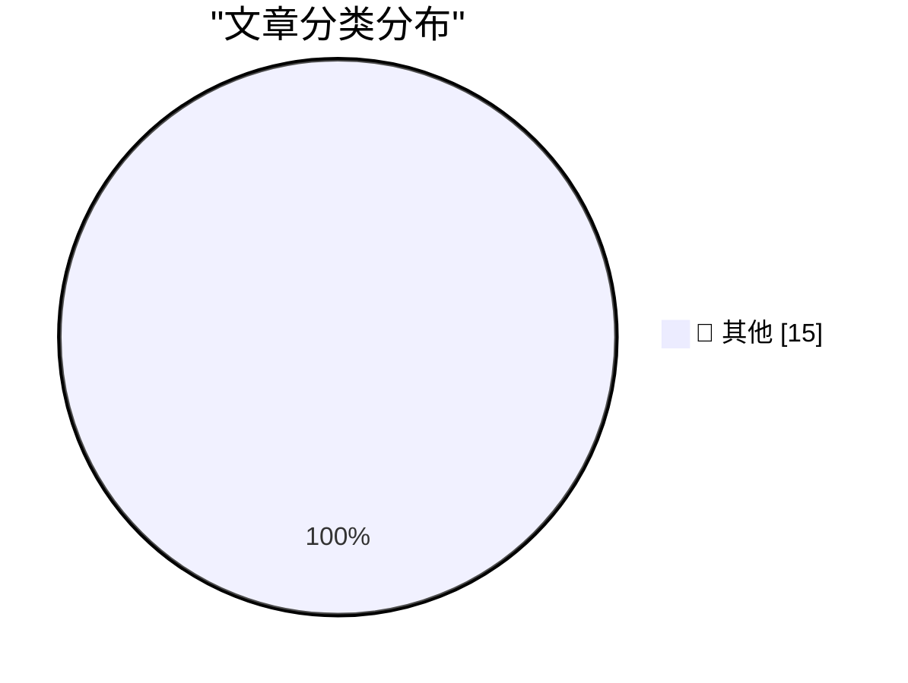

# 📰 AI 博客每日精选 — 2026-04-09

> 来自 Karpathy 推荐的 92 个顶级技术博客，AI 精选 Top 15

## 🏆 今日必读

🥇 **摘要生成失败（可重试）**

[摘要生成失败（可重试）](https://simonwillison.net/2026/Apr/8/muse-spark/#atom-everything) — simonwillison.net · 4 小时前 · 📝 其他

> 未能生成中文摘要，请稍后重试。

🥈 **摘要生成失败（可重试）**

[摘要生成失败（可重试）](https://simonwillison.net/2026/Apr/8/giles-turnbull/#atom-everything) — simonwillison.net · 12 小时前 · 📝 其他

> 未能生成中文摘要，请稍后重试。

🥉 **摘要生成失败（可重试）**

[摘要生成失败（可重试）](https://simonwillison.net/2026/Apr/7/glm-51/#atom-everything) — simonwillison.net · 1 天前 · 📝 其他

> 未能生成中文摘要，请稍后重试。

---

## 📊 数据概览

| 扫描源 | 抓取文章 | 时间范围 | 精选 |
|:---:|:---:|:---:|:---:|
| 84/92 | 2438 篇 → 32 篇 | 48h | **15 篇** |

### 分类分布

---

## 📝 其他

### 1. 摘要生成失败（可重试）

[摘要生成失败（可重试）](https://simonwillison.net/2026/Apr/8/muse-spark/#atom-everything) — **simonwillison.net** · 4 小时前 · ⭐ 15/30

> 未能生成中文摘要，请稍后重试。

---

### 2. 摘要生成失败（可重试）

[摘要生成失败（可重试）](https://simonwillison.net/2026/Apr/8/giles-turnbull/#atom-everything) — **simonwillison.net** · 12 小时前 · ⭐ 15/30

> 未能生成中文摘要，请稍后重试。

---

### 3. 摘要生成失败（可重试）

[摘要生成失败（可重试）](https://simonwillison.net/2026/Apr/7/glm-51/#atom-everything) — **simonwillison.net** · 1 天前 · ⭐ 15/30

> 未能生成中文摘要，请稍后重试。

---

### 4. 摘要生成失败（可重试）

[摘要生成失败（可重试）](https://simonwillison.net/2026/Apr/7/project-glasswing/#atom-everything) — **simonwillison.net** · 1 天前 · ⭐ 15/30

> 未能生成中文摘要，请稍后重试。

---

### 5. 摘要生成失败（可重试）

[摘要生成失败（可重试）](https://simonwillison.net/2026/Apr/7/sqlite-wal-docker-containers/#atom-everything) — **simonwillison.net** · 1 天前 · ⭐ 15/30

> 未能生成中文摘要，请稍后重试。

---

### 6. 摘要生成失败（可重试）

[摘要生成失败（可重试）](https://krebsonsecurity.com/2026/04/russia-hacked-routers-to-steal-microsoft-office-tokens/) — **krebsonsecurity.com** · 1 天前 · ⭐ 15/30

> 未能生成中文摘要，请稍后重试。

---

### 7. 摘要生成失败（可重试）

[摘要生成失败（可重试）](https://red.anthropic.com/2026/mythos-preview/) — **daringfireball.net** · 11 小时前 · ⭐ 15/30

> 未能生成中文摘要，请稍后重试。

---

### 8. 摘要生成失败（可重试）

[摘要生成失败（可重试）](https://kottke.org/26/04/solar-eclipse-far-side-of-the-moon) — **daringfireball.net** · 1 天前 · ⭐ 15/30

> 未能生成中文摘要，请稍后重试。

---

### 9. 摘要生成失败（可重试）

[摘要生成失败（可重试）](https://x.com/OpenAINewsroom/status/2041618671236469200?s=20) — **daringfireball.net** · 1 天前 · ⭐ 15/30

> 未能生成中文摘要，请稍后重试。

---

### 10. 摘要生成失败（可重试）

[摘要生成失败（可重试）](https://daringfireball.net/2026/04/openai_future) — **daringfireball.net** · 1 天前 · ⭐ 15/30

> 未能生成中文摘要，请稍后重试。

---

### 11. 摘要生成失败（可重试）

[摘要生成失败（可重试）](https://om.co/2026/04/02/openai-masters-of-agitprop-2-0/) — **daringfireball.net** · 1 天前 · ⭐ 15/30

> 未能生成中文摘要，请稍后重试。

---

### 12. 摘要生成失败（可重试）

[摘要生成失败（可重试）](https://flighty.com/airports) — **daringfireball.net** · 1 天前 · ⭐ 15/30

> 未能生成中文摘要，请稍后重试。

---

### 13. 摘要生成失败（可重试）

[摘要生成失败（可重试）](https://sheets.works/data-viz/every-iphone) — **daringfireball.net** · 1 天前 · ⭐ 15/30

> 未能生成中文摘要，请稍后重试。

---

### 14. 摘要生成失败（可重试）

[摘要生成失败（可重试）](https://pluralistic.net/2026/04/08/process-knowledge-vs-bosses/) — **pluralistic.net** · 14 小时前 · ⭐ 15/30

> 未能生成中文摘要，请稍后重试。

---

### 15. 摘要生成失败（可重试）

[摘要生成失败（可重试）](https://pluralistic.net/2026/04/07/swisscom/) — **pluralistic.net** · 1 天前 · ⭐ 15/30

> 未能生成中文摘要，请稍后重试。

---

*生成于 2026-04-09 03:47 | 扫描 84 源 → 获取 2438 篇 → 精选 15 篇*
*基于 [Hacker News Popularity Contest 2025](https://refactoringenglish.com/tools/hn-popularity/) RSS 源列表，由 [Andrej Karpathy](https://x.com/karpathy) 推荐*
