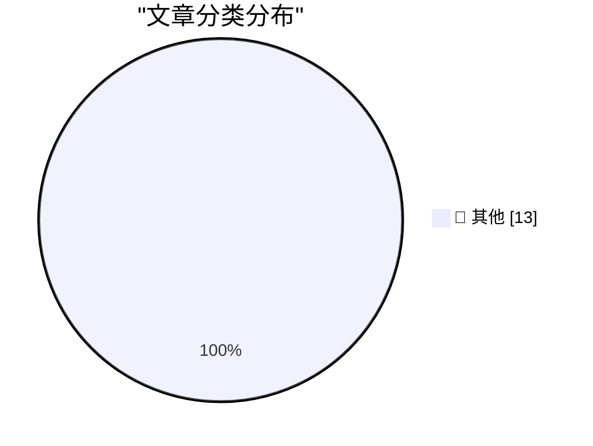

# 📰 AI 博客每日精选 — 2026-04-27

> 来自 Karpathy 推荐的 92 个顶级技术博客，AI 精选 Top 13

## 🏆 今日必读

🥇 **摘要生成失败（可重试）**

[摘要生成失败（可重试）](https://simonwillison.net/2026/Apr/25/why-are-you-like-this/#atom-everything) — simonwillison.net · 1 天前 · 📝 其他

> 未能生成中文摘要，请稍后重试。

🥈 **摘要生成失败（可重试）**

[摘要生成失败（可重试）](https://simonwillison.net/2026/Apr/25/romain-huet/#atom-everything) — simonwillison.net · 1 天前 · 📝 其他

> 未能生成中文摘要，请稍后重试。

🥉 **摘要生成失败（可重试）**

[摘要生成失败（可重试）](https://store.daringfireball.net/) — daringfireball.net · 9 小时前 · 📝 其他

> 未能生成中文摘要，请稍后重试。

---

## 📊 数据概览

| 扫描源 | 抓取文章 | 时间范围 | 精选 |
|:---:|:---:|:---:|:---:|
| 77/92 | 2312 篇 → 13 篇 | 48h | **13 篇** |

### 分类分布

---

## 📝 其他

### 1. 摘要生成失败（可重试）

[摘要生成失败（可重试）](https://simonwillison.net/2026/Apr/25/why-are-you-like-this/#atom-everything) — **simonwillison.net** · 1 天前 · ⭐ 15/30

> 未能生成中文摘要，请稍后重试。

---

### 2. 摘要生成失败（可重试）

[摘要生成失败（可重试）](https://simonwillison.net/2026/Apr/25/romain-huet/#atom-everything) — **simonwillison.net** · 1 天前 · ⭐ 15/30

> 未能生成中文摘要，请稍后重试。

---

### 3. 摘要生成失败（可重试）

[摘要生成失败（可重试）](https://store.daringfireball.net/) — **daringfireball.net** · 9 小时前 · ⭐ 15/30

> 未能生成中文摘要，请稍后重试。

---

### 4. 摘要生成失败（可重试）

[摘要生成失败（可重试）](https://daringfireball.net/2026/04/nyt_wrong_crossword_grid) — **daringfireball.net** · 9 小时前 · ⭐ 15/30

> 未能生成中文摘要，请稍后重试。

---

### 5. 摘要生成失败（可重试）

[摘要生成失败（可重试）](https://9to5google.com/2026/04/22/samsung-is-increasingly-worried-about-first-ever-mobile-division-loss-in-ram-crisis-report/) — **daringfireball.net** · 10 小时前 · ⭐ 15/30

> 未能生成中文摘要，请稍后重试。

---

### 6. 摘要生成失败（可重试）

[摘要生成失败（可重试）](https://idiallo.com/byte-size/the-satisfaction-of-a-chatgpt-plan?src=feed) — **idiallo.com** · 1 天前 · ⭐ 15/30

> 未能生成中文摘要，请稍后重试。

---

### 7. 摘要生成失败（可重试）

[摘要生成失败（可重试）](https://idiallo.com/blog/what-do-you-charge-for?src=feed) — **idiallo.com** · 1 天前 · ⭐ 15/30

> 未能生成中文摘要，请稍后重试。

---

### 8. 摘要生成失败（可重试）

[摘要生成失败（可重试）](https://pluralistic.net/2026/04/25/machiavellian/) — **pluralistic.net** · 1 天前 · ⭐ 15/30

> 未能生成中文摘要，请稍后重试。

---

### 9. 摘要生成失败（可重试）

[摘要生成失败（可重试）](https://www.johndcook.com/blog/2026/04/25/exact-solution-nonlinear-pendulum/) — **johndcook.com** · 1 天前 · ⭐ 15/30

> 未能生成中文摘要，请稍后重试。

---

### 10. 摘要生成失败（可重试）

[摘要生成失败（可重试）](https://www.johndcook.com/blog/2026/04/25/nth-derivative-of-a-quotient/) — **johndcook.com** · 1 天前 · ⭐ 15/30

> 未能生成中文摘要，请稍后重试。

---

### 11. 摘要生成失败（可重试）

[摘要生成失败（可重试）](https://www.construction-physics.com/p/reading-list-042526) — **construction-physics.com** · 1 天前 · ⭐ 15/30

> 未能生成中文摘要，请稍后重试。

---

### 12. 摘要生成失败（可重试）

[摘要生成失败（可重试）](https://blog.miguelgrinberg.com/post/how-bitwarden-encrypts-and-decrypts-secrets) — **miguelgrinberg.com** · 14 小时前 · ⭐ 15/30

> 未能生成中文摘要，请稍后重试。

---

### 13. 摘要生成失败（可重试）

[摘要生成失败（可重试）](https://computer.rip/2026-04-26-voice-modems.html) — **computer.rip** · 1 天前 · ⭐ 15/30

> 未能生成中文摘要，请稍后重试。

---

*生成于 2026-04-27 04:31 | 扫描 77 源 → 获取 2312 篇 → 精选 13 篇*
*基于 [Hacker News Popularity Contest 2025](https://refactoringenglish.com/tools/hn-popularity/) RSS 源列表，由 [Andrej Karpathy](https://x.com/karpathy) 推荐*
