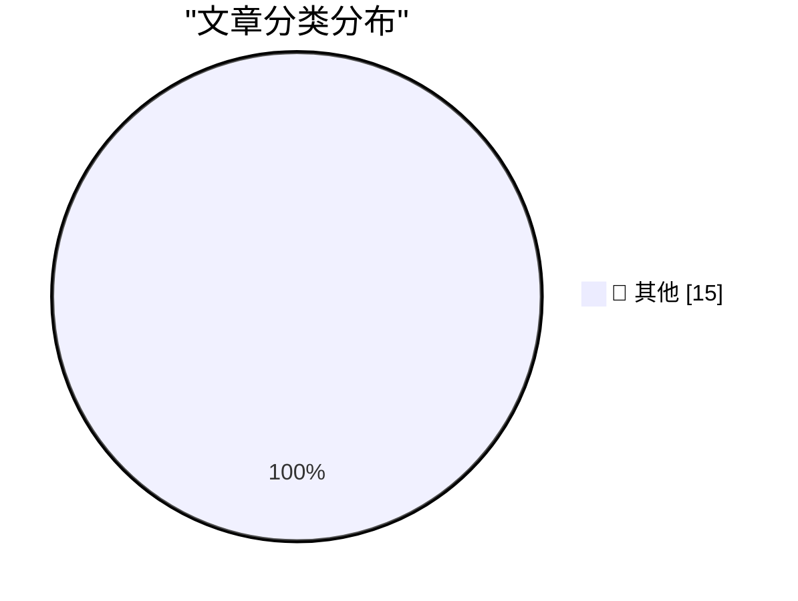

# 📰 AI 博客每日精选 — 2026-05-03

> 来自 Karpathy 推荐的 92 个顶级技术博客，AI 精选 Top 15

## 🏆 今日必读

🥇 **摘要生成失败（可重试）**

[摘要生成失败（可重试）](https://simonwillison.net/2026/May/2/sightings/#atom-everything) — simonwillison.net · 11 小时前 · 📝 其他

> 未能生成中文摘要，请稍后重试。

🥈 **摘要生成失败（可重试）**

[摘要生成失败（可重试）](https://simonwillison.net/2026/May/1/inat-sightings/#atom-everything) — simonwillison.net · 1 天前 · 📝 其他

> 未能生成中文摘要，请稍后重试。

🥉 **摘要生成失败（可重试）**

[摘要生成失败（可重试）](https://www.jeffgeerling.com/blog/2026/deskpi-super4c-sbc-cluster/) — jeffgeerling.com · 1 天前 · 📝 其他

> 未能生成中文摘要，请稍后重试。

---

## 📊 数据概览

| 扫描源 | 抓取文章 | 时间范围 | 精选 |
|:---:|:---:|:---:|:---:|
| 83/92 | 2452 篇 → 19 篇 | 48h | **15 篇** |

### 分类分布

---

## 📝 其他

### 1. 摘要生成失败（可重试）

[摘要生成失败（可重试）](https://simonwillison.net/2026/May/2/sightings/#atom-everything) — **simonwillison.net** · 11 小时前 · ⭐ 15/30

> 未能生成中文摘要，请稍后重试。

---

### 2. 摘要生成失败（可重试）

[摘要生成失败（可重试）](https://simonwillison.net/2026/May/1/inat-sightings/#atom-everything) — **simonwillison.net** · 1 天前 · ⭐ 15/30

> 未能生成中文摘要，请稍后重试。

---

### 3. 摘要生成失败（可重试）

[摘要生成失败（可重试）](https://www.jeffgeerling.com/blog/2026/deskpi-super4c-sbc-cluster/) — **jeffgeerling.com** · 1 天前 · ⭐ 15/30

> 未能生成中文摘要，请稍后重试。

---

### 4. 摘要生成失败（可重试）

[摘要生成失败（可重试）](https://daringfireball.net/linked/2026/05/01/tim-cooks-clever-solution-to-the-tariff-refund-puzzle) — **daringfireball.net** · 1 天前 · ⭐ 15/30

> 未能生成中文摘要，请稍后重试。

---

### 5. 摘要生成失败（可重试）

[摘要生成失败（可重试）](https://www.bbc.com/news/articles/c5y7yvgy0w6o) — **daringfireball.net** · 1 天前 · ⭐ 15/30

> 未能生成中文摘要，请稍后重试。

---

### 6. 摘要生成失败（可重试）

[摘要生成失败（可重试）](https://sixcolors.com/post/2026/04/apple-results-analysis-net-net-over-the-moon/) — **daringfireball.net** · 1 天前 · ⭐ 15/30

> 未能生成中文摘要，请稍后重试。

---

### 7. 摘要生成失败（可重试）

[摘要生成失败（可重试）](https://idiallo.com/byte-size/editing-llm-assisted-articles?src=feed) — **idiallo.com** · 1 天前 · ⭐ 15/30

> 未能生成中文摘要，请稍后重试。

---

### 8. 摘要生成失败（可重试）

[摘要生成失败（可重试）](https://idiallo.com/blog/disable-auto-update?src=feed) — **idiallo.com** · 1 天前 · ⭐ 15/30

> 未能生成中文摘要，请稍后重试。

---

### 9. 摘要生成失败（可重试）

[摘要生成失败（可重试）](https://pluralistic.net/2026/05/02/denazification/) — **pluralistic.net** · 17 小时前 · ⭐ 15/30

> 未能生成中文摘要，请稍后重试。

---

### 10. 摘要生成失败（可重试）

[摘要生成失败（可重试）](https://shkspr.mobi/blog/2026/05/nhs-goes-to-war-against-open-source/) — **shkspr.mobi** · 1 天前 · ⭐ 15/30

> 未能生成中文摘要，请稍后重试。

---

### 11. 摘要生成失败（可重试）

[摘要生成失败（可重试）](https://devblogs.microsoft.com/oldnewthing/20260501-00/?p=112291) — **devblogs.microsoft.com/oldnewthing** · 1 天前 · ⭐ 15/30

> 未能生成中文摘要，请稍后重试。

---

### 12. 摘要生成失败（可重试）

[摘要生成失败（可重试）](https://nesbitt.io/2026/05/02/a-github-for-maintainers.html) — **nesbitt.io** · 18 小时前 · ⭐ 15/30

> 未能生成中文摘要，请稍后重试。

---

### 13. 摘要生成失败（可重试）

[摘要生成失败（可重试）](https://nesbitt.io/2026/05/01/patching-and-forking-in-package-managers.html) — **nesbitt.io** · 1 天前 · ⭐ 15/30

> 未能生成中文摘要，请稍后重试。

---

### 14. 摘要生成失败（可重试）

[摘要生成失败（可重试）](https://www.construction-physics.com/p/reading-list-05022026) — **construction-physics.com** · 16 小时前 · ⭐ 15/30

> 未能生成中文摘要，请稍后重试。

---

### 15. 摘要生成失败（可重试）

[摘要生成失败（可重试）](https://geohot.github.io//blog/jekyll/update/2026/05/01/ai-will-create-jobs.html) — **geohot.github.io** · 1 天前 · ⭐ 15/30

> 未能生成中文摘要，请稍后重试。

---

*生成于 2026-05-03 04:40 | 扫描 83 源 → 获取 2452 篇 → 精选 15 篇*
*基于 [Hacker News Popularity Contest 2025](https://refactoringenglish.com/tools/hn-popularity/) RSS 源列表，由 [Andrej Karpathy](https://x.com/karpathy) 推荐*
