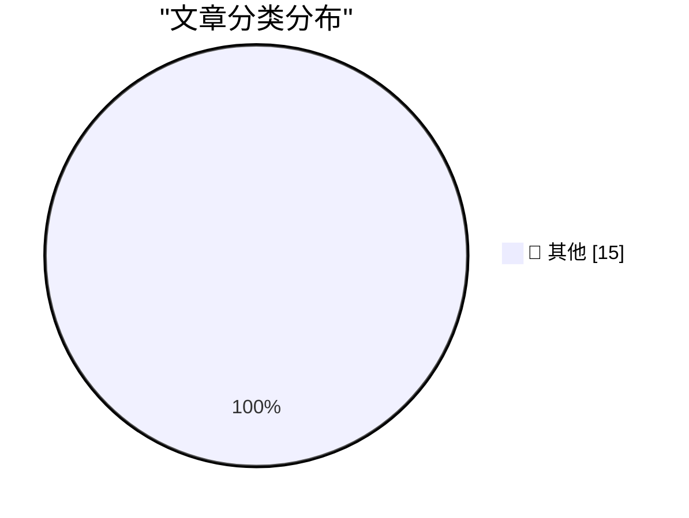

# 📰 AI 博客每日精选 — 2026-05-04

> 来自 Karpathy 推荐的 92 个顶级技术博客，AI 精选 Top 15

## 🏆 今日必读

🥇 **摘要生成失败（可重试）**

[摘要生成失败（可重试）](https://simonwillison.net/2026/May/3/anthropic/#atom-everything) — simonwillison.net · 13 小时前 · 📝 其他

> 未能生成中文摘要，请稍后重试。

🥈 **摘要生成失败（可重试）**

[摘要生成失败（可重试）](https://simonwillison.net/2026/May/2/sightings/#atom-everything) — simonwillison.net · 1 天前 · 📝 其他

> 未能生成中文摘要，请稍后重试。

🥉 **摘要生成失败（可重试）**

[摘要生成失败（可重试）](https://bsky.app/profile/gilduran.com/post/3mky5taqg3222) — daringfireball.net · 4 小时前 · 📝 其他

> 未能生成中文摘要，请稍后重试。

---

## 📊 数据概览

| 扫描源 | 抓取文章 | 时间范围 | 精选 |
|:---:|:---:|:---:|:---:|
| 78/92 | 2341 篇 → 21 篇 | 48h | **15 篇** |

### 分类分布

---

## 📝 其他

### 1. 摘要生成失败（可重试）

[摘要生成失败（可重试）](https://simonwillison.net/2026/May/3/anthropic/#atom-everything) — **simonwillison.net** · 13 小时前 · ⭐ 15/30

> 未能生成中文摘要，请稍后重试。

---

### 2. 摘要生成失败（可重试）

[摘要生成失败（可重试）](https://simonwillison.net/2026/May/2/sightings/#atom-everything) — **simonwillison.net** · 1 天前 · ⭐ 15/30

> 未能生成中文摘要，请稍后重试。

---

### 3. 摘要生成失败（可重试）

[摘要生成失败（可重试）](https://bsky.app/profile/gilduran.com/post/3mky5taqg3222) — **daringfireball.net** · 4 小时前 · ⭐ 15/30

> 未能生成中文摘要，请稍后重试。

---

### 4. 摘要生成失败（可重试）

[摘要生成失败（可重试）](https://davidgelphman.wordpress.com/2013/03/29/2-letters-from-steve/) — **daringfireball.net** · 4 小时前 · ⭐ 15/30

> 未能生成中文摘要，请稍后重试。

---

### 5. 摘要生成失败（可重试）

[摘要生成失败（可重试）](https://daringfireball.net/2026/05/crimes_against_decency_need_as_much_cover-up_as_crimes_against_the_law) — **daringfireball.net** · 5 小时前 · ⭐ 15/30

> 未能生成中文摘要，请稍后重试。

---

### 6. 摘要生成失败（可重试）

[摘要生成失败（可重试）](https://pluralistic.net/2026/05/02/denazification/) — **pluralistic.net** · 1 天前 · ⭐ 15/30

> 未能生成中文摘要，请稍后重试。

---

### 7. 摘要生成失败（可重试）

[摘要生成失败（可重试）](https://shkspr.mobi/blog/2026/05/vertically-aligning-roman-numerals-in-code/) — **shkspr.mobi** · 17 小时前 · ⭐ 15/30

> 未能生成中文摘要，请稍后重试。

---

### 8. 摘要生成失败（可重试）

[摘要生成失败（可重试）](https://www.johndcook.com/blog/2026/05/03/guitar-pick/) — **johndcook.com** · 7 小时前 · ⭐ 15/30

> 未能生成中文摘要，请稍后重试。

---

### 9. 摘要生成失败（可重试）

[摘要生成失败（可重试）](https://matklad.github.io/2026/05/03/zig-error-context.html) — **matklad.github.io** · 1 天前 · ⭐ 15/30

> 未能生成中文摘要，请稍后重试。

---

### 10. 摘要生成失败（可重试）

[摘要生成失败（可重试）](https://evanhahn.com/png-cmp-is-cmp-but-for-pngs/) — **evanhahn.com** · 1 天前 · ⭐ 15/30

> 未能生成中文摘要，请稍后重试。

---

### 11. 摘要生成失败（可重试）

[摘要生成失败（可重试）](https://nesbitt.io/2026/05/02/a-github-for-maintainers.html) — **nesbitt.io** · 1 天前 · ⭐ 15/30

> 未能生成中文摘要，请稍后重试。

---

### 12. 摘要生成失败（可重试）

[摘要生成失败（可重试）](https://www.construction-physics.com/p/reading-list-05022026) — **construction-physics.com** · 1 天前 · ⭐ 15/30

> 未能生成中文摘要，请稍后重试。

---

### 13. 摘要生成失败（可重试）

[摘要生成失败（可重试）](https://feed.tedium.co/link/15204/17331178/wheel-reinvention-technology-history) — **tedium.co** · 14 小时前 · ⭐ 15/30

> 未能生成中文摘要，请稍后重试。

---

### 14. 摘要生成失败（可重试）

[摘要生成失败（可重试）](https://susam.net/from-rss-to-atom.html) — **susam.net** · 4 小时前 · ⭐ 15/30

> 未能生成中文摘要，请稍后重试。

---

### 15. 摘要生成失败（可重试）

[摘要生成失败（可重试）](https://susam.net/code/news/quickqwerty/1.2.3.html) — **susam.net** · 1 天前 · ⭐ 15/30

> 未能生成中文摘要，请稍后重试。

---

*生成于 2026-05-04 04:40 | 扫描 78 源 → 获取 2341 篇 → 精选 15 篇*
*基于 [Hacker News Popularity Contest 2025](https://refactoringenglish.com/tools/hn-popularity/) RSS 源列表，由 [Andrej Karpathy](https://x.com/karpathy) 推荐*
