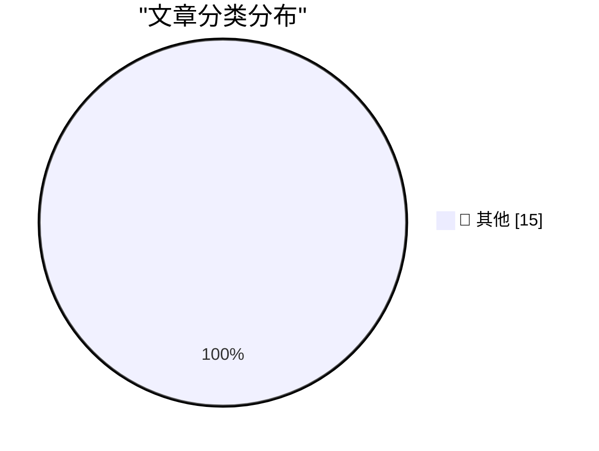

# 📰 AI 博客每日精选 — 2026-06-12

> 来自 Karpathy 推荐的 92 个顶级技术博客，AI 精选 Top 15

## 🏆 今日必读

🥇 **摘要生成失败（可重试）**

[摘要生成失败（可重试）](https://simonwillison.net/2026/Jun/11/fable-is-relentlessly-proactive/#atom-everything) — simonwillison.net · 6 小时前 · 📝 其他

> 未能生成中文摘要，请稍后重试。

🥈 **摘要生成失败（可重试）**

[摘要生成失败（可重试）](https://simonwillison.net/2026/Jun/11/datasette/#atom-everything) — simonwillison.net · 14 小时前 · 📝 其他

> 未能生成中文摘要，请稍后重试。

🥉 **摘要生成失败（可重试）**

[摘要生成失败（可重试）](https://simonwillison.net/2026/Jun/11/asyncinject/#atom-everything) — simonwillison.net · 23 小时前 · 📝 其他

> 未能生成中文摘要，请稍后重试。

---

## 📊 数据概览

| 扫描源 | 抓取文章 | 时间范围 | 精选 |
|:---:|:---:|:---:|:---:|
| 82/92 | 2463 篇 → 28 篇 | 48h | **15 篇** |

### 分类分布

---

## 📝 其他

### 1. 摘要生成失败（可重试）

[摘要生成失败（可重试）](https://simonwillison.net/2026/Jun/11/fable-is-relentlessly-proactive/#atom-everything) — **simonwillison.net** · 6 小时前 · ⭐ 15/30

> 未能生成中文摘要，请稍后重试。

---

### 2. 摘要生成失败（可重试）

[摘要生成失败（可重试）](https://simonwillison.net/2026/Jun/11/datasette/#atom-everything) — **simonwillison.net** · 14 小时前 · ⭐ 15/30

> 未能生成中文摘要，请稍后重试。

---

### 3. 摘要生成失败（可重试）

[摘要生成失败（可重试）](https://simonwillison.net/2026/Jun/11/asyncinject/#atom-everything) — **simonwillison.net** · 23 小时前 · ⭐ 15/30

> 未能生成中文摘要，请稍后重试。

---

### 4. 摘要生成失败（可重试）

[摘要生成失败（可重试）](https://simonwillison.net/2026/Jun/11/anthropic-walks-back-policy/#atom-everything) — **simonwillison.net** · 1 天前 · ⭐ 15/30

> 未能生成中文摘要，请稍后重试。

---

### 5. 摘要生成失败（可重试）

[摘要生成失败（可重试）](https://simonwillison.net/2026/Jun/10/datasette-agent/#atom-everything) — **simonwillison.net** · 1 天前 · ⭐ 15/30

> 未能生成中文摘要，请稍后重试。

---

### 6. 摘要生成失败（可重试）

[摘要生成失败（可重试）](https://simonwillison.net/2026/Jun/10/diffusiongemma/#atom-everything) — **simonwillison.net** · 1 天前 · ⭐ 15/30

> 未能生成中文摘要，请稍后重试。

---

### 7. 摘要生成失败（可重试）

[摘要生成失败（可重试）](https://simonwillison.net/2026/Jun/10/jeremy-howard/#atom-everything) — **simonwillison.net** · 1 天前 · ⭐ 15/30

> 未能生成中文摘要，请稍后重试。

---

### 8. 摘要生成失败（可重试）

[摘要生成失败（可重试）](https://krebsonsecurity.com/2026/06/who-runs-the-ransomware-group-the-gentlemen/) — **krebsonsecurity.com** · 1 天前 · ⭐ 15/30

> 未能生成中文摘要，请稍后重试。

---

### 9. 摘要生成失败（可重试）

[摘要生成失败（可重试）](https://www.apple.com/newsroom/2026/06/due-to-dma-siri-ai-delayed-in-eu-for-ios-27-and-ipados-27/) — **daringfireball.net** · 7 小时前 · ⭐ 15/30

> 未能生成中文摘要，请稍后重试。

---

### 10. 摘要生成失败（可重试）

[摘要生成失败（可重试）](https://www.youtube.com/watch?v=iEho3brGB64) — **daringfireball.net** · 9 小时前 · ⭐ 15/30

> 未能生成中文摘要，请稍后重试。

---

### 11. 摘要生成失败（可重试）

[摘要生成失败（可重试）](https://9to5mac.com/2026/06/08/craig-federighi-details-apples-collaboration-with-google-for-siri-ai-in-ios-27/) — **daringfireball.net** · 1 天前 · ⭐ 15/30

> 未能生成中文摘要，请稍后重试。

---

### 12. 摘要生成失败（可重试）

[摘要生成失败（可重试）](https://daringfireball.net/2026/06/macos_27_golden_gate_removes_the_dumb_icons_from_menu_items) — **daringfireball.net** · 1 天前 · ⭐ 15/30

> 未能生成中文摘要，请稍后重试。

---

### 13. 摘要生成失败（可重试）

[摘要生成失败（可重试）](https://idiallo.com/blog/use-a-link-please) — **idiallo.com** · 1 天前 · ⭐ 15/30

> 未能生成中文摘要，请稍后重试。

---

### 14. 摘要生成失败（可重试）

[摘要生成失败（可重试）](https://pluralistic.net/2026/06/11/lapsarianism/) — **pluralistic.net** · 15 小时前 · ⭐ 15/30

> 未能生成中文摘要，请稍后重试。

---

### 15. 摘要生成失败（可重试）

[摘要生成失败（可重试）](https://devblogs.microsoft.com/oldnewthing/20260611-00/?p=112415) — **devblogs.microsoft.com/oldnewthing** · 15 小时前 · ⭐ 15/30

> 未能生成中文摘要，请稍后重试。

---

*生成于 2026-06-12 05:49 | 扫描 82 源 → 获取 2463 篇 → 精选 15 篇*
*基于 [Hacker News Popularity Contest 2025](https://refactoringenglish.com/tools/hn-popularity/) RSS 源列表，由 [Andrej Karpathy](https://x.com/karpathy) 推荐*
