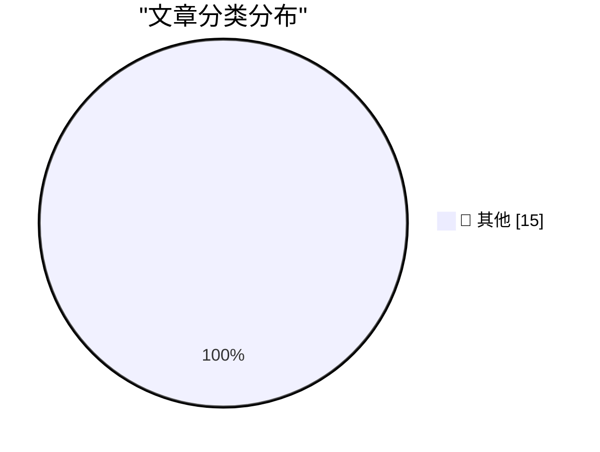

# 📰 AI 博客每日精选 — 2026-06-17

> 来自 Karpathy 推荐的 92 个顶级技术博客，AI 精选 Top 15

## 🏆 今日必读

🥇 **摘要生成失败（可重试）**

[摘要生成失败（可重试）](https://simonwillison.net/2026/Jun/17/netnewswire-status/#atom-everything) — simonwillison.net · 2 小时前 · 📝 其他

> 未能生成中文摘要，请稍后重试。

🥈 **摘要生成失败（可重试）**

[摘要生成失败（可重试）](https://simonwillison.net/2026/Jun/16/datasette-tailscale/#atom-everything) — simonwillison.net · 13 小时前 · 📝 其他

> 未能生成中文摘要，请稍后重试。

🥉 **摘要生成失败（可重试）**

[摘要生成失败（可重试）](https://simonwillison.net/2026/Jun/16/georgi-gerganov/#atom-everything) — simonwillison.net · 14 小时前 · 📝 其他

> 未能生成中文摘要，请稍后重试。

---

## 📊 数据概览

| 扫描源 | 抓取文章 | 时间范围 | 精选 |
|:---:|:---:|:---:|:---:|
| 79/92 | 2422 篇 → 41 篇 | 48h | **15 篇** |

### 分类分布

---

## 📝 其他

### 1. 摘要生成失败（可重试）

[摘要生成失败（可重试）](https://simonwillison.net/2026/Jun/17/netnewswire-status/#atom-everything) — **simonwillison.net** · 2 小时前 · ⭐ 15/30

> 未能生成中文摘要，请稍后重试。

---

### 2. 摘要生成失败（可重试）

[摘要生成失败（可重试）](https://simonwillison.net/2026/Jun/16/datasette-tailscale/#atom-everything) — **simonwillison.net** · 13 小时前 · ⭐ 15/30

> 未能生成中文摘要，请稍后重试。

---

### 3. 摘要生成失败（可重试）

[摘要生成失败（可重试）](https://simonwillison.net/2026/Jun/16/georgi-gerganov/#atom-everything) — **simonwillison.net** · 14 小时前 · ⭐ 15/30

> 未能生成中文摘要，请稍后重试。

---

### 4. 摘要生成失败（可重试）

[摘要生成失败（可重试）](https://simonwillison.net/2026/Jun/16/fable-5-export-controls/#atom-everything) — **simonwillison.net** · 1 天前 · ⭐ 15/30

> 未能生成中文摘要，请稍后重试。

---

### 5. 摘要生成失败（可重试）

[摘要生成失败（可重试）](https://simonwillison.net/2026/Jun/16/matteo-wong-the-atlantic/#atom-everything) — **simonwillison.net** · 1 天前 · ⭐ 15/30

> 未能生成中文摘要，请稍后重试。

---

### 6. 摘要生成失败（可重试）

[摘要生成失败（可重试）](https://simonwillison.net/2026/Jun/16/captcha-on-at-least-one-ampersand/#atom-everything) — **simonwillison.net** · 1 天前 · ⭐ 15/30

> 未能生成中文摘要，请稍后重试。

---

### 7. 摘要生成失败（可重试）

[摘要生成失败（可重试）](https://simonwillison.net/2026/Jun/15/datasette-agent/#atom-everything) — **simonwillison.net** · 1 天前 · ⭐ 15/30

> 未能生成中文摘要，请稍后重试。

---

### 8. 摘要生成失败（可重试）

[摘要生成失败（可重试）](https://simonwillison.net/2026/Jun/15/axios-clashes-anthropics/#atom-everything) — **simonwillison.net** · 1 天前 · ⭐ 15/30

> 未能生成中文摘要，请稍后重试。

---

### 9. 摘要生成失败（可重试）

[摘要生成失败（可重试）](https://daringfireball.net/2024/09/ios_continental_drift_fun_gap) — **daringfireball.net** · 5 小时前 · ⭐ 15/30

> 未能生成中文摘要，请稍后重试。

---

### 10. 摘要生成失败（可重试）

[摘要生成失败（可重试）](https://techcrunch.com/2026/06/09/apples-app-store-rolls-out-personalized-recommendations/) — **daringfireball.net** · 13 小时前 · ⭐ 15/30

> 未能生成中文摘要，请稍后重试。

---

### 11. 摘要生成失败（可重试）

[摘要生成失败（可重试）](https://www.mux.com/?utm_campaign=fireball&amp;utm_source=DF) — **daringfireball.net** · 1 天前 · ⭐ 15/30

> 未能生成中文摘要，请稍后重试。

---

### 12. 摘要生成失败（可重试）

[摘要生成失败（可重试）](https://www.washingtonpost.com/opinions/2026/06/14/apple-withholding-siri-ai-europe-is-another-dma-failure/) — **daringfireball.net** · 1 天前 · ⭐ 15/30

> 未能生成中文摘要，请稍后重试。

---

### 13. 摘要生成失败（可重试）

[摘要生成失败（可重试）](https://arstechnica.com/ai/2026/04/europe-could-force-google-to-open-android-to-other-ai-assistants/) — **daringfireball.net** · 1 天前 · ⭐ 15/30

> 未能生成中文摘要，请稍后重试。

---

### 14. 摘要生成失败（可重试）

[摘要生成失败（可重试）](https://workos.com/auth-md?utm_source=daringfireball&amp;utm_medium=newsletter&amp;utm_campaign=q22026) — **daringfireball.net** · 1 天前 · ⭐ 15/30

> 未能生成中文摘要，请稍后重试。

---

### 15. 摘要生成失败（可重试）

[摘要生成失败（可重试）](https://stratechery.com/2026/anthropics-safety-superpower/) — **daringfireball.net** · 1 天前 · ⭐ 15/30

> 未能生成中文摘要，请稍后重试。

---

*生成于 2026-06-17 06:12 | 扫描 79 源 → 获取 2422 篇 → 精选 15 篇*
*基于 [Hacker News Popularity Contest 2025](https://refactoringenglish.com/tools/hn-popularity/) RSS 源列表，由 [Andrej Karpathy](https://x.com/karpathy) 推荐*
