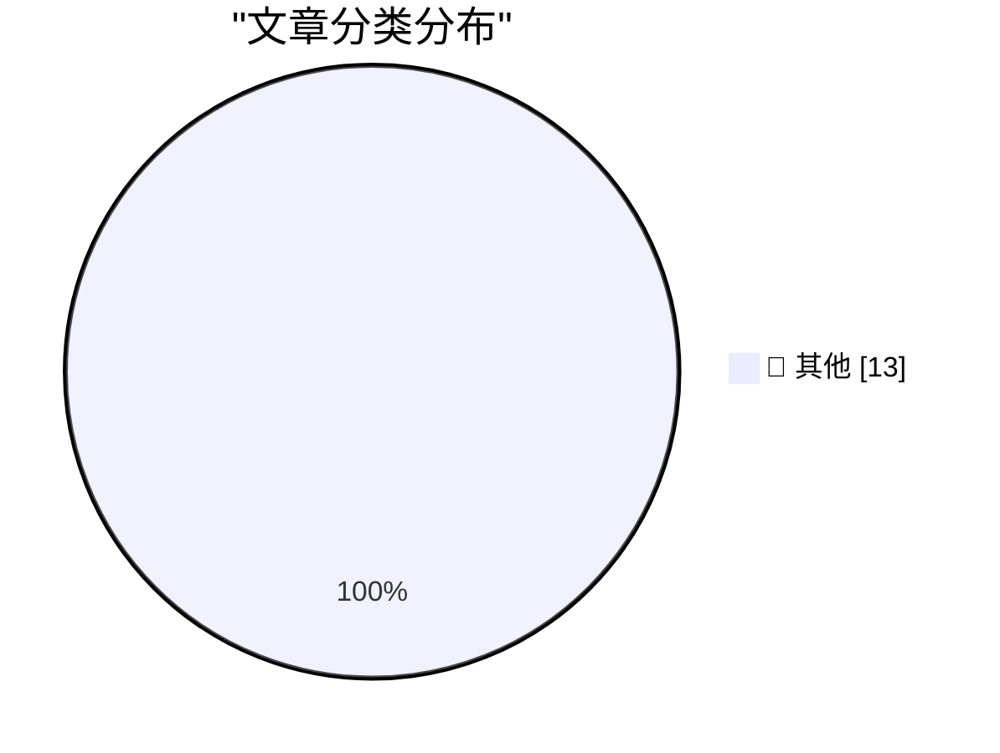

# 📰 AI 博客每日精选 — 2026-07-06

> 来自 Karpathy 推荐的 92 个顶级技术博客，AI 精选 Top 13

## 🏆 今日必读

🥇 **摘要生成失败（可重试）**

[摘要生成失败（可重试）](https://simonwillison.net/2026/Jul/5/sqlite-utils-fable/#atom-everything) — simonwillison.net · 1 天前 · 📝 其他

> 未能生成中文摘要，请稍后重试。

🥈 **摘要生成失败（可重试）**

[摘要生成失败（可重试）](https://simonwillison.net/2026/Jul/5/sqlite-utils/#atom-everything) — simonwillison.net · 1 天前 · 📝 其他

> 未能生成中文摘要，请稍后重试。

🥉 **摘要生成失败（可重试）**

[摘要生成失败（可重试）](https://simonwillison.net/2026/Jul/4/building-a-world-map-with-only-500-bytes/#atom-everything) — simonwillison.net · 1 天前 · 📝 其他

> 未能生成中文摘要，请稍后重试。

---

## 📊 数据概览

| 扫描源 | 抓取文章 | 时间范围 | 精选 |
|:---:|:---:|:---:|:---:|
| 84/92 | 2514 篇 → 13 篇 | 48h | **13 篇** |

### 分类分布

---

## 📝 其他

### 1. 摘要生成失败（可重试）

[摘要生成失败（可重试）](https://simonwillison.net/2026/Jul/5/sqlite-utils-fable/#atom-everything) — **simonwillison.net** · 1 天前 · ⭐ 15/30

> 未能生成中文摘要，请稍后重试。

---

### 2. 摘要生成失败（可重试）

[摘要生成失败（可重试）](https://simonwillison.net/2026/Jul/5/sqlite-utils/#atom-everything) — **simonwillison.net** · 1 天前 · ⭐ 15/30

> 未能生成中文摘要，请稍后重试。

---

### 3. 摘要生成失败（可重试）

[摘要生成失败（可重试）](https://simonwillison.net/2026/Jul/4/building-a-world-map-with-only-500-bytes/#atom-everything) — **simonwillison.net** · 1 天前 · ⭐ 15/30

> 未能生成中文摘要，请稍后重试。

---

### 4. 摘要生成失败（可重试）

[摘要生成失败（可重试）](https://simonwillison.net/2026/Jul/4/better-models-worse-tools/#atom-everything) — **simonwillison.net** · 1 天前 · ⭐ 15/30

> 未能生成中文摘要，请稍后重试。

---

### 5. 摘要生成失败（可重试）

[摘要生成失败（可重试）](https://seangoedecke.com/c2pa-only-works-if-everything-is-signed/) — **seangoedecke.com** · 5 小时前 · ⭐ 15/30

> 未能生成中文摘要，请稍后重试。

---

### 6. 摘要生成失败（可重试）

[摘要生成失败（可重试）](https://dayoneapp.com/blog/introducing-daily-chat/) — **daringfireball.net** · 1 天前 · ⭐ 15/30

> 未能生成中文摘要，请稍后重试。

---

### 7. 摘要生成失败（可重试）

[摘要生成失败（可重试）](https://daringfireball.net/2018/12/electron_and_the_decline_of_native_apps) — **daringfireball.net** · 1 天前 · ⭐ 15/30

> 未能生成中文摘要，请稍后重试。

---

### 8. 摘要生成失败（可重试）

[摘要生成失败（可重试）](https://flexibits.com/blog/2026/06/double-booked-never-heard-of-it-meet-calendar-mirroring-in-fantastical/) — **daringfireball.net** · 1 天前 · ⭐ 15/30

> 未能生成中文摘要，请稍后重试。

---

### 9. 摘要生成失败（可重试）

[摘要生成失败（可重试）](https://shkspr.mobi/blog/2026/07/combined-1d-and-2d-barcodes/) — **shkspr.mobi** · 1 天前 · ⭐ 15/30

> 未能生成中文摘要，请稍后重试。

---

### 10. 摘要生成失败（可重试）

[摘要生成失败（可重试）](https://nesbitt.io/2026/07/04/this-week-in-package-management.html) — **nesbitt.io** · 1 天前 · ⭐ 15/30

> 未能生成中文摘要，请稍后重试。

---

### 11. 摘要生成失败（可重试）

[摘要生成失败（可重试）](https://www.construction-physics.com/p/reading-list-070426) — **construction-physics.com** · 1 天前 · ⭐ 15/30

> 未能生成中文摘要，请稍后重试。

---

### 12. 摘要生成失败（可重试）

[摘要生成失败（可重试）](https://blog.jim-nielsen.com/2026/notes-shuffle/) — **blog.jim-nielsen.com** · 10 小时前 · ⭐ 15/30

> 未能生成中文摘要，请稍后重试。

---

### 13. 摘要生成失败（可重试）

[摘要生成失败（可重试）](https://bernsteinbear.com/blog/travel-notes-pldi-boulder/?utm_source=rss) — **bernsteinbear.com** · 1 天前 · ⭐ 15/30

> 未能生成中文摘要，请稍后重试。

---

*生成于 2026-07-06 05:10 | 扫描 84 源 → 获取 2514 篇 → 精选 13 篇*
*基于 [Hacker News Popularity Contest 2025](https://refactoringenglish.com/tools/hn-popularity/) RSS 源列表，由 [Andrej Karpathy](https://x.com/karpathy) 推荐*
