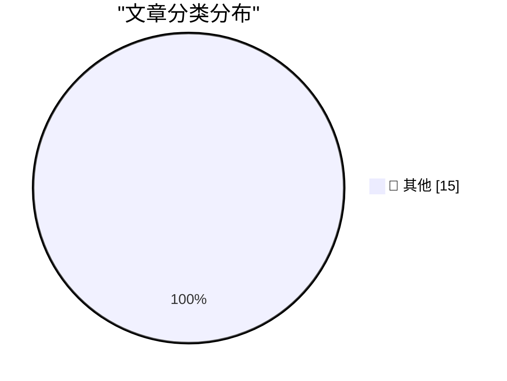

# 📰 AI 博客每日精选 — 2026-07-17

> 来自 Karpathy 推荐的 92 个顶级技术博客，AI 精选 Top 15

## 🏆 今日必读

🥇 **摘要生成失败（可重试）**

[摘要生成失败（可重试）](https://simonwillison.net/2026/Jul/17/spot-birds-not-golf/#atom-everything) — simonwillison.net · 1 小时前 · 📝 其他

> 未能生成中文摘要，请稍后重试。

🥈 **摘要生成失败（可重试）**

[摘要生成失败（可重试）](https://simonwillison.net/2026/Jul/16/firefox-in-webassembly/#atom-everything) — simonwillison.net · 4 小时前 · 📝 其他

> 未能生成中文摘要，请稍后重试。

🥉 **摘要生成失败（可重试）**

[摘要生成失败（可重试）](https://simonwillison.net/2026/Jul/16/kimi-k3/#atom-everything) — simonwillison.net · 7 小时前 · 📝 其他

> 未能生成中文摘要，请稍后重试。

---

## 📊 数据概览

| 扫描源 | 抓取文章 | 时间范围 | 精选 |
|:---:|:---:|:---:|:---:|
| 82/92 | 2482 篇 → 34 篇 | 48h | **15 篇** |

### 分类分布

---

## 📝 其他

### 1. 摘要生成失败（可重试）

[摘要生成失败（可重试）](https://simonwillison.net/2026/Jul/17/spot-birds-not-golf/#atom-everything) — **simonwillison.net** · 1 小时前 · ⭐ 15/30

> 未能生成中文摘要，请稍后重试。

---

### 2. 摘要生成失败（可重试）

[摘要生成失败（可重试）](https://simonwillison.net/2026/Jul/16/firefox-in-webassembly/#atom-everything) — **simonwillison.net** · 4 小时前 · ⭐ 15/30

> 未能生成中文摘要，请稍后重试。

---

### 3. 摘要生成失败（可重试）

[摘要生成失败（可重试）](https://simonwillison.net/2026/Jul/16/kimi-k3/#atom-everything) — **simonwillison.net** · 7 小时前 · ⭐ 15/30

> 未能生成中文摘要，请稍后重试。

---

### 4. 摘要生成失败（可重试）

[摘要生成失败（可重试）](https://simonwillison.net/2026/Jul/16/bad-codex-bug/#atom-everything) — **simonwillison.net** · 10 小时前 · ⭐ 15/30

> 未能生成中文摘要，请稍后重试。

---

### 5. 摘要生成失败（可重试）

[摘要生成失败（可重试）](https://simonwillison.net/2026/Jul/16/inkling/#atom-everything) — **simonwillison.net** · 12 小时前 · ⭐ 15/30

> 未能生成中文摘要，请稍后重试。

---

### 6. 摘要生成失败（可重试）

[摘要生成失败（可重试）](https://simonwillison.net/2026/Jul/16/mermaid-ascii/#atom-everything) — **simonwillison.net** · 13 小时前 · ⭐ 15/30

> 未能生成中文摘要，请稍后重试。

---

### 7. 摘要生成失败（可重试）

[摘要生成失败（可重试）](https://simonwillison.net/2026/Jul/16/linus-torvalds/#atom-everything) — **simonwillison.net** · 14 小时前 · ⭐ 15/30

> 未能生成中文摘要，请稍后重试。

---

### 8. 摘要生成失败（可重试）

[摘要生成失败（可重试）](https://simonwillison.net/2026/Jul/16/grok-mermaid/#atom-everything) — **simonwillison.net** · 1 天前 · ⭐ 15/30

> 未能生成中文摘要，请稍后重试。

---

### 9. 摘要生成失败（可重试）

[摘要生成失败（可重试）](https://simonwillison.net/2026/Jul/15/grok-build/#atom-everything) — **simonwillison.net** · 1 天前 · ⭐ 15/30

> 未能生成中文摘要，请稍后重试。

---

### 10. 摘要生成失败（可重试）

[摘要生成失败（可重试）](https://simonwillison.net/2026/Jul/15/claude-web-fetch-exfiltration/#atom-everything) — **simonwillison.net** · 1 天前 · ⭐ 15/30

> 未能生成中文摘要，请稍后重试。

---

### 11. 摘要生成失败（可重试）

[摘要生成失败（可重试）](https://environment.ec.europa.eu/news/commission-adds-exemptions-portable-battery-removal-rules-2026-07-14_en) — **daringfireball.net** · 2 小时前 · ⭐ 15/30

> 未能生成中文摘要，请稍后重试。

---

### 12. 摘要生成失败（可重试）

[摘要生成失败（可重试）](https://mastodon.social/@quicheindustries/116918456229212087) — **daringfireball.net** · 3 小时前 · ⭐ 15/30

> 未能生成中文摘要，请稍后重试。

---

### 13. 摘要生成失败（可重试）

[摘要生成失败（可重试）](https://dithering.passport.online/member/episode/apple-sues-open-ai) — **daringfireball.net** · 4 小时前 · ⭐ 15/30

> 未能生成中文摘要，请稍后重试。

---

### 14. 摘要生成失败（可重试）

[摘要生成失败（可重试）](https://www.bloomberg.com/news/articles/2026-07-14/openai-says-it-s-not-aware-of-any-evidence-that-apple-lawsuit-has-merit) — **daringfireball.net** · 8 小时前 · ⭐ 15/30

> 未能生成中文摘要，请稍后重试。

---

### 15. 摘要生成失败（可重试）

[摘要生成失败（可重试）](https://www.nbcnews.com/tech/apple/apple-openai-lawsuit-suit-trade-product-hardware-email-sam-altman-rcna587376) — **daringfireball.net** · 8 小时前 · ⭐ 15/30

> 未能生成中文摘要，请稍后重试。

---

*生成于 2026-07-17 04:06 | 扫描 82 源 → 获取 2482 篇 → 精选 15 篇*
*基于 [Hacker News Popularity Contest 2025](https://refactoringenglish.com/tools/hn-popularity/) RSS 源列表，由 [Andrej Karpathy](https://x.com/karpathy) 推荐*
