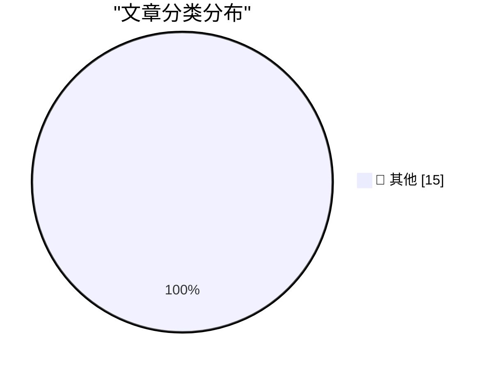

# 📰 AI 博客每日精选 — 2026-08-21

> 来自 Karpathy 推荐的 92 个顶级技术博客，AI 精选 Top 15

## 🏆 今日必读

🥇 **摘要生成失败（可重试）**

[摘要生成失败（可重试）](https://simonwillison.net/2026/Aug/20/chatgpt-search-now-uses-the-siteoperator-at-scale/) — simonwillison.net · 2 小时前 · 📝 其他

> 未能生成中文摘要，请稍后重试。

🥈 **摘要生成失败（可重试）**

[摘要生成失败（可重试）](https://simonwillison.net/2026/Aug/20/bun-webview-json-api/) — simonwillison.net · 10 小时前 · 📝 其他

> 未能生成中文摘要，请稍后重试。

🥉 **摘要生成失败（可重试）**

[摘要生成失败（可重试）](https://simonwillison.net/2026/Aug/19/smolmachines-untrusted-sandbox/) — simonwillison.net · 1 天前 · 📝 其他

> 未能生成中文摘要，请稍后重试。

---

## 📊 数据概览

| 扫描源 | 抓取文章 | 时间范围 | 精选 |
|:---:|:---:|:---:|:---:|
| 81/92 | 2486 篇 → 19 篇 | 48h | **15 篇** |

### 分类分布

---

## 📝 其他

### 1. 摘要生成失败（可重试）

[摘要生成失败（可重试）](https://simonwillison.net/2026/Aug/20/chatgpt-search-now-uses-the-siteoperator-at-scale/) — **simonwillison.net** · 2 小时前 · ⭐ 15/30

> 未能生成中文摘要，请稍后重试。

---

### 2. 摘要生成失败（可重试）

[摘要生成失败（可重试）](https://simonwillison.net/2026/Aug/20/bun-webview-json-api/) — **simonwillison.net** · 10 小时前 · ⭐ 15/30

> 未能生成中文摘要，请稍后重试。

---

### 3. 摘要生成失败（可重试）

[摘要生成失败（可重试）](https://simonwillison.net/2026/Aug/19/smolmachines-untrusted-sandbox/) — **simonwillison.net** · 1 天前 · ⭐ 15/30

> 未能生成中文摘要，请稍后重试。

---

### 4. 摘要生成失败（可重试）

[摘要生成失败（可重试）](https://simonwillison.net/2026/Aug/19/jeremy-morrell/) — **simonwillison.net** · 1 天前 · ⭐ 15/30

> 未能生成中文摘要，请稍后重试。

---

### 5. 摘要生成失败（可重试）

[摘要生成失败（可重试）](https://simonwillison.net/2026/Aug/19/conceptual-integrity-and-counting-lines-of-code/) — **simonwillison.net** · 1 天前 · ⭐ 15/30

> 未能生成中文摘要，请稍后重试。

---

### 6. 摘要生成失败（可重试）

[摘要生成失败（可重试）](https://www.jeffgeerling.com/blog/2026/steam-deck-lcd-pi-hat/) — **jeffgeerling.com** · 12 小时前 · ⭐ 15/30

> 未能生成中文摘要，请稍后重试。

---

### 7. 摘要生成失败（可重试）

[摘要生成失败（可重试）](https://www.jeffgeerling.com/blog/2026/cm5-programming-jig/) — **jeffgeerling.com** · 1 天前 · ⭐ 15/30

> 未能生成中文摘要，请稍后重试。

---

### 8. 摘要生成失败（可重试）

[摘要生成失败（可重试）](https://pluralistic.net/2026/08/20/epistemic-void/) — **pluralistic.net** · 2 小时前 · ⭐ 15/30

> 未能生成中文摘要，请稍后重试。

---

### 9. 摘要生成失败（可重试）

[摘要生成失败（可重试）](https://pluralistic.net/2026/08/19/banaility/) — **pluralistic.net** · 1 天前 · ⭐ 15/30

> 未能生成中文摘要，请稍后重试。

---

### 10. 摘要生成失败（可重试）

[摘要生成失败（可重试）](https://shkspr.mobi/blog/2026/08/asymmetric-agents/) — **shkspr.mobi** · 1 天前 · ⭐ 15/30

> 未能生成中文摘要，请稍后重试。

---

### 11. 摘要生成失败（可重试）

[摘要生成失败（可重试）](https://devblogs.microsoft.com/oldnewthing/20260819-00/?p=112624) — **devblogs.microsoft.com/oldnewthing** · 1 天前 · ⭐ 15/30

> 未能生成中文摘要，请稍后重试。

---

### 12. 摘要生成失败（可重试）

[摘要生成失败（可重试）](https://www.johndcook.com/blog/2026/08/20/ai-generated-ascii-diagrams/) — **johndcook.com** · 12 小时前 · ⭐ 15/30

> 未能生成中文摘要，请稍后重试。

---

### 13. 摘要生成失败（可重试）

[摘要生成失败（可重试）](https://www.gilesthomas.com/2026/08/built-in-gelu) — **gilesthomas.com** · 1 天前 · ⭐ 15/30

> 未能生成中文摘要，请稍后重试。

---

### 14. 摘要生成失败（可重试）

[摘要生成失败（可重试）](https://matklad.github.io/2026/08/20/better-batteries.html) — **matklad.github.io** · 1 天前 · ⭐ 15/30

> 未能生成中文摘要，请稍后重试。

---

### 15. 摘要生成失败（可重试）

[摘要生成失败（可重试）](https://nesbitt.io/2026/08/20/issues-in-the-repo.html) — **nesbitt.io** · 17 小时前 · ⭐ 15/30

> 未能生成中文摘要，请稍后重试。

---

*生成于 2026-08-21 02:23 | 扫描 81 源 → 获取 2486 篇 → 精选 15 篇*
*基于 [Hacker News Popularity Contest 2025](https://refactoringenglish.com/tools/hn-popularity/) RSS 源列表，由 [Andrej Karpathy](https://x.com/karpathy) 推荐*
